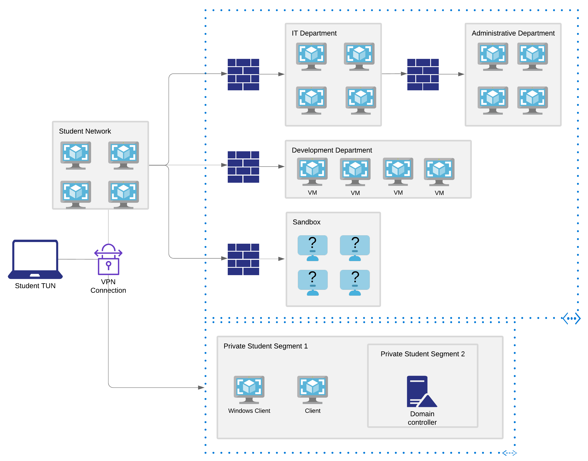

# Labs

Provides an isolated environment that contains a variety of vulnerable machines.

Each machine contains a **proof.txt** file that serves as a trophy for your compromise, but keep in mind that the goal is not to find the proof.txt file specifically.

Instead, the **main goal is to obtain a root/SYSTEM level interactive shell** on each machine.&#x20;

Some machines may also contain a **network-secret.txt** file. The contents of that file can be submitted to the control panel in order to unlock the ability to revert virtual machines to their original state in the IT, Development, and Administrative departments networks.

The machines being targeted are all in the 10.11.1.0/24 subnet

## Control Panel

Once logged into the PWK VPN lab network, you can access your PWK control panel. The PWK control panel will help you revert your client and lab machines or book your exam.

Once you find the network-secret.txt files, you'll use the control panel, submit the contents of the file, and unlock the ability to revert machines located in the additional networks you've discovered.

## Reverts

**12 reverts per 24 hours**. Counter is reset everyday at 00:00 GMT.

There is a minimum of 5 minutes between lab resets.

It is **recommended to revert a machine prior to beginning an exploitation attempt** (machines do not automatically reset and could be left in a vulnerable or inoperable state from another student or a previous attempt).

## Client Machines

Assigned three dedicated client machines that are used in conjunction with the course material and exercises.&#x20;

* Windows 10 client
* Debian Linux client
* Windows Server 2016 Domain Controller

Need to **revert the machine you wish to use via the student control panel whenever you connect to the VPN.** If reverting either of the Windows machines, both machines will be reverted.

## Lab Behavior and Restrictions

The Offensive Security lab is a shared environment. Please keep the following in mind as you explore the lab:

* Avoid changing user passwords. Instead, add new users to the system if possible. If the only way into the machine is to change the password, kindly change it back once you are done with that particular machine.
* Any firewall rules that you disable on a machine should be restored once you have gained the desired level of access.
* Do not leave machines in a non-exploitable state.
* Delete any successful (and failed) exploits from a machine once you are done. If possible, create a directory to store your exploits. This will minimize the chance that someone else will accidentally use your exploit against the target.

All of this can be easily accomplished by **reverting a machine after exploitation**.&#x20;

### Forbidden Behavior

1. Do not ARP spoof or conduct any other type of poisoning or man-in-the-middle attacks against the network.
2. Do not delete or relocate any key system files or hints unless absolutely necessary for privilege escalation.
3. Do not change the contents of the network-secret.txt or proof.txt files.
4. Do not intentionally disrupt other students who are working in the labs. This includes but is not limited to:
   * Shutting down machines
   * Kicking users off machines
   * Blocking a specific IP address or range
   * Hacking into other students' clients or Kali machines
