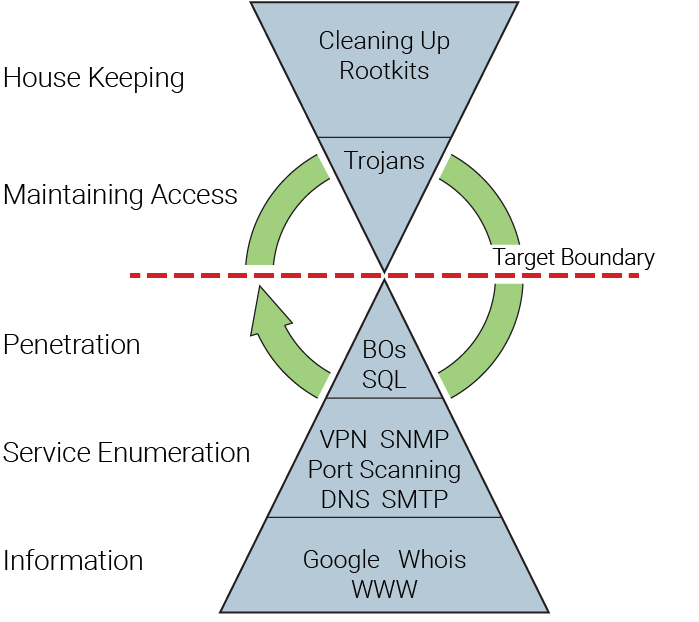

# Penetration Testing

A penetration test is an ongoing cycle of research and attack against a target or boundary. The attack should be structured, calculated, and, when possible, verified in a lab before being implemented on a live target.

The more information gathered the higher the probability of success.
