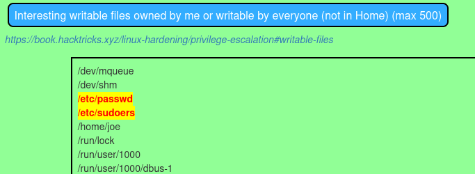

# Automated Enumeration

As mentioned in the previous section, Linux systems contain a wealth of information that can be used for further attacks. However, collecting this detailed information manually can be rather time-consuming. Fortunately tools exist to alleviate this strain.

## unix-privesc-check

[unix-privesc-check](https://pentestmonkey.net/tools/audit/unix-privesc-check) is a script that runs on Unix systems. It tries to find misconfigurations that could allow local unprivileged users to escalate privileges to other users or to access local apps (e.g. databases).

It is written as a single shell script so it can be easily uploaded and run.  It can run either as a normal user or as root (obviously it does a better job when running as root because it can read more files).

### Example

This example will use a machine at `192.168.210.214` that the attacker is assumed to have basic access to as a user with credentials `joe:offsec`.

The first step is getting the executable to the machine. If one has SSH access this can likely be done via SFTP and then run via SSH:

```shell-session
kali@kali:~$ sftp joe@192.168.210.214
joe@192.168.210.214's password: 
Connected to 192.168.210.214.
sftp> put unix-privesc-check 
Uploading unix-privesc-check to /home/joe/unix-privesc-check
unix-privesc-check                                                                100%   36KB 179.0KB/s   00:00
sftp> exit
                                                                                                                    
kali@kali:~$ ssh joe@192.168.210.214 
joe@192.168.210.214's password: 
Linux debian-privesc 4.19.0-21-amd64 #1 SMP Debian 4.19.249-2 (2022-06-30) x86_64

The programs included with the Debian GNU/Linux system are free software;
the exact distribution terms for each program are described in the
individual files in /usr/share/doc/*/copyright.

Debian GNU/Linux comes with ABSOLUTELY NO WARRANTY, to the extent
permitted by applicable law.
Last login: Mon Oct 23 16:31:32 2023 from 192.168.45.201
joe@debian-privesc:~$ ls -l | grep priv
-rwxr-xr-x 1 joe joe 36801 Oct 23 16:48 unix-privesc-check
joe@debian-privesc:~$ ./unix-privesc-check standard > user_check.txt 2>/dev/null
joe@debian-privesc:~$ exit
logout
Connection to 192.168.210.214 closed.
```

If desired the output can then be retrieved via SFTP (using the `get` command). In this example, the file was retrieved and the interesting section is included here:


```
...
############################################
Checking for writable config files
############################################
    Checking if anyone except root can change /etc/passwd
WARNING: /etc/passwd is a critical config file. World write is set for /etc/passwd
    Checking if anyone except root can change /etc/group
    Checking if anyone except root can change /etc/fstab
    Checking if anyone except root can change /etc/profile
    Checking if anyone except root can change /etc/sudoers
WARNING: /etc/sudoers is a critical config file. World write is set for /etc/sudoers
    Checking if anyone except root can change /etc/shadow
...
```


In this example both `/etc/passwd` and `/etc/sudoers` were world writable which provides some potential escalation paths.

## LinEnum

[LinEnum](https://github.com/rebootuser/LinEnum) is a tool that was developed further than unix-privesc-check, but it appears active maintenance ceased around January 2020. Regardless, it can still be useful. If downloaded and run the help menu shows:

```shell-session
kali@kali:~$ ./LinEnum.sh -h
./LinEnum.sh: option requires an argument -- h

#########################################################
# Local Linux Enumeration & Privilege Escalation Script #
#########################################################
# www.rebootuser.com | @rebootuser 
# version 0.982

# Example: ./LinEnum.sh -k keyword -r report -e /tmp/ -t 

OPTIONS:
-k      Enter keyword
-e      Enter export location
-s      Supply user password for sudo checks (INSECURE)
-t      Include thorough (lengthy) tests
-r      Enter report name
-h      Displays this help text


Running with no options = limited scans/no output file
#########################################################
```

Once it is uploaded to the target (same as [example above](automated-enumeration.md#example)) and run:

```shell-session
joe@debian-privesc:~$ ./LinEnum.sh -e /home/joe/le_check
...
```

It creates a full directory of output with the following structure (viewed after export to attacking machine via SFTP with the `get -R` command):

```shell-session
kali@kali:~$ tree -L 2 le_check
le_check
└── LinEnum-export-23-10-23
    ├── conf-files
    ├── etc-export
    ├── files_with_capabilities
    ├── history_files
    ├── ps-export
    ├── sgid-files
    └── suid-files
```

It actually sweeps up the vulnerable files for later examination:

```shell-session
kali@kali:~$ tree -L 2 le_check/LinEnum-export-23-10-23/etc-export 
le_check/LinEnum-export-23-10-23/etc-export
├── apache2
│   └── envvars
├── login.defs
├── passwd
└── sudoers

2 directories, 4 files
                                                                                                                                                                                                                                            
kali@kali:~$ cat le_check/LinEnum-export-23-10-23/etc-export/passwd 
$ cat le_check/LinEnum-export-23-10-23/etc-export/passwd 
root:x:0:0:root:/root:/bin/bash
daemon:x:1:1:daemon:/usr/sbin:/usr/sbin/nologin
bin:x:2:2:bin:/bin:/usr/sbin/nologin
sys:x:3:3:sys:/dev:/usr/sbin/nologin
sync:x:4:65534:sync:/bin:/bin/sync
...
```

Note the `/etc/passwd` and `/etc/sudoers` files were identifies by both LinEnum and `unix-privesc-check`.

## LinPEAS

[LinPEAS](https://github.com/carlospolop/PEASS-ng/blob/master/linPEAS/builder/linpeas\_builder.py) seems to be the most actively maintained of the tools listed here. It is written in Python but the `builder/` directory contains a script to generate a `linpeas.sh` executable (there is also a precompiled version always available in their [releases](https://github.com/carlospolop/PEASS-ng/releases/latest) page). Doing so and displaying the help menu shows the following output:

```shell-session
kali@kali:~$ ./linpeas.sh -h                                              
Enumerate and search Privilege Escalation vectors.
This tool enum and search possible misconfigurations (known vulns, user, processes and file permissions, special file permissions, readable/writable files, bruteforce other users(top1000pwds), passwords...) inside the host and highlight possible misconfigurations with colors.
        Checks:
            -a Perform all checks: 1 min of processes, su brute, and extra checks.                                                                                                                                                          
            -o Only execute selected checks (system_information,container,cloud,procs_crons_timers_srvcs_sockets,network_information,users_information,software_information,interesting_perms_files,interesting_files,api_keys_regex). Select a comma separated list.                                                                                                                                                                                                                   
            -s Stealth & faster (don't check some time consuming checks)                                                                                                                                                                    
            -e Perform extra enumeration                                                                                                                                                                                                    
            -t Automatic network scan & Internet conectivity checks - This option writes to files                                                                                                                                           
            -r Enable Regexes (this can take from some mins to hours)                                                                                                                                                                       
            -P Indicate a password that will be used to run 'sudo -l' and to bruteforce other users accounts via 'su'                                                                                                                       
            -D Debug mode                                                                                                                                                                                                                   
                                                                                                                                                                                                                                            
        Network recon:                                                                                                                                                                                                                      
            -t Automatic network scan & Internet conectivity checks - This option writes to files                                                                                                                                           
            -d <IP/NETMASK> Discover hosts using fping or ping. Ex: -d 192.168.0.1/24                                                                                                                                                       
            -p <PORT(s)> -d <IP/NETMASK> Discover hosts looking for TCP open ports (via nc). By default ports 22,80,443,445,3389 and another one indicated by you will be scanned (select 22 if you don't want to add more). You can also add a list of ports. Ex: -d 192.168.0.1/24 -p 53,139                                                                                                                                                                                          
            -i <IP> [-p <PORT(s)>] Scan an IP using nc. By default (no -p), top1000 of nmap will be scanned, but you can select a list of ports instead. Ex: -i 127.0.0.1 -p 53,80,443,8000,8080                                            
             Notice that if you specify some network scan (options -d/-p/-i but NOT -t), no PE check will be performed                                                                                                                      
                                                                                                                                                                                                                                            
        Port forwarding (reverse connection):                                                                                                                                                                                               
            -F LOCAL_IP:LOCAL_PORT:REMOTE_IP:REMOTE_PORT Execute linpeas to forward a port from a your host (LOCAL_IP:LOCAL_PORT) to a remote IP (REMOTE_IP:REMOTE_PORT)                                                                    
                                                                                                                                                                                                                                            
        Firmware recon:                                                                                                                                                                                                                     
            -f </FOLDER/PATH> Execute linpeas to search passwords/file permissions misconfigs inside a folder                                                                                                                               
                                                                                                                                                                                                                                            
        Misc:                                                                                                                                                                                                                               
            -h To show this message                                                                                                                                                                                                         
            -w Wait execution between big blocks of checks                                                                                                                                                                                  
            -L Force linpeas execution                                                                                                                                                                                                      
            -M Force macpeas execution                                                                                                                                                                                                      
            -q Do not show banner                                                                                                                                                                                                           
            -N Do not use colours
```

After upload on the target (same as [example above](automated-enumeration.md#example)) it can be run as follows:

```shell-session
joe@debian-privesc:~$ ./linpeas.sh -a > lp_check.txt
. . . . . . . . . . . . . . . . . . . . . . . . . . . . . . . . . . . . . . . . . . .
```

In this case all output is sent to a file `lp_check.txt` as opposed to being printed on the console. Once the command returns, the output file can be fetched from the target and reviewed. For this output it is helpful to use the parsers provided in the parsers/ directory. They can be used to transform the output `.txt` file first to JSON and then to HTML or PDF for easier viewing.

### Transforming the Output

PEAS-ng provides several [parsers](https://github.com/peass-ng/PEASS-ng/tree/master/parsers). Generally the steps are to convert the raw output to JSON using [`peas2json.py`](https://github.com/peass-ng/PEASS-ng/blob/master/parsers/peas2json.py) (or `.ps1` if on Windows). The JSON is then converted using [`json2html.py`](https://github.com/peass-ng/PEASS-ng/blob/master/parsers/json2html.py) or [`json2pdf.py`](https://github.com/peass-ng/PEASS-ng/blob/master/parsers/json2pdf.py). This allows for easy viewing. In this example, the output was transformed to HTML:

```shell-session
kali@kali:~$ python3 PEASS-ng/parsers/peas2json.py lp_check.txt lp_check.json 

kali@kali:~$ python3 PEASS-ng/parsers/json2html.py lp_check.json ~/Desktop/lp_check.html
```

Once viewed in the browser the most interesting parts again pertain to the `/etc/passwd` and `/etc/sudoers` files (highlighting done by LinPEAS):

<figure><figcaption><p>Portion of LinPEAS report as HTML</p></figcaption></figure>
