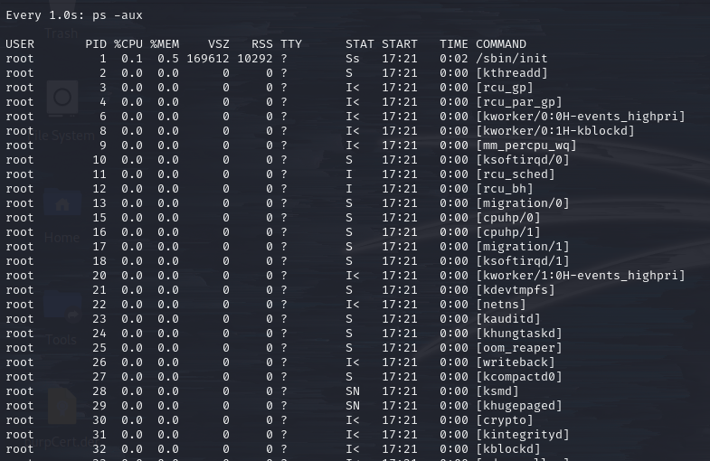
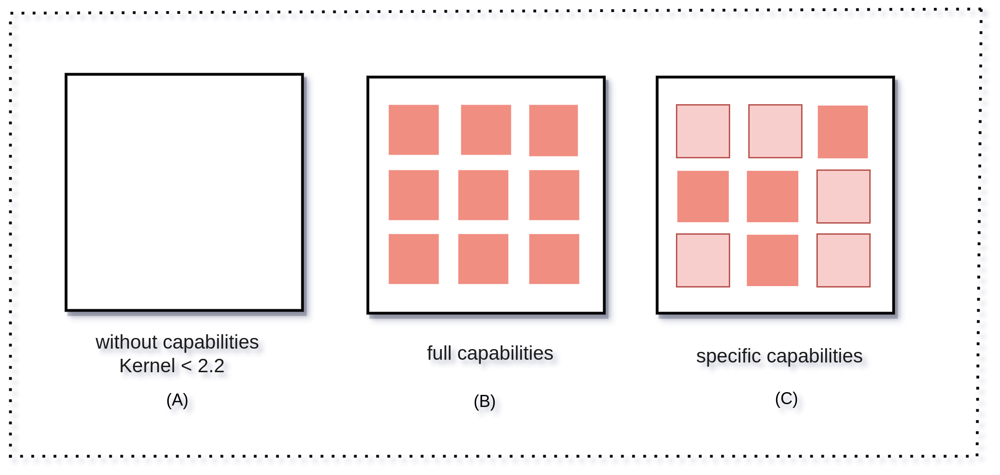

# Manual Enumeration

Manually enumerating Linux systems can be time consuming. However, this approach allows for a more controlled outcome because it helps identify more peculiar privilege escalation methods that are often overlooked by automated tools.

## Background and Assumptions

This example will assume an attacker has gained access to a machine located at `192.168.247.214` via SSH with the credentials `joe:offsec`.

## User Context

### Current User Context

Upon gaining access to a target, one of the first things to identify is the user context. This can be done with the `id` command:


```shell-session
kali@kali:~$ ssh joe@192.168.247.214                     
 ...
joe@192.168.247.214's password: 
 ...
joe@debian-privesc:~$ id
uid=1000(joe) gid=1000(joe) groups=1000(joe),24(cdrom),25(floppy),29(audio),30(dip),44(video),46(plugdev),109(netdev),112(bluetooth),116(lpadmin),117(scanner)
```


The output reveals that the user `joe` has a [UID](https://en.wikipedia.org/wiki/User\_identifier) of `1000` and belongs to a group with ID (GID) `1000`. There are also groups of which Joe is a member, but they are out of scope for this example.

### All Users

To enumerate all users on the system one could simply read the `/etc/passwd` file:

```shell-session
joe@debian-privesc:~$ cat /etc/passwd
root:x:0:0:root:/root:/bin/bash
daemon:x:1:1:daemon:/usr/sbin:/usr/sbin/nologin
bin:x:2:2:bin:/bin:/usr/sbin/nologin
sys:x:3:3:sys:/dev:/usr/sbin/nologin
...
www-data:x:33:33:www-data:/var/www:/usr/sbin/nologin
...
sshd:x:109:65534::/run/sshd:/usr/sbin/nologin
...
joe:x:1000:1000:joe,,,:/home/joe:/bin/bash
eve:x:1001:1001:,,,:/home/eve:/bin/bash
```

Each line is a user, the fields are colon-separated and described [here](../../filesystem/important-system-locations.md#etc-passwd).

In addition to `joe`, there appears to be another user `eve`. It would seem eve is also a standard user as the profile has a configured home directory (`/home/eve`) and shell (`/bin/bash`).

Conversely, system service accounts are declared with the shell `/usr/sbin/nologin` which is used to block any remote or local login for service accounts.

Enumerating all users on a target machine can help identify potential high-privilege user accounts that could be targeted in an attempt to elevate privileges.

### Sudo Permissions

Often, normal users will be given special permission to run certain commands with `sudo`. The commands available with sudo permissions can be shown with the `sudo -l` command:

```shell-session
$ sudo -l
[sudo] password for joe: 
Matching Defaults entries for joe on debian-privesc:
    env_reset, mail_badpass, secure_path=/usr/local/sbin\:/usr/local/bin\:/usr/sbin\:/usr/bin\:/sbin\:/bin

User joe may run the following commands on debian-privesc:
    (ALL) /usr/bin/crontab -l, /usr/sbin/tcpdump, /usr/bin/apt-get
```

See [GTFOBins](https://gtfobins.github.io/) for specific techniques on how to abuse any particular `sudo` binary.

#### All Commands

In _rare_, but highly convenient instances a user will be found who has permission to run all commands with `sudo`. In these cases, this effectively allows an attacker to elevate their privileges with the already compromised account and the `sudo -i` command.

Consider the user with credentials `eve:Lab123` on the same machine. When logged in via SSH the attacker finds the following:

```shell-session
kali@kali:~$ ssh eve@192.168.210.214
eve@192.168.210.214's password: 
...

eve@debian-privesc:~$ sudo -l
[sudo] password for eve: 
Matching Defaults entries for eve on debian-privesc:
    env_reset, mail_badpass, secure_path=/usr/local/sbin\:/usr/local/bin\:/usr/sbin\:/usr/bin\:/sbin\:/bin

User eve may run the following commands on debian-privesc:
    (ALL : ALL) ALL
```

As evidenced by the output above (last line), `eve` is allowed to run all commands with `sudo`. Thus privileges can be effectively escalated via `sudo -i`:

```shell-session
eve@debian-privesc:~$ sudo -i
[sudo] password for eve:

root@debian-privesc:~# whoami
root
```

While this is good to know, it is rare and should not be counted upon as a reliable "exploit" path.

## Machine Information

### Hostname

A machine's **hostname** can often provide clues about its functional roles. More often than not, the hostname will include identifiable abbreviations such as `web` for a web server, `db` for a database server, `dc` for a domain controller, etc.

The `hostname` command will display the machine's name:

```shell-session
joe@debian-privesc:~$ hostname
debian-privesc
```

Enterprises often enforce a naming convention scheme for hostnames, so they can be categorized by location, description, operating system, and service level. In this case, the hostname is comprised of only two parts: the OS type and the description.

Identifying the role of a machine can help us focus our information gathering efforts by increasing the context surrounding the host.

### Architecture

To find the machine architectecture the [`uname`](https://man7.org/linux/man-pages/man1/uname.1.html) command can be used:

```bash
uname -a
```

* `-a` displays all available information

This shows all available system information for example:


```bash
kali@kali:~$ uname -a
Linux confluence01 5.4.0-139-generic #156-Ubuntu SMP Fri Jan 20 17:27:18 UTC 2023 x86_64 x86_64 x86_64 GNU/Linux
```


If only the machine hardware name is desired the `-m` flag can be used:

```bash
uname -m
```

```bash
kali@kali:~$ uname -m
x86_64
```

### Operating System

At some point during the privilege escalation process, an attacker may need to rely on [kernel](https://en.wikipedia.org/wiki/Kernel\_\(operating\_system\)) exploits that specifically exploit vulnerabilities in the core of a target's operating system. These types of exploits are built for a very specific type of target, specified by a particular operating system and version combination. Since attacking a target with a mismatched kernel exploit can lead to system instability or even a crash, one must gather precise information about the target.

The `/etc/issue` and `/etc/*-release` files contain information about the operating system release and version. One can also run the `uname -a` command:

```shell-session
joe@debian-privesc:~$ cat /etc/issue
Debian GNU/Linux 10 \n \l

joe@debian-privesc:~$ cat /etc/os-release
PRETTY_NAME="Debian GNU/Linux 10 (buster)"
NAME="Debian GNU/Linux"
VERSION_ID="10"
VERSION="10 (buster)"
VERSION_CODENAME=buster
ID=debian
HOME_URL="https://www.debian.org/"
SUPPORT_URL="https://www.debian.org/support"
BUG_REPORT_URL="https://bugs.debian.org/"

joe@debian-privesc:~$ uname -a
Linux debian-privesc 4.19.0-21-amd64 #1 SMP Debian 4.19.249-2 (2022-06-30)
x86_64 GNU/Linux
```

The `issue` and `os-release` files located in the `/etc` directory contain the operating system version (Debian 10) and release-specific information, including the distribution codename (buster). The command `uname -a` outputs the kernel version (4.19.0) and architecture (x86\_64).

### Processes and Services

It is important to determine which running processes and services may allow attackers to elevate their privileges. Unlike on Windows systems, on Linux users can list information about higher-privilege processes such as the ones running inside the `root` user context.

In order for a process to be useful for privilege escalation, the process must run in the context of a privileged account and must either have insecure permissions or allow users to interact with it in unintended ways.

#### Examining All Processes

One can list system processes (including those run by privileged users) with the `ps` command.

```shell-session
joe@debian-privesc:~$ ps aux
USER       PID %CPU %MEM    VSZ   RSS TTY      STAT START   TIME COMMAND
root         1  0.0  0.4 169592 10176 ?        Ss   Aug16   0:02 /sbin/init
...
colord     752  0.0  0.6 246984 12424 ?        Ssl  Aug16   0:00 /usr/lib/colord/colord
Debian-+   753  0.0  0.2 157188  5248 ?        Sl   Aug16   0:00 /usr/lib/dconf/dconf-service
...
root      1545  0.0  0.0      0     0 ?        I    Aug16   0:00 [kworker/1:1-events]
root      1653  0.0  0.3  14648  7712 ?        Ss   01:03   0:00 sshd: joe [priv]
root      1656  0.0  0.0      0     0 ?        I    01:03   0:00 [kworker/1:2-events_power_efficient]
joe       1657  0.0  0.4  21160  8960 ?        Ss   01:03   0:00 /lib/systemd/systemd --user
joe       1658  0.0  0.1 170892  2532 ?        S    01:03   0:00 (sd-pam)
joe       1672  0.0  0.2  14932  5064 ?        S    01:03   0:00 sshd: joe@pts/0
joe       1673  0.0  0.2   8224  5020 pts/0    Ss   01:03   0:00 -bash
root      1727  0.0  0.0      0     0 ?        I    03:00   0:00 [kworker/0:0-ata_sff]
root      1728  0.0  0.0      0     0 ?        I    03:06   0:00 [kworker/0:2-ata_sff]
joe       1730  0.0  0.1  10600  3028 pts/0    R+   03:10   0:00 ps axu
```

* `-a` lists all processes
* `-x` lists processes without a [tty](https://www.linusakesson.net/programming/tty/)
* `-u` lists processes in a user-readable format

The output lists several processes running as root that are worth researching for possible vulnerabilities. Of particular interest is `1672` which appears to be SSH accessible by the current user.

Note the `ps` command ran in the example is also listed in the output (last line), owned by the current user. One can also filter the specific user-owned process from the output with the appropriate username.

#### Examining Individual Processes

It is possible to glean more information about a process via the [proc pseudo-filesystem](https://www.kernel.org/doc/html/latest/filesystems/proc.html).

The directory `/proc` contains (among other things) one subdirectory for each process running on the system, which is named after the process ID (PID). The link `self` points to the process reading the file system. The full listing of entries available for each process is below:

<table><thead><tr><th width="181">File</th><th>Content</th></tr></thead><tbody><tr><td><code>clear_refs</code></td><td>Clears page referenced bits shown in <code>smaps</code> output</td></tr><tr><td><code>cmdline</code></td><td>Command line arguments</td></tr><tr><td><code>cpu</code></td><td>Current and last CPU in which it was executed</td></tr><tr><td><code>cwd</code></td><td>Link to the current working directory</td></tr><tr><td><code>environ</code></td><td>Values of environment variables</td></tr><tr><td><code>exe</code></td><td>Link to the executable of this process</td></tr><tr><td><code>fd</code></td><td>Directory, which contains all file descriptors</td></tr><tr><td><code>maps</code></td><td>Memory maps to executables and library files</td></tr><tr><td><code>mem</code></td><td>Memory held by this process</td></tr><tr><td><code>root</code></td><td>Link to the root directory of this process</td></tr><tr><td><code>stat</code></td><td>Process status</td></tr><tr><td><code>statm</code></td><td>Process memory status information</td></tr><tr><td><code>status</code></td><td>Process status in human readable form</td></tr><tr><td><code>wchan</code></td><td><p>Present with <code>CONFIG_KALLSYMS=y</code></p><p></p><p>Shows the kernel function symbol the task is blocked in - or "0" if not blocked.</p></td></tr><tr><td><code>pagemap</code></td><td>Page table</td></tr><tr><td><code>stack</code></td><td>Report full stack trace, enable via <code>CONFIG_STACKTRACE</code></td></tr><tr><td><code>smaps</code></td><td>An extension based on <code>maps</code>, showing the memory consumption of each mapping and flags associated with it</td></tr><tr><td><code>smaps_rollup</code></td><td>Accumulated <code>smaps</code> stats for all mappings of the process. This can be derived from <code>smaps</code>, but is faster and more convenient</td></tr><tr><td><code>numa_maps</code></td><td>An extension based on <code>maps</code>, showing the memory locality and binding policy as well as <code>mem</code> usage (in pages) of each mapping.</td></tr></tbody></table>

One of the more interesting files is the `/proc/PID/status` file which provides a great deal of information about the process in question.

An example status file is below. In this case, the process used was the SSH session connecting the attacker to the example machine (PID 1232):


```
Name:   sshd
Umask:  0022
State:  S (sleeping)
Tgid:   1232
Ngid:   0
Pid:    1232
PPid:   1214
TracerPid:      0
Uid:    1000    1000    1000    1000
Gid:    1000    1000    1000    1000
FDSize: 64
Groups: 24 25 29 30 44 46 109 112 116 117 1000 
NStgid: 1232
NSpid:  1232
NSpgid: 1214
NSsid:  1214
VmPeak:    14940 kB
VmSize:    14940 kB
VmLck:         0 kB
VmPin:         0 kB
VmHWM:      4884 kB
VmRSS:      4884 kB
RssAnon:            1120 kB
RssFile:            3764 kB
RssShmem:              0 kB
VmData:     1088 kB
VmStk:       132 kB
VmExe:       496 kB
VmLib:      6672 kB
VmPTE:        68 kB
VmSwap:        0 kB
HugetlbPages:          0 kB
CoreDumping:    0
Threads:        1
SigQ:   0/7820
SigPnd: 0000000000000000
ShdPnd: 0000000000000000
SigBlk: 0000000000000000
SigIgn: 0000000000001000
SigCgt: 0000000180010000
CapInh: 0000000000000000
CapPrm: 0000000000000000
CapEff: 0000000000000000
CapBnd: 0000003fffffffff
CapAmb: 0000000000000000
NoNewPrivs:     0
Seccomp:        0
Speculation_Store_Bypass:       thread vulnerable
Cpus_allowed:   3
Cpus_allowed_list:      0-1
Mems_allowed:   00000000,00000001
Mems_allowed_list:      0
voluntary_ctxt_switches:        419
nonvoluntary_ctxt_switches:     6
```


This shows nearly the same information one would get if they viewed it with the `ps` command. In fact, `ps` uses the `proc` file system to obtain its information. But by reading the file `/proc/PID/status`, one gets a more detailed view of the process.

For the purposes of privilege escalation some important fields will be `UID` and `GID`. Each of these entries has 4 numbers which appear in the following order (same for both `UID` and `GID` fields):

1. Real `U/GID`
2. Effective `U/GID`
3. Saved set `U/GID`
4. File system `U/GID`&#x20;

This can provide good color around the user/group context of a running process.

#### Updating the Output

It is possible to enumerate all the running processes with the `ps` command, but since it only takes a single snapshot of the active processes it is not exactly a live feed. Users can refresh it using the `watch` command. `watch` works by taking a command string in quotes as a parameter. That command is then rerun periodically, and its output is printed to the screen by the `watch` utility.

```shell-session
joe@debian-privesc:~$ watch -n 1 "ps -aux"
```

* `-n` indicates how often (in seconds) the command (`"ps -aux"`) is rerun

Which results in the following screen:

<figure><figcaption><p>All processes listed by ps via watch</p></figcaption></figure>

### Scheduled Tasks

Systems acting as servers often periodically execute various automated, scheduled tasks. When these systems are misconfigured, or the user-created files are left with insecure permissions, attackers can modify these files that will be executed by the scheduling system at a high privilege level.

The Linux-based job scheduler is known as [cron](https://en.wikipedia.org/wiki/Cron). Scheduled tasks are listed under the `/etc/cron.*` directories, where _`*`_ represents the frequency at which the task will run. For example, tasks that will be run daily can be found under `/etc/cron.daily`. Each script is listed in its own subdirectory.

```shell-session
joe@debian-privesc:~$ ls -lah /etc/cron*
-rw-r--r-- 1 root root 1.1K Oct 11  2019 /etc/crontab

/etc/cron.d:
total 24K
drwxr-xr-x   2 root root 4.0K Aug 16 04:25 .
drwxr-xr-x 120 root root  12K Aug 18 12:37 ..
-rw-r--r--   1 root root  102 Oct 11  2019 .placeholder
-rw-r--r--   1 root root  285 May 19  2019 anacron

/etc/cron.daily:
total 60K
drwxr-xr-x   2 root root 4.0K Aug 18 09:05 .
drwxr-xr-x 120 root root  12K Aug 18 12:37 ..
-rw-r--r--   1 root root  102 Oct 11  2019 .placeholder
-rwxr-xr-x   1 root root  311 May 19  2019 0anacron
-rwxr-xr-x   1 root root  539 Aug  8  2020 apache2
-rwxr-xr-x   1 root root 1.5K Dec  7  2020 apt-compat
-rwxr-xr-x   1 root root  355 Dec 29  2017 bsdmainutils
-rwxr-xr-x   1 root root  384 Dec 31  2018 cracklib-runtime
-rwxr-xr-x   1 root root 1.2K Apr 18  2019 dpkg
-rwxr-xr-x   1 root root 2.2K Feb 10  2018 locate
-rwxr-xr-x   1 root root  377 Aug 28  2018 logrotate
-rwxr-xr-x   1 root root 1.1K Feb 10  2019 man-db
-rwxr-xr-x   1 root root  249 Sep 27  2017 passwd

/etc/cron.hourly:
total 20K
drwxr-xr-x   2 root root 4.0K Aug 16 04:17 .
drwxr-xr-x 120 root root  12K Aug 18 12:37 ..
-rw-r--r--   1 root root  102 Oct 11  2019 .placeholder

/etc/cron.monthly:
total 24K
drwxr-xr-x   2 root root 4.0K Aug 16 04:25 .
drwxr-xr-x 120 root root  12K Aug 18 12:37 ..
-rw-r--r--   1 root root  102 Oct 11  2019 .placeholder
-rwxr-xr-x   1 root root  313 May 19  2019 0anacron

/etc/cron.weekly:
total 28K
drwxr-xr-x   2 root root 4.0K Aug 16 04:26 .
drwxr-xr-x 120 root root  12K Aug 18 12:37 ..
-rw-r--r--   1 root root  102 Oct 11  2019 .placeholder
-rwxr-xr-x   1 root root  312 May 19  2019 0anacron
-rwxr-xr-x   1 root root  813 Feb 10  2019 man-db
```

It is worth noting that system administrators often add their own scheduled tasks in the `/etc/crontab` file. These tasks should be inspected carefully for insecure file permissions, since most jobs in this particular file will run as root. To view the current user's scheduled jobs, run `crontab -l`:

```shell-session
joe@debian-privesc:~$ crontab -l
# Edit this file to introduce tasks to be run by cron.
#
# Each task to run has to be defined through a single line
# indicating with different fields when the task will be run
# and what command to run for the task
#
# To define the time you can provide concrete values for
# minute (m), hour (h), day of month (dom), month (mon),
# and day of week (dow) or use '*' in these fields (for 'any').
#
# Notice that tasks will be started based on the cron's system
# daemon's notion of time and timezones.
#
# Output of the crontab jobs (including errors) is sent through
# email to the user the crontab file belongs to (unless redirected).
#
# For example, you can run a backup of all your user accounts
# at 5 a.m every week with:
# 0 5 * * 1 tar -zcf /var/backups/home.tgz /home/
#
# For more information see the manual pages of crontab(5) and cron(8)
#
# m h  dom mon dow   command
```

However as demonstrated [above](manual-enumeration.md#sudo-permissions), joe has permission to run `crontab` as sudo. Doing so reveals another job:

```shell-session
joe@debian-privesc:~$ sudo crontab -l
[sudo] password for joe:
# Edit this file to introduce tasks to be run by cron.
...
# m h  dom mon dow   command

* * * * * /bin/bash /home/joe/.scripts/user_backups.sh
```

Listing cron jobs using sudo reveals jobs run by the `root` user. In this example, it shows a backup script running as `root`. If this file has weak permissions, one may be able to leverage it to escalate privileges.

#### Logs

It is worth checking both the system log at `/var/log/syslog` and the Cron logs at `/var/log/cron.log` for jobs that may have insecure permissions. In the case of the example machine, there appears to be no `cron.log` file (empty output of first command) but there are some entries in the `syslog` file pertaining to `cron`:

```shell-session
joe@debian-privesc:~$ ls /var/log | grep -i cron

joe@debian-privesc:~$ grep -i "cron" /var/log/syslog
Oct 25 18:34:22 debian-privesc CRON[1177]: (root) CMD (/bin/bash /home/joe/.scripts/user_backups.sh)
Oct 25 18:35:01 debian-privesc CRON[1212]: (root) CMD (/bin/bash /home/joe/.scripts/user_backups.sh)
Oct 25 18:36:01 debian-privesc CRON[1336]: (root) CMD (/bin/bash /home/joe/.scripts/user_backups.sh)
Oct 25 18:37:01 debian-privesc CRON[1456]: (root) CMD (/bin/bash /home/joe/.scripts/user_backups.sh)
Oct 25 18:38:01 debian-privesc CRON[1557]: (root) CMD (/bin/bash /home/joe/.scripts/user_backups.sh)
Oct 25 18:39:01 debian-privesc CRON[1682]: (root) CMD (/bin/bash /home/joe/.scripts/user_backups.sh)
Oct 25 18:39:39 debian-privesc crontab[1793]: (root) LIST (root)
Oct 25 18:40:01 debian-privesc CRON[1827]: (root) CMD (/bin/bash /home/joe/.scripts/user_backups.sh)
Oct 25 18:41:01 debian-privesc CRON[1956]: (root) CMD (/bin/bash /home/joe/.scripts/user_backups.sh)
```

This validates some of the earlier output and shows a job running every minute as `root`. If the location of the script has [insecure permissions](manual-enumeration.md#insecure-folder-permissions), it could potentially be leveraged for escalation.

### Installed Applications

The search for a working exploit begins with the enumeration of all installed applications, noting the version of each. This information can be used to search for a matching exploit.

Manually searching for this information could be very time consuming and ineffective, so this process is usually automated. However, one should know how to manually query installed packages as this is needed to corroborate information obtained during other enumeration steps.

Linux-based systems use a variety of package managers. For example, Debian-based Linux distributions, like the one in this example, use [dpkg](https://linux.die.net/man/1/dpkg), while Red Hat-based systems use [rpm](https://linux.die.net/man/8/rpm).

To list applications installed on the example Debian system, use `dpkg -l`:

```shell-session
joe@debian-privesc:~$ dpkg -l
Desired=Unknown/Install/Remove/Purge/Hold
| Status=Not/Inst/Conf-files/Unpacked/halF-conf/Half-inst/trig-aWait/Trig-pend
|/ Err?=(none)/Reinst-required (Status,Err: uppercase=bad)
||/ Name                                  Version                                      Architecture Description
+++-=====================================-============================================-============-===============================================================================
ii  accountsservice                       0.6.45-2                                     amd64        query and manipulate user account information
ii  acl                                   2.2.53-4                                     amd64        access control list - utilities
ii  adduser                               3.118                                        all          add and remove users and groups
ii  adwaita-icon-theme                    3.30.1-1                                     all          default icon theme of GNOME
ii  aisleriot                             1:3.22.7-2                                   amd64        GNOME solitaire card game collection
ii  alsa-utils                            1.1.8-2                                      amd64        Utilities for configuring and using ALSA
ii  anacron                               2.3-28                                       amd64        cron-like program that doesn't go by time
ii  analog                                2:6.0-22                                     amd64        web server log analyzer
ii  apache2                               2.4.38-3+deb10u7                             amd64        Apache HTTP Server
ii  apache2-bin                           2.4.38-3+deb10u7                             amd64        Apache HTTP Server (modules and other binary files)
ii  apache2-data                          2.4.38-3+deb10u7                             all          Apache HTTP Server (common files)
ii  apache2-doc                           2.4.38-3+deb10u7                             all          Apache HTTP Server (on-site documentation)
ii  apache2-utils                         2.4.38-3+deb10u7                             amd64        Apache HTTP Server (utility programs for web servers)
...
```

### Insecure Folder Permissions

Files with insufficient access restrictions can create a vulnerability that may grant an attacker elevated privileges. This most often happens when an attacker can modify scripts or binary files that are executed under the context of a privileged account.

Sensitive files that are readable by an unprivileged user may also contain important information such as hard-coded credentials for a database or a service account running with higher privileges.

Since it is not feasible to manually check the permissions of each file and directory, this task needs to be automated as much as possible. As a start, it is possible to use `find` to identify directories with insecure permissions:

```bash
find / -writable -type d 2>/dev/null
```

* `-writable` includes only files that are writable by the current user
* `-type d` narrows the results to only directories
* `2>/dev/null` filters out errors (standard output `2`) by sending the output to `/dev/null`

On the example machine, this command results in the output:

```shell-session
joe@debian-privesc:~$ find / -writable -type d 2>/dev/null
..
/home/joe
/home/joe/Videos
/home/joe/Templates
/home/joe/.local
/home/joe/.local/share
/home/joe/.local/share/sounds
/home/joe/.local/share/evolution
/home/joe/.local/share/evolution/tasks
/home/joe/.local/share/evolution/tasks/system
/home/joe/.local/share/evolution/tasks/trash
/home/joe/.local/share/evolution/addressbook
/home/joe/.local/share/evolution/addressbook/system
/home/joe/.local/share/evolution/addressbook/system/photos
/home/joe/.local/share/evolution/addressbook/trash
/home/joe/.local/share/evolution/mail
/home/joe/.local/share/evolution/mail/trash
/home/joe/.local/share/evolution/memos
/home/joe/.local/share/evolution/memos/system
/home/joe/.local/share/evolution/memos/trash
/home/joe/.local/share/evolution/calendar
/home/joe/.local/share/evolution/calendar/system
/home/joe/.local/share/evolution/calendar/trash
/home/joe/.local/share/icc
/home/joe/.local/share/gnome-shell
/home/joe/.local/share/gnome-settings-daemon
/home/joe/.local/share/keyrings
/home/joe/.local/share/tracker
/home/joe/.local/share/tracker/data
/home/joe/.local/share/folks
/home/joe/.local/share/gvfs-metadata
/home/joe/.local/share/applications
/home/joe/.local/share/nano
/home/joe/Downloads
/home/joe/.scripts
/home/joe/Pictures
/home/joe/.cache
...
```

Of note in this example is the `/home/joe/.scripts` directory which holds the job found in the [scheduled tasks](manual-enumeration.md#scheduled-tasks) session with root permissions.

### Special Permission Executables

Aside from the `rwx` file permissions described previously, two additional special rights pertain to executable files: `setuid` and `setgid`. These are symbolized with the letter "`s`".

If these two rights are set, either an uppercase or lowercase "`s`" will appear in the permissions. This allows the current user to execute the file with the rights of the _owner_ (setuid) or the _owner's group_ (setgid).

When running an executable, it normally inherits the permissions of the user that runs it. However, if the SUID permissions are set, the binary will run with the permissions of the file owner. This means that if a binary has the SUID bit set and the file is owned by root, any local user will be able to execute that binary with elevated privileges.

When a user or a system-automated script launches a SUID application, it inherits the UID/GID of its initiating script: this is known as **effective UID/GID** (eUID, eGID), which is the actual user that the OS verifies to grant permissions for a given action.

#### Purpose of SUID

Before getting into how to find and exploit SUID binaries it is worth understanding how they came to be with an example. Consider the /etc/shadow file. It is where (on modern Linux systems) all user password hashes are stored. The file has the following permissions:

```shell-session
kali@kali:~$ ls -l /etc/shadow
-rw-r----- 1 root shadow 1421 Oct 14 19:03 /etc/shadow
```

It is writable only by its owner(`root`). How then is a non-privileged user able to update their own password given that doing so will require the new hash to be written to the `shadow` file?

This issue is exactly what SUID binaries are created to circumvent. This can be demonstrated via the `/proc` file system (described [above](manual-enumeration.md#examining-individual-processes)).

If one starts a password change via the `passwd` command, and leaves it running without updating the password, the /proc/PID/status file will show the following for that process. First start `passwd` in one shell:

```shell-session
joe@debian-privesc:~$ passwd
Changing password for joe.
Current password: 
```

Then in a different shell, locate the running `passwd` process and examine the UID field of its `/proc/PID/status` file:

```shell-session
joe@debian-privesc:~$ ps u -C passwd
USER       PID %CPU %MEM    VSZ   RSS TTY      STAT START   TIME COMMAND
root      2688  0.0  0.1   9364  3156 pts/0    S+   17:30   0:00 passwd

joe@debian-privesc:~$ grep -i uid /proc/2688/status
Uid:    1000    0       0       0
```

While the process's UID is `1000` (`joe`), the eUID (second field) is `0` (`root`). This allows the process to write `joe`'s new password hash into the `shadow` file. This corresponds with the `s` bit set in the permissions for the `passwd` binary:

```shell-session
joe@debian-privesc:~$ ls -l /usr/bin/passwd
-rwsr-xr-x 1 root root 63736 Jul 27  2018 /usr/bin/passwd
```

#### Enumeration of SUID Binaries

Any user who manages to subvert a setuid root program to call a command of their choice can effectively impersonate the root user and gains all rights on the system. Attackers regularly search for these types of files when they gain access to a system as a way of escalating their privileges.

It is possible to use `find` to search for SUID-marked binaries:

```bash
find / -perm -u=s -type f 2>/dev/null
```

* `-perm -u=s` searches only for items with SUID bit set
* `-type f` limits results to files
* `2>/dev/null` filters out errors (standard output `2`) by sending the output to `/dev/null`

On the example machine, this can be used to search for special-permission binaries


```shell-session
joe@debian-privesc:~$ find / -perm -u=s -type f 2>/dev/null
/usr/bin/chsh
/usr/bin/fusermount
/usr/bin/chfn
/usr/bin/passwd
/usr/bin/sudo
/usr/bin/pkexec
/usr/bin/ntfs-3g
/usr/bin/gpasswd
/usr/bin/newgrp
/usr/bin/bwrap
/usr/bin/su
/usr/bin/umount
/usr/bin/mount
/usr/lib/policykit-1/polkit-agent-helper-1
/usr/lib/xorg/Xorg.wrap
/usr/lib/eject/dmcrypt-get-device
/usr/lib/openssh/ssh-keysign
/usr/lib/spice-gtk/spice-client-glib-usb-acl-helper
/usr/lib/dbus-1.0/dbus-daemon-launch-helper
/usr/sbin/pppd
```


Exploitation of SUID binaries will vary based on several factors. For example, if `/bin/cp` (the _copy_ command) were SUID, one could copy and overwrite sensitive files such as `/etc/passwd` (or `/etc/shadow`).

See [GTFOBins](https://gtfobins.github.io/) for specific techniques on how to abuse any particular setuid binary.

### Linux Capabilities

In Linux, [capabilities](https://earthly.dev/blog/intro-to-linux-capabilities/) are a way to assign specific privileges to a running process. They allow more fine-grained control over the privileges that processes have on a Linux system. Linux kernel capabilities are supported not only for processes, but for all threads in a process as well.

In Unix, there are two main controls: superuser (`root`) and normal user (non-root). The UID is used to determine what a user can do within the system. The UID of the root user is set to `0`. A non-zero UID signifies that it’s a normal user who generally does not have permissions to install software, modify system files, and more.

Capabilities are generally intended to reduce the attack surface by allowing only specific elevated permissions. E.g. `CAP_NET_RAW` grants a process/thread the right to access raw network sockets, but does not grant all other privileges, such as the ability to kill other processes, that granting the whole process elevated permissions would also entail. This means that a process can be given only the capabilities it needs, thus making it a less powerful tool if misused by attackers.

A complete list of capabilities is provided by the [Linux manual page](https://man7.org/linux/man-pages/man7/capabilities.7.html).

<figure><figcaption><p>Linux capabilities kernel access illustration</p></figcaption></figure>

* **A:** process has complete access to the system
* **B:** process has access to the system, but the privileges are now divided into sections
* **C:** process has restricted capabilities

In the illustration, A and B are functionally equivalent, however, C is significantly more restricted than B, but still able to do all it needs.

#### Enumeration

It is possible to list all files (visible to the current user) with capabilities via the `getcap` command:

```bash
getcap -r / 2>/dev/null
```

* `-r` enables recursive search
* `/` starts the recursive search at the root directory
* `2>/dev/null` filters out error output (mostly from files/directories the current user cannot view)&#x20;

On the example machine that results in the following output:

```shell-session
joe@debian-privesc:~$ /usr/sbin/getcap -r / 2>/dev/null
/usr/bin/ping = cap_net_raw+ep
/usr/bin/perl = cap_setuid+ep
/usr/bin/perl5.28.1 = cap_setuid+ep
/usr/bin/gnome-keyring-daemon = cap_ipc_lock+ep
/usr/lib/x86_64-linux-gnu/gstreamer1.0/gstreamer-1.0/gst-ptp-helper = cap_net_bind_service,cap_net_admin+ep
```

Of most interest are the one with the `cap_setuid` which allows the process "Make arbitrary manipulations of process UIDs."

The `+ep` flag indicates that the capabilities are **effective** and **permitted**.

* **Permitted capabilities (**`CapPrm`**):** the capabilities that a process is allowed to have
* **Effective capabilities (**`CapEff`**):** all the capabilities with which the current process is executing
  * This may be the same as, or a subset of, `CapPrm`

See [GTFOBins](https://gtfobins.github.io/) for specific techniques on how to abuse any particular capability-enabled binary.

### Mountable Drives

On most systems, drives are automatically mounted at boot time. Because of this, it's easy to forget about unmounted drives that could contain valuable information. One should always look for unmounted drives, and if they exist, check the mount permissions.

On Linux-based systems, one can use `mount` to list all mounted filesystems. In addition, the `/etc/fstab` file lists all drives that will be mounted at boot time:


```shell-session
joe@debian-privesc:~$ cat /etc/fstab 
...
UUID=60b4af9b-bc53-4213-909b-a2c5e090e261 /               ext4    errors=remount-ro 0       1
# swap was on /dev/sda5 during installation
UUID=86dc11f3-4b41-4e06-b923-86e78eaddab7 none            swap    sw              0       0
/dev/sr0        /media/cdrom0   udf,iso9660 user,noauto     0       0

joe@debian-privesc:~$ mount
sysfs on /sys type sysfs (rw,nosuid,nodev,noexec,relatime)
proc on /proc type proc (rw,nosuid,nodev,noexec,relatime)
udev on /dev type devtmpfs (rw,nosuid,relatime,size=1001064k,nr_inodes=250266,mode=755)
devpts on /dev/pts type devpts (rw,nosuid,noexec,relatime,gid=5,mode=620,ptmxmode=000)
tmpfs on /run type tmpfs (rw,nosuid,noexec,relatime,size=204196k,mode=755)
/dev/sda1 on / type ext4 (rw,relatime,errors=remount-ro)
securityfs on /sys/kernel/security type securityfs (rw,nosuid,nodev,noexec,relatime)
tmpfs on /dev/shm type tmpfs (rw,nosuid,nodev)
tmpfs on /run/lock type tmpfs (rw,nosuid,nodev,noexec,relatime,size=5120k)
tmpfs on /sys/fs/cgroup type tmpfs (ro,nosuid,nodev,noexec,mode=755)
cgroup2 on /sys/fs/cgroup/unified type cgroup2 (rw,nosuid,nodev,noexec,relatime,nsdelegate)
cgroup on /sys/fs/cgroup/systemd type cgroup (rw,nosuid,nodev,noexec,relatime,xattr,name=systemd)
pstore on /sys/fs/pstore type pstore (rw,nosuid,nodev,noexec,relatime)
bpf on /sys/fs/bpf type bpf (rw,nosuid,nodev,noexec,relatime,mode=700)
...
systemd-1 on /proc/sys/fs/binfmt_misc type autofs (rw,relatime,fd=25,pgrp=1,timeout=0,minproto=5,maxproto=5,direct,pipe_ino=10550)
mqueue on /dev/mqueue type mqueue (rw,relatime)
debugfs on /sys/kernel/debug type debugfs (rw,relatime)
hugetlbfs on /dev/hugepages type hugetlbfs (rw,relatime,pagesize=2M)
tmpfs on /run/user/117 type tmpfs (rw,nosuid,nodev,relatime,size=204192k,mode=700,uid=117,gid=124)
tmpfs on /run/user/1000 type tmpfs (rw,nosuid,nodev,relatime,size=204192k,mode=700,uid=1000,gid=1000)
binfmt_misc on /proc/sys/fs/binfmt_misc type binfmt_misc (rw,relatime)
```


Line 5 of the output indicates a `swap` partition and line 14 shows the primary `ext4` extension on this machine.

Additionally, `lsblk` will list all available disks:

```shell-session
joe@debian-privesc:~$ lsblk
NAME   MAJ:MIN RM  SIZE RO TYPE MOUNTPOINT
sda      8:0    0   32G  0 disk
|-sda1   8:1    0   31G  0 part /
|-sda2   8:2    0    1K  0 part
`-sda5   8:5    0  975M  0 part [SWAP]
sr0     11:0    1 1024M  0 rom
```

Notice that the `sda` drive consists of three different numbered partitions. In some situations, showing information for all local disks on the system might reveal partitions that are not mounted. Depending on the system configuration (or misconfiguration), one then might be able to mount those partitions and search for interesting documents, credentials, or other information that could allow the escalation of privileges or the opportunity to get a better foothold in the network.

### Device Drivers and Kernel Modules

Another common privilege escalation technique involves exploitation of device drivers and kernel modules.

Since this technique relies on matching vulnerabilities with corresponding exploits, attackers will need to gather a list of drivers and kernel modules that are loaded on the target.

One can enumerate the loaded kernel modules using the `lsmod` command without any arguments:


```shell-session
joe@debian-privesc:~$ lsmod
Module                  Size  Used by
binfmt_misc            20480  1
rfkill                 28672  1
sb_edac                24576  0
crct10dif_pclmul       16384  0
crc32_pclmul           16384  0
ghash_clmulni_intel    16384  0
vmw_balloon            20480  0
...
drm                   495616  5 vmwgfx,drm_kms_helper,ttm
libata                270336  2 ata_piix,ata_generic
vmw_pvscsi             28672  2
scsi_mod              249856  5 vmw_pvscsi,sd_mod,libata,sg,sr_mod
i2c_piix4              24576  0
button                 20480  0
```


Once the modules have been listed, any that appear interesting can be investigated further. In order to get more information about `libdata` (line 12), use `modinfo` (located in `/sbin`, and this tool requires the full path to run):

```shell-session
joe@debian-privesc:~$ /sbin/modinfo libata
filename:       /lib/modules/4.19.0-21-amd64/kernel/drivers/ata/libata.ko
version:        3.00
license:        GPL
description:    Library module for ATA devices
author:         Jeff Garzik
srcversion:     00E4F01BB3AA2AAF98137BF
depends:        scsi_mod
retpoline:      Y
intree:         Y
name:           libata
vermagic:       4.19.0-21-amd64 SMP mod_unload modversions
sig_id:         PKCS#7
signer:         Debian Secure Boot CA
sig_key:        4B:6E:F5:AB:CA:66:98:25:17:8E:05:2C:84:66:7C:CB:C0:53:1F:8C
...
```

This and online research can be used to potentially find methods of privilege escalation.

### Git Repository Enumartion

Steps to enumerate a found git repository (indicated by presence of `.git` file) are demonstrated [here](../../../assembling-the-pieces/privilege-escalation-on-initial-host.md#examining-the-git-repository).

## Network Information

It is also important to review available network interfaces, routes, and open ports. This information can help attackers determine if the compromised target is connected to multiple networks and therefore could be used as a pivot. The presence of specific virtual interfaces may also indicate the existence of virtualization or antivirus software.

One can also investigate port bindings to see if a running service is only available on a loopback address, rather than on a routable one. Investigating a privileged program or service listening on the loopback interface could expand the attack surface and increase the probability of a privilege escalation attack's success.

### Network Interfaces

Depending on the version of Linux, the TCP/IP configuration of every network adapter can be listed via the `ifconfig` or `ip` command. While the former command displays interface statistics, the latter provides a compact version of the same information. Both commands accept the `a` (or `addr`) flag to display all information available.

The example machine is Debian so it utilizes the `ip` command:

```shell-session
joe@debian-privesc:~$ ip a
1: lo: <LOOPBACK,UP,LOWER_UP> mtu 65536 qdisc noqueue state UNKNOWN group default qlen 1000
    link/loopback 00:00:00:00:00:00 brd 00:00:00:00:00:00
    inet 127.0.0.1/8 scope host lo
       valid_lft forever preferred_lft forever
4: ens192: <BROADCAST,MULTICAST,UP,LOWER_UP> mtu 1500 qdisc mq state UP group default qlen 1000
    link/ether 00:50:56:86:c7:b6 brd ff:ff:ff:ff:ff:ff
    inet 192.168.247.214/24 brd 192.168.247.255 scope global ens192
       valid_lft forever preferred_lft forever
5: ens224: <BROADCAST,MULTICAST,UP,LOWER_UP> mtu 1500 qdisc mq state UP group default qlen 1000
    link/ether 00:50:56:86:df:72 brd ff:ff:ff:ff:ff:ff
    inet 172.16.187.214/24 brd 172.16.187.255 scope global ens224
       valid_lft forever preferred_lft forever
```

Based on the output above, the Linux client is also connected to more than one network.

### Accessible Routes

The ip command can also be used to check accessible routes via:

```bash
ip route
```

The output from this command looks like:

```bash
kali@kali:~$ ip route
default via 192.168.205.254 dev ens192 proto static 
10.4.205.0/24 dev ens224 proto kernel scope link src 10.4.205.63 
192.168.205.0/24 dev ens192 proto kernel scope link src 192.168.205.63
```

This shows that the target should have access to hosts in the `10.4.205.0/24` and `192.168.205.0/24` subnets via the `ens224` and `ens192` interfaces respectively.

### Routing Tables

The network routing tables can be displayed with either `route` or `routel`, depending on the Linux distribution and version. Both commands provide similar information.

```shell-session
joe@debian-privesc:~$ routel
         target            gateway          source    proto    scope    dev tbl
        default    192.168.247.254                   static          ens192 
   172.16.187.0 24                  172.16.187.214   kernel     link ens224 
  192.168.247.0 24                 192.168.247.214   kernel     link ens192 
      127.0.0.0          broadcast       127.0.0.1   kernel     link     lo local
      127.0.0.0 8            local       127.0.0.1   kernel     host     lo local
      127.0.0.1              local       127.0.0.1   kernel     host     lo local
127.255.255.255          broadcast       127.0.0.1   kernel     link     lo local
   172.16.187.0          broadcast  172.16.187.214   kernel     link ens224 local
 172.16.187.214              local  172.16.187.214   kernel     host ens224 local
 172.16.187.255          broadcast  172.16.187.214   kernel     link ens224 local
  192.168.247.0          broadcast 192.168.247.214   kernel     link ens192 local
192.168.247.214              local 192.168.247.214   kernel     host ens192 local
192.168.247.255          broadcast 192.168.247.214   kernel     link ens192 local
```

### Active Network Connections

One can display active network connections and listening ports using either `netstat` or `ss`, again depending on the Linux distribution. Both commands accept the same arguments:

```shell-session
joe@debian-privesc:~$ ss -anp
Netid  State      Recv-Q  Send-Q                              Local Address:Port              Peer Address:Port                                                                                                                       
nl     UNCONN     0       0                                               0:1107                          *                                                                                                                           
nl     UNCONN     0       0                                               0:0                             *                                                                                                                           
nl     UNCONN     0       0                                               0:456                           *                                                                                                                           
nl     UNCONN     0       0                                               0:1107                          *
...
u_dgr  UNCONN     0       0                   /run/user/1000/systemd/notify 30252                        * 0        users:(("systemd",pid=1462,fd=16))
...
udp    UNCONN     0       0                                         0.0.0.0:631                    0.0.0.0:*                                                                                                                          
udp    ESTAB      0       0                                 192.168.247.214:33906                  8.8.8.8:53                                                                                                                         
udp    UNCONN     0       0                                         0.0.0.0:5353                   0.0.0.0:*                                                                                                                          
udp    UNCONN     0       0                                            [::]:42735                     [::]:*                                                                                                                          
udp    UNCONN     0       0                                            [::]:5353                      [::]:*                                                                                                                          
tcp    LISTEN     0       128                                       0.0.0.0:80                     0.0.0.0:*                                                                                                                          
tcp    LISTEN     0       128                                       0.0.0.0:22                     0.0.0.0:*                                                                                                                          
tcp    LISTEN     0       5                                       127.0.0.1:631                    0.0.0.0:*                                                                                                                          
tcp    TIME-WAIT  0       0                                       127.0.0.1:52600                127.0.0.1:4444                                                                                                                       
tcp    TIME-WAIT  0       0                                       127.0.0.1:45872                127.0.0.1:4444                                                                                                                       
tcp    ESTAB      0       36                                192.168.247.214:22              192.168.45.201:51656                                                                                                                      
tcp    ESTAB      0       0                                       127.0.0.1:52954                127.0.0.1:22                                                                                                                         
tcp    ESTAB      0       0                                       127.0.0.1:22                   127.0.0.1:52954                                                                                                                      
tcp    TIME-WAIT  0       0                                       127.0.0.1:42042                127.0.0.1:22                                                                                                                         
tcp    TIME-WAIT  0       0                                       127.0.0.1:58002                127.0.0.1:4444                                                                                                                       
tcp    TIME-WAIT  0       0                                       127.0.0.1:46720                127.0.0.1:4444                                                                                                                       
tcp    TIME-WAIT  0       0                                       127.0.0.1:33244                127.0.0.1:22                                                                                                                         
tcp    TIME-WAIT  0       0                                       127.0.0.1:46658                127.0.0.1:22                                                                                                                         
tcp    LISTEN     0       128                                          [::]:22                        [::]:*                                                                                                                          
v_str  ESTAB      0       0                                      3097281766:1023                         0:976
```

* `-a` lists all connections
* `-n` disables hostname resolution (which may stall the command's execution)
* `-p` lists the process name each connection belongs to

### Listening Ports

It is possible to check which ports are listening for connections with the [`ss`](https://man7.org/linux/man-pages/man8/ss.8.html) utility and the -l flag:

```bash
ss -ntplu
```

* `-n` disables host resolution
* `-t` lists TCP ports
* `-u` lists UDP ports
* `-p` lists the processes using the sockets
* `-l` specifies _listening_ interfaces

The output from this command looks like this:

```bash
kali@kali:~$ ss -ntplu           
Netid  State   Recv-Q   Send-Q     Local Address:Port      Peer Address:Port  Process                                   
udp    UNCONN  0        0                0.0.0.0:59205          0.0.0.0:*      users:(("firefox-esr",pid=2166,fd=112))  
udp    UNCONN  0        0                0.0.0.0:47871          0.0.0.0:*                                               
udp    UNCONN  0        0                0.0.0.0:36699          0.0.0.0:*      users:(("firefox-esr",pid=2166,fd=121))  
tcp    LISTEN  0        128              0.0.0.0:22             0.0.0.0:*                                               
tcp    LISTEN  0        128                 [::]:22                [::]:*
```

* In the sample output there is an SSH server listening on all interfaces at port 22 (both IPv4 and IPv6)

### Firewall Rules

In general, attackers are primarily interested in a firewall's state, profile, and rules during the _remote exploitation_ phase of an assessment (which has already occurred in the example here given that an SSH connection is being used to access the machine).

That said, this information can also be useful during privilege escalation. For example, if a network service is not remotely accessible because it is blocked by the firewall, it is generally accessible locally via the loopback interface. If attackers can interact with these services locally, they may be able to exploit them to escalate our privileges on the local system.

During this phase, they can also gather information about inbound and outbound port filtering to facilitate port forwarding and tunneling when it's time to pivot to an internal network.

On Linux-based systems, one must have `root` privileges to list firewall rules with `iptables`. However, depending on how the firewall is configured, one may be able to glean information about the rules as a standard user.

For example, the [iptables-persistent](https://packages.debian.org/sid/iptables-persistent) package on Debian Linux saves firewall rules in specific files under `/etc/iptables` by default (Note `iptables` has been replaced by the newer [nftables](https://www.netfilter.org/projects/nftables/index.html)). These files are used by the system to restore [netfilter](https://www.netfilter.org/) rules at boot time. These files are often left with weak permissions, allowing them to be read by any local user on the target system.

```shell-session
joe@debian-privesc:~$ ls -l /etc/iptables
total 8
-rw-r--r-- 1 root root 227 Aug 18  2022 rules.v4
-rw-r--r-- 1 root root 181 Aug 18  2022 rules.v6

joe@debian-privesc:~$ cat /etc/iptables/rules.v6
# Generated by xtables-save v1.8.2 on Thu Aug 18 12:37:14 2022
*filter
:INPUT ACCEPT [0:0]
:FORWARD ACCEPT [0:0]
:OUTPUT ACCEPT [0:0]
COMMIT
# Completed on Thu Aug 18 12:37:14 2022

joe@debian-privesc:~$ cat /etc/iptables/rules.v4
# Generated by xtables-save v1.8.2 on Thu Aug 18 12:53:22 2022
*filter
:INPUT ACCEPT [0:0]
:FORWARD ACCEPT [0:0]
:OUTPUT ACCEPT [0:0]
-A INPUT -p tcp -m tcp --dport 1999 -j ACCEPT
COMMIT
# Completed on Thu Aug 18 12:53:22 2022
```

While `rules.v6` does not have much of use, `rules.v4` does a non-default rule that explicitly allows the destination port `1999`. This configuration detail stands out and should be noted for later investigation.
