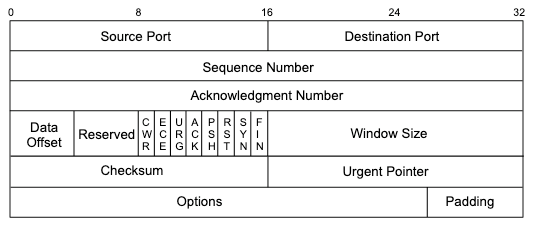

# Reading Captures

Simple reading of a capture (`.pcap`) file is done with the `-r` flag.

```bash
kali@kali:~$ tcpdump -r password_cracking_filtered.pcap
reading from file password_cracking_filtered.pcap, link-type EN10MB (Ethernet), snapshot length 65535
06:51:20.800917 IP 208.68.234.99.60509 > 172.16.40.10.81: Flags [S], seq 1855084074, win 14600, options [mss 1460,sackOK,TS val 25538253 ecr 0,nop,wscale 7], length 0
06:51:20.800953 IP 172.16.40.10.81 > 208.68.234.99.60509: Flags [S.], seq 4166855389, ack 1855084075, win 14480, options [mss 1460,sackOK,TS val 71430591 ecr 25538253,nop,wscale 4], length 0
06:51:20.801023 IP 208.68.234.99.60509 > 172.16.40.10.81: Flags [S], seq 1855084074, win 14600, options [mss 1460,sackOK,TS val 25538253 ecr 0,nop,wscale 7], length 0
06:51:20.801030 IP 172.16.40.10.81 > 208.68.234.99.60509: Flags [S.], seq 4166855389, ack 1855084075, win 14480, options [mss 1460,sackOK,TS val 71430591 ecr 25538253,nop,wscale 4], length 0
06:51:20.801048 IP 208.68.234.99.60509 > 172.16.40.10.81: Flags [S], seq 1855084074, win 14600, options [mss 1460,sackOK,TS val 25538253 ecr 0,nop,wscale 7], length 0
06:51:20.801051 IP 172.16.40.10.81 > 208.68.234.99.60509: Flags [S.], seq 4166855389, ack 1855084075, win 14480, options [mss 1460,sackOK,TS val 71430591 ecr 25538253,nop,wscale 4], length 0
06:51:20.802026 IP 208.68.234.99.60509 > 172.16.40.10.81: Flags [.], ack 1, win 115, options [nop,nop,TS val 25538253 ecr 71430591], length 0
06:51:20.802032 IP 208.68.234.99.60509 > 172.16.40.10.81: Flags [P.], seq 1:89, ack 1, win 115, options [nop,nop,TS val 25538253 ecr 71430591], length 88
06:51:20.802053 IP 172.16.40.10.81 > 208.68.234.99.60509: Flags [.], ack 89, win 905, options [nop,nop,TS val 71430591 ecr 25538253], length 0
06:51:20.802105 IP 208.68.234.99.60509 > 172.16.40.10.81: Flags [.], ack 1, win 115, options [nop,nop,TS val 25538253 ecr 71430591], length 0
...
```

## Filtering Traffic

As seen above, unfiltered captures can be a bit overwhelming. Fortunately using some creative piping it is possible to create some helpful views.

### Common Filters

<table><thead><tr><th width="255">Filter</th><th>Description</th></tr></thead><tbody><tr><td><code>src host {IP}</code></td><td>Filters <strong>source host</strong> to <code>{IP}</code></td></tr><tr><td><code>dst host {IP}</code></td><td>Filters <strong>destination host</strong> to <code>{IP}</code></td></tr><tr><td><code>{protocol}</code></td><td>Filters based on protocol used.<br><br>Example filters: <code>ip</code>, <code>tcp</code>, <code>udp</code>, <code>icmp</code>, <code>ip6</code>, <code>icmp6</code></td></tr><tr><td><code>proto</code></td><td>Used in multi-layer protocol searches.<br><br>E.g. to filter to only TCP packets that were carried over IP the filter would be <code>ip proto tcp</code></td></tr><tr><td><code>port {PORT}</code></td><td>Filters <strong>port</strong> (for both source and destination).<br><br>Can be used with <code>src</code> or <code>dst</code> to limit port filtering to source or destination respectively (e.g <code>dst port 81</code>)</td></tr><tr><td><code>portrange {LOW-HIGH}</code></td><td>Used to filter to a range of ports (for both source and destination)<br><br>Can be used with <code>src</code> or <code>dst</code> to limit filtering to source or destination respectively (e.g <code>src portrange 1000-1024</code>)</td></tr></tbody></table>

These filters are used `tcpdump {filter name} {filter_value}`. Multiple filters may be applied using the `and` and `or` keywords.

E.g. to filter traffic from source host `10.10.10.2` to destination host `10.10.10.1` in an `example.pcap` file:

```bash
kali@kali:~$ tcpdump -n src host 10.10.10.2 and dst host 10.10.10.1 -r example.pcap
```

Parentheses `()` may be used to further define and group filters.

E.g. to filter traffic from source host `10.10.10.2` to destination host `10.10.10.1`, but only ports 1-100, in an `example.pcap` file:


```
kali@kali:~$ tcpdump -n src host 10.10.10.2 and (dst host 10.10.10.1 and dst portrange 1-100) -r example.pcap
```


#### Example

Filtering an example file (`password_cracking_filtered.pcap`).&#x20;


```bash
$ tcpdump -r password_cracking_filtered.pcap | awk '{print $5}' | sort | uniq -c | head           
reading from file password_cracking_filtered.pcap, link-type EN10MB (Ethernet), snapshot length 65535
  20164 172.16.40.10.81:
     14 208.68.234.99.32768:
     14 208.68.234.99.32769:
      6 208.68.234.99.32770:
     14 208.68.234.99.32771:
      6 208.68.234.99.32772:
      6 208.68.234.99.32773:
     15 208.68.234.99.32774:
     12 208.68.234.99.32775:
      6 208.68.234.99.32776:
```


<table><thead><tr><th width="229">Component</th><th>Description</th></tr></thead><tbody><tr><td><code>tcpdump -r {FILE}</code></td><td>Reads from <code>{FILE}</code></td></tr><tr><td><code>awk '{print $5}'</code></td><td>Prints the fifth field in the dump.<br><br>Per analysis of the unfiltered file this field is the <strong>destination IP address</strong></td></tr><tr><td><code>sort</code></td><td>Sorts the output (by IP address in this case)</td></tr><tr><td><code>uniq -c</code></td><td>Returns unique entries and counts of each in the data set</td></tr></tbody></table>

Can see that `172.16.40.10` was the most common destination address followed by `208.68.234.99`. Given that `172.16.40.10` was contacted on a low destination port (81) and `208.68.234.99` was contacted on high destination ports, one can safely assume that the former is a server and the latter is a client.

```bash
sudo tcpdump -n src host 172.16.40.10 -r password_cracking_filtered.pcap
...
08:51:20.801051 IP 172.16.40.10.81 > 208.68.234.99.60509: Flags [S.], seq 4166855389, ack 1855084075, win 14480, options [mss 1460,sackOK,TS val 71430591 ecr 25538253,nop,wscale 4], length 0
08:51:20.802053 IP 172.16.40.10.81 > 208.68.234.99.60509: Flags [.], ack 89, win 905, options [nop,nop,TS val 71430591 ecr 25538253], length 0
...
sudo tcpdump -n dst host 172.16.40.10 -r password_cracking_filtered.pcap
...
08:51:20.801048 IP 208.68.234.99.60509 > 172.16.40.10.81: Flags [S], seq 1855084074, win 14600, options [mss 1460,sackOK,TS val 25538253 ecr 0,nop,wscale 7], length 0
08:51:20.802026 IP 208.68.234.99.60509 > 172.16.40.10.81: Flags [.], ack 4166855390, win 115, options [nop,nop,TS val 25538253 ecr 71430591], length 0
...
sudo tcpdump -n port 81 -r password_cracking_filtered.pcap
...
08:51:20.800917 IP 208.68.234.99.60509 > 172.16.40.10.81: Flags [S], seq 1855084074, win 14600, options [mss 1460,sackOK,TS val 25538253 ecr 0,nop,wscale 7], length 0
08:51:20.800953 IP 172.16.40.10.81 > 208.68.234.99.60509: Flags [S.], seq 4166855389, ack 1855084075, win 14480, options [mss 1460,sackOK,TS val 71430591 ecr 25538253,nop,wscale 4], length 0
...
```

## Header Filtering

Continuing with the example from above it would be nice to narrow the capture down to just data packets. One proxy for determining if a packet is a data packet is looking for ones that have the `PSH` or `ACK` flag turned on.

* All packets sent and received after the initial 3-way handshake will have the `ACK` flag set.&#x20;
* `PSH` flag is used to enforce immediate delivery of a packet and is commonly used in interactive _Application Layer_ protocols to avoid buffering

<figure><figcaption><p>TCP Packet Header</p></figcaption></figure>

The `PSH` and `ACK` flags are the **fourth and fifth bits** of the **fourteenth byte**.

Turning on only these flags would yield a 14th byte of `00011000` (decimal 24).

This can be passed as a filter to tcpdump (`'tcp[13] = 24'`) to filter to only packets with the `PSH` and `ACK` flags set.

```bash
kali@kali:~$ sudo tcpdump -A -n 'tcp[13] = 24' -r password_cracking_filtered.pcap
06:51:20.802032 IP 208.68.234.99.60509 > 172.16.40.10.81: Flags [P.], seq 1855084075:1
E.....@.9....D.c..(
.].Qn.V+.]*....s1......
.....A..GET //admin HTTP/1.1
Host: admin.megacorpone.com:81
User-Agent: Teh Forest Lobster

...
E.....@.@.....(
.D.c.Q.^...E..?I...........
.A......HTTP/1.1 401 Authorization Required
Date: Mon, 22 Apr 2013 12:51:20 GMT
Server: Apache/2.2.20 (Ubuntu)
WWW-Authenticate: Basic realm="Password Protected Area"
Vary: Accept-Encoding
Content-Length: 488
Content-Type: text/html; charset=iso-8859-1

<!DOCTYPE HTML PUBLIC "-//IETF//DTD HTML 2.0//EN">
<html><head>
<title>401 Authorization Required</title>
</head><body>
<h1>Authorization Required</h1>
<p>This server could not verify that you
are authorized to access the document
requested.  Either you supplied the wrong
credentials (e.g., bad password), or your
browser doesn't understand how to supply
the credentials required.</p>
<hr>
<address>Apache/2.2.20 (Ubuntu) Server at admin.megacorpone.com Port 81</address>
</body></html>

...

08:51:25.044432 IP 172.16.40.10.81 > 208.68.234.99.33313:
E..s.m@.@..U..(
.D.c.Q.!o....&......^u.....
.A......HTTP/1.1 301 Moved Permanently
Date: Mon, 22 Apr 2013 12:51:25 GMT
Server: Apache/2.2.20 (Ubuntu)
Location: http://admin.megacorpone.com:81/admin/
Vary: Accept-Encoding
Content-Length: 333
Content-Type: text/html; charset=iso-8859-1

<!DOCTYPE HTML PUBLIC "-//IETF//DTD HTML 2.0//EN">
<html><head>
<title>301 Moved Permanently</title>
</head><body>
<h1>Moved Permanently</h1>
<p>The document has moved <a href="http://admin.megacorpone.com:81/admin/">here</a>.</p>
<hr>
<address>Apache/2.2.20 (Ubuntu) Server at admin.megacorpone.com Port 81</address>
</body></html>
```

The significant amount of HTTP 401 requests indicate a brute force attack. The eventual 301 (HTTP redirect) indicates that the attack succeeded and the attacker was redirected to the appropriate location.

#### Matching with tcpflags <a href="#matching-with-tcpflags" id="matching-with-tcpflags"></a>

Actually, there’s an easier way to filter flags (`man pcap-filter` and look for tcpflags):

```bash
tcpdump 'tcp[tcpflags] == tcp-ack'
```

Matching all packages with TCP-SYN or TCP-FIN set:

```bash
tcpdump 'tcp[tcpflags] & (tcp-syn|tcp-fin) != 0'
```
