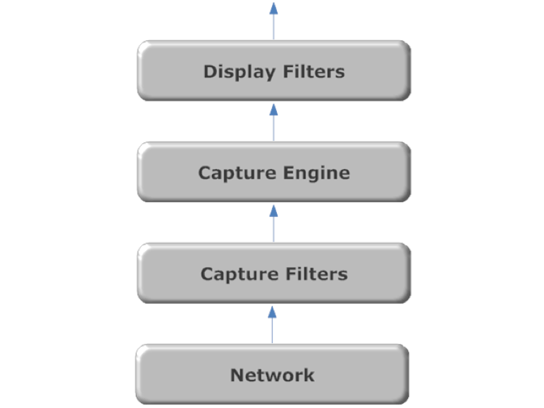
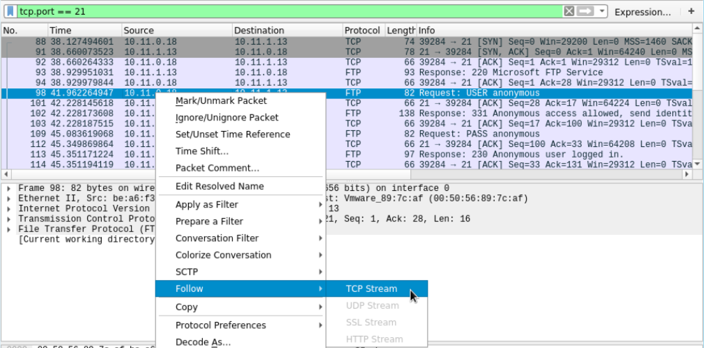

# Wireshark

Wireshark uses _Libpcap_ (on Linux) or _Winpcap_ (on Windows) libraries in order to capture packets from the network.

In order to facilitate the analysis various filters can be applied

* Capture Filters
  * When engaged any packets that do not match the filter criteria will be dropped and the remaining data is passed on to the _capture engine_
* Display Filters
  * Fiters applied post-capture to limit output

<figure><figcaption>
Wireshark Order of Operations
</figcaption></figure>

## Streams

Wireshark allows user to view network traffic including the contents of each packet. However, they're often more interested in _streams_ of data between various applications. Wireshark offers the ability to follow a TCP stream by right clicking on the packet:

<figure><figcaption>
Follow TCP Stream in Wireshark
</figcaption></figure>
