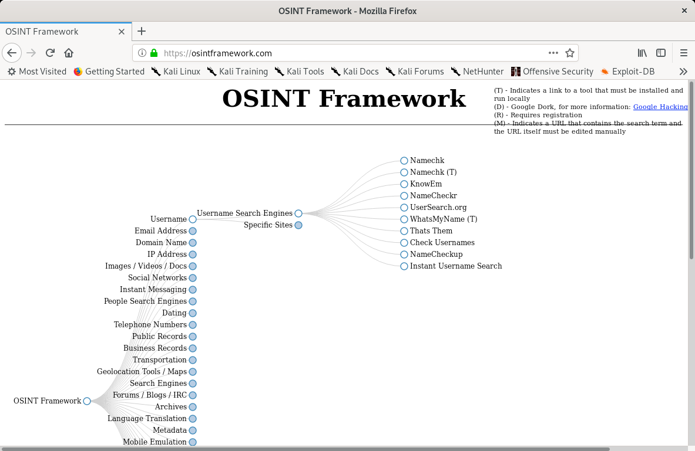

# Information Gathering Frameworks

## OSINT Framework

The OSINT Framework includes information gathering tools and websites in one central location.

The OSINT framework is not meant to be a checklist, but reviewing the categories and available tools may spur ideas for additional information gathering opportunities.

<figure><figcaption>
OSINT Framework
</figcaption></figure>

## Maltego

Maltego is a very powerful data mining tool that offers an endless combination of search tools and strategies. The learning curve for it can be steep, but its impressive capability warrants an introduction.

Maltego searches thousands of online data sources, and uses extremely clever "transforms" to convert one piece of information into another.&#x20;

Maltego CE (the limited "community version" of Maltego) is included in Kali and requires a free registration to use. Commercial versions are also available and can handle larger datasets.

#### Example Use Cases

1. If performing a user information gathering campaign, one could submit an email address, and through various automated searches, "transform" that into an associated phone number or street address
2. During an organizational information gathering exercise, one could submit a domain name and "transform" that into a web server, then a list of email addresses, then a list of associated social media accounts, and then into a potential password list for that email account
