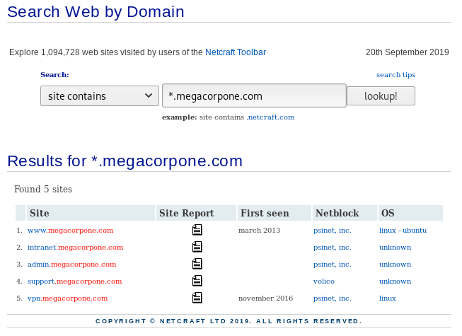
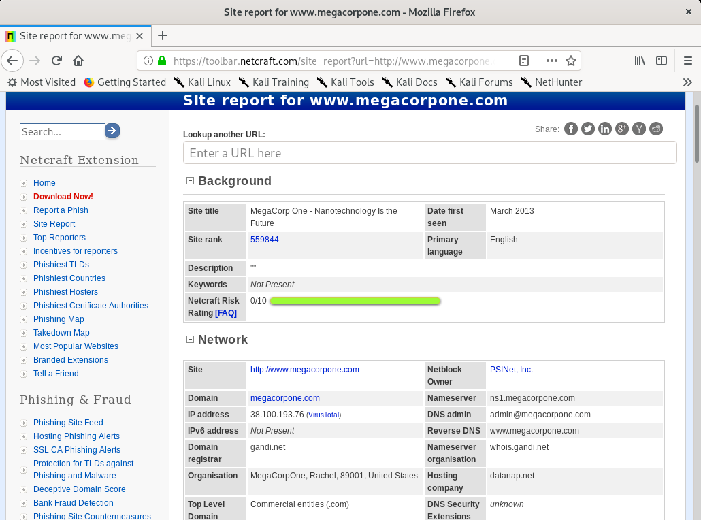
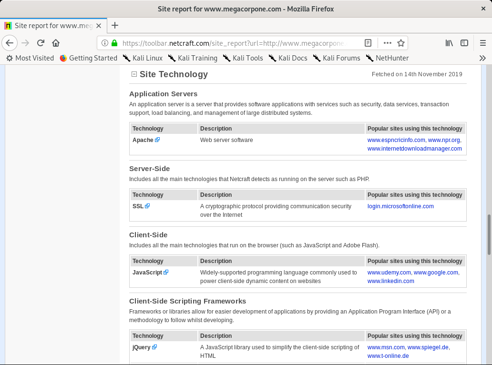

# Netcraft

Internet services company based in England offering a free web portal that performs various information gathering functions.

## DNS Search

Used to gather DNS information about a target

#### Example

<figure><figcaption>
DNS search results for OffSec's example site
</figcaption></figure>

## Site Report

For each server located in the DNS search there is a _Site Report_ available.

Included in the site report is a section about **Site Technology** which can often contain useful information about the software running on the site.

#### Example

<figure><figcaption>
Example Site Report
</figcaption></figure>

<figure><figcaption>
Site Technology section of Site Report
</figcaption></figure>
