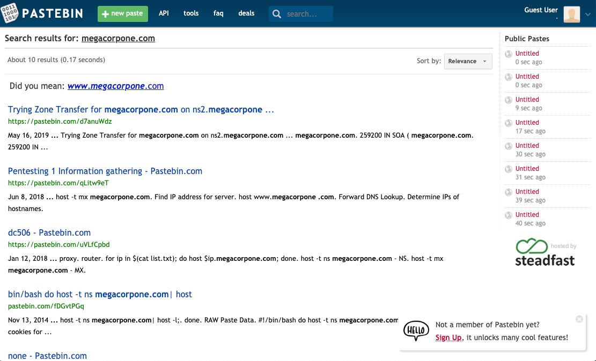

# Pastebin

_Pastebin_ is a website for storing and sharing text. The site doesn't require an account for basic usage. Many people use Pastebin because it is ubiquitous and simple to use. Additionally because of the anonymity offered by the service, Pastebin is often used in the dumping/shaming phase of cyberattacks.

For these reasons, it is worth running a quick search on pastebin to see if anything turns up. It likely will not, but this is pretty low effort and therefore probably worth the time.

#### Example

<figure><figcaption>
Example pastebin search
</figcaption></figure>
