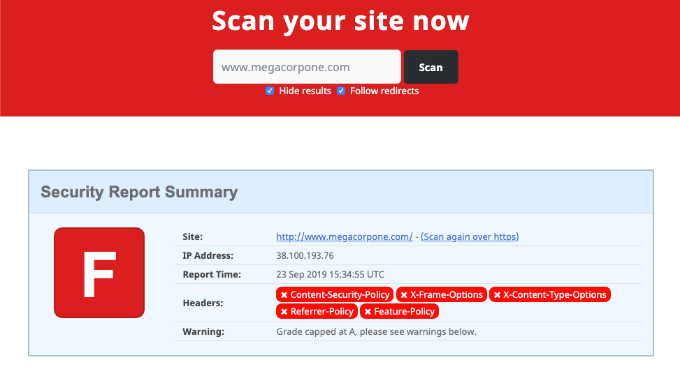

# Security Headers Scanner

Service that will analyze HTTP response headers and provide basic analysis of the target site's security posture. Can be used to get an idea of an organization's coding and security practices based on the results.

#### Example

Search MegaCorp One's website:

<figure><figcaption>
Example search
</figcaption></figure>

Based on this search, the site is missing several defensive headers, such as **Content-Security-Policy** and **X-Frame-Options**. These missing headers are not necessarily vulnerabilities in and of themselves, but they could indicate web developers or server admins that are not familiar with **server hardening**.
