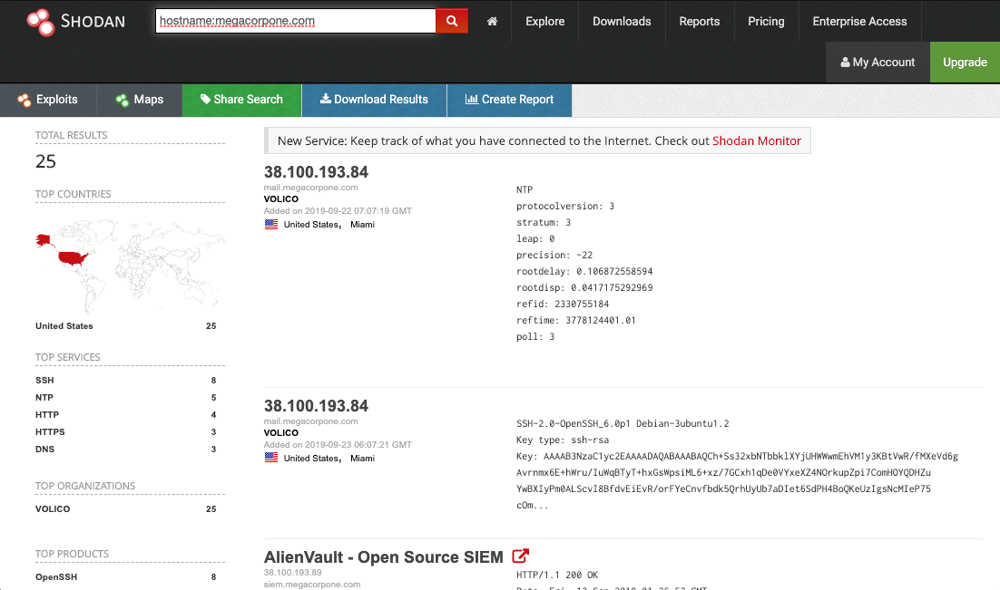
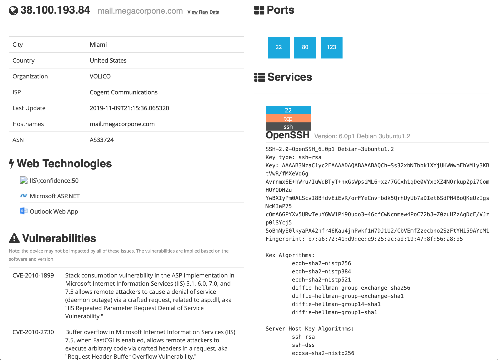

# Shodan

_Shodan_ is a search engine that crawls devices connected to the Internet including but not limited to the World Wide Web. This includes the servers that run websites but also devices like routers and IoT devices.

Shodan can search based on:

* Domain
* IP
* Device type
  * E.g. find all open webcams on the internet

<figure><figcaption>
Example Shodan search by domain
</figcaption></figure>

<figure><figcaption>
Example Shodan report for single device (IP)
</figcaption></figure>
