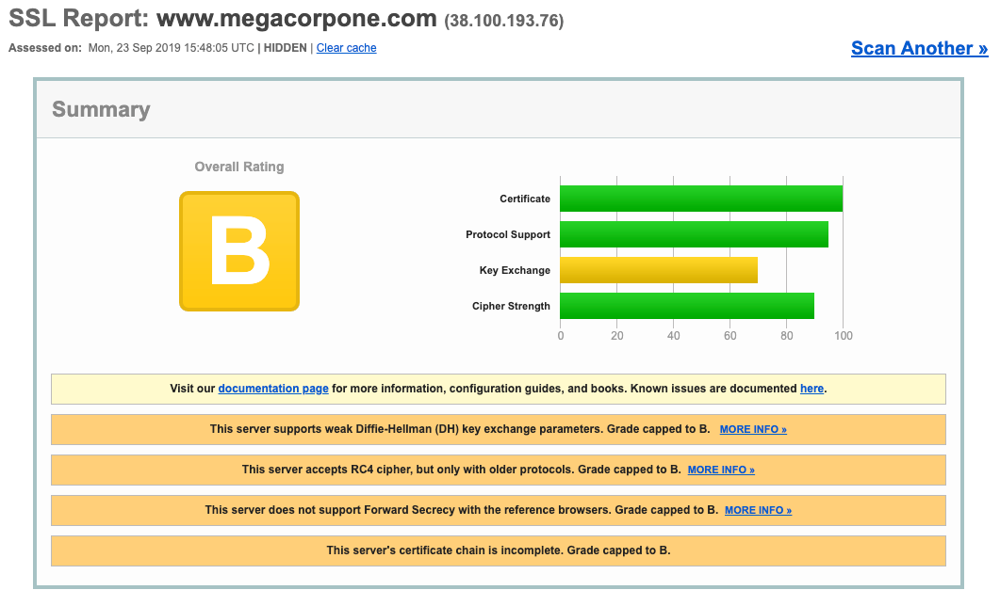

# SSL Server Test

Another scanning tool we can use is the _SSL Server Test_ from Qualys SSL Labs. This tool analyzes a server's SSL/TLS configuration and compares it against current best practices. It will also identify some SSL/TLS related vulnerabilities, such as Poodle or Heartbleed.

#### Example

Search MegaCorp One's website:

<figure><figcaption>
Example SSL Server Test search
</figcaption></figure>

The weak Diffie-Hellman key exchange, RC4 ciphers, and lack of Forward Secrecy suggest our target is not applying current best practices for SSL/TLS hardening. For example, disabling RC4 ciphers has been recommended for several years due to multiple vulnerabilities.

Again these results are not vulnerabilities in and of themselves but they do indicate a lax approach to security which means further probing efforts will likely be rewarded.
