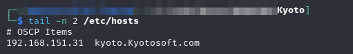
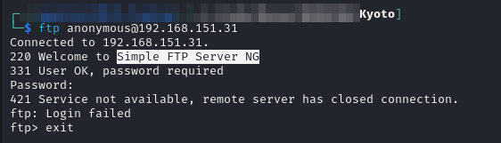
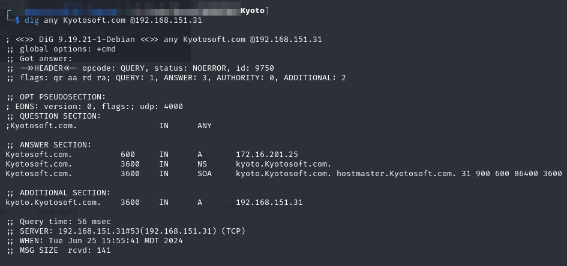
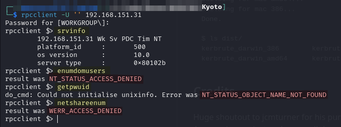
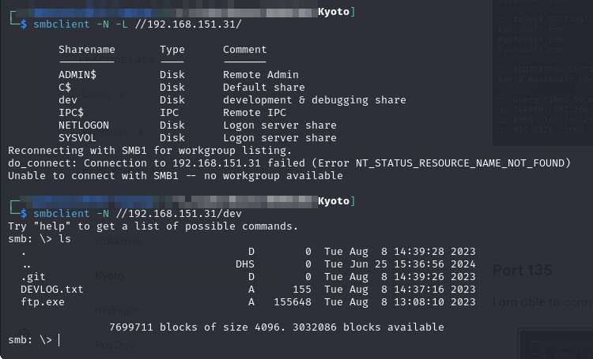

# Kyoto

## Enumeration

Started with a TCP SYN scan via Nmap:


```
# Nmap 7.94SVN scan initiated Tue Jun 25 15:37:45 2024 as: nmap -Pn -A -p- -o ./enumeration/external_tcp_all.nmap 192.168.151.31
Nmap scan report for kyoto.offsec (192.168.151.31)
Host is up (0.053s latency).
Not shown: 65505 closed tcp ports (reset)
PORT      STATE SERVICE       VERSION
21/tcp    open  ftp
| fingerprint-strings: 
|   GenericLines, Help, NULL, SMBProgNeg, SSLSessionReq: 
|_    220 Welcome to Simple FTP Server NG
53/tcp    open  domain        Simple DNS Plus
88/tcp    open  kerberos-sec  Microsoft Windows Kerberos (server time: 2024-06-25 21:38:43Z)
111/tcp   open  rpcbind?
| rpcinfo: 
|   program version    port/proto  service
|   100003  2,3         2049/udp6  nfs
|   100003  2,3,4       2049/tcp6  nfs
|   100003  3           2049/udp   nfs
|   100003  4           2049/tcp   nfs
|   100005  1,2,3       2049/tcp   mountd
|   100005  1,2,3       2049/tcp6  mountd
|   100005  1,2,3       2049/udp   mountd
|   100005  1,2,3       2049/udp6  mountd
|   100021  1,2,3,4     2049/tcp   nlockmgr
|   100021  1,2,3,4     2049/tcp6  nlockmgr
|   100021  1,2,3,4     2049/udp   nlockmgr
|   100021  1,2,3,4     2049/udp6  nlockmgr
|   100024  1           2049/tcp   status
|   100024  1           2049/tcp6  status
|   100024  1           2049/udp   status
|_  100024  1           2049/udp6  status
135/tcp   open  msrpc         Microsoft Windows RPC
139/tcp   open  netbios-ssn   Microsoft Windows netbios-ssn
389/tcp   open  ldap          Microsoft Windows Active Directory LDAP (Domain: Kyotosoft.com0., Site: Default-First-Site-Name)
445/tcp   open  microsoft-ds?
464/tcp   open  kpasswd5?
593/tcp   open  ncacn_http    Microsoft Windows RPC over HTTP 1.0
636/tcp   open  tcpwrapped
2049/tcp  open  nlockmgr      1-4 (RPC #100021)
3268/tcp  open  ldap          Microsoft Windows Active Directory LDAP (Domain: Kyotosoft.com0., Site: Default-First-Site-Name)
3269/tcp  open  tcpwrapped
3389/tcp  open  ms-wbt-server Microsoft Terminal Services
| rdp-ntlm-info: 
|   Target_Name: KYOTOSOFT
|   NetBIOS_Domain_Name: KYOTOSOFT
|   NetBIOS_Computer_Name: KYOTO
|   DNS_Domain_Name: Kyotosoft.com
|   DNS_Computer_Name: kyoto.Kyotosoft.com
|   DNS_Tree_Name: Kyotosoft.com
|   Product_Version: 10.0.20348
|_  System_Time: 2024-06-25T21:39:51+00:00
|_ssl-date: 2024-06-25T21:40:03+00:00; -1s from scanner time.
| ssl-cert: Subject: commonName=kyoto.Kyotosoft.com
| Not valid before: 2024-05-15T10:35:58
|_Not valid after:  2024-11-14T10:35:58
5985/tcp  open  http          Microsoft HTTPAPI httpd 2.0 (SSDP/UPnP)
|_http-title: Not Found
|_http-server-header: Microsoft-HTTPAPI/2.0
9389/tcp  open  mc-nmf        .NET Message Framing
47001/tcp open  http          Microsoft HTTPAPI httpd 2.0 (SSDP/UPnP)
|_http-title: Not Found
|_http-server-header: Microsoft-HTTPAPI/2.0
49664/tcp open  msrpc         Microsoft Windows RPC
49665/tcp open  msrpc         Microsoft Windows RPC
49666/tcp open  msrpc         Microsoft Windows RPC
49667/tcp open  msrpc         Microsoft Windows RPC
49668/tcp open  msrpc         Microsoft Windows RPC
49672/tcp open  msrpc         Microsoft Windows RPC
49675/tcp open  ncacn_http    Microsoft Windows RPC over HTTP 1.0
49676/tcp open  msrpc         Microsoft Windows RPC
49694/tcp open  msrpc         Microsoft Windows RPC
49709/tcp open  msrpc         Microsoft Windows RPC
49714/tcp open  msrpc         Microsoft Windows RPC
49739/tcp open  msrpc         Microsoft Windows RPC
1 service unrecognized despite returning data. If you know the service/version, please submit the following fingerprint at https://nmap.org/cgi-bin/submit.cgi?new-service :
SF-Port21-TCP:V=7.94SVN%I=7%D=6/25%Time=667B38E3%P=x86_64-pc-linux-gnu%r(N
...
SF:le\x20FTP\x20Server\x20NG\r\n\r\n");
No exact OS matches for host (If you know what OS is running on it, see https://nmap.org/submit/ ).
TCP/IP fingerprint:
OS:SCAN(V=7.94SVN%E=4%D=6/25%OT=21%CT=1%CU=43025%PV=Y%DS=4%DC=T%G=Y%TM=667B
...
OS:RUD=G)IE(R=N)

Network Distance: 4 hops
Service Info: Hosts: Simple, KYOTO; OS: Windows; CPE: cpe:/o:microsoft:windows

Host script results:
| smb2-security-mode: 
|   3:1:1: 
|_    Message signing enabled and required
| smb2-time: 
|   date: 2024-06-25T21:39:52
|_  start_date: N/A
```


It appears to be the DC for a domain called `Kyotosoft.com`. The machine itself appears to also be named `kyoto`. I make the appropriate entry in my `/etc/hosts` file:

<figure><figcaption><p>Hosts entry</p></figcaption></figure>

I then proceed to work on the open ports.

### Port 21

Initial attempt at anonymous login was unsuccessful:

<figure><figcaption><p>Initial attempt at anonymous FTP connection</p></figcaption></figure>


### Port 53

Some DNS records are available but nothing interesting:

<figure><figcaption><p>Dig any results</p></figcaption></figure>


### Port 135

I am able to connect anonymously with rpcclient but most commands seem to be unavailable:

<figure><figcaption></figcaption></figure>


### Ports 139 & 445

I attempt anonymous SMB share listing. It succeeds so I try connecting to one of the shares (`dev`) anonymously which also succeeds:

<figure><figcaption><p>Anonymous SMB enumeration</p></figcaption></figure>

The foothold requires creating a custom buffer overflow payload so I skip it for now.
