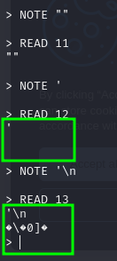

---
layout:
  title:
    visible: true
  description:
    visible: false
  tableOfContents:
    visible: true
  outline:
    visible: true
  pagination:
    visible: true
---

# midnight

## Enumeration

## Foothold

### Remote Note Keeper

There's not much to do but just kind of mess with it a bit. The startup menu listed 4 commands: `NOTE`, `LIST`, `READ`, and `EXIT`.

When `NOTE` is used the service is presumably just reading the command line input. This means there may be an opportunity for command injection if I can figure out how to escape the script. I start typing random things into the `NOTE` command and then using `READ` to see if it got altered in processing. Each time I create a note the index is incremented so I can use `READ` with the next number in sequence each time.

Eventually I find something weird with apostrophes `'`. When I run NOTE ' and then READ there is an extra carriage return. The standard behavior can be seen with `READ 11` which correctly read double quotes entered via `NOTE ""`. After printing the note contents there is a single empty line before the next input prompt:

<figure><figcaption>
Weird processing around '
</figcaption></figure>

However `READ 12` has 2 carriage returns. And `READ 13` gets quite strange. So this implies somehow the ' is escaping the normal processing. If I can figure out what sort of loop this is running in perhaps I can inject commands. This will take more messing with the service.

At this point I got stuck.
