---
layout:
  title:
    visible: true
  description:
    visible: false
  tableOfContents:
    visible: true
  outline:
    visible: true
  pagination:
    visible: true
---

# Depreciated

## Enumeration

### Nmap

```
Starting Nmap 7.94SVN ( https://nmap.org ) at 2024-05-30 20:48 MDT
Nmap scan report for depreciated.offsec (192.168.191.170)
Host is up (0.057s latency).
Not shown: 65531 closed tcp ports (reset)
PORT     STATE SERVICE VERSION
22/tcp   open  ssh     OpenSSH 8.2p1 Ubuntu 4ubuntu0.3 (Ubuntu Linux; protocol 2.0)
| ssh-hostkey: 
|   3072 c1:99:4b:95:22:25:ed:0f:85:20:d3:63:b4:48:bb:cf (RSA)
|   256 0f:44:8b:ad:ad:95:b8:22:6a:f0:36:ac:19:d0:0e:f3 (ECDSA)
|_  256 32:e1:2a:6c:cc:7c:e6:3e:23:f4:80:8d:33:ce:9b:3a (ED25519)
80/tcp   open  http    nginx 1.18.0 (Ubuntu)
|_http-server-header: nginx/1.18.0 (Ubuntu)
|_http-title: Under Maintainence
5132/tcp open  unknown
| fingerprint-strings: 
|   DNSStatusRequestTCP, DNSVersionBindReqTCP, NULL: 
|     Enter Username:
|   GenericLines, GetRequest, HTTPOptions, RTSPRequest: 
|     Enter Username: Enter OTP: Incorrect username or password
|   Help: 
|     Enter Username: Enter OTP:
|   RPCCheck: 
|     Enter Username: Traceback (most recent call last):
|     File "/opt/depreciated/messaging/messages.py", line 100, in <module>
|     main()
|     File "/opt/depreciated/messaging/messages.py", line 82, in main
|     username = input("Enter Username: ")
|     File "/usr/lib/python3.8/codecs.py", line 322, in decode
|     (result, consumed) = self._buffer_decode(data, self.errors, final)
|     UnicodeDecodeError: 'utf-8' codec can't decode byte 0x80 in position 0: invalid start byte
|   SSLSessionReq: 
|     Enter Username: Traceback (most recent call last):
|     File "/opt/depreciated/messaging/messages.py", line 100, in <module>
|     main()
|     File "/opt/depreciated/messaging/messages.py", line 82, in main
|     username = input("Enter Username: ")
|     File "/usr/lib/python3.8/codecs.py", line 322, in decode
|     (result, consumed) = self._buffer_decode(data, self.errors, final)
|     UnicodeDecodeError: 'utf-8' codec can't decode byte 0xd7 in position 13: invalid continuation byte
|   TerminalServerCookie: 
|     Enter Username: Traceback (most recent call last):
|     File "/opt/depreciated/messaging/messages.py", line 100, in <module>
|     main()
|     File "/opt/depreciated/messaging/messages.py", line 82, in main
|     username = input("Enter Username: ")
|     File "/usr/lib/python3.8/codecs.py", line 322, in decode
|     (result, consumed) = self._buffer_decode(data, self.errors, final)
|_    UnicodeDecodeError: 'utf-8' codec can't decode byte 0xe0 in position 5: invalid continuation byte
8433/tcp open  http    Werkzeug httpd 2.0.2 (Python 3.8.10)
|_http-server-header: Werkzeug/2.0.2 Python/3.8.10
|_http-title: Site doesn't have a title (text/html; charset=utf-8).
1 service unrecognized despite returning data. If you know the service/version, please submit the following fingerprint at https://nmap.org/cgi-bin/submit.cgi?new-service :
SF-Port5132-TCP:V=7.94SVN%I=7%D=5/30%Time=66593AC6%P=x86_64-pc-linux-gnu%r
...
SF:\n");
No exact OS matches for host (If you know what OS is running on it, see https://nmap.org/submit/ ).
TCP/IP fingerprint:
OS:SCAN(V=7.94SVN%E=4%D=5/30%OT=22%CT=1%CU=36345%PV=Y%DS=4%DC=T%G=Y%TM=6659
...
OS:=9D9A%RUD=G)IE(R=Y%DFI=N%T=40%CD=S)

Network Distance: 4 hops
Service Info: OS: Linux; CPE: cpe:/o:linux:linux_kernel

TRACEROUTE (using port 199/tcp)
HOP RTT      ADDRESS
1   56.18 ms 192.168.45.1
2   56.10 ms 192.168.45.254
3   57.82 ms 192.168.251.1
4   58.00 ms depreciated.offsec (192.168.191.170)

OS and Service detection performed. Please report any incorrect results at https://nmap.org/submit/ .
Nmap done: 1 IP address (1 host up) scanned in 133.82 seconds
```

### Port 80

The landing page here just says the site is under maintenance:

<figure><figcaption><p>Lading page</p></figcaption></figure>

I ran `feroxbuster` but found nothing else of use.

### Port 5132

I attempt to Telnet into 5132 because that seems like a logical starting point. I am prompted for a username upon successful connection:

<figure>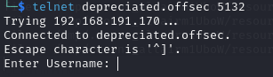<figcaption><p>Port 5132 prompt</p></figcaption></figure>

Once entered it asks for an OTP. I tried `admin:123456` to see what would happen and it just closed the connection:

<figure>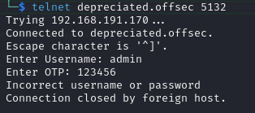<figcaption><p>Connection closed</p></figcaption></figure>

If I can find a OTP or generator this could be helpful. Otherwise it is just brute-force.

### Port 8433

This port has a landing page that indicates it is for an API:

<figure>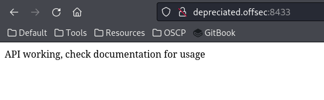<figcaption><p>Port 8433</p></figcaption></figure>

I use [`ffuf`](https://github.com/ffuf/ffuf) to check for API endpoints (using both `POST` and `GET`) and I find 2:


```bash
ffuf -u http://depreciated.offsec:8433/FUZZ -X POST -w /usr/share/wordlists/seclists/Discovery/Web-Content/api/api-endpoints-res.txt
```


* `ffuf` replaces "`FUZZ`" with the contents of the wordlist (potential API endpoint names in this case)
* `-x POST` uses HTTP `POST` commands during enumeration. I ran the same command again with `-x GET` (which is the default) and found the same endpoints

<figure>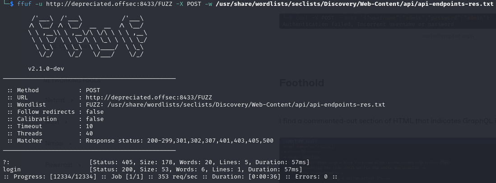<figcaption><p>ffuf output</p></figcaption></figure>

I examine these endpoints. `/?` just shows the landing page. `/login` can be posted to via `curl`. Maybe this can be brute-forced but it does not seem likely:

<figure>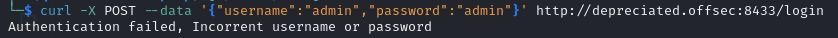<figcaption><p>curl attempt at login</p></figcaption></figure>

At this point I must do some closer examination.

## Foothold

I head back to port 80 to see what is in the source code. I find a commented-out section of HTML that indicates GraphQL is being used and the endpoint:

<figure>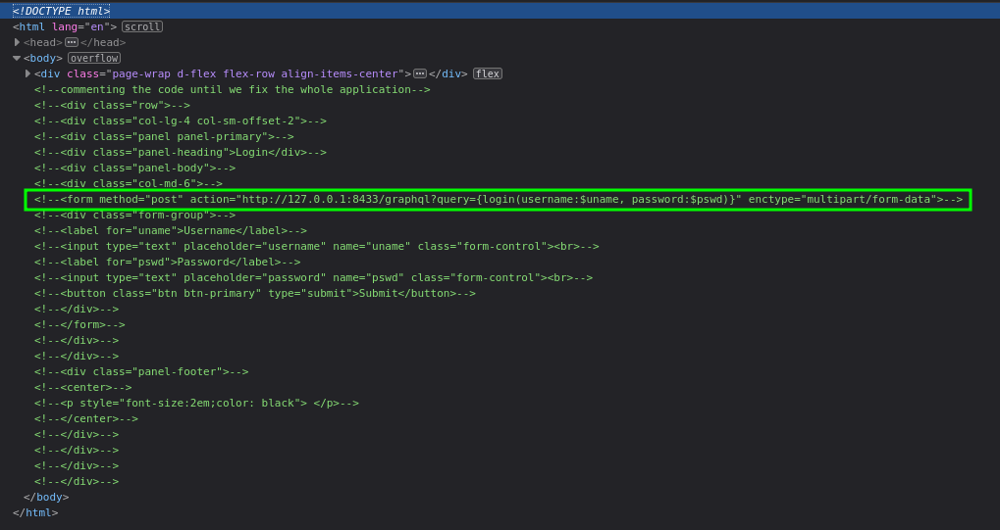<figcaption><p>GraphQL left in HTML</p></figcaption></figure>

Perfect this gives me a point to look at. I did not know much about GraphQL.

### GraphQL

[GraphQL](https://graphql.org/) is is an open-source data query and manipulation language for APIs and a query runtime engine.

GraphQL enables **declarative data fetching** where a _client can specify exactly what data it needs from an API_. Instead of multiple endpoints that return separate data, a GraphQL server exposes a single endpoint and responds with precisely the data a client asked for. Because a GraphQL server can fetch from separate data sources and present the data in a unified [graph](https://en.wikipedia.org/wiki/Graph\_\(abstract\_data\_type\)), it is not tied to any specific database or storage engine.

### Interacting with GraphQL

Most sources recommend [GraphiQL](https://github.com/skevy/graphiql-app) as a tool. Unfortunately every version of the `.AppImage` I tried had a segmentation fault just after launch.&#x20;

Instead I used [Altair](https://altairgraphql.dev/) which worked flawlessly.

#### Login Attempt

My first try I attempted to use the same exact query seen in the HTML comment:


```html
<form method="post" action="http://127.0.0.1:8433/graphql?query={login(username:$uname, password:$pswd)}" enctype="multipart/form-data">
```


To set it up I used an external version of the URL from the HTML above. The URL was set to:

```
http://depreciated.offsec:8433/graphql
```

And the query section contained:

```graphql
{login(username:"admin", password:"admin")}
```

Now this errored on the first run because I had not set variables but it at least outlines the structure:

<figure>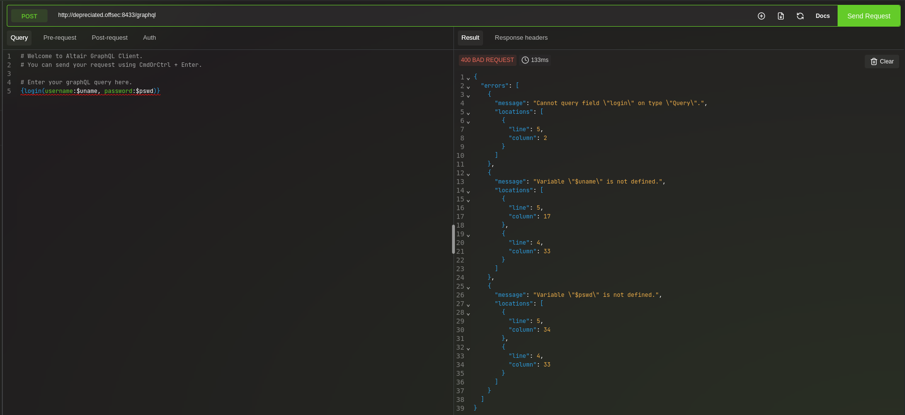<figcaption><p>Errored initial query</p></figcaption></figure>

#### Listing All Commands

Using the technique described [here](https://book.hacktricks.xyz/network-services-pentesting/pentesting-web/graphql?source=post\_page-----23b84201c463--------------------------------#introspection) I use introspection to list all commands with the query:

```graphql
{__schema{types{name,fields{name}}}}
```

This revealed a list of commands:

<figure>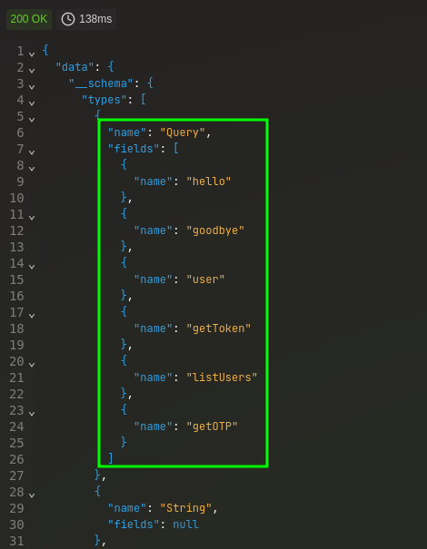<figcaption><p>List of queries available</p></figcaption></figure>

The last 2 seem particularly helpful. Lets start with users.

#### List Users

The query is simply:

```graphql
{listUsers}
```


<figure>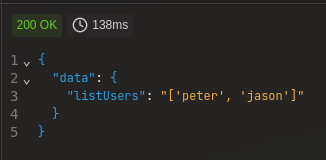<figcaption><p>Users</p></figcaption></figure>

#### Get OTP

I attempt to use getOTP now. My first attempt I structure incorrectly:

<figure>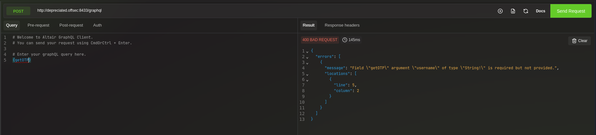<figcaption></figcaption></figure>

The error message helped me construct a query and I got an OTP back!

```graphql
{getOTP(username:"peter")}
```

<figure>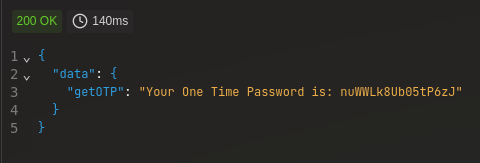<figcaption><p>OTP Returned</p></figcaption></figure>

### Connecting With OTP

Out of curiosity I try the OTP on port 5132 and it works!

<figure>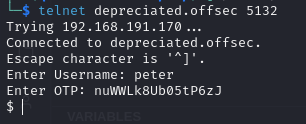<figcaption><p>Successful Authentication</p></figcaption></figure>

No matter what I typed: whoami, help, ?, etc. nothing returned anything. Eventually I decided to try something other than Telnet and tried Netcat. At this point at least a `help` command worked:

<figure>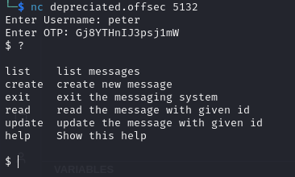<figcaption><p>Netcat connection</p></figcaption></figure>

Still not exactly sure what I am looking at but it is something.

### Figuring Out Where I Am

So I have the ability to run commands via some type of connection at port 5132. Unfortunately I cannot run arbitrary commands yet so that is the next step.

I use the list command mentioned to list the messages and then I attempted to read each one. One contains what might be the current user's password:

<figure>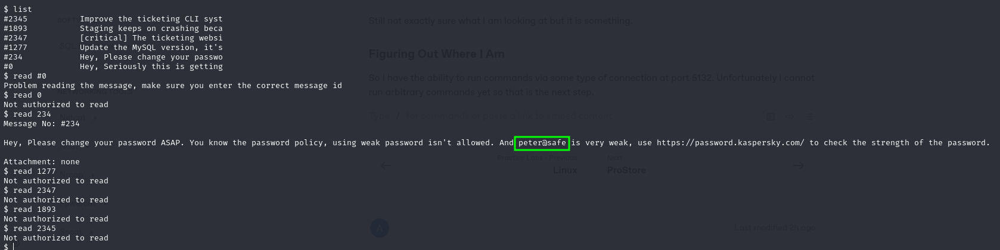<figcaption><p>Potential password</p></figcaption></figure>

I recall that the machine had OpenSSH at port 22 so I am going to try the `peter:peter@safe` credentials on port 22:

<figure>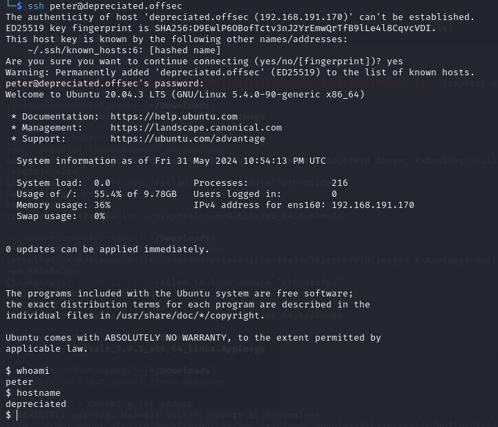<figcaption><p>Successful SSH</p></figcaption></figure>

User access achieved as `peter`.

## Privilege Escalation

I started linPEAS in one SSH session and then popped open another to do some manual enumeration.

### Interesting Root Process

I started making my way through [S1ren's privesc checklist](https://sirensecurity.io/blog/linux-privilege-escalation-resources/) and when I looked for processes running as `root` I found something interesting:

```bash
ps aux |grep -i 'root' --color=auto
```

<figure>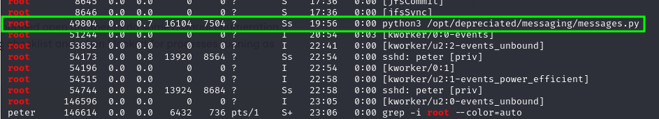<figcaption><p>Interesting process as root</p></figcaption></figure>

I check the file location and find it is all owned by root but a lot of it is readable:

<figure>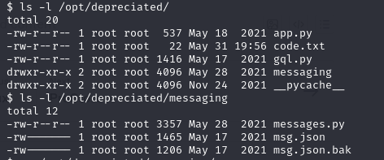<figcaption><p>Readable directories</p></figcaption></figure>

### Source Code Examination

I copy the `messages.py` file to my machine and look it over:


```python
import json
import os
import random
#TODO: Need to fix all the weird logics and bugs
try:
    with open("/opt/depreciated/messaging/msg.json", "r") as f:
        MESSAGES = json.load(f)
except json.decoder.JSONDecodeError:
    with open("/opt/depreciated/messaging/msg.json.bak", "r") as f:
        MESSAGES = json.load(f)

def create_message(user):
    for_ = input("for: ")
    description = input("Description: ")
    num = random.randint(1000, 9999)
    author = user
    attachment = input("File: ")

    if attachment and attachment != "none" and os.path.exists(attachment):
        with open(attachment, 'r') as f:
            data = f.read()
        basename = '/opt/depreciated/' + os.path.basename(attachment)

        with open(basename, 'w') as f:
            f.write(data)
    else:
        attachment = "none"
    msg_info = {'id': num, 'author': author, 'description': description, 'for': for_, 'attachment': attachment}
    MESSAGES.append(msg_info)

    with open("/opt/depreciated/messaging/msg.json", 'w') as f:
         json.dump(MESSAGES, f)


def terminal(user):
    """This will provide the attacker a shell via 
       which they can run/execute custom commands
    """

        
    while True:
        cmd = input("$ ")
        if cmd.lower() == "help" or cmd.lower() == "?":
            print("""
list    list messages
create  create new message
exit    exit the messaging system
read    read the message with given id
update  update the message with given id
help    Show this help
                    """)
        elif cmd.lower() == "exit":
            exit(1)
        elif cmd.lower() == "list":
            for message in MESSAGES:
                print(f'#{message["id"]}\t\t{message["description"][:30]}')
        elif cmd.lower() == "create":
            create_message(user)
        elif "read" in cmd.lower():
            try:
                _, message_id = cmd.lower().split()
            except ValueError:
                print("Please provide a valid message id")
                continue
            try:
                for message in MESSAGES:
                    if message["id"] == int(message_id) and (user == message["author"] or user in message["for"] or user == "admin"):
                        if "attachment" in message:
                            attach = message['attachment']
                        else:
                            attach = "none"
                        print(f'Message No: #{message["id"]}\n\n{message["description"]}\n\nAttachment: {attach}')
                        break
                else:
                   print("Not authorized to read")
            except ValueError:
                print('Problem reading the message, make sure you enter the correct message id')
        elif "update" in cmd.lower():
            print("This is a WIP feature")

def main():
    username = input("Enter Username: ")
    OTP = input("Enter OTP: ")

    with open("/opt/depreciated/code.txt", "r") as f:
        data = f.readline()
    try:
        name,password = data.split(":")
    except ValueError:
        print("Incorrect username or password")
        exit(1)

    if (username.strip() == name.strip()) and (OTP.strip() == password.strip()):
        terminal(name)
    else:
        print("Incorrect username or password")
        exit(1)

if __name__ == '__main__':
    main()
```


So first I notice the login and terminal. Basically it reads a file at `/opt/depreciated/code.txt` which is presumably generated by the API call `getOTP` because I found the file and it just looked like this:


```
peter:Gj8YTHnIJ3psj1mW
```


### Leaking `root` Files

That file is read and compared for login. Once logged in the attacker can use the commands listed. I then zero in on the `create_message` function and specifically its attachment feature. It looks like the attachment is copied to `/opt/depreciated` (which I can read). But `messages.py` is running as root so theoretically anything can be copied. I go back to my connection on port `5132` and try to send myself a message with `/etc/shadow` as the attachment:

<figure>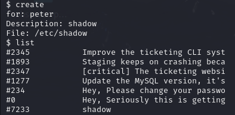<figcaption><p>Leaking as root PoC</p></figcaption></figure>

I then went back to my SSH session, checked `/opt/depreciated`, and lo and behold:

<figure>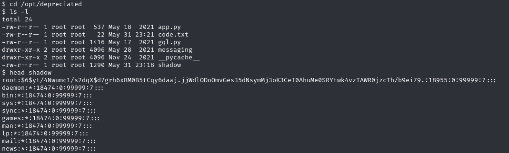<figcaption><p>Readable copy of shadow file</p></figcaption></figure>

Ok so it seems I can leak files this way. For good measure I leaked the flag like this but that seems like not what they had in mind.

I attempted leaking a root SSH key from the default location `/root/.ssh/id_rsa` (root had its home at /root) but there was nothing there.

I also tried cracking the hash in /etc/shadow but that did not work.

Finally I decided to leak the `msg.json` file that stores all messages on the system (referenced in `messages.py`):

<figure>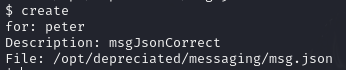<figcaption><p>Leaking the msg.json file</p></figcaption></figure>

I took it back to my machine and examine it. I quickly find something valuable, a message to admin that contains a password:

<figure>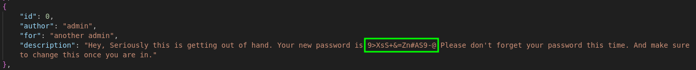<figcaption><p>Leaked password</p></figcaption></figure>

I decide to try this as `root`'s SSH password and it works:

<figure>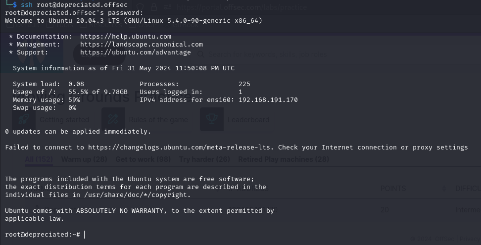<figcaption><p>SSH session as root</p></figcaption></figure>

Admin access achieved!

## Learned

* **GraphQL:** I had never encountered GraphQL before so I had to learn it here. It would be nice to get more practice with it on another machine
