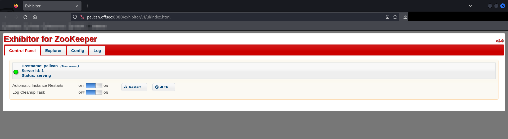
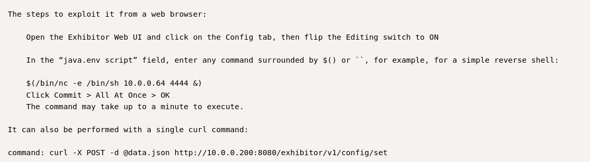
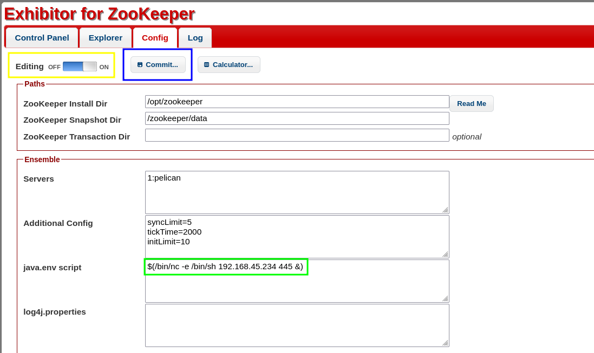
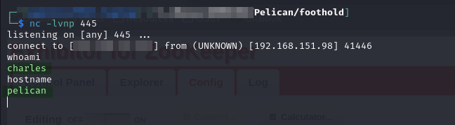
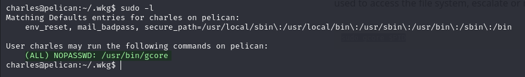
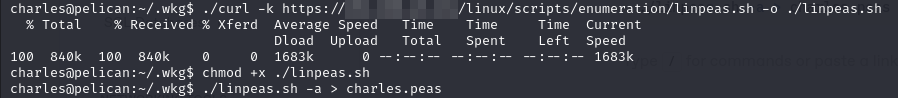
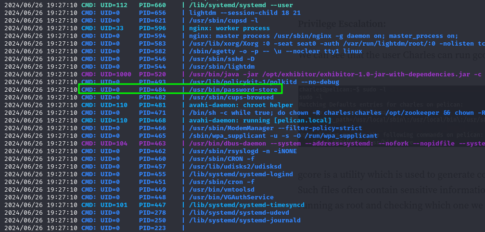
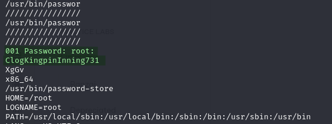
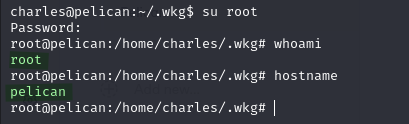

# Pelican

## Enumeration

I start with an Nmap TCP SYN scan:


```
# Nmap 7.94SVN scan initiated Tue Jun 25 18:23:47 2024 as: nmap -Pn -A -p- -o ./enumeration/external_tcp_all.nmap 192.168.151.98
Nmap scan report for pelican.offsec (192.168.151.98)
Host is up (0.052s latency).
Not shown: 65526 closed tcp ports (reset)
PORT      STATE SERVICE     VERSION
22/tcp    open  ssh         OpenSSH 7.9p1 Debian 10+deb10u2 (protocol 2.0)
| ssh-hostkey: 
|   2048 a8:e1:60:68:be:f5:8e:70:70:54:b4:27:ee:9a:7e:7f (RSA)
|   256 bb:99:9a:45:3f:35:0b:b3:49:e6:cf:11:49:87:8d:94 (ECDSA)
|_  256 f2:eb:fc:45:d7:e9:80:77:66:a3:93:53:de:00:57:9c (ED25519)
139/tcp   open  netbios-ssn Samba smbd 3.X - 4.X (workgroup: WORKGROUP)
445/tcp   open  netbios-ssn Samba smbd 4.9.5-Debian (workgroup: WORKGROUP)
631/tcp   open  ipp         CUPS 2.2
|_http-server-header: CUPS/2.2 IPP/2.1
|_http-title: Bad Request - CUPS v2.2.10
2181/tcp  open  zookeeper   Zookeeper 3.4.6-1569965 (Built on 02/20/2014)
2222/tcp  open  ssh         OpenSSH 7.9p1 Debian 10+deb10u2 (protocol 2.0)
| ssh-hostkey: 
|   2048 a8:e1:60:68:be:f5:8e:70:70:54:b4:27:ee:9a:7e:7f (RSA)
|   256 bb:99:9a:45:3f:35:0b:b3:49:e6:cf:11:49:87:8d:94 (ECDSA)
|_  256 f2:eb:fc:45:d7:e9:80:77:66:a3:93:53:de:00:57:9c (ED25519)
8080/tcp  open  http        Jetty 1.0
|_http-title: Error 404 Not Found
|_http-server-header: Jetty(1.0)
8081/tcp  open  http        nginx 1.14.2
|_http-server-header: nginx/1.14.2
|_http-title: Did not follow redirect to http://pelican.offsec:8080/exhibitor/v1/ui/index.html
37753/tcp open  java-rmi    Java RMI
No exact OS matches for host (If you know what OS is running on it, see https://nmap.org/submit/ ).
TCP/IP fingerprint:
OS:SCAN(V=7.94SVN%E=4%D=6/25%OT=22%CT=1%CU=34870%PV=Y%DS=4%DC=T%G=Y%TM=667B
OS:5FE1%P=x86_64-pc-linux-gnu)SEQ(SP=106%GCD=1%ISR=10E%TI=Z%II=I%TS=A)SEQ(S
OS:P=106%GCD=2%ISR=10E%TI=Z%II=I%TS=A)OPS(O1=M551ST11NW7%O2=M551ST11NW7%O3=
OS:M551NNT11NW7%O4=M551ST11NW7%O5=M551ST11NW7%O6=M551ST11)WIN(W1=FE88%W2=FE
OS:88%W3=FE88%W4=FE88%W5=FE88%W6=FE88)ECN(R=Y%DF=Y%T=40%W=FAF0%O=M551NNSNW7
OS:%CC=Y%Q=)T1(R=Y%DF=Y%T=40%S=O%A=S+%F=AS%RD=0%Q=)T2(R=N)T3(R=N)T4(R=N)T5(
OS:R=Y%DF=Y%T=40%W=0%S=Z%A=S+%F=AR%O=%RD=0%Q=)T6(R=N)T7(R=N)U1(R=Y%DF=N%T=4
OS:0%IPL=164%UN=0%RIPL=G%RID=G%RIPCK=G%RUCK=C6E7%RUD=G)IE(R=Y%DFI=N%T=40%CD
OS:=S)

Network Distance: 4 hops
Service Info: Host: PELICAN; OS: Linux; CPE: cpe:/o:linux:linux_kernel

Host script results:
| smb2-time: 
|   date: 2024-06-26T00:24:59
|_  start_date: N/A
| smb-security-mode: 
|   account_used: guest
|   authentication_level: user
|   challenge_response: supported
|_  message_signing: disabled (dangerous, but default)
| smb-os-discovery: 
|   OS: Windows 6.1 (Samba 4.9.5-Debian)
|   Computer name: pelican
|   NetBIOS computer name: PELICAN\x00
|   Domain name: \x00
|   FQDN: pelican
|_  System time: 2024-06-25T20:25:00-04:00
| smb2-security-mode: 
|   3:1:1: 
|_    Message signing enabled but not required
|_clock-skew: mean: 1h20m00s, deviation: 2h18m34s, median: 0s
```


### Port 8080

Nmap found nothing here but examining the output from port 8081 reveals that port 8081 redirects to an address on port 8080 `http://pelican.offsec:8080/exhibitor/v1/ui/index.html`. I load that up to see what I have:

<figure><figcaption><p>Landing page on port 8080</p></figcaption></figure>

### Port 8081

Redirects to [port 8080](pelican.md#port-8080).

## Foothold

Honestly at this point I kind of just stumbled into the foothold. I was researching what Exhibitor for Zookeeper was when I stumbled across an [RCE for it](https://www.exploit-db.com/exploits/48654). According to the version marker in the corner on screen, it is running v1.0 so I decided this was worth a shot.

According to the Exploit-DB entry it can be exploited via the `Config` UI:

<figure><figcaption><p>Excerpt from EDB describing exploit</p></figcaption></figure>

I used the browser version:

<figure><figcaption><p>Setting up the shell</p></figcaption></figure>

First I set Editing to On via the switch highlighted in yellow. Then I added the command in green, finally I hit commit which is boxed in blue. After a few moments I caught the shell:

<figure><figcaption><p>Catching the shell</p></figcaption></figure>

At this point I stabilized the shell using the python technique. User access achieved as `charles`.

## Privilege Escalation

As part of my initial manual enumeration I run sudo -l and find a command:

<figure><figcaption><p>Available sudo commands</p></figcaption></figure>

Handily enough there is a [GTFOBins page for `gcore`](https://gtfobins.github.io/gtfobins/gcore/#sudo). It seems that it allows me to perform core memory dumps of any process. While this could be helpful it requires me to find a process with something valuable stored in memory. Probably easier said than done. I am still going to run linPEAS to see what else is available:


```bash
./linpeas.sh -a > charles.peas
```


<figure><figcaption><p>Running linPEAS</p></figcaption></figure>

Ultimately nothing else stood out in the linPEAS so I came back to the core dump

### Core Dumps

I spent awhile chasing my tail with [this technique](https://schulz.dk/2021/10/25/using-core-dumps-for-linux-privacy-escalation/). The basic idea was to use the fact that `sudo gcore` writes with elevated rights (i.e. files output by sudo `gcore` are owned by root with `644` permissions). Meaning if I could figure out how to get a payload into memory of a process and then core dumped it I could theoretically write that file anywhere. While examining this I noticed a cron job that seemed to be using `chown` to change the ownership of files in the `/opt/zookeeper` directory. In the command `chown` was not a full path. I was thinking maybe I could insert an executable earlier in `PATH` but I could not figure out how to get `gcore` to stop appending the PID of the process to its core dump files. So even if I wrote to `/usr/local/bin/` the file would be called `chown.1714` or something. Also I could not figure out the best way to get an executable into memory and then dump it cleanly enough to have a valid binary and not something that just crashed immediately.

Back to the drawing board. While researching the above I had moved pspy over to the machine. I check out what is running there and find an interesting process. It seems there is a `password-store` process running:

<figure><figcaption><p>password-store process</p></figcaption></figure>

[`pass`](https://www.passwordstore.org/), which appears as a process named `password-store`, is the built-in password manager for Unix. That seems like a promising process to core dump as it probably has credentials in memory. I use the following command to perform a core dump:

```bash
sudo gcore 484
```

From my research I learned that the easiest way to examine core dumps is to use the strings command on them. With that in mind I use the following to examine the dump:

```bash
strings core.484
```

There is a lot of output but a few lines look interesting. Seems like the credentials could be `root:ClogKingpinInning731`:

<figure><figcaption><p>Potential creds in core dump</p></figcaption></figure>

Can't hurt to test so I try using them with `su` and it is successful:

<figure><figcaption><p>Credentials are valid</p></figcaption></figure>

`root` access achieved.

## Learned

* **Core Dumps:** I had never done any core dumping so I learned what it was, how to read the output (`strings` command), and some potential escalation techniques for it. I spent awhile chasing my tail but I learned a lot about trying to arrange to put some code in memory and core dump it. I also learned that if core dumping is available, start by looking for password manager processes _then_ move on to other things if that fails.

### Difficulty Rating

* **Foothold 2/10:** I kind of just tripped over this one
* **Privilege Escalation 5/10:** I quickly found that I could run `sudo gcore` but I spent a long time trying to use that the wrong way before finding the `password-store` process to core dump and find creds
