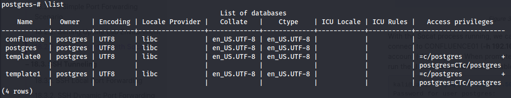

---
layout:
  title:
    visible: true
  description:
    visible: false
  tableOfContents:
    visible: true
  outline:
    visible: true
  pagination:
    visible: true
---

# PostgreSQL

[PostgreSQL](https://www.postgresql.org/) is an open-source SQL database.

## Interface

### Command Line

On Linux the PostgreSQL database can be launched via the [`psql`](https://www.postgresql.org/docs/current/app-psql.html) command. The `-U` flag can be used to set the username for login. If attempting to access a remote database the -h and -p flags can be used to set the host (IP) and port respectively:

```bash
psql -h 192.168.205.63 -p 5423 -U postgresql
```

* This example connects to a remote database at `192.168.205.63` on port `5423` with the username `postgresql`

### Database Commands

#### List Databases

To [list](https://www.postgresql.org/docs/current/app-psql.html#APP-PSQL-META-COMMAND-LIST) all available databases in PostgreSQL use the `\l` or `\list` meta-command. Sample output from the command is shown below:

<figure><figcaption><p>Database listing</p></figcaption></figure>
