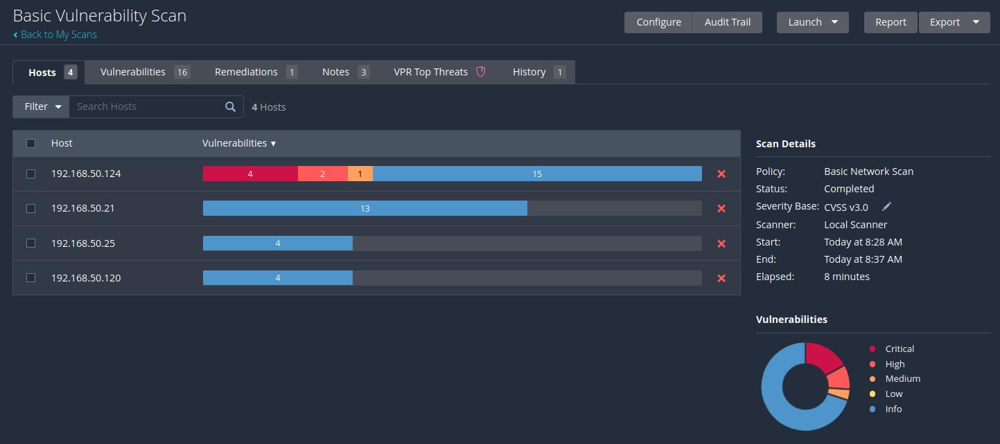
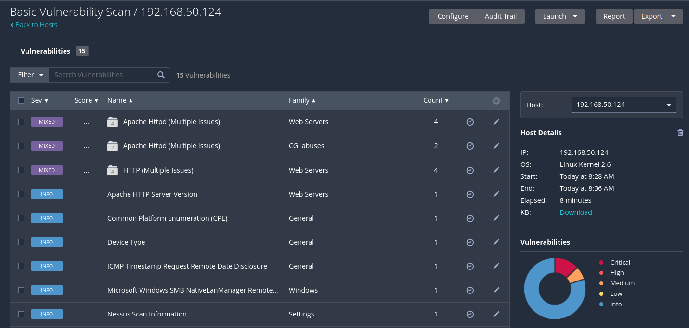
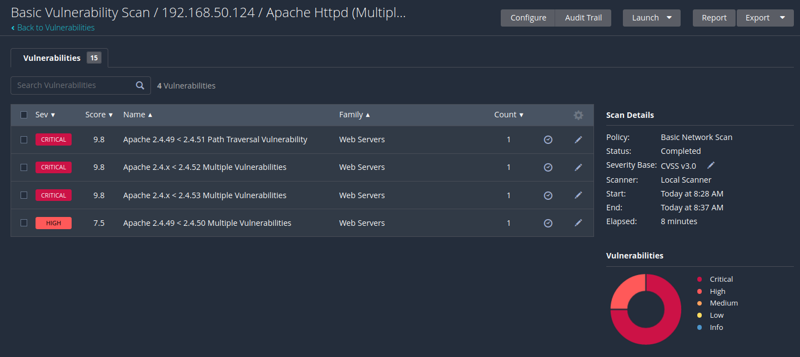
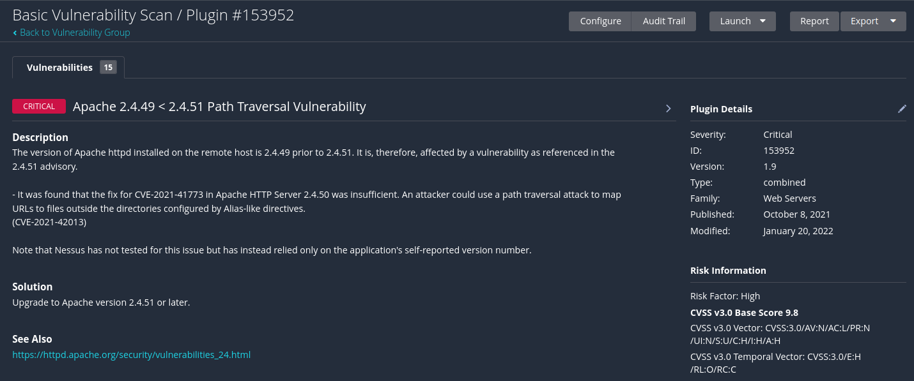
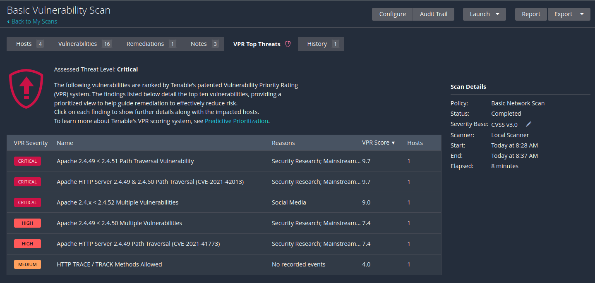
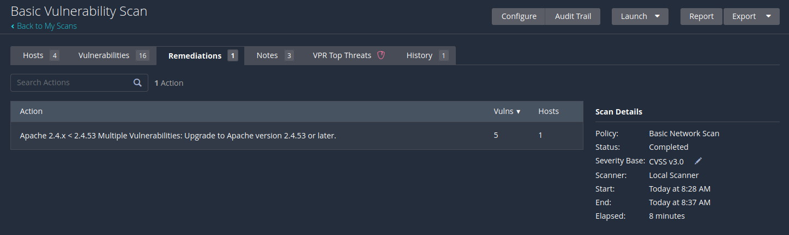

# Scans

## Templates and Policies

### Policies

A policy is a set of predefined configuration options in the context of a Nessus scan.

When a policy is saved it can later be used as a **template**.

### Templates

Nessus provides a broad variety of scanning templates for users.&#x20;

These templates are grouped into the three categories:

1. **Discovery:** the only template in this category is _Host Discovery_, which can be used to create a list of live hosts and their open ports.
2. **Vulnerabilities:** consists of templates for critical vulnerabilities or vulnerability groups e.g. _PrintNightmare_ or _Zerologon_ as well as templates for common scanning areas e.g. _Web Application Tests_ or _Malware Scans_.
3. **Compliance:** only available in the enterprise version

#### Vulnerability Scanning Templates

Nessus also provides three general vulnerability scanning templates:

1. **Basic Network Scan:** performs a full scan with the majority of settings predefined. It will detect a broad variety of vulnerabilities and is therefore the recommended scanning template by Nessus. Users also have the option to customize these settings and recommendations.
2. **Advanced Scan:** is a template without any predefined settings. Can be used when one wants to fully customize their vulnerability scan or if they have specific needs.
3. **Advanced Dynamic Scan:** also comes without any predefined settings or recommendations. The biggest difference between the two templates is that in the Advanced Dynamic Scan, users don't need to select plugins manually. The template allows users to configure a _dynamic plugin filter_ instead.

#### Plugins

Nessus Plugins are programs written in the **Nessus Attack Scripting Language** (**NASL**) that contain the information and the algorithm to detect vulnerabilities. Each plugin is assigned to a **plugin family**, which covers different use cases.

## Analyzing Scan Results

Begin by accessing the scan dashboard via the _My Scans_ list.

The results dashboard will then appear looking something like this:

<figure><figcaption>
Results Dashboard for a basic scan
</figcaption></figure>

The initial view displays the _Hosts_ page, which lists all scanned hosts and provides a visual representation of the vulnerability data. This allows users to identify important findings in one glance and gives an overview of the security status of each system.

On the bottom right, Nessus displays a visual representation of the distribution of all targets' vulnerability information. Above it, general information about the vulnerability scan can be found.

### Hosts

To get the list of findings from a specific host, can click on a list entry. This shows the list of vulnerabilities from the selected host.&#x20;

For example here is a report from `192.168.50.124`:

<figure><figcaption>
Basic report for a single host
</figcaption></figure>

The **Severity** column gives users a quick indicator if this is a critical finding or not.

The **Count** column shows how many findings the corresponding group contains. Users can click on a grouped finding to display a list of all findings in this group:

<figure><figcaption>
Sample findings group from host report
</figcaption></figure>

This displays information on the grouped findings. Clicking on an individual finding will yield further detail:

<figure><figcaption>
Sample vulnerability report
</figcaption></figure>

### Overview

The above is how to analyze reports for specific hosts, however sometimes testers are looking for a higher-level view to understand the vulnerabilities across an entire network (and thus the highest priorities). To facilitate this Nessus provides a feature to get a prioritized overview of vulnerabilities named **VPR Top Threats**, which utilizes the **Vulnerability Priority Rating** ([VPR](https://www.tenable.com/blog/what-is-vpr-and-how-is-it-different-from-cvss)). The findings in the VPR list consist of the top ten vulnerabilities of the scan:

<figure><figcaption>
VPR Top Threats screen
</figcaption></figure>

### Remediations

If Nessus detects a vulnerability, the plugins often contain a remediation strategy, or information on how to mitigate the vulnerability. In the case of the Apache vulnerabilities from above, the following information is displayed:

<figure><figcaption>
Apache remediation recommendations
</figcaption></figure>

### History

The last report page is **History**. This page lists all vulnerability scans with this configuration. This can be used to review or compare results of previous scans.
