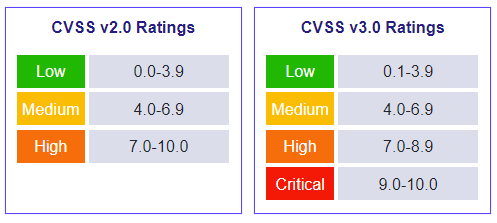

# CVE System

The Common Vulnerabilities and Exposures (CVE) is a list of publicly disclosed computer security flaws. When new items are added, they are given a unique CVE ID which can be used to identify the vulnerability. Colloquially a vulnerability that has an assigned ID is usually just referred to as "a CVE"&#x20;

The CVE system is overseen by the MITRE corporation. CVE entries are brief. They don’t include technical data, or information about risks, impacts, and fixes. Those details appear in other databases, including the [U.S. National Vulnerability Database (NVD)](https://nvd.nist.gov/), the [CERT/CC Vulnerability Notes Database](https://www.kb.cert.org/vuls/), and various lists maintained by vendors and other organizations.

## Criteria

In order to be assigned a CVE ID a vulnerability must be:

1. **Independently fixable**
   * The flaw can be fixed independently of any other bugs.
2. **Acknowledged by the affected vendor OR documented**
   * The software or hardware vendor acknowledges the bug and that it has a negative impact on security. Or, the reporter must have shared a vulnerability report that demonstrates the negative impact of the bug AND that it violates the security policy of the affected system.
3. **Affecting one codebase.**
   * Flaws that impact more than one product get separate CVEs. In cases of shared libraries, protocols or standards, the flaw gets a single CVE only if there’s no way to use the shared code without being vulnerable. Otherwise each affected codebase or product gets a unique CVE.

## Common Vulnerability Scoring System (CVSS)

The CVSS is a set of open standards for assigning a number to a vulnerability to assess its severity. CVSS scores are used by the NVD, CERT and others to assess the impact of vulnerabilities.

The two major versions are CVSS v2 and CVSS v3. Both versions use a range from 0 to 10 to rate vulnerabilities with different severity labels.

<figure><figcaption>
CVSS Scale
</figcaption></figure>

The CVSS score is calculated in three "layers" (base, temporal, and environmental) based on a set of factors that fall into the following categories:

* **Base Score:** The _intrinsic_ characteristics of a vulnerability
  * **Exploitability:** Factors such as attack complexity, privileges required, user interaction required, etc.
  * **Impact:** Effects of the vulnerability on the CIA triad
* **Temporal Score:** Reflects the current state of affairs regarding exploit techniques and exploit code availability
  * **Base Score:** The base score is used as the root of the calculation and modified by the temporal factors
* **Environmental Score:** This is an additional layer that an analyst can use to describe the impact of a particular CVE on _their own_ (or a client's) IT environment
  * **Temporal Score:** The temporal score is used as the root of the calculation and modified by the environmental factors
  * **Environmental Factors:** Things such as adjacent security controls, network segmentation, etc. that would reduce an attacker's ability to exploit a particular CVE in a particular environment

NIST provides a [calculator](https://nvd.nist.gov/vuln-metrics/cvss/v3-calculator) that allows users to understand the exact method of CVSS calculation and interaction of the factors.
