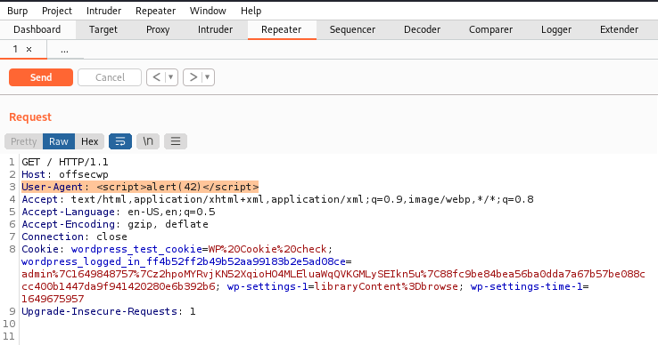
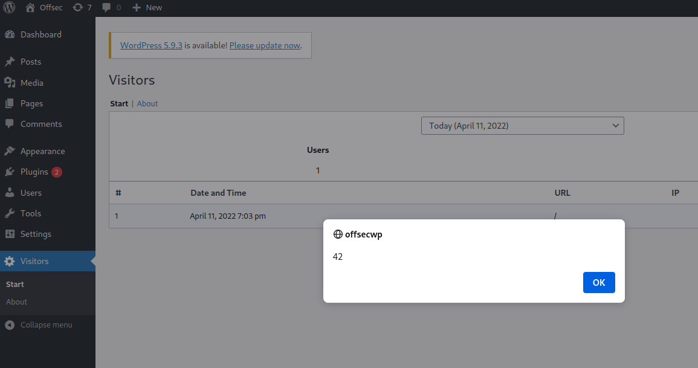

---
layout:
  title:
    visible: true
  description:
    visible: false
  tableOfContents:
    visible: true
  outline:
    visible: true
  pagination:
    visible: true
---

# Basic XSS

The following is a very simple example of real-world XSS. The example involves WordPress and a vulnerable plugin.

The plugin in question is [visitors-app](https://wordpress.org/plugins/visitors-app/) (which is actually no longer available due to the security flaw examined here). The purpose of this plugin is to log data about visitors to a particular site. The data logged includes IP, source, and User-Agent header. It turned out the plugin was vulnerable to stored XSS attacks.

Inspecting the source code of the plugin, one comes across the `database.php` file which allows attackers to understand how the plugin is processing the data.


```php
function VST_save_record() {
	global $wpdb;
	$table_name = $wpdb->prefix . 'VST_registros';

	VST_create_table_records();

	return $wpdb->insert(
				$table_name,
				array(
					'patch' => $_SERVER["REQUEST_URI"],
					'datetime' => current_time( 'mysql' ),
					'useragent' => $_SERVER['HTTP_USER_AGENT'],
					'ip' => $_SERVER['HTTP_X_FORWARDED_FOR']
				)
			);
}
```


This PHP function is responsible for parsing various HTTP request headers, including the User-Agent, which is saved in the `useragent` record value.

Continued examination of the source code shows that each time a WordPress administrator loads the Visitor plugin, the function will execute the following portion of code from `start.php`:


```php
$i=count(VST_get_records($date_start, $date_finish));
foreach(VST_get_records($date_start, $date_finish) as $record) {
    echo '
        <tr class="active" >
            <td scope="row" >'.$i.'</td>
            <td scope="row" >'.date_format(date_create($record->datetime), get_option("links_updated_date_format")).'</td>
            <td scope="row" >'.$record->patch.'</td>
            <td scope="row" ><a href="https://www.geolocation.com/es?ip='.$record->ip.'#ipresult">'.$record->ip.'</a></td>
            <td>'.$record->useragent.'</td>
        </tr>';
    $i--;
}
```


Note that in line 9 of the above code, the `useragent` value is retrieved from the database and inserted plainly in the `<td>` element without any sanitization.

Given that the User-Agent header is attacker-controlled, an attack could be crafted to leverage this oversight.

For example purposes the attack will just use the `alert()` function to pop open a browser alert, however a real attacker could leverage this same vulnerability for more nefarious purposes.

The attacker's goal is to insert `<script>alert(42)</script>` into the User-Agent header. This can be accomplished via BurpSuite's repeater function:

<figure><figcaption><p>Overwriting the actual header with a value for stored XSS</p></figcaption></figure>

Assuming the server returns a `200` status code after the modified request is sent, the attack was successful. Navigating to the page showing user log data will now result in an alert being shown (indicating the script was executed successfully):

<figure><figcaption><p>Successful stored XSS</p></figcaption></figure>
