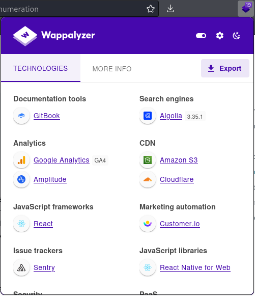

# Enumeration

## URL Inspection

File extensions, which are sometimes a part of a URL, can reveal the programming language the application was written in.&#x20;

Some of these, like `.php`, are straightforward, but other extensions are more cryptic and vary based on the frameworks in use. For example, a Java-based web application might use `.jsp`, `.do`, or `.html`.

However, file extensions on web pages are becoming less common since many languages and frameworks now support the concept of _routes_, which allow developers to map a URI to a section of code. Applications leveraging routes use logic to determine what content is returned to the user and make URI extensions largely irrelevant.

## Page Inspection

This like URL inspection is often a fairly laborious manual process (though some automated tools can help speed this process up a bit).

This can be done in-browser with the Inspector or Debugger tool (`Ctrl` + `Shift` + `K` for Firefox).

It is important to understand the key web frameworks for this type of inspection.The most popular frameworks are (in no particular order):

* [React](https://reactjs.org/)
* Angular
* Vue.JS
* Ember JS
* JQuery
* Ruby on Rails
* Django
* Laravel
* ASP.NET
* Express

## Response Headers

HTTP response headers can be viewed both in the web inspector and via a proxy such as BurpSuite. They can provide valuable information about the structure of the underlying application.

The `Server` header displayed above will often reveal at least the name of the web server software. In many default configurations, it also reveals the version number.

Historically, headers that started with "`X-`" were called non-standard HTTP headers. However, RFC6648 now deprecates the use of "`X-`" in favor of a clearer naming convention.

The names or values in the response header often reveal additional information about the technology stack used by the application. Some examples of non-standard headers include `X-Powered-By`, `x-amz-cf-id`, and `X-Aspnet-Version`. Further research into these names could reveal additional information, such as that the `x-amz-cf-id` header indicates the application uses Amazon CloudFront.

## Sitemaps

The most common sitemap locations are `robots.txt` and `sitemap.xml`.

For example one could retrieve the `robots.txt` file for `google.com` using the `curl` command.

```bash
kali@kali:~$ curl https://www.google.com/robots.txt
User-agent: *
Disallow: /search
Allow: /search/about
Allow: /search/static
Allow: /search/howsearchworks
Disallow: /sdch
Disallow: /groups
Disallow: /index.html?
Disallow: /?
Allow: /?hl=
...
```

`Allow` and `Disallow` are directives for web crawlers indicating pages or directories that "polite" web crawlers may or may not access, respectively. Although the listed pages and directories in most cases may not be interesting and some may even be invalid, sitemap files should not be overlooked as they may contain clues about the website layout or other interesting information.

## Locating Administration Consoles

Web servers often ship with remote administration web applications, or consoles, which are accessible via a particular URL and often listening on a specific TCP port.

Two common examples are the **manager** application for _Tomcat_ hosted at `/manager/html` and **phpMyAdmin** for _MySQL_ hosted at  and `/phpmyadmin` respectively.

While these consoles can be restricted to local access or may be hosted on custom TCP ports, one often finds them externally exposed by default configurations.

## Determining Technology

### Wappalyzer

[Wappalyzer](https://www.wappalyzer.com/) is a browser extension that can be used to enumerate the technology stack of any website. It just sits in the browser bar and when clicked displays a site's tech stack. For example this site's stack appears as:

<figure><figcaption><p>Current page viewed with Wappalyzer at time of writing</p></figcaption></figure>

### WhatWeb

[WhatWeb](https://github.com/urbanadventurer/WhatWeb) recognizes web technologies including content management systems (CMS), blogging platforms, statistic/analytics packages, JavaScript libraries, web servers, and embedded devices.

It can be installed via apt and then called with the whatweb command. For example to check the GitBook website the command would be:

```bash
whatweb https://app.gitbook.com
```

* The aggressiveness of the scan can be set with the `-a` flag. The level values are `1` (default), `3`, or `4` corresponding to Stealthy, Aggressive, and Heavy respectively

And when run the output would look like:

<pre class="language-shell-session" data-overflow="wrap"><code class="lang-shell-session"><strong>kali@kali:~$ whatweb https://app.gitbook.com                                                      
</strong>https://app.gitbook.com [200 OK] Country[UNITED STATES][US], Email[icon_512x512@2x.png], HTML5, HTTPServer[cloudflare], IP[104.18.41.89], Script[module,text/javascript], Strict-Transport-Security[max-age=31536000], Title[GitBook], UncommonHeaders[cf-ray,cf-cache-status,access-control-allow-origin,alt-svc,content-security-policy,referrer-policy,x-content-type-options,x-goog-generation,x-goog-hash,x-goog-metageneration,x-goog-storage-class,x-goog-stored-content-encoding,x-goog-stored-content-length,x-guploader-uploadid,x-magic-hash,x-release], Via-Proxy[magic cache], X-Powered-By[GitBook]
</code></pre>

## Examining WordPress

[WordPress](https://wordpress.com/) is one of many website platforms, technically a Content Management System (CMS). While it is only one, as of 2023, 43% of sites use WordPress ([source](https://barn2.com/blog/wordpress-market-share/)). If a site is determined to be using WordPress various tools exist to help an attacker examine that site.

### WPScan

[WPScan](https://wpscan.com/) is a WordPress vulnerability scanner. This tool attempts to determine the WordPress versions, themes, and plugins as well as their vulnerabilities.

WPScan also looks up component vulnerabilities in the [WordPress Vulnerability Database](https://wpscan.com/statistics/), which requires an API token. A limited API key can be obtained for free by registering an account on the WPScan homepage. However, even without providing an API key, WPScan is a great tool to enumerate WordPress instances.

The basic command structure for WPScan on Linux is:


```bash
wpscan --url http://192.168.50.244 -e --plugins-detection aggressive -o machine.wpscan
```


* `-e` enumerates the instance. The default mode is to enumerate _config backups_ and _all plugins_
  * The `--help` function provides a list of options that can be used here such as `ap` and `vp` for all and vulnerable plugins respectively
* `-plugins-detection aggressive` allows more aggressive scanning
* `-o` generates an output file (file extension can be anything `.wpscan` is not a special file type or anything)
* If an API token is available it is supplied with the `--api-token` flag (future self, you have one so use it)

When run the output will look something like this:


```
[i] Plugin(s) Identified:

[+] akismet
 | Location: http://192.168.50.244/wp-content/plugins/akismet/
 | Latest Version: 5.0
 | Last Updated: 2022-07-26T16:13:00.000Z
 |
 | Found By: Known Locations (Aggressive Detection)
 |  - http://192.168.50.244/wp-content/plugins/akismet/, status: 500
 |
 | The version could not be determined.

[+] classic-editor
 | Location: http://192.168.50.244/wp-content/plugins/classic-editor/
 | Latest Version: 1.6.2 
 | Last Updated: 2021-07-21T22:08:00.000Z
...

[+] contact-form-7
 | Location: http://192.168.50.244/wp-content/plugins/contact-form-7/
 | Latest Version: 5.6.3 (up to date)
 | Last Updated: 2022-09-01T08:48:00.000Z
...

[+] duplicator
 | Location: http://192.168.50.244/wp-content/plugins/duplicator/
 | Last Updated: 2022-09-24T17:57:00.000Z
 | Readme: http://192.168.50.244/wp-content/plugins/duplicator/readme.txt
 | [!] The version is out of date, the latest version is 1.5.1
 |
 | Found By: Known Locations (Aggressive Detection)
 |  - http://192.168.50.244/wp-content/plugins/duplicator/, status: 403
 |
 | Version: 1.3.26 (80% confidence)
 | Found By: Readme - Stable Tag (Aggressive Detection)
 |  - http://192.168.50.244/wp-content/plugins/duplicator/readme.txt

[+] elementor
 | Location: http://192.168.50.244/wp-content/plugins/elementor/
 | Latest Version: 3.7.7 (up to date)
 | Last Updated: 2022-09-20T14:51:00.000Z
...
```

